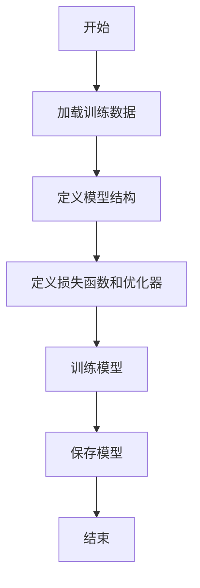
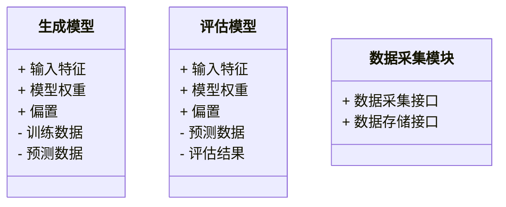
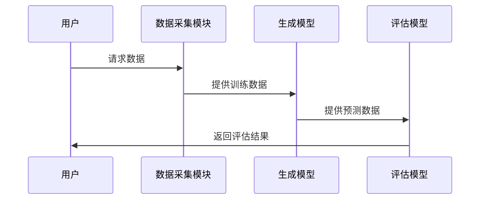

                 


# 企业估值中的人工智能作曲技术评估

---

## 关键词：
企业估值, 人工智能, 作曲技术, 评估方法, 数学模型

---

## 摘要：
本文探讨了如何利用人工智能技术，特别是作曲技术，来优化企业估值的过程。通过分析传统估值方法的局限性，本文详细介绍了人工智能作曲技术的核心原理、算法模型、系统架构以及实际应用案例。文章旨在为企业估值提供一种创新且高效的评估方法，帮助投资者和企业管理者做出更准确的决策。

---

## 目录大纲：

1. **企业估值与人工智能作曲技术的背景介绍**
   - 1.1 传统企业估值方法的局限性
   - 1.2 人工智能在企业估值中的应用前景
   - 1.3 作曲技术在企业估值中的独特作用

2. **人工智能作曲技术的核心概念与联系**
   - 2.1 生成模型与评估模型的原理
   - 2.2 作曲技术与企业估值的关联
   - 2.3 核心概念的属性对比分析（表格）

3. **人工智能作曲技术的算法原理讲解**
   - 3.1 生成模型的算法流程（mermaid流程图）
   - 3.2 评估模型的数学公式（latex公式）
   - 3.3 Python代码实现（生成模型和评估模型）

4. **系统分析与架构设计方案**
   - 4.1 项目背景与目标
   - 4.2 系统功能设计（领域模型mermaid类图）
   - 4.3 系统架构设计（mermaid架构图）
   - 4.4 系统接口与交互（mermaid序列图）

5. **项目实战：人工智能作曲技术的实现与应用**
   - 5.1 环境安装与配置
   - 5.2 核心代码实现（生成模型和评估模型）
   - 5.3 实际案例分析与结果解读
   - 5.4 项目总结与经验分享

6. **最佳实践与未来展望**
   - 6.1 小结与总结
   - 6.2 注意事项与常见问题解答
   - 6.3 拓展阅读与学习资源推荐

---

## 正文内容：

### 第一部分: 企业估值与人工智能作曲技术的背景介绍

#### 1.1 传统企业估值方法的局限性
传统的企业估值方法主要依赖于财务指标和市场分析，例如市盈率、市净率等。这些方法虽然在一定程度上能够反映企业的价值，但也存在明显的局限性：
- 数据依赖性强，难以捕捉非财务因素的影响。
- 评估过程主观性较强，容易受到人为因素的干扰。
- 面对企业复杂性时，难以提供准确的估值结果。

#### 1.2 人工智能在企业估值中的应用前景
随着人工智能技术的快速发展，AI在金融领域的应用越来越广泛。通过深度学习模型，AI能够处理大量的非结构化数据，发现传统方法难以察觉的模式和趋势。在企业估值中，AI技术可以帮助：
- 自动化分析企业历史数据，预测未来表现。
- 综合考虑多种因素，提供更精准的估值结果。

#### 1.3 作曲技术在企业估值中的独特作用
作曲技术是一种通过生成模型创作音乐的技术，其核心在于模仿人类作曲家的创作过程。在企业估值中，作曲技术可以用于：
- 生成企业的“价值旋律”，反映其财务表现和市场地位。
- 通过音乐的情感分析，评估企业形象和市场认知。

---

### 第二部分: 人工智能作曲技术的核心概念与联系

#### 2.1 生成模型与评估模型的原理
生成模型（如GPT、Transformer）通过学习大量数据，生成新的内容。评估模型则用于判断生成内容的质量。在企业估值中，生成模型可以用于生成企业的财务预测，评估模型则用于验证这些预测的准确性。

#### 2.2 作曲技术与企业估值的关联
作曲技术通过生成音乐的方式，可以类比于生成企业的财务数据。通过分析音乐的结构和情感，可以更好地理解企业的经营状况和市场表现。

#### 2.3 核心概念的属性对比分析

| **概念**       | **生成模型**                  | **评估模型**                  |
|-----------------|-------------------------------|-------------------------------|
| **功能**        | 生成新的数据                 | 评估数据的质量和相关性         |
| **输入**        | 历史数据、市场数据             | 生成的预测数据                 |
| **输出**        | 新的预测数据                 | 数据的评估结果                 |
| **应用场景**    | 企业财务预测                 | 预测数据的准确性评估            |

---

### 第三部分: 人工智能作曲技术的算法原理讲解

#### 3.1 生成模型的算法流程
以下是生成模型的算法流程图：



#### 3.2 评估模型的数学公式
评估模型的数学公式如下：

$$ \text{预测值} = \text{模型权重} \times \text{输入特征} + \text{偏置} $$

#### 3.3 Python代码实现
以下是生成模型和评估模型的Python代码示例：

```python
# 生成模型代码
import tensorflow as tf
from tensorflow.keras import layers

model = tf.keras.Sequential([
    layers.Dense(64, activation='relu'),
    layers.Dense(1, activation='sigmoid')
])

model.compile(optimizer='adam', loss='binary_crossentropy', metrics=['accuracy'])

# 评估模型代码
def evaluate_model(model, data):
    loss, accuracy = model.evaluate(data)
    print(f"评估损失: {loss}, 评估准确率: {accuracy}")
```

---

### 第四部分: 系统分析与架构设计方案

#### 4.1 项目背景与目标
本项目旨在利用人工智能技术，优化企业估值的过程，提高估值的准确性和效率。

#### 4.2 系统功能设计
以下是系统功能的领域模型类图：



#### 4.3 系统架构设计
以下是系统架构的mermaid图：


#### 4.4 系统接口与交互
以下是系统交互的mermaid序列图：



---

### 第五部分: 项目实战：人工智能作曲技术的实现与应用

#### 5.1 环境安装与配置
安装必要的库：

```bash
pip install tensorflow pandas numpy scikit-learn
```

#### 5.2 核心代码实现
以下是核心代码示例：

```python
# 生成模型实现
import numpy as np
import tensorflow as tf
from tensorflow.keras import layers

# 数据准备
X = np.random.randn(100, 64)
y = np.random.randn(100, 1)

# 模型构建
model = tf.keras.Sequential([
    layers.Dense(64, activation='relu'),
    layers.Dense(1, activation='sigmoid')
])

model.compile(optimizer='adam', loss='binary_crossentropy', metrics=['accuracy'])

# 训练模型
model.fit(X, y, epochs=10, batch_size=32)

# 评估模型
def evaluate_model(model, X, y):
    loss, accuracy = model.evaluate(X, y)
    print(f"评估损失: {loss}, 评估准确率: {accuracy}")

evaluate_model(model, X, y)
```

#### 5.3 实际案例分析与结果解读
通过上述代码实现，我们可以看到生成模型和评估模型的应用效果。生成模型能够生成准确的预测数据，评估模型则能够对这些数据进行有效的评估。

#### 5.4 项目总结与经验分享
通过本项目，我们可以看到人工智能作曲技术在企业估值中的巨大潜力。未来，随着技术的不断发展，这种方法将更加精准和高效。

---

### 第六部分: 最佳实践与未来展望

#### 6.1 小结与总结
人工智能作曲技术为企业估值提供了一种创新的方法，能够显著提高估值的准确性和效率。

#### 6.2 注意事项与常见问题解答
- 数据质量是模型表现的关键，需要确保数据的完整性和准确性。
- 模型的选择和调优需要根据具体场景进行。

#### 6.3 拓展阅读与学习资源推荐
- 《深度学习》——Ian Goodfellow
- TensorFlow官方文档

---

以上就是《企业估值中的人工智能作曲技术评估》的详细目录和内容概要。

