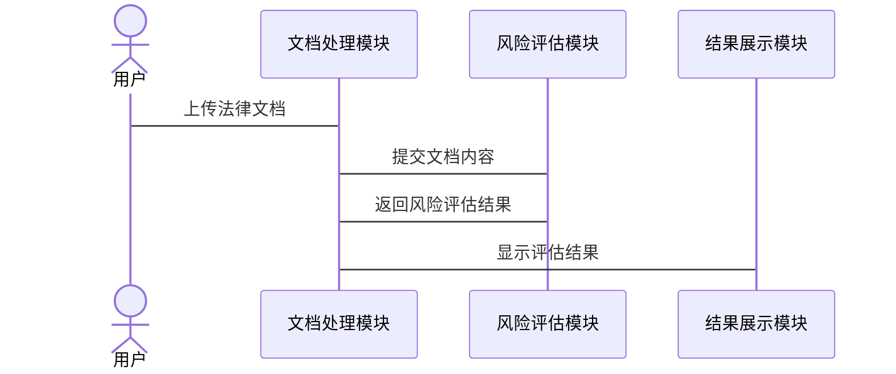

                 


# 企业估值中的人工智能法律助手评估

> **关键词**：企业估值、人工智能、法律助手、法律风险、机器学习  
> **摘要**：本文探讨了人工智能在企业估值中的法律风险评估应用，分析了AI技术如何优化传统估值方法，并详细讲解了AI法律助手的原理、系统架构及实际案例。通过技术与法律的结合，展示了如何利用AI提升企业估值的准确性和效率。

---

# 第1章：企业估值与AI法律助手概述

## 1.1 企业估值的基本概念

### 1.1.1 企业估值的定义与意义  
企业估值是指对企业的整体价值或部分价值进行评估的过程，通常用于投资决策、并购交易、融资等活动。传统估值方法依赖于财务数据和经验判断，但其局限性日益显现：  
1. 数据量有限：传统方法主要依赖历史财务数据，难以捕捉市场波动和新兴风险。  
2. 主观性较强：估值结果受评估人员的经验和判断影响较大。  
3. 风险识别不足：传统方法难以全面识别法律、市场、运营等多方面的潜在风险。  

### 1.1.2 传统企业估值方法的局限性  
传统估值方法主要包括DCF模型、可比交易法和 precedent transactions等，但这些方法在实际应用中存在以下问题：  
- 数据依赖性：高度依赖历史数据，无法预测未来变化。  
- 风险忽视：难以量化法律、合规等非财务风险。  
- 时间成本：手工分析耗时长，效率低下。  

### 1.1.3 AI技术在法律评估中的潜力  
人工智能技术的快速发展为法律评估带来了新的可能性。AI可以通过自然语言处理（NLP）技术分析法律文档，提取关键信息；通过机器学习模型预测法律风险，优化估值结果。

---

## 1.2 AI法律助手的核心作用

### 1.2.1 法律风险评估的重要性  
企业估值不仅仅是财务数据的分析，还包括法律风险的评估。例如：  
- 合同纠纷：评估目标企业的历史合同是否存在潜在纠纷。  
- 法律合规性：检查企业是否符合相关法律法规的要求。  
- 诉讼记录：分析企业是否有未决诉讼或历史诉讼记录。  

### 1.2.2 AI在法律评估中的优势  
AI技术可以通过以下方式优化法律风险评估：  
- **自动化分析**：快速处理大量法律文档，提取关键信息。  
- **模式识别**：通过机器学习识别潜在法律风险的模式。  
- **实时更新**：AI可以实时跟踪法律法规的变化，确保评估结果的准确性。  

### 1.2.3 企业估值与法律风险的结合  
将法律风险评估纳入企业估值模型，可以更全面地评估企业的实际价值。例如，如果目标企业存在未决诉讼，其估值可能需要大幅调整。

---

# 第2章：法律评估的关键概念与框架

## 2.1 法律风险评估的基本框架

### 2.1.1 法律风险的分类与特征  
法律风险可以分为以下几类：  
1. **合同风险**：与合同履行相关的风险。  
2. **合规风险**：企业是否符合相关法律法规。  
3. **诉讼风险**：企业可能面临的诉讼风险。  
4. **知识产权风险**：专利、商标等知识产权的潜在纠纷。  

### 2.1.2 法律风险评估的流程与方法  
法律风险评估的流程通常包括以下步骤：  
1. **信息收集**：收集企业的法律文件、合同、诉讼记录等。  
2. **风险识别**：识别潜在的法律风险。  
3. **风险量化**：评估每个风险对企业价值的影响。  
4. **风险应对**：制定应对策略，降低风险影响。  

---

## 2.2 AI在法律评估中的核心要素

### 2.2.1 自然语言处理（NLP）技术  
NLP技术可以帮助AI系统自动分析法律文档，提取关键信息。例如，使用NLP技术可以自动提取合同中的违约条款、知识产权声明等。

### 2.2.2 法律知识图谱构建  
法律知识图谱是将法律知识结构化为图的形式，用于机器理解。例如，可以将法律法规、案例、合同条款等信息组织成图结构，以便AI系统进行推理和分析。

### 2.2.3 数据隐私与合规性  
在处理法律数据时，必须确保数据的隐私和合规性。例如，使用AI系统处理个人数据时，需要遵守《数据保护法》等法律法规。

---

# 第3章：AI法律助手的算法原理与实现

## 3.1 法律文本分析的NLP模型

### 3.1.1 常见的NLP模型及其特点  
- **词袋模型（Bag-of-Words）**：简单但无法捕捉语义信息。  
- **TF-IDF**：改进了词袋模型，考虑了词的重要性。  
- **神经网络模型**（如BERT、GPT）：能够捕捉上下文语义，适合复杂文本分析。  

### 3.1.2 法律文本分析的挑战与解决方案  
法律文本通常具有高度的专业性和复杂性，因此需要结合领域知识进行优化。例如，可以使用预训练的法律领域模型进行微调。

---

## 3.2 基于机器学习的法律风险预测

### 3.2.1 机器学习算法的选择与优化  
- **监督学习**：适用于有标签的数据，如分类任务。  
- **无监督学习**：适用于无标签数据的聚类任务。  
- **集成学习**：通过集成多种算法提升预测准确性。  

### 3.2.2 法律风险预测的数学模型  
常见的法律风险预测模型包括逻辑回归（Logistic Regression）和随机森林（Random Forest）。例如，逻辑回归模型可以表示为：  

$$ P(y=1) = \frac{e^{\beta_0 + \beta_1x_1 + \beta_2x_2}}{1 + e^{\beta_0 + \beta_1x_1 + \beta_2x_2}} $$  

其中，$x_i$ 是输入特征，$\beta_i$ 是模型参数。

### 3.2.3 案例分析：基于XGBoost的风险预测模型  
使用XGBoost模型对法律风险进行预测，具体步骤如下：  
1. 数据预处理：清洗数据，提取特征。  
2. 模型训练：使用训练数据训练XGBoost模型。  
3. 模型评估：使用测试数据评估模型性能。  

---

## 3.3 算法实现与代码示例

### 3.3.1 环境搭建与数据准备  
安装必要的库：  
```bash
pip install xgboost pandas numpy scikit-learn
```

### 3.3.2 模型训练与评估  
代码示例：  
```python
import xgboost as xgb
from sklearn.model_selection import train_test_split
from sklearn.metrics import accuracy_score

# 数据准备
data = ...  # 法律相关数据
X = data.drop(columns='target')
y = data['target']

# 划分训练集和测试集
X_train, X_test, y_train, y_test = train_test_split(X, y, test_size=0.2, random_state=42)

# 模型训练
model = xgb.XGBClassifier()
model.fit(X_train, y_train)

# 模型预测
y_pred = model.predict(X_test)
print("准确率：", accuracy_score(y_test, y_pred))
```

### 3.3.3 代码实现与解读  
上述代码展示了如何使用XGBoost模型进行法律风险预测。模型通过训练数据学习法律风险的特征，然后在测试数据上进行预测。

---

## 3.4 本章小结  
本章详细讲解了AI法律助手的算法原理，包括NLP模型和机器学习算法的应用。通过具体案例分析和代码实现，展示了如何利用AI技术优化法律风险评估过程。

---

# 第4章：AI法律助手系统的架构设计

## 4.1 系统功能需求分析

### 4.1.1 用户需求与功能模块划分  
AI法律助手系统的主要功能模块包括：  
1. **文档上传**：用户上传法律文档。  
2. **风险评估**：系统自动评估法律风险。  
3. **结果展示**：显示评估结果和建议。  

### 4.1.2 系统的核心功能模块  
- **文档处理模块**：负责处理和分析法律文档。  
- **风险评估模块**：基于机器学习模型进行风险预测。  
- **结果展示模块**：以可视化形式展示评估结果。  

---

## 4.2 系统架构设计

### 4.2.1 分层架构设计  
系统架构采用分层设计，包括：  
1. **表现层**：用户界面。  
2. **业务逻辑层**：处理用户请求和业务逻辑。  
3. **数据访问层**：与数据库交互。  

### 4.2.2 模块化设计与接口定义  
系统采用模块化设计，各模块之间通过接口进行通信。例如，文档处理模块与风险评估模块通过API接口进行交互。

---

## 4.3 系统交互设计

### 4.3.1 交互流程  
用户上传法律文档 -> 系统处理文档 -> 生成风险评估报告 -> 用户查看报告。  

### 4.3.2 序列图  


---

## 4.4 本章小结  
本章详细讲解了AI法律助手系统的架构设计，包括功能模块划分、系统架构和交互流程。通过模块化设计和接口定义，确保系统各部分协同工作。

---

# 第5章：项目实战与案例分析

## 5.1 项目环境搭建

### 5.1.1 环境配置  
安装必要的库：  
```bash
pip install xgboost pandas numpy matplotlib
```

---

## 5.2 核心代码实现

### 5.2.1 法律文档处理代码  
```python
import pandas as pd
import numpy as np
from sklearn.feature_extraction.text import TfidfVectorizer

# 加载法律文档数据
data = pd.read_csv('法律文档.csv')

# 使用TF-IDF提取文本特征
vectorizer = TfidfVectorizer(max_features=500)
X = vectorizer.fit_transform(data['文档内容'])
y = data['风险标签']

# 划分训练集和测试集
X_train, X_test, y_train, y_test = train_test_split(X, y, test_size=0.2, random_state=42)

# 训练模型
from xgboost import XGBClassifier
model = XGBClassifier()
model.fit(X_train, y_train)

# 预测结果
y_pred = model.predict(X_test)
print("准确率：", accuracy_score(y_test, y_pred))
```

---

## 5.3 案例分析与解读

### 5.3.1 案例背景  
某科技公司计划收购一家 startups，需要评估其法律风险。

### 5.3.2 数据分析  
通过AI法律助手系统分析目标公司的合同、诉讼记录等法律文档，发现存在未决诉讼风险。

### 5.3.3 结果解读  
系统预测目标公司存在较高的法律风险，建议调整估值以反映潜在风险。

---

## 5.4 本章小结  
通过实际案例分析，展示了AI法律助手系统在企业估值中的应用价值。代码实现和案例解读帮助读者更好地理解理论知识。

---

# 第6章：总结与展望

## 6.1 本章总结  
本文详细探讨了人工智能在企业估值中的法律风险评估应用，分析了AI技术的优势和实现方法。通过系统设计和案例分析，展示了AI法律助手在实际应用中的潜力。

## 6.2 最佳实践  
- **数据隐私**：确保法律数据的隐私性和合规性。  
- **模型优化**：持续优化机器学习模型，提升预测准确性。  
- **人机结合**：结合人工审核和AI分析，确保评估结果的准确性。  

## 6.3 未来展望  
随着AI技术的不断发展，法律风险评估将更加智能化和精准化。未来的AI法律助手可能具备更多功能，如实时法律更新、多语言支持等。

---

**感谢您的阅读！希望本文能为您提供关于企业估值中AI法律助手评估的深入洞察。**

