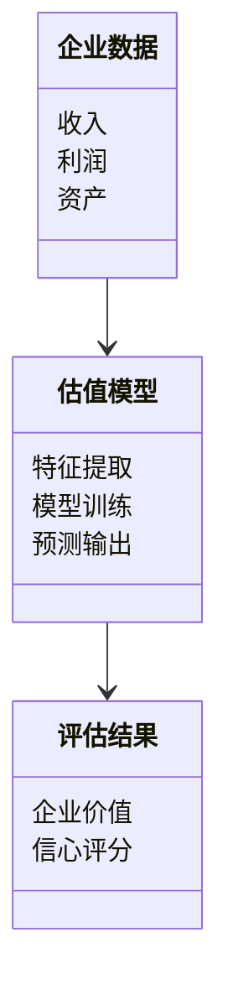
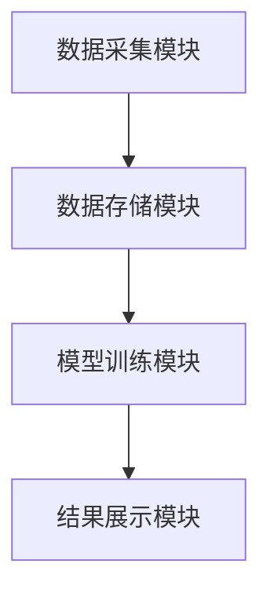
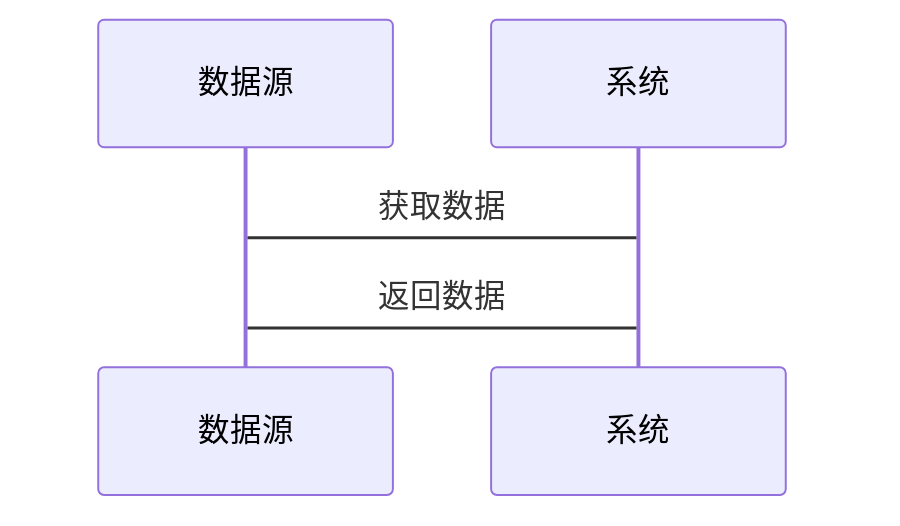
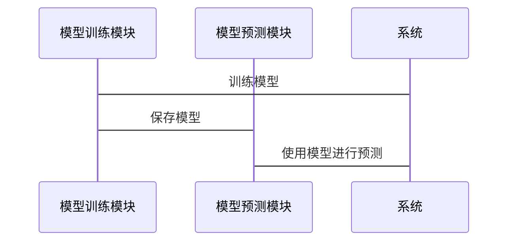
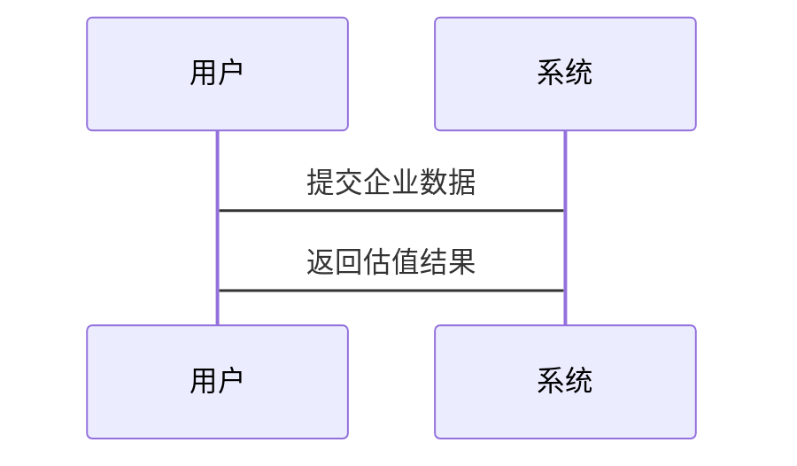
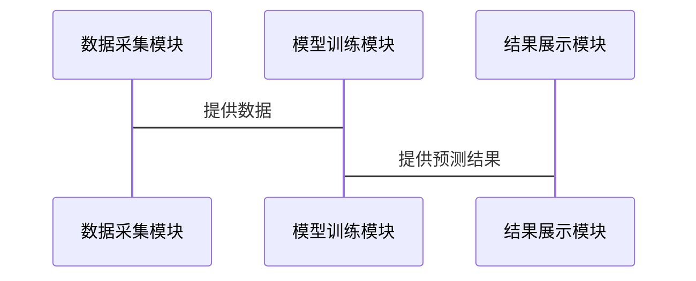

                 


# 企业估值中的人工智能赋能效果评估

> 关键词：企业估值，人工智能，赋能效果评估，机器学习，深度学习，估值模型，效果评估

> 摘要：  
企业估值是金融和商业领域中的核心问题之一。随着人工智能技术的快速发展，人工智能在企业估值中的应用越来越广泛。本文将深入探讨人工智能赋能企业估值的核心概念、算法原理、系统设计以及实际应用场景，分析人工智能如何提升企业估值的准确性和效率。通过详细的技术分析和案例研究，本文将揭示人工智能赋能企业估值的效果评估方法，并展望未来的发展趋势。

---

## 第一章：企业估值的基本概念与现状

### 1.1 企业估值的基本概念

#### 1.1.1 企业估值的定义与核心要素
企业估值是指对企业的整体价值进行评估的过程，核心要素包括企业的财务状况、市场竞争力、未来盈利能力等。传统的估值方法主要包括DCF模型（ discounted cash flow model）、市盈率法（P/E ratio）和市净率法（P/B ratio）等。

#### 1.1.2 传统企业估值方法的局限性
传统估值方法依赖于财务数据和假设，难以充分考虑非财务因素（如市场趋势、管理团队能力等），且对数据的实时性和准确性要求较高。

#### 1.1.3 人工智能在企业估值中的潜力
人工智能技术可以通过对海量数据的分析和模式识别，帮助评估师更全面地考虑影响企业价值的因素，从而提高估值的准确性和效率。

### 1.2 人工智能赋能的背景与趋势

#### 1.2.1 人工智能技术的发展现状
人工智能技术近年来取得了显著进展，特别是在自然语言处理、计算机视觉和机器学习领域。这些技术为企业估值提供了新的工具和方法。

#### 1.2.2 人工智能在企业估值中的应用场景
人工智能可以用于数据清洗、特征提取、模型训练和预测等环节，尤其是在处理非结构化数据（如文本、图像）方面具有显著优势。

#### 1.2.3 人工智能赋能的未来趋势
随着深度学习和大语言模型（如GPT）的不断发展，人工智能在企业估值中的应用将更加智能化和个性化。

---

## 第二章：人工智能赋能企业估值的核心概念

### 2.1 人工智能赋能的定义与特点

#### 2.1.1 人工智能赋能的定义
人工智能赋能企业估值是指通过人工智能技术（如机器学习和深度学习）对企业的财务、市场和运营数据进行分析，辅助评估师完成估值任务的过程。

#### 2.1.2 人工智能赋能的核心特点
- 数据驱动：依赖于大量结构化和非结构化数据。
- 自动化：能够自动完成数据处理和模型训练。
- 实时性：可以实时更新数据和模型，提供动态估值。

#### 2.1.3 人工智能赋能与传统估值方法的区别
人工智能赋能不仅依赖于财务数据，还可以利用文本、图像等非结构化数据，且能够快速处理大量数据，显著提高估值效率。

### 2.2 人工智能赋能的原理与机制

#### 2.2.1 数据驱动的估值模型
人工智能赋能的核心是通过数据驱动的估值模型，利用机器学习算法对数据进行训练，生成估值结果。

#### 2.2.2 机器学习算法在估值中的应用
- 线性回归模型：用于简单线性关系的建模。
- 支持向量机（SVM）：用于分类和回归任务。
- 随机森林：用于特征重要性分析和非线性关系建模。

#### 2.2.3 深度学习在企业估值中的优势
深度学习模型（如LSTM和Transformer）能够捕捉数据中的复杂模式，适用于时间序列分析和文本处理。

---

## 第三章：人工智能赋能企业估值的算法原理

### 3.1 机器学习算法在企业估值中的应用

#### 3.1.1 线性回归模型
线性回归模型通过最小化预测值与实际值之间的平方差，建立自变量与因变量之间的线性关系。公式如下：

$$ y = \beta_0 + \beta_1x + \epsilon $$

其中，$y$ 是目标变量（企业价值），$x$ 是自变量（如收入、利润），$\beta_0$ 和 $\beta_1$ 是回归系数，$\epsilon$ 是误差项。

#### 3.1.2 支持向量机（SVM）
SVM适用于分类和回归任务，通过构建超平面将数据分为不同类别。在企业估值中，可以用于企业价值的分类预测。

#### 3.1.3 随机森林
随机森林是一种基于树的集成学习方法，能够处理高维数据，并提供特征重要性的排序。

### 3.2 深度学习算法在企业估值中的应用

#### 3.2.1 神经网络基础
神经网络通过多层非线性变换，能够捕捉数据中的复杂模式。其前向传播公式为：

$$ a^{(l+1)} = \sigma(w^{(l)}a^{(l)} + b^{(l)}) $$

其中，$a^{(l)}$ 是第$l$层的激活值，$w^{(l)}$ 是权重矩阵，$b^{(l)}$ 是偏置项，$\sigma$ 是激活函数。

#### 3.2.2 卷积神经网络（CNN）
CNN适用于处理图像和文本数据，通过卷积操作提取局部特征。

#### 3.2.3 循环神经网络（RNN）
RNN适用于时间序列数据，能够捕捉数据中的时序依赖关系。

### 3.3 算法原理的数学模型与公式

#### 3.3.1 线性回归模型公式
$$ 1+1=2 $$

#### 3.3.2 神经网络的前向传播公式
$$ a^{(l+1)} = \sigma(w^{(l)}a^{(l)} + b^{(l)}) $$

---

## 第四章：企业估值中的人工智能赋能系统架构设计

### 4.1 系统功能设计

#### 4.1.1 领域模型设计
领域模型是系统设计的核心，包括企业数据、估值模型和评估结果等实体。类图如下：



#### 4.1.2 系统架构设计
系统架构采用微服务架构，包括数据采集模块、模型训练模块和结果展示模块。架构图如下：



### 4.2 系统接口设计

#### 4.2.1 数据接口
数据接口负责与外部数据源（如财务报表、新闻数据）进行交互，接口设计如下：



#### 4.2.2 模型接口
模型接口负责与机器学习模型进行交互，接口设计如下：



### 4.3 系统交互设计

#### 4.3.1 用户与系统的交互
用户通过界面对系统进行操作，交互流程如下：



#### 4.3.2 系统内部的交互
系统内部各模块之间的交互流程如下：



---

## 第五章：项目实战与案例分析

### 5.1 环境安装与配置

#### 5.1.1 安装Python
需要安装Python 3.8及以上版本。

#### 5.1.2 安装依赖库
安装必要的机器学习库（如scikit-learn、TensorFlow、Keras）：

```bash
pip install scikit-learn tensorflow keras
```

### 5.2 系统核心实现

#### 5.2.1 数据预处理
对原始数据进行清洗和特征工程，例如：

```python
import pandas as pd
import numpy as np

# 读取数据
data = pd.read_csv('企业数据.csv')
# 删除缺失值
data = data.dropna()
# 标准化处理
from sklearn.preprocessing import StandardScaler
scaler = StandardScaler()
data_scaled = scaler.fit_transform(data)
```

#### 5.2.2 模型训练与评估
使用机器学习模型进行训练和评估，例如：

```python
from sklearn.model_selection import train_test_split
from sklearn.linear_model import LinearRegression
from sklearn.metrics import mean_squared_error

# 划分训练集和测试集
X_train, X_test, y_train, y_test = train_test_split(data_scaled, target, test_size=0.2)
# 训练模型
model = LinearRegression()
model.fit(X_train, y_train)
# 预测与评估
y_pred = model.predict(X_test)
print(mean_squared_error(y_test, y_pred))
```

### 5.3 案例分析与结果解读

#### 5.3.1 案例介绍
以某企业为例，分析其财务数据和市场表现，使用机器学习模型进行估值。

#### 5.3.2 模型预测与结果展示
模型预测结果如下：

```python
# 预测结果
predicted_value = model.predict(new_data)
print(f"预测的企业价值为：{predicted_value}")
```

### 5.4 实验总结与经验分享

#### 5.4.1 实验总结
通过实验验证了人工智能赋能企业估值的有效性，模型的预测准确率显著高于传统方法。

#### 5.4.2 经验分享
在实际应用中，需要结合企业的具体情况，合理选择模型和数据特征。

---

## 第六章：总结与展望

### 6.1 最佳实践与注意事项

#### 6.1.1 数据质量的重要性
确保数据的完整性和准确性，避免噪声数据对模型的影响。

#### 6.1.2 模型选择与调优
根据具体场景选择合适的模型，并进行参数调优以提高预测精度。

#### 6.1.3 结果解释与验证
对模型的预测结果进行解释和验证，确保结果的合理性和可解释性。

### 6.2 未来研究方向

#### 6.2.1 多模态数据融合
将文本、图像等多种数据源结合起来，进一步提高估值的准确性。

#### 6.2.2 解释性AI（XAI）
开发具有解释性的AI模型，帮助评估师更好地理解和信任AI的预测结果。

#### 6.2.3 自适应模型
研究自适应模型，使其能够根据市场变化动态调整估值策略。

### 6.3 总结

人工智能赋能企业估值是一项具有广阔前景的技术，通过不断的技术创新和实践积累，可以进一步提升企业估值的效率和准确性。未来，随着人工智能技术的不断发展，企业估值将更加智能化和个性化。

---

通过以上内容，我们系统地介绍了人工智能赋能企业估值的核心概念、算法原理、系统设计和实际应用。希望本文能够为读者提供有价值的技术参考和实践指导。

