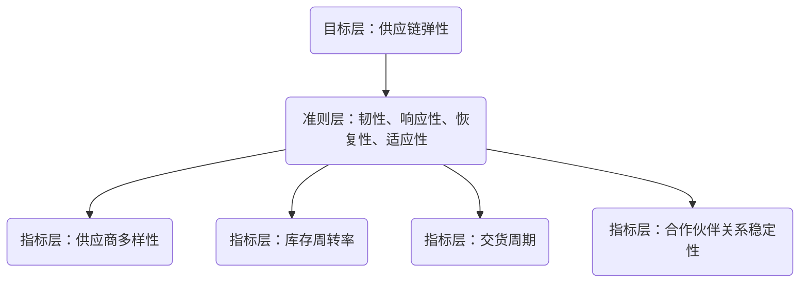
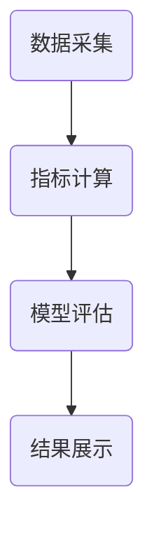

                 


# 企业估值中的供应链弹性价值评估

> 关键词：供应链弹性，企业估值，价值评估，供应链韧性，风险控制

> 摘要：本文深入探讨了供应链弹性在企业估值中的重要性，分析了供应链弹性的核心概念、数学模型、系统架构及实际应用。通过详细讲解供应链弹性的四个维度，结合数学公式和Python代码实现，展示了如何将供应链弹性纳入企业估值模型中，为企业提供更全面的评估方法。

---

## 第一部分: 供应链弹性与企业估值的背景与概念

### 第1章: 供应链弹性与企业估值的背景

#### 1.1 供应链弹性的定义与内涵

供应链弹性是指企业在面对外部环境变化时，能够灵活调整供应链策略，保持供应链稳定性和持续性的能力。它强调供应链在面对突发事件（如自然灾害、疫情、市场波动等）时的适应性和恢复能力。

**供应链弹性的内涵与特征：**
1. **动态性**：供应链弹性要求企业在变化的环境中快速响应。
2. **冗余性**：通过建立备用供应商或库存来提高供应链的弹性。
3. **协同性**：企业与供应商、客户之间的协同合作是供应链弹性的重要保障。
4. **可测量性**：供应链弹性可以通过量化指标进行评估。

#### 1.2 供应链弹性的重要性

供应链弹性不仅是企业运营的重要组成部分，也是企业估值的关键因素之一。它直接影响企业的盈利能力和抗风险能力。

**供应链弹性对企业竞争力的影响：**
1. **提升企业抗风险能力**：在突发事件中，弹性供应链能够帮助企业快速恢复生产，减少损失。
2. **增强企业市场响应能力**：弹性供应链能够帮助企业更快地适应市场变化，抓住新的商业机会。
3. **降低运营成本**：通过弹性供应链管理，企业可以在供应链中断时迅速调整资源分配，避免高额损失。

#### 1.3 供应链弹性价值评估的必要性

供应链弹性价值评估是企业在进行估值时必须考虑的因素。它能够帮助企业识别供应链中的潜在风险，并采取相应的措施来降低这些风险。

**供应链弹性价值评估与企业估值的关系：**
1. **影响企业价值的核心因素**：供应链弹性是企业长期稳定发展的关键因素之一，直接影响企业的估值。
2. **提升企业投资吸引力**：具备强大供应链弹性的企业更容易吸引投资者，提升企业市值。
3. **优化企业风险管理**：通过评估供应链弹性，企业可以更好地识别和管理供应链风险。

---

### 第2章: 供应链弹性价值评估的核心概念

#### 2.1 供应链弹性的维度与指标

供应链弹性可以从多个维度进行评估，主要包括韧性、响应性、恢复性和适应性。

**供应链弹性的维度对比表：**

| 维度    | 定义与特征                                                                 |
|---------|--------------------------------------------------------------------------|
| 韧性    | 供应链在面对外部冲击时的承受能力，包括供应商的多样性和地理分布。           |
| 响应性  | 供应链对市场需求变化的快速反应能力，包括生产计划的灵活性和库存管理。       |
| 恢复性  | 供应链在遭受重大损失后的恢复能力，包括备用供应商和快速重组能力。           |
| 适应性  | 供应链在长期变化中的调整能力，包括技术创新和合作伙伴关系的维护。          |

#### 2.2 供应链弹性与企业估值的关系

供应链弹性直接影响企业的盈利能力和抗风险能力，从而影响企业的估值。

**供应链弹性对企业估值的影响：**
1. **提升企业稳定性**：弹性供应链能够确保企业在市场波动中的稳定运营，提升企业的估值。
2. **降低风险溢价**：具备强大供应链弹性的企业通常具有更低的系统性风险，从而降低投资者要求的风险溢价。
3. **增强市场竞争力**：弹性供应链能够帮助企业更快地适应市场变化，增强市场竞争力，从而提升企业估值。

#### 2.3 供应链弹性价值评估的理论框架

供应链弹性价值评估的理论框架包括供应链弹性的核心要素、评估指标和模型构建。

**供应链弹性价值评估的理论基础：**
1. **系统动力学**：研究供应链在动态环境中的行为和相互作用。
2. **风险管理理论**：评估供应链中的潜在风险，并制定应对策略。
3. **博弈论**：分析供应链上下游企业之间的合作与竞争关系。

---

### 第3章: 供应链弹性价值评估的数学模型与方法

#### 3.1 供应链弹性价值评估的数学模型

供应链弹性价值评估需要结合多个因素，构建一个综合评分模型。

**供应链弹性价值评估的综合评分公式：**
$$ E = \sum_{i=1}^{n} w_i \cdot s_i $$
其中，\( E \) 表示供应链弹性价值评分，\( w_i \) 表示第 \( i \) 个指标的权重，\( s_i \) 表示第 \( i \) 个指标的评分。

#### 3.2 供应链弹性价值评估的算法原理

基于层次分析法（AHP）的供应链弹性价值评估流程如下：

1. **确定评估指标**：选择供应链弹性的关键指标，如供应商多样性、库存周转率等。
2. **构建层次结构**：将指标分为不同的层次，如目标层、准则层和指标层。
3. **计算权重**：通过专家评分和层次分析法计算各指标的权重。
4. **计算综合评分**：根据权重和评分计算综合弹性价值评分。

**层次分析法（AHP）的流程图：**


#### 3.3 供应链弹性价值评估的Python代码实现

以下是基于层次分析法的供应链弹性价值评估的Python代码：

```python
import numpy as np

# 定义评估指标
criteria = ['韧性', '响应性', '恢复性', '适应性']
criteria_weights = [0.3, 0.2, 0.25, 0.25]

# 定义供应商评估指标
suppliers = ['供应商A', '供应商B', '供应商C']
suppliers_scores = [
    [0.8, 0.7, 0.6, 0.7],
    [0.7, 0.8, 0.7, 0.6],
    [0.6, 0.6, 0.8, 0.8]
]

# 计算综合评分
def calculate_supplier_score(scores, weights):
    return np.dot(scores, weights)

# 计算供应商弹性价值评分
for i in range(len(suppliers)):
    score = calculate_supplier_score(suppliers_scores[i], criteria_weights)
    print(f"{suppliers[i]}的供应链弹性价值评分为：{score}")
```

---

### 第4章: 供应链弹性价值评估的系统架构与实现

#### 4.1 供应链弹性价值评估系统的总体架构

供应链弹性价值评估系统包括以下几个功能模块：

1. **数据采集模块**：采集供应链相关数据，如供应商信息、库存数据等。
2. **指标计算模块**：根据采集的数据计算供应链弹性的各项指标。
3. **模型评估模块**：使用数学模型计算综合弹性价值评分。
4. **结果展示模块**：将评估结果以可视化形式展示给用户。

**系统功能流程图：**


#### 4.2 供应链弹性价值评估系统的实现

以下是供应链弹性价值评估系统的Python实现代码：

```python
import numpy as np
import pandas as pd

# 数据加载
data = pd.read_csv('supply_chain_data.csv')

# 计算供应链弹性指标
def compute_elasticity(data):
    # 计算韧性指标
    resilience = data['供应商数量'].mean()
    # 计算响应性指标
    responsiveness = data['交货周期'].mean()
    # 计算恢复性指标
    recovery = data['库存周转率'].mean()
    # 计算适应性指标
    adaptability = data['合作伙伴稳定性'].mean()
    return [resilience, responsiveness, recovery, adaptability]

# 计算综合评分
criteria_weights = [0.3, 0.2, 0.25, 0.25]
elasticity_scores = compute_elasticity(data)
elasticity_value = np.dot(elasticity_scores, criteria_weights)

print(f"综合供应链弹性价值评分为：{elasticity_value}")
```

---

### 第5章: 供应链弹性价值评估的项目实战

#### 5.1 项目背景与目标

**项目背景：**
某制造企业希望对其供应商的供应链弹性进行评估，以优化供应链管理，降低运营风险。

**项目目标：**
1. 建立供应商供应链弹性评估模型。
2. 识别供应链中的潜在风险。
3. 提供优化供应链管理的建议。

#### 5.2 项目实施过程

1. **数据采集**：收集供应商的基本信息、生产数据、库存数据等。
2. **指标计算**：根据供应链弹性的四个维度计算各项指标。
3. **模型评估**：使用层次分析法计算综合弹性价值评分。
4. **结果分析**：根据评估结果制定优化策略。

#### 5.3 项目小结

通过供应链弹性价值评估模型，企业能够更好地识别和管理供应链风险，优化供应链管理，提升企业的整体竞争力和估值。

---

## 第六部分: 总结与最佳实践

### 6.1 总结

供应链弹性是企业估值中的重要因素。通过建立供应链弹性价值评估模型，企业可以更好地应对市场变化，降低运营风险，提升企业价值。

### 6.2 最佳实践 tips

1. **定期评估**：企业应定期评估供应链弹性，及时调整供应链策略。
2. **数据驱动**：利用大数据和人工智能技术提高供应链弹性评估的准确性。
3. **供应商管理**：加强与供应商的合作关系，提高供应链的响应性和恢复性。

### 6.3 未来研究方向

1. **智能化评估**：研究基于人工智能的供应链弹性评估方法。
2. **动态模型优化**：探索动态环境下供应链弹性评估的优化方法。
3. **多维度分析**：结合更多维度的指标，进一步完善供应链弹性评估模型。

---

通过本文的详细讲解，读者可以全面理解供应链弹性在企业估值中的重要性，并掌握如何通过数学模型和系统架构实现供应链弹性价值评估。希望本文能为企业在供应链管理中的决策提供有价值的参考。

