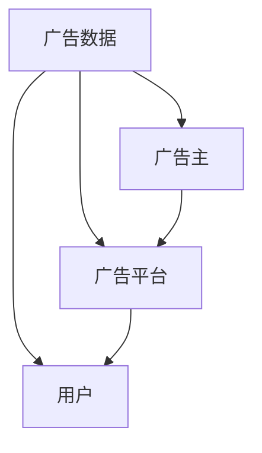
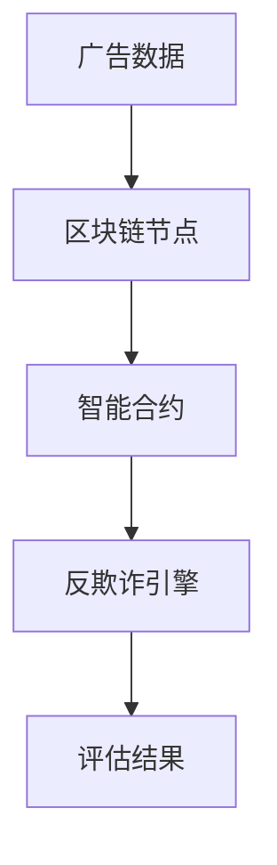
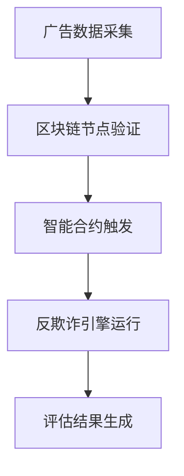
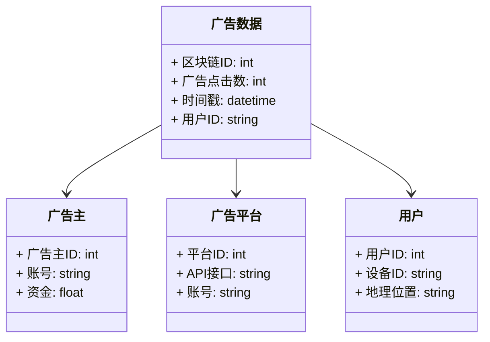
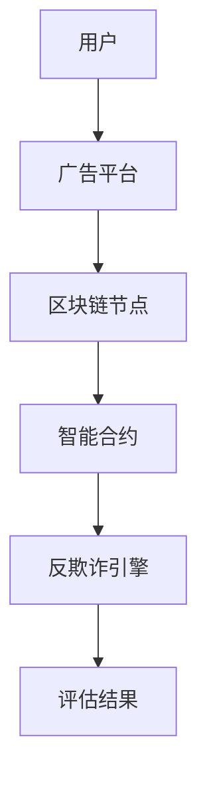

                 


# 《企业估值中的区块链数字广告反欺诈平台评估》

## 关键词：区块链、数字广告、反欺诈、企业估值、智能合约

## 摘要：
随着数字广告行业的快速发展，欺诈行为对企业估值的影响日益显著。区块链技术的引入为解决这一问题提供了新的可能性。本文详细探讨了如何利用区块链技术构建数字广告反欺诈平台，并通过评估该平台的价值来影响企业估值。文章从背景、核心概念、算法原理、系统架构、项目实战等方面展开，结合具体案例和代码实现，为企业估值提供了新的视角和方法。

---

## 正文：

### 第一部分: 企业估值中的区块链数字广告反欺诈平台背景介绍

#### 第1章: 问题背景与描述

##### 1.1 问题背景
- **数字广告行业的现状与挑战**：数字广告行业规模庞大，但欺诈行为（如虚假点击、假流量）猖獗，导致企业广告支出浪费，影响企业估值。
- **区块链技术的应用潜力**：区块链的去中心化、不可篡改性和透明性，使其成为解决广告反欺诈的理想技术。
- **反欺诈平台的必要性**：通过区块链技术，可以实时监测和记录广告数据，确保数据的真实性和完整性。

##### 1.2 问题描述
- **广告欺诈行为**：包括点击劫持、虚假流量、假IP地址等，这些行为不仅浪费广告预算，还可能误导企业决策。
- **当前反欺诈技术的局限性**：传统中心化反欺诈系统依赖第三方数据，存在数据孤岛、可操控性等问题，难以彻底解决欺诈问题。

##### 1.3 问题解决与边界
- **区块链技术如何解决广告反欺诈**：通过区块链记录广告数据，确保数据不可篡改；智能合约自动执行反欺诈规则，实时监测广告行为。
- **平台的边界与外延**：平台专注于广告数据的反欺诈评估，不涉及广告内容的生成或分发。
- **核心概念**：区块链节点、智能合约、反欺诈引擎、广告数据、评估结果。

#### 第2章: 核心概念与联系

##### 2.1 核心概念原理
- **区块链技术的核心原理**：分布式账本、共识机制、智能合约。
- **数字广告反欺诈的核心机制**：实时数据监测、去中心化验证、不可篡改性。
- **平台评估的基本原理**：基于区块链数据的多维度分析，生成广告欺诈风险评估报告。

##### 2.2 概念属性特征对比

| 概念           | 属性特征                          |
|----------------|-----------------------------------|
| 区块链技术     | 分布式、不可篡改、透明、去中心化  |
| 数字广告反欺诈 | 实时监测、数据完整性、自动化规则  |
| 平台评估       | 多维度分析、可量化、结果可信度高 |

##### 2.3 ER实体关系图


##### 2.4 数据流图


### 第二部分: 区块链数字广告反欺诈平台评估算法原理

#### 第3章: 算法原理讲解

##### 3.1 反欺诈算法
- **基于区块链的广告监测算法**：通过区块链节点实时监测广告数据，识别异常行为。
- **智能合约实现的反欺诈机制**：智能合约自动触发反欺诈规则，验证广告数据的真实性。
- **去中心化评估算法**：利用分布式节点进行数据验证，生成欺诈风险评估报告。

##### 3.2 算法流程图


##### 3.3 算法实现
- **Python源代码示例**：
```python
def blockchain_ad_monitor(data):
    # 验证数据是否经过区块链节点签名
    if verify_signature(data):
        return True
    else:
        return False

def smart_contract_execution(action):
    # 执行智能合约中的反欺诈规则
    if action == 'monitor':
        return blockchain_monitor()
    else:
        return None

def anti_fraud_engine(data):
    # 分析广告数据，判断是否存在欺诈行为
    if detect_fraud(data):
        return 'fraud detected'
    else:
        return 'no fraud detected'
```

### 第三部分: 系统分析与架构设计方案

#### 第4章: 系统分析

##### 4.1 问题场景介绍
- **问题场景**：广告主投放广告，用户点击广告，数据被记录到区块链节点，智能合约验证数据真实性，反欺诈引擎分析数据，生成评估报告。

##### 4.2 项目介绍
- **项目目标**：构建一个基于区块链的数字广告反欺诈平台，提供实时监测和评估服务。
- **项目参与者**：广告主、广告平台、用户、区块链节点。

##### 4.3 系统功能设计
- **领域模型类图**


##### 4.4 系统架构设计
- **系统架构图**


##### 4.5 系统接口设计
- **API接口**：
  - `POST /api/blockchain/verify`：验证广告数据签名。
  - `GET /api/contract/execute`：执行智能合约。
  - `POST /api/fraud/analyze`：分析广告数据。

### 第五部分: 项目实战

#### 第5章: 项目实战

##### 5.1 环境安装
- **安装Python和区块链框架**：
  ```bash
  pip install python-ethereum
  pip install web3
  ```

##### 5.2 核心实现
- **区块链节点验证**：
  ```python
  from web3 import Web3

  def verify_signature(data):
      # 使用区块链节点验证数据签名
      w3 = Web3(Web3.HTTPProvider("http://localhost:8545"))
      contract_address = w3.toChecksumAddress("0x...")  # 替换为实际地址
      contract_abi = [...]  # 替换为实际ABI
      # 调用智能合约方法验证数据
      return w3.eth.contract(contract_address, abi=contract_abi).functions.verify(data).call()
  ```

##### 5.3 代码应用解读
- **数据验证流程**：
  ```python
  # 1. 采集广告数据
  ad_data = {
      'click_id': '123',
      'timestamp': '2023-10-01 12:00:00',
      'user_id': '456'
  }
  
  # 2. 通过区块链节点验证数据
  is_verified = verify_signature(ad_data)
  
  # 3. 触发智能合约
  if is_verified:
      smart_contract_execution('monitor')
  ```

##### 5.4 案例分析
- **案例：虚假流量检测**：
  - 广告主投放广告，平台记录点击数据。
  - 区块链节点验证点击数据，发现大量来自同一IP的异常点击。
  - 智能合约触发反欺诈规则，标记该广告数据为欺诈。
  - 评估结果生成报告，广告主节省广告支出，提升企业估值。

##### 5.5 项目小结
- **项目成果**：构建了一个基于区块链的数字广告反欺诈平台，实现了广告数据的实时监测和评估。
- **经验总结**：区块链技术能够有效解决广告反欺诈问题，但需要克服性能和扩展性方面的挑战。

### 第四部分: 最佳实践、小结、注意事项和拓展阅读

#### 第6章: 最佳实践

##### 6.1 小结
- 本文详细探讨了区块链技术在数字广告反欺诈中的应用，展示了如何通过区块链构建一个高效的反欺诈平台，从而提升企业估值。

##### 6.2 注意事项
- **数据隐私**：确保广告数据的隐私性，遵守相关法律法规。
- **性能优化**：区块链节点的性能和扩展性需要进一步优化，以应对大规模数据处理。
- **合规性**：确保平台符合广告行业的监管要求。

##### 6.3 拓展阅读
- **推荐阅读**：
  - 《Blockchain Basics: A Non-Technical Introduction to Distributed Ledger Technology》
  - 《广告反欺诈：理论与实践》
  - 《智能合约：法律与技术的融合》

---

通过以上内容，我们详细分析了区块链数字广告反欺诈平台的背景、原理、架构和实现，为企业估值提供了新的思路和方法。未来，随着技术的不断发展，区块链在广告行业的应用将更加广泛，为企业创造更大的价值。

