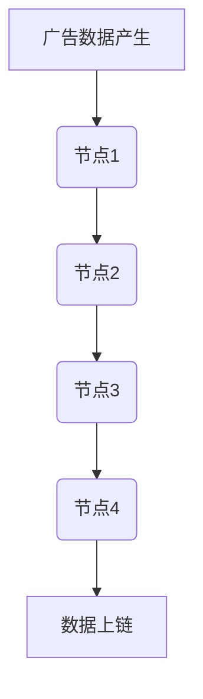
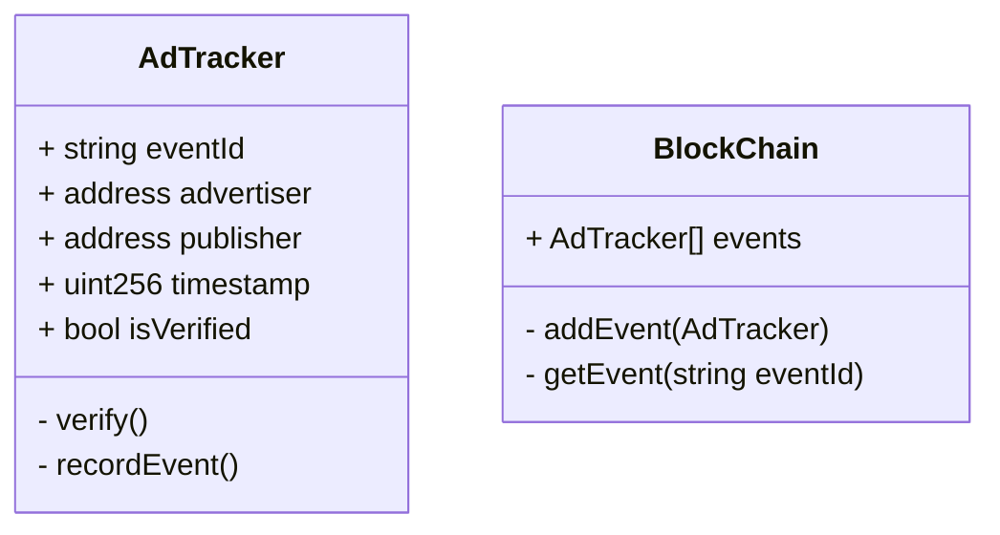
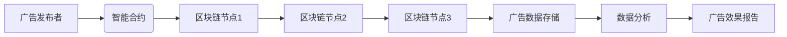
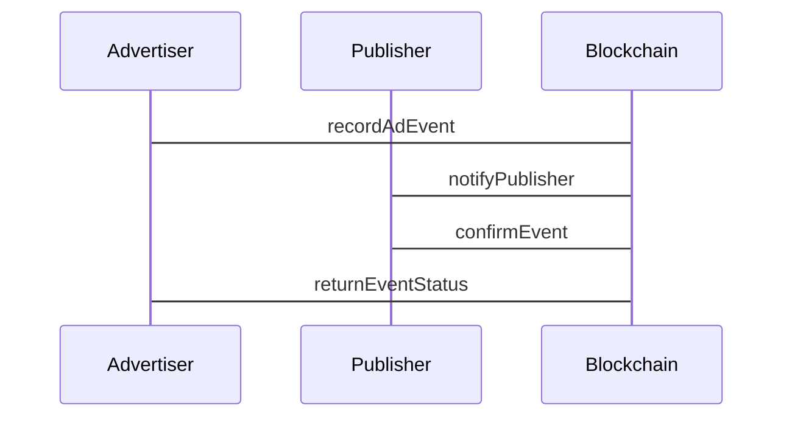

                 


# 企业估值中的区块链数字广告追踪平台评估

## 关键词：区块链、数字广告、企业估值、平台评估、共识机制、智能合约

## 摘要：本文详细探讨了区块链技术在数字广告追踪中的应用及其对企业估值的影响。通过分析区块链的去中心化特性、不可篡改性和透明性，本文揭示了区块链如何解决传统广告追踪中的痛点。文章详细阐述了区块链数字广告追踪平台的核心概念、算法原理、系统架构设计以及实际项目实现，为企业估值提供了新的视角和方法。

---

## 第1章 企业估值中的数字广告追踪问题

### 1.1 数字广告行业的现状与挑战

#### 1.1.1 数字广告行业的快速发展
数字广告行业近年来呈现爆发式增长，2022年全球数字广告支出达到4961亿美元。然而，行业的快速发展背后隐藏着诸多痛点，如广告数据的不透明性、虚假流量、点击欺诈等问题。

#### 1.1.2 数字广告追踪中的痛点
- **数据不透明**：广告点击量和展示量难以验证，存在虚假流量。
- **追踪成本高**：传统中心化平台依赖第三方追踪工具，成本高昂且数据易篡改。
- **数据孤岛**：不同平台的数据无法有效整合，难以形成完整的广告效果评估体系。

#### 1.1.3 区块链技术在广告追踪中的潜力
区块链的去中心化特性能够确保广告数据的真实性和透明性，实现广告效果的精准评估，从而为企业估值提供可靠依据。

### 1.2 区块链技术的核心优势

#### 1.2.1 区块链的基本概念
区块链是一种分布式账本技术，通过去中心化的方式记录数据，并通过密码学确保数据的不可篡改性。

#### 1.2.2 区块链的核心特性
- **去中心化**：数据由多个节点共同维护，避免单点故障。
- **不可篡改**：每一条数据都通过哈希算法加密，并通过共识机制确保数据一致性。
- **透明性**：所有交易记录在区块链上公开可查，但用户隐私得到保护。

#### 1.2.3 区块链在广告追踪中的应用价值
通过区块链技术，广告的点击、展示、转化等数据可以被实时记录并不可篡改，从而为广告效果评估提供可靠的数据支持。

### 1.3 平台评估的重要性

#### 1.3.1 平台评估的定义
平台评估是对区块链数字广告追踪平台的技术性能、安全性、可扩展性等多维度进行综合评估的过程。

#### 1.3.2 平台评估的必要性
- **确保数据真实性**：通过评估平台的技术能力，确保广告数据的准确性和完整性。
- **降低企业估值风险**：基于真实数据的广告效果评估，能够为企业的估值提供可靠依据。
- **提升行业信任度**：通过透明化的数据记录，提升广告行业的信任度。

#### 1.3.3 平台评估的边界与外延
平台评估不仅关注技术层面的性能，还涉及数据隐私、用户体验、法律合规等多个方面。

---

## 第2章 区块链与数字广告追踪的结合

### 2.1 区块链在广告追踪中的应用原理

#### 2.1.1 区块链的去中心化特性
通过分布式节点记录广告数据，避免单点数据篡改的可能性。

#### 2.1.2 区块链的不可篡改特性
每一条广告数据都通过哈希算法加密，并通过共识机制确保数据一致性。

#### 2.1.3 区块链的透明性
所有广告数据记录在区块链上，公开可查，但用户隐私得到保护。

### 2.2 数字广告追踪的核心要素

#### 2.2.1 广告数据的全生命周期管理
从广告发布、点击、展示到转化，记录广告数据的全生命周期。

#### 2.2.2 广告点击的追踪与验证
通过区块链记录每一次广告点击事件，确保数据的真实性。

#### 2.2.3 广告效果的评估指标
包括点击率（CTR）、转化率（CR）、展示量（Impression）等关键指标。

### 2.3 平台评估的关键指标

#### 2.3.1 平台的性能指标
- **交易处理能力**：每秒处理的交易数量（TPS）。
- **网络延迟**：区块链网络的响应时间。
- **存储效率**：数据存储的压缩率和查询效率。

#### 2.3.2 平台的安全性评估
- **漏洞检测**：平台是否存在安全漏洞。
- **抗攻击性**：平台在面对DDoS攻击、恶意节点攻击时的表现。
- **隐私保护**：平台对用户隐私的保护能力。

#### 2.3.3 平台的可扩展性
- **节点扩展性**：平台支持的节点数量。
- **链上数据规模**：平台能够处理的最大数据量。
- **跨链 interoperability**：平台与其他区块链平台的兼容性。

---

## 第3章 广告追踪的区块链算法实现

### 3.1 区块链共识机制在广告追踪中的应用

#### 3.1.1 共识机制的定义
共识机制是区块链中用于确保所有节点达成一致的算法。

#### 3.1.2 共识机制的选择
- **工作量证明（PoW）**：通过计算哈希值来验证交易。
- **权益证明（PoS）**：通过持有代币数量来决定记账权。
- ** delegated proof-of-stake（DPoS）**：通过选举代表节点来记账。

#### 3.1.3 共识机制在广告追踪中的实现
以DPoS为例，通过选举多个节点来记录广告数据，确保数据的准确性和一致性。



### 3.2 智能合约在广告追踪中的应用

#### 3.2.1 智能合约的定义
智能合约是区块链上的自动化程序，用于执行预定义的规则。

#### 3.2.2 智能合约的功能
- **自动执行广告追踪**：智能合约自动记录广告的点击、展示等事件。
- **自动结算**：根据广告效果自动结算广告费用。

#### 3.2.3 智能合约在广告追踪中的实现
以下是一个简单的智能合约示例：

```solidity
// SPDX-License-Identifier: MIT
pragma solidity ^0.8.0;

contract AdTracker {
    struct AdEvent {
        address advertiser;
        address publisher;
        uint256 timestamp;
        string eventId;
    }

    event AdEventRecorded(AdEvent event);

    function recordAdEvent(address advertiser, address publisher, string memory eventId) public {
        AdEvent memory newEvent = AdEvent(advertiser, publisher, block.timestamp, eventId);
        emit AdEventRecorded(newEvent);
    }
}
```

### 3.3 广告数据的加密与解密算法

#### 3.3.1 加密算法的定义
加密算法用于保护广告数据的隐私性。

#### 3.3.2 加密算法的选择
- **对称加密**：如AES算法，速度快，适合大量数据加密。
- **非对称加密**：如RSA算法，适合公钥加密和签名。

#### 3.3.3 加密算法在广告追踪中的实现
以下是一个简单的加密与解密示例：

```python
from cryptography.hazmat.primitives.asymmetric import padding
from cryptography.hazmat.primitives.asymmetric.rsa import RSAParameters
from cryptography.hazmat.primitives import hashes

# 生成RSA密钥对
key = RSAParameters.generate_private-public_key()

# 加密广告数据
message = "广告点击事件"
encrypted_data = key.public_key().encrypt(message)

# 解密数据
decrypted_data = key.decrypt(encrypted_data)
```

---

## 第4章 区块链数字广告追踪平台的系统架构设计

### 4.1 问题场景介绍
广告数据的全生命周期管理，包括数据采集、存储、分析和展示。

### 4.2 项目介绍
一个基于区块链的数字广告追踪平台，旨在解决传统广告追踪中的痛点。

### 4.3 系统功能设计

#### 4.3.1 领域模型


### 4.4 系统架构设计

#### 4.4.1 系统架构图


#### 4.4.2 系统接口设计
- **API接口**：广告发布者调用智能合约接口记录广告事件。
- **数据接口**：数据分析模块从区块链节点获取广告数据。

#### 4.4.3 系统交互图


---

## 第5章 项目实战

### 5.1 环境安装
- **区块链框架**：以太坊（Ethereum）或波场（TRX）。
- **智能合约开发工具**：Solidity、Remix IDE。
- **后端开发工具**：Python、Node.js。

### 5.2 系统核心实现源代码

#### 5.2.1 智能合约实现
```solidity
// SPDX-License-Identifier: MIT
pragma solidity ^0.8.0;

contract AdTracker {
    struct AdEvent {
        address advertiser;
        address publisher;
        uint256 timestamp;
        string eventId;
        bool isVerified;
    }

    event AdEventRecorded(AdEvent event);

    function recordAdEvent(address advertiser, address publisher, string memory eventId) public {
        AdEvent memory newEvent = AdEvent(advertiser, publisher, block.timestamp, eventId, false);
        emit AdEventRecorded(newEvent);
    }

    function verifyEvent(string memory eventId) public {
        // 验证逻辑
        AdEvent storage event = getEvent(eventId);
        event.isVerified = true;
    }

    function getEvent(string memory eventId) private view returns (AdEvent) {
        // 获取事件逻辑
    }
}
```

#### 5.2.2 后端代码实现
```python
from web3 import Web3
from eth_account import Account

# 初始化区块链实例
web3 = Web3(Web3.HTTPProvider("http://localhost:8545"))

# 智能合约地址
contract_address = "0x..."

# 智能合约ABI
abi = [...]  # 替换为实际ABI

# 合约实例
contract = web3.eth.contract(contract_address, abi=abi)

# 记录广告事件
def record_ad_event(advertiser, publisher, event_id):
    account = Account.from_key(private_key).connect(web3)
    tx_hash = contract.functions.recordAdEvent(advertiser, publisher, event_id).transact({'from': account.address})
    receipt = web3.eth.waitForTransactionReceipt(tx_hash)
    return receipt

# 验证事件
def verify_event(event_id):
    tx_receipt = contract.functions.verifyEvent(event_id).transact()
    receipt = web3.eth.waitForTransactionReceipt(tx_receipt)
    return receipt
```

### 5.3 代码应用解读与分析
- **智能合约**：通过智能合约记录广告事件，并验证事件的真实性。
- **后端代码**：通过Python与区块链节点交互，记录和验证广告事件。

### 5.4 实际案例分析
假设一家广告公司发布了一条广告，记录广告点击事件，通过区块链平台验证点击量，确保数据真实可靠。

### 5.5 项目小结
通过区块链技术实现数字广告追踪，能够有效解决传统广告追踪中的痛点，为企业估值提供可靠依据。

---

## 第6章 最佳实践

### 6.1 小结
本文详细探讨了区块链技术在数字广告追踪中的应用，并提出了基于区块链的数字广告追踪平台的评估方法。

### 6.2 注意事项
- **数据隐私**：确保广告数据的隐私性。
- **合规性**：确保平台符合相关法律法规。
- **性能优化**：优化平台性能，提高处理能力。

### 6.3 拓展阅读
- **区块链与企业估值**：进一步了解区块链在企业估值中的其他应用。
- **智能合约的安全性**：深入研究智能合约的安全性问题。

---

# 结语

区块链技术正在逐步改变数字广告行业的生态，通过区块链数字广告追踪平台，企业能够更准确地评估广告效果，从而做出更明智的商业决策。随着技术的不断发展，区块链在企业估值中的应用潜力将更加巨大。

