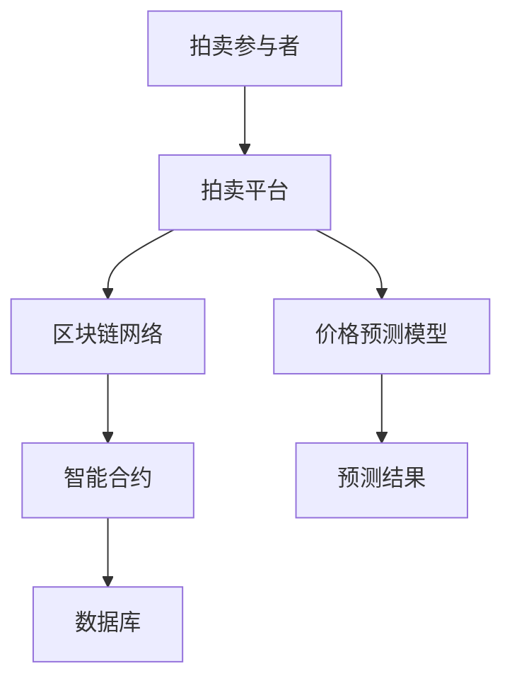
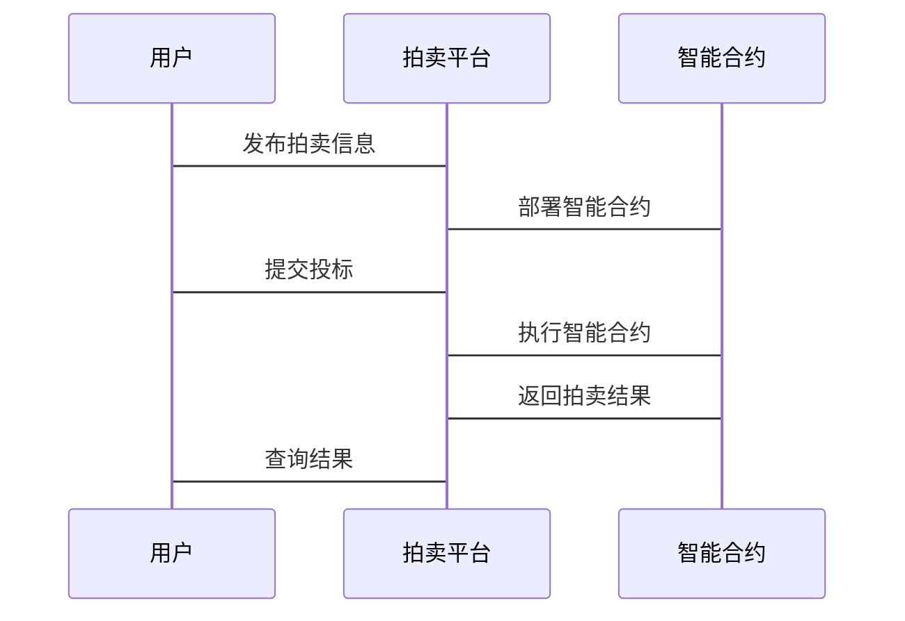

                 


# 企业估值中的区块链数字艺术品拍卖平台评估

> 关键词：区块链，数字艺术品，拍卖平台，企业估值，智能合约

> 摘要：本文详细探讨了区块链技术在数字艺术品拍卖平台中的应用及其对企业估值的影响。通过分析区块链的去中心化特性、智能合约功能以及数字艺术品的独特属性，本文构建了一个基于区块链的数字艺术品拍卖平台评估模型。该模型结合了传统艺术品估值方法与区块链技术的优势，能够更准确、更高效地进行数字艺术品的估值，为企业的价值评估提供了新的思路。

---

## 第1章: 区块链与数字艺术品拍卖平台概述

### 1.1 区块链技术的基本概念

区块链是一种分布式账本技术，通过去中心化的方式记录数据，并确保数据的安全性和不可篡改性。区块链的核心特征包括：

- **去中心化**：数据存储在多个节点上，没有单点故障。
- **不可篡改性**：数据一旦写入区块链，无法被修改。
- **透明性**：区块链上的数据对所有参与者可见。
- **智能合约**：基于区块链的自动化执行合同，用于自动处理交易和支付。

### 1.2 数字艺术品拍卖平台的定义与特点

数字艺术品是指以数字形式存在的艺术作品，如数字画作、NFT（非同质化代币）等。数字艺术品拍卖平台是一个在线平台，允许买家和卖家进行数字艺术品的拍卖交易。其特点包括：

- **数字化**：作品以数字形式存在，可以轻松复制和传播。
- **唯一性**：通过区块链技术，数字艺术品可以证明其唯一性和所有权。
- **全球性**：拍卖平台可以覆盖全球市场，打破地域限制。

### 1.3 区块链在企业估值中的作用

区块链技术在数字艺术品拍卖平台中的应用，能够显著提升企业的估值能力。具体表现为：

- **提升透明度**：区块链记录的交易数据不可篡改，提高了拍卖过程的透明度。
- **增强信任**：智能合约的自动执行减少了人为干预，增强了交易的信任度。
- **降低交易成本**：通过去中心化的方式，区块链减少了中间环节，降低了交易成本。

---

## 第2章: 区块链数字艺术品拍卖平台的核心概念

### 2.1 数字艺术品的特性与分类

数字艺术品的特性包括：

- **数字化**：作品以数字形式存在，可以通过互联网传播。
- **可复制性**：数字作品可以轻松复制，但通过区块链技术可以确保其唯一性。
- **可编程性**：数字艺术品可以通过代码进行互动和变换。

数字艺术品的分类主要依据其用途和形式，包括：

- **数字绘画**：以数字形式创作的绘画作品。
- **NFT艺术**：以NFT形式存在的数字艺术作品，具有唯一性和所有权证明。
- **互动艺术**：用户可以通过互动方式生成或改变的艺术作品。

### 2.2 区块链技术在数字艺术品拍卖中的应用

区块链技术在数字艺术品拍卖中的应用主要体现在以下几个方面：

- **所有权记录**：通过区块链记录艺术品的所有权信息，确保交易的合法性。
- **智能合约**：用于自动执行拍卖流程，确保交易的公平性和透明性。
- **防止伪造**：区块链的不可篡改性确保数字艺术品的真实性和唯一性。

### 2.3 数字艺术品拍卖平台的估值模型

传统的艺术品估值方法主要依赖于专家经验和市场参考价，存在主观性强、透明度低等问题。区块链技术的应用可以有效解决这些问题。以下是区块链数字艺术品拍卖平台的估值模型：

1. **数据采集**：通过区块链记录艺术品的历史交易数据、创作者信息、市场需求等。
2. **特征提取**：提取艺术品的数字化特征，如颜色分布、纹理特征等。
3. **模型训练**：利用机器学习算法对历史数据进行建模，预测艺术品的市场价值。
4. **智能合约**：通过智能合约自动执行估值模型，确保评估的公平性和透明性。

---

## 第3章: 区块链数字艺术品拍卖平台的算法原理

### 3.1 区块链数字艺术品拍卖的核心算法

区块链数字艺术品拍卖的核心算法主要体现在智能合约的设计和价格预测模型的构建。以下是具体的实现步骤：

1. **智能合约的设计**：
   - 定义拍卖规则，如拍卖时间、竞价规则等。
   - 实现自动支付功能，确保拍卖资金的安全性。
   - 记录拍卖结果，确保数据的不可篡改性。

2. **价格预测模型的构建**：
   - 收集历史拍卖数据，包括成交价、艺术品特征、市场热度等。
   - 使用机器学习算法（如线性回归、随机森林）对数据进行建模。
   - 对模型进行训练和优化，确保预测的准确性。

### 3.2 智能合约的实现细节

以下是智能合约的实现流程：

1. **智能合约的编写**：
   ```solidity
   // 智能合约代码示例
   contract ArtAuction {
       address payable public beneficiary;
       uint public minBid;
       uint public auctionEndTime;

       constructor(address payable _beneficiary, uint _minBid) {
           beneficiary = _beneficiary;
           minBid = _minBid;
       }

       function bid() payable public {
           require(msg.value >= minBid);
           // 处理投标逻辑
       }

       function withdraw() public {
           require(block.timestamp >= auctionEndTime);
           // 处理退款逻辑
       }
   }
   ```

2. **智能合约的部署**：
   - 将智能合约部署到区块链网络上。
   - 确保合约地址可被拍卖参与者访问。

3. **智能合约的安全性**：
   - 定期进行安全审计，防止漏洞攻击。
   - 使用权限控制，确保合约的安全性和稳定性。

### 3.3 数字艺术品价格预测的数学模型

以下是基于机器学习的价格预测模型：

1. **数据预处理**：
   - 收集数字艺术品的历史交易数据。
   - 提取艺术品的数字化特征，如颜色、纹理、风格等。

2. **模型训练**：
   - 使用线性回归模型对数据进行训练。
   - 通过交叉验证优化模型参数。

3. **模型预测**：
   - 使用训练好的模型对新艺术品进行估值。

数学公式示例：
$$ \text{预测价格} = \beta_0 + \beta_1 \times \text{颜色特征} + \beta_2 \times \text{纹理特征} $$

---

## 第4章: 区块链数字艺术品拍卖平台的系统架构设计

### 4.1 系统功能模块划分

区块链数字艺术品拍卖平台的系统功能模块包括：

1. **用户认证模块**：
   - 用户注册与登录。
   - 用户身份验证。

2. **拍卖流程模块**：
   - 拍卖信息发布。
   - 拍卖过程监控。

3. **智能合约模块**：
   - 智能合约的编写与部署。
   - 智能合约的执行与管理。

4. **价格预测模块**：
   - 数据收集与处理。
   - 模型训练与预测。

### 4.2 系统架构设计

以下是系统的总体架构图：



### 4.3 系统接口设计

系统接口设计包括：

1. **用户接口**：
   - 提供拍卖信息发布、投标、查询等功能。

2. **智能合约接口**：
   - 提供合约部署、执行、查询等功能。

3. **价格预测接口**：
   - 提供数据输入、模型调用、结果返回等功能。

### 4.4 系统交互设计

以下是系统的交互流程图：



---

## 第5章: 区块链数字艺术品拍卖平台的项目实战

### 5.1 环境安装

要运行区块链数字艺术品拍卖平台，需要以下环境：

- **区块链平台**：如Ethereum、Hyperledger Fabric。
- **智能合约开发工具**：如Solidity、 Remix。
- **机器学习框架**：如Python、Scikit-learn。

### 5.2 系统核心实现源代码

以下是系统核心代码示例：

```python
# 价格预测模型代码
import numpy as np
from sklearn.linear_model import LinearRegression

# 数据预处理
X = np.array([[1, 2], [3, 4], [5, 6]])
y = np.array([2, 4, 6])

# 模型训练
model = LinearRegression()
model.fit(X, y)

# 模型预测
new_X = np.array([[7, 8]])
predicted_y = model.predict(new_X)
print(predicted_y)
```

### 5.3 案例分析

以一个具体的数字艺术品拍卖为例，详细分析平台的运作流程：

1. **拍卖信息发布**：用户在平台发布数字艺术品拍卖信息，包括作品描述、起拍价、拍卖时间等。
2. **智能合约部署**：平台根据拍卖信息生成智能合约，并部署到区块链网络。
3. **投标过程**：用户提交投标，智能合约自动验证投标是否有效。
4. **拍卖结果确认**：拍卖结束后，智能合约自动执行，将拍品所有权转移至最高 bidder。
5. **价格预测**：平台根据历史数据和当前市场情况，预测艺术品的市场价值。

### 5.4 项目小结

通过实际案例分析，可以验证区块链数字艺术品拍卖平台的可行性和高效性。智能合约的自动执行和价格预测模型的准确预测，显著提升了拍卖的透明度和效率。

---

## 第6章: 最佳实践与总结

### 6.1 最佳实践

1. **安全性**：定期进行安全审计，防止智能合约漏洞。
2. **可扩展性**：设计模块化的系统架构，便于功能扩展。
3. **用户体验**：优化平台的用户界面，提升用户体验。

### 6.2 小结

本文详细探讨了区块链技术在数字艺术品拍卖平台中的应用，并构建了一个基于区块链的数字艺术品拍卖平台评估模型。该模型能够准确评估数字艺术品的价值，为企业的估值提供了新的思路。

### 6.3 注意事项

1. **技术风险**：区块链技术和智能合约存在一定的技术风险，需要谨慎处理。
2. **法律风险**：数字艺术品的交易和所有权需要符合相关法律法规。
3. **市场风险**：数字艺术品市场波动较大，需要做好风险管理工作。

### 6.4 拓展阅读

- 推荐阅读《区块链：分布式应用设计》。
- 参考文献：《区块链技术与数字艺术》。

---

通过本文的详细讲解，读者可以深入了解区块链技术在数字艺术品拍卖平台中的应用，并能够实际操作构建一个基于区块链的数字艺术品拍卖平台。希望本文能够为相关领域的研究和实践提供有价值的参考。

