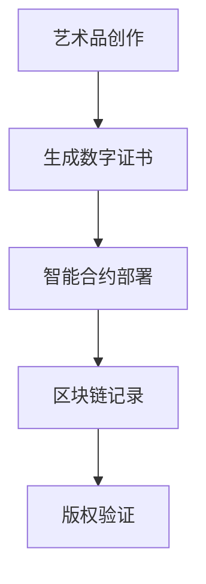
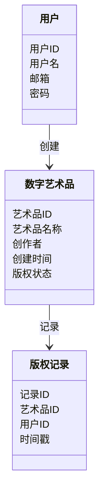
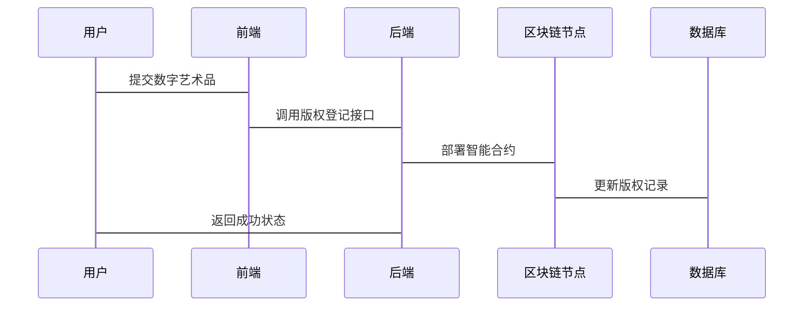

                 


# 企业估值中的区块链数字艺术品版权管理平台评估

## 关键词：区块链，数字艺术品，版权管理，企业估值，智能合约，去中心化

## 摘要：本文深入探讨了区块链技术在数字艺术品版权管理中的应用，分析了其对企业估值的影响。通过详细的技术分析和系统设计，展示了如何利用区块链实现高效、透明的版权管理，从而提升企业的市场价值。

---

## 第一部分：背景介绍

### 第1章：问题背景与问题描述

#### 1.1 问题背景

- **数字艺术品的兴起与发展**：数字艺术作品（如NFTs）在数字艺术市场中的爆炸式增长，以及传统版权管理方法的局限性。
- **版权管理的痛点与挑战**：版权归属难以验证，盗版问题严重，交易过程复杂，缺乏透明度。
- **区块链技术的应用前景**：区块链的去中心化和不可篡改性为解决版权问题提供了技术基础。

#### 1.2 问题描述

- **数字艺术品版权管理的现状**：依赖中心化机构，存在效率低、成本高等问题。
- **平台评估的难点与关键点**：如何选择和评估区块链数字艺术品版权管理平台，确保其安全性和功能性。

#### 1.3 问题解决

- **区块链技术如何解决版权问题**：通过区块链记录艺术品的创建、交易和使用历史，确保版权信息的真实性和不可篡改性。
- **数字艺术品平台评估的方法**：基于技术实现、用户体验、安全性等多维度的综合评估。

#### 1.4 边界与外延

- **平台评估的边界条件**：仅关注版权管理功能，不涉及艺术品创作工具或其他附加功能。
- **相关领域的扩展与联系**：数字艺术品市场的整体发展趋势，区块链技术在其他领域的应用。

#### 1.5 概念结构与核心要素

- **核心概念的构成**：区块链技术、数字艺术品、版权管理平台。
- **核心要素的详细说明**：区块链的去中心化特性、智能合约的功能、数字艺术品的唯一性验证。

---

## 第二部分：核心概念与联系

### 第2章：核心概念解析

#### 2.1 区块链技术

- **区块链的基本原理**：通过分布式账本记录交易，确保数据不可篡改。
- **区块链的特性与优势**：去中心化、不可篡改、透明性、安全性。

#### 2.2 数字艺术品

- **数字艺术品的定义与特点**：以数字形式存在的艺术作品，具有可复制性和传播性。
- **数字艺术品的创作与传播**：数字技术降低了创作门槛，促进了艺术作品的快速传播。

#### 2.3 版权管理

- **版权管理的流程与挑战**：包括作品登记、授权、侵权监测等，传统方法效率低下。
- **区块链在版权管理中的应用**：通过区块链记录版权信息，确保作品的合法性和所有权。

### 第3章：核心概念对比分析

#### 3.1 概念属性对比

| 概念       | 区块链技术 | 数字艺术品 | 版权管理 |
|------------|------------|------------|----------|
| 定义       | 分布式账本技术 | 数字形式的艺术作品 | 管理艺术作品的版权 |
| 特性       | 去中心化、不可篡改 | 可复制性、传播性 | 法律保护、授权管理 |
| 应用领域   | 加密货币、供应链、版权管理 | 数字艺术市场 | 文化产业 |

#### 3.2 ER实体关系图

```mermaid
erd
    艺术品
    拥有者
    版权记录
    交易记录
    智能合约
    区块链
    节点
    用户
```

---

## 第三部分：算法原理

### 第4章：区块链数字艺术品版权管理平台的算法原理

#### 4.1 区块链的工作流程



- **数据结构与哈希函数**：哈希函数用于生成区块标识，确保数据完整性和唯一性。
- **区块链的共识机制**：如PoW、PoS，用于验证交易的有效性。

#### 4.2 智能合约的实现

```solidity
// SPDX-License-Identifier: MIT
pragma solidity ^0.8.0;

contract Artwork {
    address public owner;
    string public metadata;
    uint256 public version;

    constructor(address _owner, string memory _metadata, uint256 _version) {
        owner = _owner;
        metadata = _metadata;
        version = _version;
    }

    function transferOwnership(address newOwner) public {
        owner = newOwner;
    }
}
```

- **智能合约的定义与功能**：用于自动执行版权转让和许可，确保交易的透明和可追溯。
- **智能合约的编写与部署**：使用Solidity语言编写，部署在区块链网络上。

#### 4.3 数学模型与公式

- **哈希函数**：$$H(x) = \text{hash}(x)$$
- **共识机制的数学模型**：$$P = \sum_{i=1}^{n} \frac{1}{i}$$

---

## 第四部分：系统分析与架构设计

### 第5章：系统分析

#### 5.1 问题场景介绍

- **系统目标**：构建一个基于区块链的数字艺术品版权管理平台，实现版权登记、交易追踪和侵权监测。
- **用户需求**：艺术家、收藏家和平台管理员需要便捷、安全的版权管理工具。

#### 5.2 系统功能设计

- **功能模块**：版权登记、交易记录、侵权监测、用户管理。
- **领域模型类图**



#### 5.3 系统架构设计


- **系统架构图**：前端处理用户请求，后端处理逻辑，区块链节点记录数据，数据库存储元数据。
- **系统接口设计**：API接口用于用户认证、艺术品上传、版权查询。
- **系统交互流程**



---

## 第五部分：项目实战

### 第6章：项目实战

#### 6.1 环境安装

- **区块链平台选择**：以太坊、Hyperledger Fabric等。
- **工具安装**：Solidity编译器、以太坊钱包、区块链模拟器。

#### 6.2 系统核心实现

```python
from web3 import Web3, HTTPProvider

# 初始化Web3实例
web3 = Web3(HTTPProvider('http://localhost:8545'))

# 合约地址和ABI
contract_address = '0x123...'
contract_abi = [...]  # 合约ABI

# 创建合约实例
contract = web3.eth.contract(contract_address, abi=contract_abi)

# 调用智能合约方法
tx_hash = contract.functions.registerArtwork(artist, metadata, version).transact()
web3.eth.waitForTransactionReceipt(tx_hash)
```

#### 6.3 代码应用解读与分析

- **代码实现**：通过Python脚本与智能合约交互，实现数字艺术品的版权登记和转移。
- **代码功能**：提交艺术品信息、查询版权状态、处理交易请求。

#### 6.4 实际案例分析

- **案例选择**：假设一个数字绘画作品，通过平台进行版权登记和交易。
- **步骤分解**：创作、登记、交易、验证，展示每一步的操作流程和技术细节。

#### 6.5 项目小结

- **项目总结**：成功实现了基于区块链的数字艺术品版权管理平台，验证了技术可行性。
- **项目意义**：展示了区块链技术在文化产业中的应用潜力，提升了企业的技术竞争力。

---

## 第六部分：最佳实践

### 第7章：最佳实践

#### 7.1 小结

- **核心观点总结**：区块链技术有效解决了数字艺术品版权管理的痛点，提升了企业估值。
- **关键点回顾**：智能合约的正确使用、区块链平台的选择、系统的安全性和可扩展性。

#### 7.2 注意事项

- **技术选型**：选择合适的区块链平台，考虑性能、安全性、可扩展性。
- **用户体验**：设计直观易用的界面，降低用户使用门槛。
- **法律合规**：确保平台符合相关法律法规，特别是版权法和数据保护法。

#### 7.3 拓展阅读

- **推荐阅读书籍**：《区块链：数字货币的革命》、《智能合约开发指南》。
- **推荐阅读文章**：《区块链技术在数字版权管理中的应用研究》。

---

## 结语

通过本文的详细分析和系统设计，我们展示了如何利用区块链技术构建高效的数字艺术品版权管理平台，解决了传统方法的痛点，为企业估值带来了显著提升。未来，随着技术的不断发展，区块链在数字艺术领域的应用将更加广泛和深入，为企业创造更大的价值。

