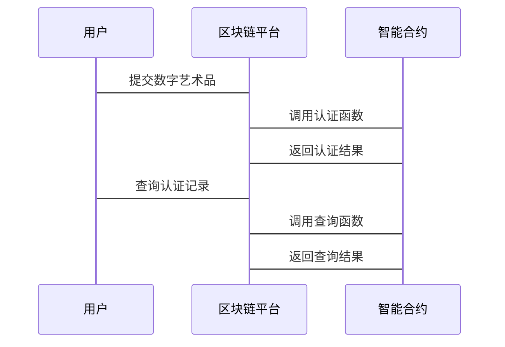

                 


# 企业估值中的区块链数字艺术品认证平台评估

## 关键词：
区块链、数字艺术品、企业估值、智能合约、数字认证、去中心化

## 摘要：
数字艺术品在数字经济发展中占据重要地位，其价值评估和认证问题日益突出。区块链技术的不可篡改性和可追溯性为数字艺术品的认证和估值提供了新的解决方案。本文从区块链技术的基本原理出发，详细探讨了区块链在数字艺术品认证中的应用，分析了数字艺术品认证平台的核心概念、算法原理和系统架构设计，并通过实际案例展示了如何构建一个高效的数字艺术品认证平台。文章最后总结了当前平台的优化方向和未来发展趋势，为企业在数字艺术品领域的估值和管理提供了重要的参考和指导。

---

# 第一部分：区块链数字艺术品认证平台的背景

## 第1章：数字艺术品与区块链技术概述

### 1.1 数字艺术品的现状与挑战

#### 1.1.1 数字艺术品的定义与特点
数字艺术品是以数字形式存在的艺术作品，包括数字绘画、3D建模、数字摄影等。其特点包括：
- **易复制性**：数字格式的艺术作品可以轻松被复制和传播。
- **难确权**：缺乏权威的认证机构，导致数字艺术品的创作者和所有者权益难以保障。
- **交易透明度低**：数字艺术品的交易过程缺乏透明度，存在欺诈和盗版的风险。

#### 1.1.2 数字艺术品交易中的问题
数字艺术品交易中存在的主要问题包括：
- **知识产权保护**：数字艺术品的创作者难以有效防止作品被盗用和侵权。
- **交易信任**：买卖双方缺乏信任，导致交易成本增加。
- **估值困难**：缺乏统一的评估标准，导致数字艺术品的估值不准确。

#### 1.1.3 区块链技术在数字艺术品中的应用潜力
区块链技术为数字艺术品的认证和交易提供了以下潜力：
- **去中心化存储**：区块链的去中心化特性可以确保数字艺术品的唯一性和真实性。
- **不可篡改性**：区块链记录的交易和认证信息无法被篡改，确保了数据的安全性。
- **透明性**：区块链的公开账本可以提高交易的透明度，增强买卖双方的信任。

### 1.2 区块链技术的基本概念

#### 1.2.1 区块链的定义与核心原理
区块链是一种去中心化的分布式账本技术，通过链式数据结构和密码学算法确保数据的安全性和一致性。其核心原理包括：
- **去中心化**：数据分布在多个节点上，不存在单一的控制中心。
- **共识机制**：通过共识算法确保所有节点达成一致。
- **智能合约**：自动执行预定义的合同条款，减少中间人干预。

#### 1.2.2 区块链的共识机制
共识机制是区块链的核心，确保所有节点达成一致。常见的共识机制包括：
- **工作量证明（PoW）**：通过计算哈希值来验证数据的有效性。
- **权益证明（PoS）**：通过持有一定数量的代币来获得记账权。
- ** delegated proof of stake（DPoS）**：通过选举代表节点来实现共识。

#### 1.2.3 智能合约的概念与作用
智能合约是在区块链上运行的自动执行程序，用于自动执行合同条款。在数字艺术品交易中，智能合约可以用于：
- **自动化交易**：自动完成艺术品的转移和资金的结算。
- **自动验证**：通过智能合约验证数字艺术品的唯一性和真实性。

### 1.3 数字艺术品认证平台的必要性

#### 1.3.1 数字艺术品确权的重要性
数字艺术品的创作者和所有者需要通过确权来保护自己的权益。区块链技术可以提供不可篡改的记录，确保数字艺术品的唯一性和所有权。

#### 1.3.2 区块链在数字艺术品认证中的优势
区块链技术的优势在于其不可篡改性和可追溯性。通过区块链，数字艺术品的交易和认证信息可以被永久记录，确保信息的真实性和可靠性。

#### 1.3.3 平台在企业估值中的价值
数字艺术品认证平台可以帮助企业准确评估数字艺术品的价值，降低估值误差。同时，通过提高交易的透明度和信任度，企业可以降低交易成本，增强市场竞争力。

---

## 第2章：数字艺术品认证平台的核心概念

### 2.1 区块链数字艺术品认证的核心原理
区块链数字艺术品认证的核心原理在于其不可篡改性和可追溯性。通过区块链技术，数字艺术品的每一步交易和认证信息都可以被记录和验证，确保艺术品的真实性和所有权。

### 2.2 数字艺术品认证的流程与机制
数字艺术品认证的流程包括：
1. **提交作品**：用户将数字艺术品提交到区块链平台，平台生成唯一标识。
2. **认证记录**：平台记录作品的哈希值和提交时间，确保作品的唯一性和真实性。
3. **交易验证**：通过智能合约实现作品的自动转移和资金结算。

### 2.3 平台核心概念的ER实体关系图
以下是一个简单的ER实体关系图，展示了数字艺术品认证平台的核心实体和关系：

```mermaid
er
    actor 用户
    actor 艺术家
    actor 收藏家
    entity 数字艺术品
    entity 认证记录
    relationship 用户 -> 数字艺术品: 提交作品
    relationship 艺术家 -> 数字艺术品: 创作作品
    relationship 收藏家 -> 数字艺术品: 购买作品
    relationship 数字艺术品 <-> 认证记录: 记录认证信息
```

---

## 第3章：区块链共识机制与数字艺术品认证

### 3.1 共识机制在数字艺术品认证中的应用
共识机制是区块链的核心，确保数字艺术品认证的准确性和可靠性。通过共识机制，数字艺术品的每一步交易和认证信息都可以被验证和确认。

### 3.2 智能合约在数字艺术品交易中的作用
智能合约在数字艺术品交易中的作用不可忽视。通过智能合约，数字艺术品的转移和资金结算可以实现自动化，减少人为干预和欺诈风险。

### 3.3 区块链数字艺术品认证的数学模型与公式
以下是一个简单的哈希函数示例，用于对数字艺术品进行唯一标识：

$$ H(message) = hash $$

---

## 第4章：数字艺术品认证平台的系统架构设计

### 4.1 系统功能设计
数字艺术品认证平台的功能设计包括：
- 提交作品：用户可以通过平台提交数字艺术品，并生成唯一标识。
- 认证记录：平台记录作品的哈希值和提交时间，确保作品的唯一性和真实性。
- 交易验证：通过智能合约实现作品的自动转移和资金结算。

### 4.2 系统架构设计
数字艺术品认证平台的系统架构设计包括：
- 前端：用户界面，实现用户与平台的数据交互。
- 后端：处理用户请求，验证交易信息。
- 区块链节点：分布式节点，存储交易和认证信息。
- 数据库：存储用户信息、作品信息和交易记录。

### 4.3 接口设计与交互流程
以下是一个用户提交数字艺术品的交互流程示例：



---

## 第5章：数字艺术品认证平台的项目实战

### 5.1 项目环境安装
数字艺术品认证平台的项目环境安装包括：
- 安装以太坊钱包：用于管理和操作以太坊代币。
- 安装Solidity编译器：用于编写和编译智能合约。
- 安装以太坊节点：用于运行和管理区块链网络。

### 5.2 智能合约实现
以下是一个简单的智能合约示例，用于实现数字艺术品的提交和认证：

```solidity
contract DigitalArt {
    mapping(address => uint256) public ownerOf;
    mapping(uint256 => bytes32) public hashOf;

    function submit(bytes32 hash) public {
        hashOf[block.number] = hash;
        ownerOf[msg.sender] = block.number;
    }

    function transfer(address to) public {
        uint256 tokenId = ownerOf[msg.sender];
        ownerOf[to] = tokenId;
        ownerOf[msg.sender] = 0;
    }
}
```

### 5.3 项目实战总结
通过实际项目的实施，我们可以看到区块链技术在数字艺术品认证中的巨大潜力。智能合约的应用不仅提高了交易的效率，还降低了交易成本和风险。

---

## 第6章：平台的优化与未来发展趋势

### 6.1 平台优化的方向
数字艺术品认证平台的优化方向包括：
- 提高系统的可扩展性：通过优化区块链网络和智能合约的设计，提高平台的处理能力。
- 降低交易成本：通过采用Layer 2解决方案，降低交易的 gas 费用。

### 6.2 未来发展趋势
数字艺术品认证平台的未来发展趋势包括：
- 区块链技术的进一步发展：如Layer 2解决方案的应用，将大大提升平台的性能和效率。
- 数字艺术品市场的扩大：随着数字艺术的兴起，数字艺术品认证平台的需求将进一步增加。

---

## 第7章：总结与展望

### 7.1 章节回顾
本文详细探讨了区块链技术在数字艺术品认证中的应用，分析了数字艺术品认证平台的核心概念、算法原理和系统架构设计，并通过实际案例展示了如何构建一个高效的数字艺术品认证平台。

### 7.2 未来展望
随着区块链技术的不断发展，数字艺术品认证平台将为企业在数字艺术品领域的估值和管理提供更多的可能性。未来的研究方向包括优化平台性能、降低交易成本、提高用户体验等。

---

通过本文的分析和探讨，我们可以看到区块链技术在数字艺术品认证中的巨大潜力。数字艺术品认证平台的应用不仅提高了交易的效率和透明度，还为企业的估值和管理提供了重要的参考和指导。未来，随着区块链技术的进一步发展，数字艺术品认证平台将在数字经济发展中发挥越来越重要的作用。

