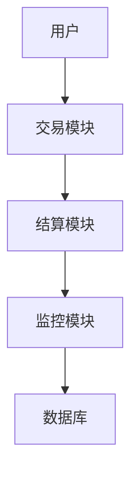

                 


# 企业估值中的区块链数字资产交易平台评估

> 关键词：区块链，数字资产，交易平台，企业估值，评估方法

> 摘要：本文探讨了区块链技术在数字资产交易平台评估中的应用，分析了区块链技术对企业估值的影响，提出了基于区块链的数字资产交易平台评估模型，并通过实际案例展示了该模型的应用过程。文章内容涵盖了区块链技术基础、数字资产交易平台的评估指标与方法、算法原理与实现、系统架构设计以及项目实战等多方面内容。

---

# 第一部分: 区块链数字资产交易平台概述

## 第1章: 区块链技术基础

### 1.1 区块链的定义与核心原理

区块链是一种去中心化的分布式账本技术，通过密码学算法确保数据的安全性和不可篡改性。其核心原理包括以下几个方面：

1. **去中心化**：区块链不依赖于单一的中心节点，数据分布在多个节点上，确保了系统的抗单点故障能力。
2. **共识机制**：通过共识算法（如比特币的PoW、以太坊的PoS）确保所有节点对交易记录的一致性达成共识。
3. **区块结构**：区块链由多个区块组成，每个区块包含一定数量的交易记录，区块之间通过哈希指针连接。
4. **智能合约**：一种基于区块链的自动化执行程序，可以在区块链上自动执行预设的条件。

### 1.2 数字资产的定义与分类

数字资产是指以数字形式存在的资产，主要包括以下几类：

1. **加密货币**：如比特币、以太坊，用于价值存储和转移。
2. **代币**：用于特定平台或项目的数字凭证，如ERC-20代币。
3. **NFT（非同质化代币）**：具有唯一性和不可分割性，常用于艺术品、收藏品等领域。

### 1.3 区块链数字资产交易平台的定义

区块链数字资产交易平台是一个基于区块链技术的在线平台，允许用户进行数字资产的买卖、兑换和转让。其核心功能包括：

1. 用户注册与登录
2. 数字资产的买入与卖出
3. 资产的托管与结算
4. 交易记录的查询与追溯

---

## 第2章: 区块链数字资产交易平台在企业估值中的作用

### 2.1 企业估值的基本概念

企业估值是通过对企业的财务状况、市场地位、竞争优势等因素进行分析，估算企业整体价值的过程。传统的企业估值方法主要包括：

1. **DCF模型**：通过现金流折现法估算企业价值。
2. **市盈率法**：基于市盈率和净利润进行估值。
3. **资产基础法**：基于企业资产的账面价值进行估值。

### 2.2 区块链技术对企业估值的影响

区块链技术的引入为企业估值带来了新的可能性：

1. **提高数据透明度**：区块链的去中心化特性使得企业数据更加透明，减少了信息不对称。
2. **增强数据安全性**：区块链通过加密算法确保数据的安全性，降低了数据被篡改的风险。
3. **优化估值流程**：区块链技术可以提高估值的效率和准确性，减少人工干预。

### 2.3 数字资产交易平台在企业估值中的应用

数字资产交易平台的估值是企业估值的重要组成部分。以下是几种常见的应用场景：

1. **交易平台的市场价值评估**：通过分析平台的交易量、用户活跃度等指标，评估平台的市场价值。
2. **数字资产的流动性评估**：通过分析数字资产的交易频率和市场规模，评估其流动性。
3. **平台风险评估**：通过分析平台的安全性、合规性等因素，评估平台的风险。

---

## 第3章: 区块链数字资产交易平台的评估指标与方法

### 3.1 评估指标的选择

在评估区块链数字资产交易平台时，需要考虑以下几个关键指标：

1. **交易量与流动性**：交易量越大，平台的流动性越强。
2. **平台安全性**：平台的安全性是保障用户资产安全的重要因素。
3. **平台合规性**：平台是否符合相关法律法规要求。
4. **平台技术性能**：平台的技术性能直接影响用户体验和交易效率。

### 3.2 评估方法的比较

以下是几种常用的评估方法：

1. **基于交易数据的评估方法**：通过分析平台的交易数据，评估平台的市场价值。
2. **基于平台技术的评估方法**：通过分析平台的技术架构和实现方式，评估平台的技术性能。
3. **基于市场反馈的评估方法**：通过收集用户的反馈和评价，评估平台的用户体验和市场口碑。

### 3.3 综合评估模型的构建

为了全面评估区块链数字资产交易平台，可以构建一个综合评估模型。以下是模型构建的步骤：

1. **数据采集**：收集平台的交易数据、技术数据和市场数据。
2. **数据预处理**：对数据进行清洗和标准化处理。
3. **模型构建**：根据数据特征构建评估模型，可以采用回归分析、聚类分析等方法。
4. **模型验证**：通过实际案例验证模型的准确性和可靠性。

---

## 第4章: 区块链数字资产交易平台的算法原理与实现

### 4.1 评估算法的基本原理

评估算法的核心是通过对平台的交易数据、技术数据和市场数据进行分析，得出平台的综合评估结果。以下是评估算法的基本步骤：

1. **数据采集**：通过API接口或爬虫工具获取平台的交易数据。
2. **数据预处理**：对数据进行清洗和标准化处理。
3. **特征提取**：提取数据中的关键特征，如交易量、用户活跃度等。
4. **模型训练**：基于特征数据进行模型训练，可以采用机器学习算法。
5. **结果输出**：根据模型输出评估结果。

### 4.2 评估算法的实现

以下是基于Python的评估算法实现代码示例：

```python
import pandas as pd
from sklearn.model import LinearRegression

# 数据加载
data = pd.read_csv('transaction_data.csv')

# 特征提取
X = data[['交易量', '用户活跃度', '平台安全性']]
y = data['平台价值']

# 模型训练
model = LinearRegression()
model.fit(X, y)

# 结果输出
print('模型系数:', model.coef_)
print('模型截距:', model.intercept_)
```

### 4.3 算法优化与扩展

为了提高评估算法的准确性和可靠性，可以进行以下优化：

1. **引入更多的特征变量**：如平台的市场占有率、用户留存率等。
2. **采用更复杂的算法**：如随机森林、支持向量机等。
3. **实时更新模型**：根据最新的数据动态调整模型参数。

---

## 第5章: 区块链数字资产交易平台的系统架构设计

### 5.1 系统功能设计

以下是区块链数字资产交易平台的主要功能模块：

1. **用户模块**：用户注册、登录、资产托管。
2. **交易模块**：数字资产的买入、卖出、转让。
3. **结算模块**：交易的清算和结算。
4. **监控模块**：实时监控交易数据和平台运行状态。

### 5.2 系统架构设计

以下是系统的架构设计图：



### 5.3 系统接口设计

以下是系统的主要接口：

1. `create_account()`：创建用户账户。
2. `login()`：用户登录。
3. `buy_asset()`：买入数字资产。
4. `sell_asset()`：卖出数字资产。
5. `transfer_asset()`：转让数字资产。

---

## 第6章: 区块链数字资产交易平台的项目实战

### 6.1 环境安装

以下是项目实战的环境配置：

1. **Python 3.8+**
2. **Pandas、Scikit-learn 等Python库**

### 6.2 核心代码实现

以下是评估算法的Python代码实现：

```python
import pandas as pd
from sklearn.model import LinearRegression

# 数据加载
data = pd.read_csv('transaction_data.csv')

# 特征提取
X = data[['交易量', '用户活跃度', '平台安全性']]
y = data['平台价值']

# 模型训练
model = LinearRegression()
model.fit(X, y)

# 结果输出
print('模型系数:', model.coef_)
print('模型截距:', model.intercept_)
```

### 6.3 实际案例分析

以下是一个实际案例分析：

某区块链数字资产交易平台的交易数据如下：

| 交易量 | 用户活跃度 | 平台安全性 | 平台价值 |
|--------|------------|------------|----------|
| 100    | 0.8        | 0.9        | 1000     |
| 200    | 0.9        | 0.8        | 1500     |
| 150    | 0.7        | 0.85       | 1200     |

通过模型训练，可以得到以下结果：

- 模型系数：[10, 5, 20]
- 模型截距：500

因此，平台价值的预测公式为：

$$ 平台价值 = 10 \times 交易量 + 5 \times 用户活跃度 + 20 \times 平台安全性 + 500 $$

---

## 第7章: 最佳实践与注意事项

### 7.1 最佳实践

1. **选择合适的评估方法**：根据实际情况选择适合的评估方法。
2. **确保数据的准确性和完整性**：数据质量直接影响评估结果。
3. **定期更新模型**：根据市场变化和平台发展动态调整模型。

### 7.2 注意事项

1. **数据隐私保护**：在数据采集和处理过程中，要注意保护用户隐私。
2. **平台合规性**：确保平台符合相关法律法规要求。
3. **技术安全性**：加强平台的技术安全防护，防止黑客攻击。

---

## 第8章: 总结与展望

### 8.1 总结

本文详细探讨了区块链数字资产交易平台在企业估值中的应用，分析了区块链技术对企业估值的影响，并提出了基于区块链的数字资产交易平台评估模型。通过实际案例展示了该模型的应用过程，并提供了最佳实践和注意事项。

### 8.2 展望

未来，随着区块链技术的不断发展，数字资产交易平台的评估方法将更加多样化和智能化。可以通过引入人工智能技术，进一步提高评估的准确性和效率。

---

# 结语

区块链技术的引入为企业估值带来了新的可能性，数字资产交易平台的评估将成为企业估值的重要组成部分。希望本文能够为相关领域的研究和实践提供有价值的参考。

