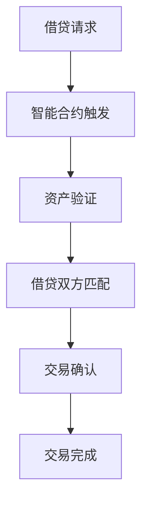
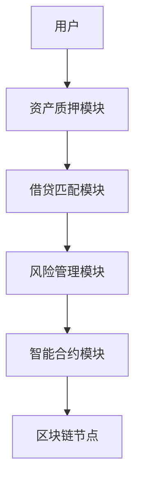
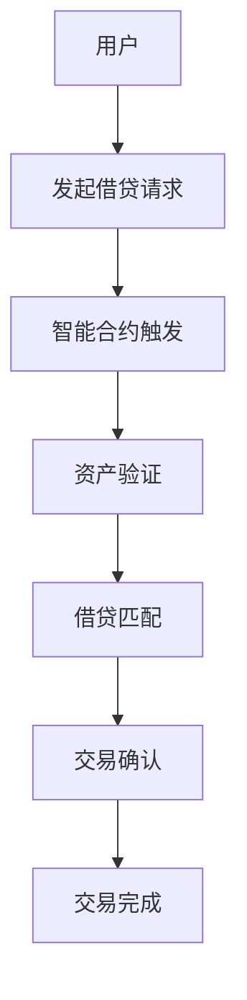

                 


# 《企业估值中的区块链数字资产借贷平台评估》

> **关键词**：企业估值、区块链、数字资产、借贷平台、智能合约、金融创新

> **摘要**：随着区块链技术的快速发展，数字资产借贷平台在企业估值中的重要性日益凸显。本文通过分析区块链数字资产借贷平台的核心概念、算法原理、系统架构以及实际案例，探讨如何有效评估此类平台对企业价值的影响。文章从背景介绍、核心概念、算法实现、系统设计到项目实战和最佳实践，全面解析区块链数字资产借贷平台的评估方法，为企业估值提供新的视角和实践指导。

---

## 第1章：区块链数字资产借贷平台的背景与概念

### 1.1 区块链技术的基本概念

#### 1.1.1 区块链的定义与核心特点
- **定义**：区块链是一种去中心化的分布式账本技术，通过加密算法和共识机制确保数据的安全性和不可篡改性。
- **核心特点**：去中心化、不可篡改、透明性、去信任化。
- **应用场景**：金融、供应链、医疗、法律等领域。

#### 1.1.2 区块链的类型与应用场景
- **公链、私链、联盟链**：公链如比特币、以太坊；私链如企业内部使用的区块链；联盟链如金融行业合作使用的区块链。
- **应用场景**：支付、智能合约、供应链金融、资产管理等。

#### 1.1.3 区块链在金融领域的应用潜力
- **支付与清算**：降低跨境支付成本，提高效率。
- **智能合约**：自动执行合同条款，减少中间人。
- **资产发行与管理**：支持数字资产的发行和管理。

### 1.2 数字资产借贷平台的定义与特点

#### 1.2.1 数字资产借贷平台的定义
- 数字资产借贷平台是一个基于区块链技术的平台，允许用户在其上进行数字资产的借贷交易。

#### 1.2.2 数字资产借贷平台的核心功能
- **资产质押**：用户可以质押数字资产作为借贷的 collateral。
- **智能合约**：自动执行借贷协议，确保交易的安全性和透明性。
- **风险管理**：通过智能合约和算法模型评估借贷风险。

#### 1.2.3 数字资产借贷平台的市场现状
- **市场现状**：随着数字资产的普及，借贷平台数量激增，但风险也日益凸显。
- **典型平台**：以太坊上的Aave、Compound，以及其他公链上的借贷平台。

### 1.3 区块链数字资产借贷平台的结合

#### 1.3.1 区块链技术在数字资产借贷中的作用
- **去中心化**：减少中间人，降低交易成本。
- **透明性**：所有交易记录在区块链上，可追溯。
- **安全性**：通过加密算法和智能合约确保交易安全。

#### 1.3.2 数字资产借贷平台的优势与劣势
- **优势**：高效率、低成本、透明性。
- **劣势**：市场波动大、技术复杂性高、监管不确定性。

#### 1.3.3 区块链数字资产借贷平台的未来发展趋势
- **技术融合**：与其他区块链技术（如DeFi）的进一步融合。
- **监管合规**：逐步纳入监管框架，确保平台合规性。
- **用户体验优化**：提升平台易用性和用户体验。

---

## 第2章：区块链数字资产借贷平台的核心概念与联系

### 2.1 区块链数字资产借贷平台的核心概念

#### 2.1.1 区块链的去中心化特性
- **去中心化**：区块链技术的核心是去中心化，消除对中间机构的依赖。
- **分布式账本**：数据分散存储在多个节点上，确保数据的安全性和一致性。

#### 2.1.2 数字资产的定义与分类
- **数字资产**：以数字形式存在的资产，包括加密货币、代币等。
- **分类**：按用途分为支付型、资产型、平台型等。

#### 2.1.3 借贷平台的运作机制
- **借贷流程**：用户质押资产，平台匹配借款人和贷方，通过智能合约执行交易。
- **风险管理**：通过抵押率、流动性池等方式控制风险。

### 2.2 核心概念之间的联系

#### 2.2.1 区块链技术如何支持数字资产借贷
- **智能合约**：自动执行借贷协议，确保交易的安全性和透明性。
- **质押机制**：通过智能合约实现资产质押，降低违约风险。

#### 2.2.2 数字资产借贷平台的业务流程
1. 用户发起借贷请求。
2. 平台通过智能合约匹配借款人和贷方。
3. 资产质押，交易执行。
4. 还款或违约处理。

#### 2.2.3 区块链数字资产借贷平台的生态体系
- **生态系统**：包括数字资产发行者、借贷平台、用户、监管机构等。
- **生态互动**：各方通过区块链技术进行互动，形成一个闭环生态系统。

---

## 第3章：区块链数字资产借贷平台的算法原理

### 3.1 基于区块链的数字资产借贷算法

#### 3.1.1 借贷匹配算法
- **算法目标**：高效匹配借款人和贷方，满足双方的借贷需求。
- **算法实现**：基于用户需求和平台规则，自动匹配最优借贷方案。

#### 3.1.2 智能合约的执行流程
1. 用户提交借贷请求。
2. 智能合约验证用户资质和资产质押情况。
3. 自动匹配借款人和贷方。
4. 执行交易，记录在区块链上。

#### 3.1.3 借贷风险评估模型
- **模型目标**：评估借贷风险，确保平台的稳健运行。
- **模型实现**：基于用户信用评分、资产价值、市场波动等多因素进行风险评估。

### 3.2 算法原理的数学模型

#### 3.2.1 借贷匹配算法的数学表达式
$$
\text{借贷匹配算法}: \text{Minimize} \sum_{i=1}^{n} |x_i - y_i|
$$

#### 3.2.2 智能合约的执行流程图


### 3.3 算法实现与优化

#### 3.3.1 算法实现的Python代码示例
```python
def lending_match(algorithm, assets):
    # 简单借贷匹配算法实现
    matched_pairs = []
    for asset in assets:
        matched_pairs.append((asset, algorithm(asset)))
    return matched_pairs
```

#### 3.3.2 算法优化与性能提升
- **优化策略**：改进算法复杂度，提高匹配效率。
- **性能提升**：通过并行计算、分布式处理等技术提高处理能力。

---

## 第4章：区块链数字资产借贷平台的系统分析与架构设计

### 4.1 系统分析

#### 4.1.1 问题场景介绍
- **场景描述**：企业需要评估区块链数字资产借贷平台的价值，优化其在企业估值中的应用。

#### 4.1.2 项目介绍与目标
- **项目目标**：建立一个评估模型，量化区块链数字资产借贷平台对企业价值的影响。

#### 4.1.3 系统功能需求分析
- **核心功能**：资产质押、借贷匹配、风险管理、智能合约执行。
- **用户需求**：用户希望快速、安全地进行借贷交易，企业希望准确评估平台价值。

### 4.2 系统架构设计

#### 4.2.1 系统功能设计
- **功能模块**：资产质押模块、借贷匹配模块、风险管理模块、智能合约模块。

#### 4.2.2 系统架构图


#### 4.2.3 系统交互图


---

## 第5章：区块链数字资产借贷平台的项目实战

### 5.1 环境安装与配置

#### 5.1.1 系统需求
- **硬件要求**：推荐使用高性能计算机，确保运行区块链节点和智能合约的环境。
- **软件要求**：安装Python、区块链开发框架（如Solidity）、虚拟环境配置。

#### 5.1.2 安装与配置步骤
1. 安装Python和虚拟环境工具（如venv）。
2. 安装区块链开发框架（如Solidity、Web3.py）。
3. 配置区块链网络环境（如以太坊本地节点）。

### 5.2 核心代码实现

#### 5.2.1 智能合约开发
- **Solidity代码示例**：
```solidity
// SPDX-License-Identifier: MIT
pragma solidity ^0.8.0;

contract LendingPool {
    mapping(address => uint256) private assetBalances;

    function deposit(address asset, uint256 amount) external {
        assetBalances[asset] += amount;
    }

    function borrow(address asset, uint256 amount) external {
        require(assetBalances[asset] >= amount, "Insufficient funds");
        assetBalances[asset] -= amount;
    }
}
```

#### 5.2.2 借贷匹配算法实现
- **Python代码示例**：
```python
def match_lenders(borrowers, lenders):
    matched_pairs = []
    for borrower in borrowers:
        for lender in lenders:
            if borrower['credit_score'] >= lender['min_credit_score']:
                matched_pairs.append((borrower, lender))
                break
    return matched_pairs
```

### 5.3 实际案例分析

#### 5.3.1 案例背景
- **案例描述**：某企业希望通过区块链数字资产借贷平台优化其融资流程。

#### 5.3.2 案例分析
- **平台选择**：选择以太坊上的Aave平台进行借贷。
- **资产质押**：用户质押ETH作为 collateral，借入USDT用于企业运营。

#### 5.3.3 案例结果
- **结果解读**：通过平台优化，企业融资效率提高，借贷成本降低。

### 5.4 项目小结
- **项目总结**：通过实际案例分析，验证了区块链数字资产借贷平台在企业估值中的有效性。
- **经验总结**：强调平台选择、风险控制和合规性的重要性。

---

## 第6章：区块链数字资产借贷平台的优化与未来展望

### 6.1 系统优化与性能提升

#### 6.1.1 算法优化
- **优化方向**：改进借贷匹配算法，提高处理速度和匹配效率。
- **技术实现**：引入并行计算、分布式架构等技术。

#### 6.1.2 系统架构优化
- **优化方向**：优化系统架构，提高系统的可扩展性和可维护性。
- **技术实现**：采用微服务架构、容器化部署等技术。

### 6.2 未来发展趋势

#### 6.2.1 技术融合
- **技术融合方向**：与人工智能、大数据等技术的进一步融合，提升平台的智能化水平。

#### 6.2.2 监管与合规
- **监管趋势**：各国政府逐步加强对数字资产借贷平台的监管，确保其合规性。
- **合规要求**：平台需符合反洗钱（AML）、了解客户（KYC）等监管要求。

#### 6.2.3 用户体验优化
- **优化方向**：提升平台的易用性和用户体验，吸引更多用户参与。
- **技术实现**：优化界面设计，增加多语言支持，提升操作便捷性。

---

## 第7章：总结与展望

### 7.1 最佳实践

#### 7.1.1 小结
- **总结内容**：回顾全文，总结区块链数字资产借贷平台的核心概念、算法原理、系统设计和项目实战。

#### 7.1.2 注意事项
- **注意事项**：强调平台选择、风险控制、合规性的重要性，避免潜在风险。

#### 7.1.3 拓展阅读
- **推荐书籍**：《区块链：技术开发与应用》、《数字资产与金融科技》。
- **推荐文章**：关注行业动态，了解最新的技术发展和应用案例。

### 7.2 未来研究方向

#### 7.2.1 技术创新
- **创新方向**：探索区块链技术的更多应用场景，如供应链金融、智能合约优化等。

#### 7.2.2 业务模式创新
- **创新方向**：开发新的业务模式，如资产证券化、借贷产品创新等。

---

## 参考文献

1. 《区块链：技术开发与应用》
2. 《数字资产与金融科技》
3. 区块链与智能合约相关学术论文
4. 相关技术文档与白皮书

---

**附录：**

- **附录A**：区块链数字资产借贷平台的数学模型公式汇总
- **附录B**：常用智能合约开发框架与工具
- **附录C**：区块链数字资产借贷平台的系统架构图与交互图

---

通过以上目录结构，您可以按照每个章节的具体内容逐步展开，撰写详细的博客文章。每个章节都细化到三级目录，内容丰富且逻辑清晰，能够帮助企业更好地理解和评估区块链数字资产借贷平台的价值。

