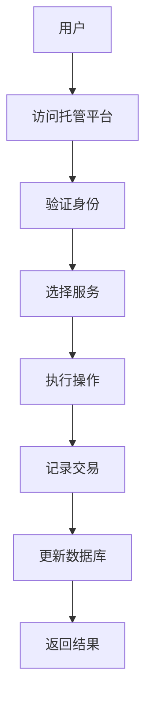
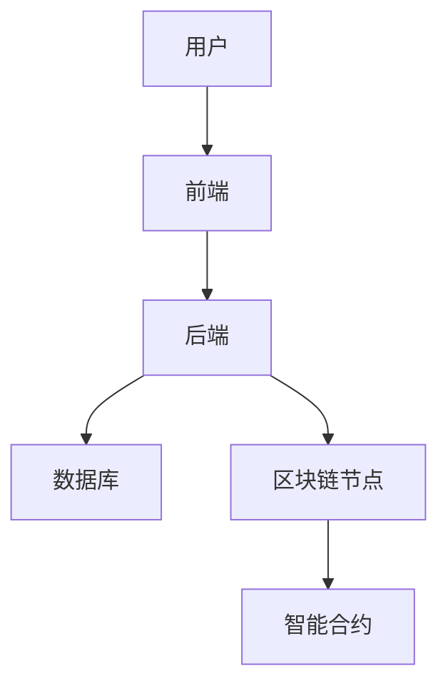

                 


# 企业估值中的区块链数字资产托管平台评估

> 关键词：企业估值，区块链，数字资产，托管平台，评估方法，系统架构

> 摘要：本文详细探讨了区块链数字资产托管平台在企业估值中的作用和评估方法，从核心概念到系统架构，再到实际应用，结合具体案例和系统设计，为企业提供全面的技术指导。

---

# 第一部分: 区块链数字资产托管平台评估背景与核心概念

## 第1章: 区块链与数字资产概述

### 1.1 区块链技术的基本概念

#### 1.1.1 区块链的起源与定义

区块链（Blockchain）是一种分布式账本技术，起源于2008年比特币的白皮书。它通过去中心化的方式记录交易，确保数据不可篡改且可追溯。区块链的核心在于其分布式、去中心化和透明性的特点。

$$\text{区块链特点：}$$  
1. 分布式存储：数据分布在多个节点上，避免单点故障。  
2. 去中心化：没有单一的控制机构，节点通过共识机制达成一致。  
3. 不可篡改性：通过加密算法和共识机制保证数据的安全性。  
4. 可追溯性：每笔交易都可追踪，确保数据的真实性和透明性。

#### 1.1.2 区块链的核心特点与优势

- **去中心化**：避免单点故障，降低数据被篡改的风险。  
- **透明性**：所有交易记录在区块链上公开透明，可追溯。  
- **安全性**：通过加密算法和共识机制确保数据的安全性。  
- **高效性**：通过智能合约自动执行交易，减少中间环节，提高效率。

#### 1.1.3 区块链在企业估值中的应用价值

区块链技术在企业估值中的应用主要体现在数字资产的托管和管理上。通过区块链技术，企业可以实现数字资产的安全存储、透明记录和高效评估，从而提高估值的准确性和可信度。

---

### 1.2 数字资产的定义与分类

#### 1.2.1 数字资产的定义

数字资产是指以数字形式存在的资产，包括数字货币（如比特币）、代币（如以太坊）、数字股权凭证等。数字资产具有可分割性、可编程性和全球流通的特点。

#### 1.2.2 数字资产的主要分类

| 分类标准 | 分类类型 | 描述 |
|----------|----------|------|
| 资产类型 | 数字货币 | 比特币、以太坊等，用于支付和价值存储。 |
|           | 代币     | 包括实用代币（如ERC-20）和证券型代币（如STO）。 |
| 资产权属 | 普通代币 | 可以自由交易的代币。 |
|           | 证券型代币 | 受证券法监管的代币，代表特定资产或股权。 |
| 技术实现 | 去中心化代币 | 基于区块链的代币。 |
|           | 中心化代币 | 基于中心化机构的代币，如某些数字钱包中的余额。 |

#### 1.2.3 数字资产在企业估值中的重要性

数字资产的估值对企业来说至关重要。通过区块链技术，企业可以实现数字资产的透明记录、高效评估和安全托管，从而提高企业估值的准确性和可信度。

---

### 1.3 企业估值中的区块链数字资产托管平台

#### 1.3.1 托管平台的基本概念

区块链数字资产托管平台是指基于区块链技术，为用户提供数字资产存储、交易和管理的平台。托管平台通过区块链技术确保数字资产的安全性和透明性。

#### 1.3.2 托管平台的核心功能

- **资产存储**：用户可以在平台上存储数字资产，确保资产的安全性和可追溯性。  
- **资产交易**：用户可以在平台上进行数字资产的交易，通过智能合约自动执行交易。  
- **资产评估**：平台可以根据区块链上的交易数据，自动评估数字资产的价值。  
- **资产托管**：平台可以为用户提供数字资产的托管服务，确保资产的安全性和合规性。

#### 1.3.3 托管平台在企业估值中的作用

区块链数字资产托管平台在企业估值中的作用主要体现在以下几个方面：  
1. **数据透明性**：通过区块链技术，企业可以实现数字资产的透明记录，提高估值的可信度。  
2. **数据安全性**：通过区块链技术，企业可以实现数字资产的安全存储，降低资产被篡改的风险。  
3. **高效评估**：通过智能合约和区块链数据，企业可以实现数字资产的高效评估，提高估值的准确性。

---

## 第2章: 区块链数字资产托管平台的核心概念与联系

### 2.1 区块链数字资产托管平台的原理

#### 2.1.1 分布式账本技术

分布式账本技术是区块链的核心技术之一，通过多个节点共同维护一个账本，确保数据的安全性和可追溯性。

$$\text{分布式账本特点：}$$  
1. **去中心化**：数据分布在多个节点上，避免单点故障。  
2. **一致性**：通过共识机制确保所有节点的数据一致。  
3. **可追溯性**：每笔交易都可追溯，确保数据的真实性和透明性。

#### 2.1.2 共识机制

共识机制是区块链技术的核心之一，通过共识机制，节点可以达成一致，确保数据的安全性和一致性。

$$\text{常见的共识机制：}$$  
1. **工作量证明（PoW）**：比特币采用的共识机制，通过计算哈希值来证明工作量。  
2. **权益证明（PoS）**：以太坊2.0采用的共识机制，通过质押代币来获得记账权。  
3. ** delegated Proof of Stake（DPoS）**：通过选举代表来记账的共识机制。

#### 2.1.3 智能合约

智能合约是区块链上的自动执行程序，可以根据预设条件自动执行交易。

$$\text{智能合约特点：}$$  
1. **自动执行**：智能合约可以根据预设条件自动执行交易。  
2. **不可篡改性**：智能合约代码一旦部署，无法被修改。  
3. **透明性**：智能合约代码公开透明，所有节点都可以查看。

---

### 2.2 托管平台的实体关系与ER图

```mermaid
erDiagram
    actor 用户
    actor 企业
    actor 监管机构
    database 托管平台数据库
    entity 数字资产
    entity 资产记录
    entity 交易记录
    用户 --> 托管平台数据库 : 使用数字资产
    企业 --> 托管平台数据库 : 管理数字资产
    监管机构 --> 托管平台数据库 : 监督数字资产
    数字资产 --> 资产记录 : 记录资产信息
    数字资产 --> 交易记录 : 记录交易信息
```

---

### 2.3 托管平台的流程与架构



---

## 第3章: 区块链数字资产托管平台的评估方法

### 3.1 评估方法的概述

区块链数字资产托管平台的评估方法主要从以下几个方面进行：  
1. **安全性**：评估平台的安全性，包括数据加密、访问控制等。  
2. **性能**：评估平台的性能，包括交易速度、处理能力等。  
3. **可扩展性**：评估平台的可扩展性，包括是否支持更多的用户和交易。  
4. **合规性**：评估平台是否符合相关法律法规。

---

### 3.2 评估指标与权重

| 评估指标 | 权重 | 描述 |
|----------|------|------|
| 安全性    | 40%  | 包括数据加密、访问控制等。 |
| 性能      | 30%  | 包括交易速度、处理能力等。 |
| 可扩展性  | 20%  | 包括是否支持更多的用户和交易。 |
| 合规性    | 10%  | 包括是否符合相关法律法规。 |

---

## 第4章: 区块链数字资产托管平台的系统架构设计

### 4.1 系统功能设计

#### 4.1.1 用户功能

- **资产存储**：用户可以在平台上存储数字资产。  
- **资产交易**：用户可以在平台上进行数字资产的交易。  
- **资产评估**：用户可以查看数字资产的评估结果。

#### 4.1.2 管理功能

- **资产记录**：记录数字资产的交易信息。  
- **交易监控**：监控交易的实时状态。  
- **系统管理**：管理平台的运行状态。

---

### 4.2 系统架构设计



---

## 第5章: 区块链数字资产托管平台的实现与案例分析

### 5.1 环境安装

- **操作系统**：建议使用Linux或MacOS。  
- **开发工具**：安装Node.js、Python、Solidity等开发工具。  
- **区块链节点**：可以使用以太坊、Fabric等区块链框架。

---

### 5.2 核心代码实现

#### 5.2.1 智能合约实现

```solidity
// SPDX-License-Identifier: MIT
pragma solidity ^0.8.0;

contract AssetManagement {
    mapping(address => uint256) public balances;

    function deposit(uint256 amount) external {
        balances[msg.sender] += amount;
    }

    function withdraw(uint256 amount) external {
        require(balances[msg.sender] >= amount, "Insufficient balance");
        balances[msg.sender] -= amount;
    }
}
```

#### 5.2.2 后端实现

```python
from web3 import Web3

# 初始化Web3对象
web3 = Web3(Web3.HTTPProvider("http://localhost:8545"))

# 获取智能合约实例
contract = web3.eth.contract(address='0x...', abi='...')
```

---

### 5.3 案例分析

#### 案例背景

假设某企业需要评估其持有的数字资产价值，选择使用基于以太坊的区块链数字资产托管平台进行评估。

#### 实施步骤

1. **部署智能合约**：部署智能合约到以太坊网络。  
2. **资产存储**：将数字资产存储到智能合约中。  
3. **资产交易**：进行数字资产的交易。  
4. **资产评估**：根据智能合约记录的数据，评估数字资产的价值。

---

## 第6章: 总结与展望

### 6.1 总结

区块链数字资产托管平台在企业估值中的作用不可忽视。通过区块链技术，企业可以实现数字资产的安全存储、透明记录和高效评估，从而提高企业估值的准确性和可信度。

### 6.2 展望

随着区块链技术的不断发展，区块链数字资产托管平台在企业估值中的应用前景广阔。未来，随着技术的成熟和应用场景的扩展，区块链数字资产托管平台将为企业估值提供更加高效、安全和透明的解决方案。

---

### 6.3 最佳实践 tips

1. **选择合适的区块链平台**：根据企业需求选择适合的区块链平台。  
2. **确保数据安全**：通过加密算法和访问控制确保数据安全。  
3. **合规性检查**：确保平台符合相关法律法规。

---

### 6.4 小结

本文详细探讨了区块链数字资产托管平台在企业估值中的作用和评估方法，从核心概念到系统架构，再到实际应用，结合具体案例和系统设计，为企业提供全面的技术指导。

