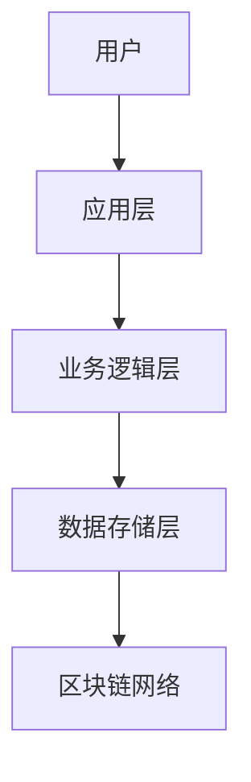
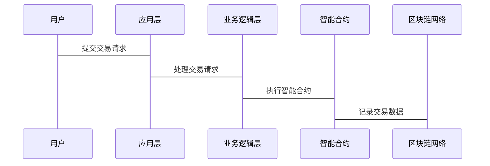

                 


# 企业估值中的区块链数字资产托管平台评估

> **关键词**: 区块链, 数字资产, 托管平台, 企业估值, 智能合约

> **摘要**: 在数字资产迅速发展的背景下，区块链技术为数字资产的托管与评估提供了新的可能性。本文深入探讨区块链数字资产托管平台的核心概念、技术原理、评估模型，并结合实际案例分析其在企业估值中的应用。通过系统分析与架构设计，本文为构建高效、安全的区块链数字资产托管平台提供了理论依据和实践指导。

---

## 第1章 区块链与数字资产的背景与概念

### 1.1 区块链技术的定义与特点

#### 1.1.1 区块链的基本概念
区块链是一种去中心化的分布式账本技术，通过密码学和共识机制确保数据的安全性和不可篡改性。其核心特点包括去中心化、透明性、不可篡改性和去信任化。

#### 1.1.2 区块链的核心特点
- **去中心化**: 消除单一信任点，依赖分布式节点达成共识。
- **透明性**: 所有交易记录在区块链上公开可见。
- **不可篡改性**: 数据一旦写入区块链，难以被修改。
- **去信任化**: 通过技术手段消除对中间机构的信任依赖。

#### 1.1.3 区块链与数字资产的关系
数字资产（如比特币、以太坊等）的交易和管理高度依赖区块链技术。区块链为数字资产提供了安全的存储和交易环境，确保资产的唯一性和可追溯性。

### 1.2 数字资产的定义与分类

#### 1.2.1 数字资产的定义
数字资产是指以数字形式存在的资产，包括数字货币、代币、NFT（非同质化代币）等。数字资产可以通过区块链技术进行发行、交易和管理。

#### 1.2.2 数字资产的主要分类
- **数字货币**: 用于支付和价值转移的数字资产，如比特币、以太坊。
- **代币**: 表示特定权益的数字资产，如平台代币、治理代币。
- **NFT**: 非同质化代币，用于表示独特的数字资产，如数字艺术品、收藏品。

#### 1.2.3 数字资产的特性与优势
- **安全性**: 区块链技术确保数字资产的安全存储和交易。
- **透明性**: 交易记录公开可查，提高信任度。
- **可编程性**: 通过智能合约实现自动化操作。

### 1.3 区块链数字资产托管平台的背景

#### 1.3.1 数字资产托管的需求背景
随着数字资产的普及，托管需求日益增加。企业需要安全、可靠的平台来存储和管理数字资产，确保其价值和安全性。

#### 1.3.2 区块链技术在托管中的作用
区块链技术通过去中心化和不可篡改性，为数字资产托管提供了更高的安全性和透明性。

#### 1.3.3 企业估值与数字资产托管的关系
数字资产的估值直接影响企业的整体价值。通过区块链托管平台，企业可以更准确地评估和管理数字资产，提升企业估值。

---

## 第2章 区块链数字资产托管平台的核心概念

### 2.1 智能合约的原理与应用

#### 2.1.1 智能合约的定义
智能合约是部署在区块链上的自动执行程序，用于在满足特定条件时自动执行交易或操作。

#### 2.1.2 智能合约的工作原理
智能合约通过区块链节点的共识机制执行，确保合约的自动性和不可篡改性。

#### 2.1.3 智能合约在托管平台中的应用
- **资产转移**: 自动执行资产的转移操作。
- **收益分配**: 根据预设规则自动分配收益。
- **风险管理**: 通过智能合约实现风险控制。

### 2.2 分布式账本技术

#### 2.2.1 分布式账本的定义
分布式账本是区块链的核心数据结构，记录所有交易和资产信息。

#### 2.2.2 分布式账本的结构与特点
- **区块**: 包含交易数据和元数据，通过哈希指针连接。
- **链式结构**: 每个区块都有指向前一个区块的指针，形成链式结构。
- **分布式存储**: 账本分布在多个节点上，确保数据的冗余性和安全性。

#### 2.2.3 分布式账本在托管平台中的应用
- **资产记录**: 记录数字资产的发行、转移和销毁。
- **交易确认**: 确认交易的合法性和有效性。
- **数据查询**: 支持高效的资产查询和追溯。

### 2.3 数字资产的生命周期管理

#### 2.3.1 数字资产的生成与发行
数字资产通过智能合约在区块链上生成，并发行给指定地址。

#### 2.3.2 数字资产的转移与交易
数字资产通过区块链网络进行转移，交易记录在区块链上公开可见。

#### 2.3.3 数字资产的销毁与退市
数字资产可以通过智能合约进行销毁，确保资产的总量和价值得到有效控制。

---

## 第3章 区块链数字资产托管平台的评估模型

### 3.1 评估模型的构建与原理

#### 3.1.1 评估模型的定义
评估模型是用于量化数字资产价值的数学模型，结合区块链技术和市场数据进行综合评估。

#### 3.1.2 评估模型的构建方法
- **数据采集**: 收集数字资产的市场数据、交易数据和链上数据。
- **特征提取**: 提取影响资产价值的关键特征，如交易量、市场波动、持有地址数。
- **模型训练**: 使用机器学习算法训练评估模型，预测资产价值。

#### 3.1.3 评估模型的数学表达
评估模型可以表示为：
$$
V = f(x_1, x_2, ..., x_n)
$$
其中，$V$ 是资产价值，$x_i$ 是输入特征。

### 3.2 评估指标的设计与选择

#### 3.2.1 评估指标的分类
- **市场指标**: 交易量、市场资本化。
- **技术指标**: 块链长度、网络节点数。
- **用户指标**: 活跃地址数、用户参与度。

#### 3.2.2 评估指标的权重分配
通过层次分析法（AHP）确定各指标的权重，构建综合评估模型。

#### 3.2.3 评估指标的计算方法
- **市场指标计算**: 交易量和市场资本化数据可以通过区块链浏览器获取。
- **技术指标计算**: 区块链网络的节点数和链长度可以通过区块链监控工具获取。
- **用户指标计算**: 活跃地址数和用户参与度可以通过链上数据分析工具获取。

### 3.3 评估算法的实现与优化

#### 3.3.1 评估算法的实现步骤
1. 数据采集：从区块链网络获取交易数据、市场数据和链上数据。
2. 数据清洗：去除异常数据，确保数据的准确性和完整性。
3. 特征提取：提取影响资产价值的关键特征。
4. 模型训练：使用机器学习算法训练评估模型。
5. 模型优化：通过交叉验证和参数调优优化模型性能。

#### 3.3.2 评估算法的优化方法
- **特征选择**: 使用特征重要性分析方法选择关键特征。
- **模型优化**: 使用网格搜索（Grid Search）优化模型参数。
- **集成学习**: 使用集成学习方法提升模型性能。

#### 3.3.3 评估算法的性能分析
通过准确率、召回率和F1分数等指标评估模型的性能，并与传统评估方法进行对比分析。

---

## 第4章 区块链数字资产托管平台的系统分析与架构设计

### 4.1 系统功能设计

#### 4.1.1 功能模块划分
- **资产管理模块**: 负责数字资产的发行、转移和销毁。
- **交易处理模块**: 处理数字资产的交易请求，确保交易的合法性和有效性。
- **智能合约模块**: 执行预设的智能合约，实现自动化操作。

#### 4.1.2 功能流程设计
1. 资产发行：通过智能合约在区块链上发行数字资产。
2. 资产转移：用户提交转移请求，系统通过智能合约自动执行交易。
3. 资产评估：基于评估模型对数字资产进行价值评估，提供给用户参考。

### 4.2 系统架构设计

#### 4.2.1 分层架构设计
- **应用层**: 提供用户交互界面，接收用户请求。
- **业务逻辑层**: 处理用户的交易请求，调用智能合约。
- **数据存储层**: 存储区块链账本和交易数据。

#### 4.2.2 系统架构图


#### 4.2.3 系统接口设计
- **API接口**: 提供RESTful API接口，供第三方调用。
- **智能合约接口**: 提供与智能合约交互的接口，实现自动化操作。

### 4.3 系统交互设计

#### 4.3.1 系统交互流程
用户通过应用层提交交易请求，业务逻辑层处理请求并调用智能合约，数据存储层记录交易数据。

#### 4.3.2 交互流程图


---

## 第5章 区块链数字资产托管平台的项目实战

### 5.1 环境安装

#### 5.1.1 开发环境配置
- **操作系统**: Windows/Mac/Linux
- **编程语言**: Python/JavaScript
- **区块链框架**: Ethereum/abricate

#### 5.1.2 工具安装
- **区块链节点**: 安装Ethereum节点或abricate节点。
- **智能合约编译工具**: 使用Solidity编译智能合约。
- **开发环境搭建**: 安装必要的开发库和工具。

### 5.2 系统核心实现源代码

#### 5.2.1 智能合约实现
```solidity
// SPDX-License-Identifier: MIT
pragma solidity ^0.8.0;

contract AssetManagement {
    mapping(address => uint256) public balances;

    function deposit(uint256 amount) external {
        balances[msg.sender] += amount;
    }

    function withdraw(uint256 amount) external {
        require(balances[msg.sender] >= amount, "Insufficient balance");
        balances[msg.sender] -= amount;
    }
}
```

#### 5.2.2 评估模型实现
```python
import numpy as np
from sklearn.model_selection import train_test_split
from sklearn.ensemble import RandomForestRegressor

# 数据预处理
X = ... # 特征数据
y = ... # 目标变量

X_train, X_test, y_train, y_test = train_test_split(X, y, test_size=0.2)

# 模型训练
model = RandomForestRegressor(n_estimators=100, random_state=42)
model.fit(X_train, y_train)

# 模型评估
score = model.score(X_test, y_test)
print(f"模型准确率: {score}")
```

### 5.3 代码应用解读与分析

#### 5.3.1 智能合约解读
智能合约代码定义了资产的存入和取出功能，通过区块链节点实现资产的转移和管理。

#### 5.3.2 评估模型解读
评估模型使用随机森林回归算法，基于区块链上的交易数据和市场数据，预测数字资产的价值。

### 5.4 实际案例分析

#### 5.4.1 案例背景
某企业希望通过区块链数字资产托管平台管理其发行的代币，并进行价值评估。

#### 5.4.2 案例实现
1. 发行代币：通过智能合约在区块链上发行代币。
2. 资产托管：用户将代币存入托管平台，系统记录资产信息。
3. 资产评估：基于评估模型对代币进行价值评估，提供给企业参考。

### 5.5 项目小结

#### 5.5.1 项目总结
通过区块链数字资产托管平台，企业可以实现数字资产的安全托管和高效管理，提升企业估值。

#### 5.5.2 项目经验
在项目实施过程中，需要注意智能合约的安全性、系统的可扩展性以及数据的准确性和完整性。

---

## 第6章 最佳实践与总结

### 6.1 最佳实践

#### 6.1.1 技术实现
- 确保智能合约的安全性，避免漏洞。
- 使用去中心化架构，提升系统的安全性和可靠性。

#### 6.1.2 项目管理
- 明确项目目标和范围，制定详细的项目计划。
- 建立有效的沟通机制，确保团队协作。

### 6.2 总结与展望

#### 6.2.1 总结
本文详细探讨了区块链数字资产托管平台的核心概念、技术原理和评估模型，并结合实际案例分析了其在企业估值中的应用。通过系统分析与架构设计，本文为构建高效、安全的区块链数字资产托管平台提供了理论依据和实践指导。

#### 6.2.2 展望
未来，随着区块链技术的不断发展，数字资产托管平台将更加智能化和自动化。企业可以通过区块链技术实现更高效的资产管理和更准确的企业估值。

---

## 参考文献

1. 《区块链技术与应用》
2. 《数字资产与智能合约》
3. 《企业估值与数字资产》

---

通过本文的详细分析与实践，读者可以深入了解区块链数字资产托管平台的核心技术及其在企业估值中的应用，为企业数字化转型和资产管理提供重要的理论支持和实践指导。

