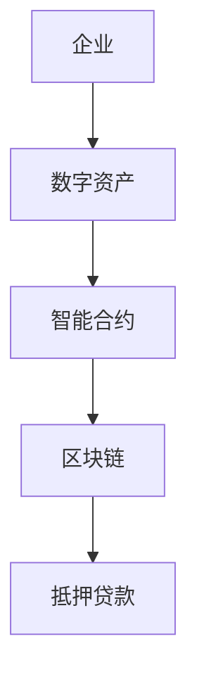
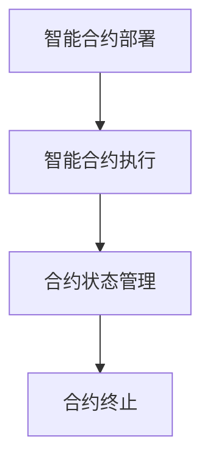
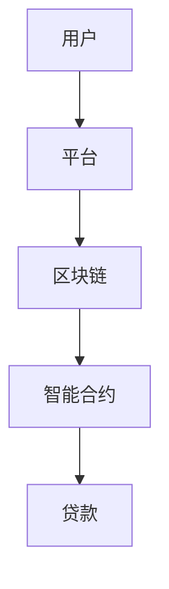

                 


# 企业估值中的区块链数字资产抵押贷款平台评估

## 关键词：区块链、数字资产、抵押贷款、企业估值、智能合约

## 摘要：  
本文探讨了区块链技术在企业估值中的应用，特别是如何通过数字资产抵押贷款平台实现高效、透明的估值与贷款流程。文章详细分析了区块链的去中心化特性、数字资产的流动性与价值评估，以及智能合约在抵押贷款中的关键作用，结合实际案例与技术实现，为企业估值提供了一种创新的解决方案。

---

## 第一部分: 企业估值中的区块链数字资产抵押贷款平台背景

## 第1章: 问题背景与概念结构

### 1.1 问题背景

#### 1.1.1 传统企业估值的局限性  
传统企业估值方法依赖于财务报表和人工评估，存在以下问题：  
1. 数据不透明，容易 manipulated。  
2. 估值过程耗时长，成本高。  
3. 缺乏实时数据支持，难以准确反映企业动态价值。  

#### 1.1.2 区块链技术的引入  
区块链技术的去中心化、不可篡改和透明性特点，为解决企业估值问题提供了新思路。  
- 提供实时数据支持，确保估值数据的真实性与准确性。  
- 通过智能合约实现自动化估值流程，降低人为干预。  

#### 1.1.3 数字资产抵押贷款的创新  
数字资产作为抵押品，具有以下优势：  
1. 高流动性，便于快速变现。  
2. 可分割性，支持小额融资。  
3. 去中心化特性，降低操作风险。  

### 1.2 问题描述

#### 1.2.1 传统抵押贷款的流程与挑战  
传统抵押贷款流程复杂，存在以下问题：  
1. 审批流程长，效率低。  
2. 估值依据主观性强，容易引发争议。  
3. 存在道德风险，抵押品管理难度大。  

#### 1.2.2 区块链在抵押贷款中的潜在优势  
区块链技术可以实现以下优化：  
1. 实现抵押品的透明追踪，降低道德风险。  
2. 通过智能合约自动执行抵押品的质押与释放。  
3. 提供实时估值数据，提升贷款审批效率。  

#### 1.2.3 数字资产作为抵押品的可行性  
数字资产作为抵押品具有以下特点：  
1. 数字资产的持有记录可追溯，便于验证。  
2. 数字资产的价值波动大，需结合市场数据进行实时评估。  
3. 数字资产的去中心化特性，确保抵押品的安全性。  

### 1.3 问题解决

#### 1.3.1 区块链如何提升企业估值  
区块链技术通过以下方式提升企业估值：  
1. 提供实时数据支持，确保估值的准确性。  
2. 通过智能合约实现自动化估值流程，降低人为干预。  
3. 提高数据透明度，增强投资者信任。  

#### 1.3.2 数字资产抵押贷款的实现路径  
数字资产抵押贷款的实现路径包括：  
1. 数字资产的持有者向平台提交抵押申请。  
2. 平台利用区块链技术验证抵押品的真实性。  
3. 通过智能合约自动执行抵押品的质押与释放。  

#### 1.3.3 平台如何降低风险与成本  
平台通过以下方式降低风险与成本：  
1. 利用区块链技术实现抵押品的透明追踪，降低操作风险。  
2. 通过智能合约自动执行抵押品的质押与释放，减少人工干预，降低成本。  

### 1.4 边界与外延

#### 1.4.1 平台的功能边界  
平台的功能边界包括：  
1. 提供数字资产的抵押贷款服务。  
2. 实现抵押品的质押与释放。  
3. 提供实时估值数据。  

#### 1.4.2 与传统金融的对比  
与传统金融相比，平台具有以下优势：  
1. 数字资产的高流动性，支持快速融资。  
2. 区块链技术的去中心化特性，降低操作风险。  

#### 1.4.3 数字资产的多样性与风险  
数字资产的多样性与风险包括：  
1. 不同数字资产的价值波动性不同，需结合市场数据进行实时评估。  
2. 数字资产的持有者需具备一定的技术知识，以确保资产的安全性。  

### 1.5 核心概念与组成

#### 1.5.1 平台的核心要素  
平台的核心要素包括：  
1. 区块链技术：确保抵押品的安全性与透明性。  
2. 数字资产：作为抵押品的主要形式。  
3. 智能合约：实现抵押品的质押与释放。  

#### 1.5.2 数字资产的分类与属性  
数字资产的分类与属性包括：  
1. 加密货币：如比特币、以太坊等。  
2. 代币：如ERC-20代币。  
3. 数字资产的流动性：高流动性资产支持快速融资。  

#### 1.5.3 区块链技术的作用机制  
区块链技术的作用机制包括：  
1. 去中心化：确保数据的安全性与透明性。  
2. 共识机制：确保数据的准确性和一致性。  
3. 智能合约：实现自动化的抵押品管理。  

---

## 第二部分: 核心概念与联系

## 第2章: 核心概念解析

### 2.1 区块链技术

#### 2.1.1 区块链的基本原理  
区块链的基本原理包括：  
1. 分布式账本：记录所有交易数据。  
2. 共识机制：确保所有节点达成一致。  
3. 加密算法：确保数据的安全性。  

#### 2.1.2 共识机制的作用  
共识机制的作用包括：  
1. 确保数据的一致性。  
2. 提高系统的安全性。  
3. 降低信任成本。  

#### 2.1.3 智能合约的核心功能  
智能合约的核心功能包括：  
1. 自动化执行合同条款。  
2. 实现去中心化的信任机制。  
3. 支持多种应用场景。  

### 2.2 数字资产

#### 2.2.1 数字资产的定义与分类  
数字资产的定义与分类包括：  
1. 数字资产是基于区块链技术的虚拟资产。  
2. 分为加密货币、代币、NFT等类别。  

#### 2.2.2 加密货币与代币的区别  
加密货币与代币的区别包括：  
1. 加密货币：如比特币，具有去中心化特性。  
2. 代币：如ERC-20代币，依赖于特定区块链平台。  

#### 2.2.3 数字资产的流动性与价值评估  
数字资产的流动性与价值评估包括：  
1. 高流动性资产支持快速融资。  
2. 价值评估需结合市场数据与技术分析。  

### 2.3 智能合约

#### 2.3.1 智能合约的定义与特点  
智能合约的定义与特点包括：  
1. 智能合约是基于区块链的自动执行程序。  
2. 具有去中心化、自动执行、不可篡改的特点。  

#### 2.3.2 智能合约的执行流程  
智能合约的执行流程包括：  
1. 编写合约代码。  
2. 部署合约到区块链。  
3. 调用合约函数。  
4. 自动执行合约条款。  

#### 2.3.3 智能合约的法律地位  
智能合约的法律地位包括：  
1. 智能合约在法律上被视为合同的一种形式。  
2. 合同的自动执行需符合相关法律法规。  

## 第3章: 核心概念之间的关系

### 3.1 实体关系图



---

## 第三部分: 技术原理

## 第3章: 技术原理

### 3.1 智能合约的执行流程



### 3.2 数学模型与算法

#### 3.2.1 数学模型
$$
\text{资产价值} = \sum_{i=1}^{n} w_i \times v_i
$$
其中，$w_i$ 是资产 $i$ 的权重，$v_i$ 是资产 $i$ 的价值。

#### 3.2.2 算法实现
```python
def calculate_asset_value/assets):
    weights = [0.5, 0.3, 0.2]
    return sum(w * v for w, v in zip(weights, assets))
```

---

## 第四部分: 系统分析与架构设计

## 第4章: 系统分析与架构设计

### 4.1 系统架构设计



---

## 第五部分: 项目实战

## 第5章: 项目实战

### 5.1 技术实现

#### 5.1.1 智能合约实现
```solidity
// SPDX-License-Identifier: MIT
pragma solidity ^0.8.0;

contract Asset抵押贷款 {
    uint256 public loanAmount;
    address public borrower;

    function requestLoan(uint256 amount) public {
        loanAmount = amount;
        borrower = msg.sender;
    }

    function approveLoan() external {
        require(msg.sender == address(0x...), "仅平台可以批准贷款");
        borrower.transfer(loanAmount);
    }
}
```

### 5.2 案例分析

#### 5.2.1 抵押贷款流程
1. 用户提交抵押贷款申请。  
2. 平台验证抵押品的真实性。  
3. 智能合约自动执行贷款发放与还款流程。  

---

## 第六部分: 最佳实践与小结

## 第6章: 最佳实践与小结

### 6.1 最佳实践
1. 确保数字资产的高流动性，支持快速融资。  
2. 选择合适的区块链平台，确保系统的安全性与效率。  
3. 合规性：确保平台符合相关法律法规。  

### 6.2 小结
区块链数字资产抵押贷款平台通过智能合约实现了抵押品的自动化管理，提升了企业估值的效率与准确性。平台的优势在于其去中心化特性，降低了操作风险与成本。未来，随着区块链技术的不断发展，数字资产抵押贷款将在企业估值中发挥更大的作用。  

### 6.3 注意事项
1. 数字资产的价值波动较大，需结合市场数据进行实时评估。  
2. 平台需具备良好的风险管理机制，防止资产贬值导致的贷款损失。  
3. 遵守相关法律法规，确保平台的合规性。  

### 6.4 拓展阅读
1. 《区块链技术入门与应用》  
2. 《智能合约开发实战》  
3. 《数字资产管理与投资》  

---

通过以上分析，我们可以看到，区块链数字资产抵押贷款平台在企业估值中具有重要的应用价值。平台通过智能合约实现了抵押品的自动化管理，提升了估值效率与准确性。未来，随着区块链技术的不断发展，数字资产抵押贷款将在企业估值中发挥更大的作用。

