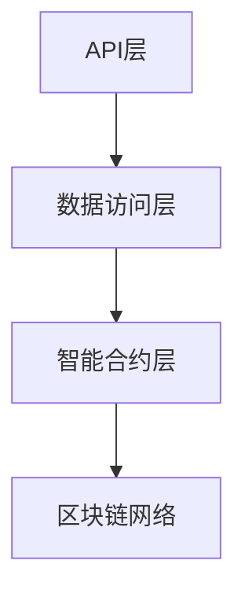

                 


# 企业估值中的区块链数字资产衍生品交易平台评估

## 关键词：区块链，数字资产，衍生品交易，企业估值，智能合约，共识机制

## 摘要：本文探讨了区块链技术在数字资产衍生品交易平台评估中的应用，分析了其在企业估值中的作用，详细讲解了区块链技术原理、衍生品定价模型、系统架构设计及项目实现。

---

## 第1章：区块链技术与数字资产

### 1.1 区块链技术的兴起

#### 1.1.1 区块链的基本概念

区块链是一种去中心化的分布式账本技术，通过密码学保证数据安全，通过共识机制实现数据一致性。它具有不可篡改、透明性和去中心化的特点。

#### 1.1.2 区块链在金融领域的应用

区块链在金融领域的应用主要体现在支付、结算、借贷和证券发行等方面。其去中心化和高效率的特点使得金融交易更加便捷和安全。

### 1.2 数字资产与衍生品交易

#### 1.2.1 数字资产的分类

数字资产主要分为加密货币（如比特币）、代币（如ERC20代币）和NFTs（非同质化代币）。每类资产都有其独特的特点和应用场景。

#### 1.2.2 衍生品交易的基本原理

衍生品交易是基于标的资产的合约交易，常见的有期货、期权等。区块链技术的应用使得衍生品交易更加透明和高效。

---

## 第2章：区块链数字资产衍生品交易平台的核心概念

### 2.1 区块链技术原理

区块链技术通过去中心化的账本记录交易，确保数据不可篡改。其核心要素包括分布式账本、共识机制和智能合约。

### 2.2 数字资产的分类与特点

数字资产可以根据功能和用途分为支付型、平台型和资产型代币。支付型代币用于支付，平台型代币用于特定平台服务，资产型代币代表实物资产。

### 2.3 衍生品交易平台的架构

衍生品交易平台通常包括用户管理、交易撮合和结算清算三个功能模块。用户管理负责用户身份验证，交易撮合处理订单匹配，结算清算处理资金和资产的交割。

---

## 第3章：区块链共识机制

### 3.1 共识机制的分类

共识机制主要有PoW、PoS、Dpos等类型。PoW通过计算工作量来决定记账权，PoS通过持有币的数量来决定，Dpos通过 delegated 权重投票。

### 3.2 智能合约的实现

智能合约是运行在区块链上的自动执行程序，用于自动执行合同条款。Solidity是常用的智能合约编程语言，支持条件判断、函数调用和事件触发。

---

## 第4章：衍生品定价模型

### 4.1 基本原理

衍生品定价模型基于标的资产的价格波动、时间价值和波动率。Black-Scholes模型是常见的期权定价模型，公式为：

$$C = S_0 + \sigma \sqrt{T} \cdot N(d_1) - K e^{-rT} N(d_2)$$

其中，$S_0$ 是标的资产价格，$\sigma$ 是波动率，$T$ 是到期时间，$K$ 是行权价，$r$ 是无风险利率，$N(d)$ 是标准正态分布的累积分布函数。

### 4.2 数学模型与优化

通过调整模型参数，如波动率和相关性，可以优化衍生品定价模型。蒙特卡洛模拟是一种常用的风险评估方法，用于估计衍生品的价格波动。

---

## 第5章：系统架构设计

### 5.1 系统功能设计

系统功能模块包括用户管理、交易撮合和结算清算。用户管理模块处理用户注册和身份验证，交易撮合模块处理订单匹配，结算清算模块处理资金和资产的交割。

### 5.2 系统架构图

以下是系统的分层架构图：



---

## 第6章：项目实战

### 6.1 环境搭建

搭建以太坊开发环境，安装Ganache模拟器和Solidity编译器。配置以太坊钱包，如MetaMask，用于测试智能合约。

### 6.2 核心代码实现

以下是智能合约的Solidity代码示例：

```solidity
// SPDX-License-Identifier: MIT
pragma solidity ^0.8.0;

contract DerivativesExchange {
    struct Order {
        address trader;
        uint256 amount;
        bool isBuy;
    }

    function createOrder(bool isBuy, uint256 amount) public {
        Order memory order = Order(msg.sender, amount, isBuy);
        // 处理订单逻辑
    }

    function trade(address counterParty, uint256 amount) public {
        // 执行交易逻辑
    }
}
```

### 6.3 案例分析

以比特币期权交易为例，用户在平台创建订单，系统匹配订单后自动执行智能合约，完成资产的交割。

---

## 第7章：最佳实践与总结

### 7.1 最佳实践

- **安全性**：确保智能合约代码经过严格审计，防范漏洞攻击。
- **合规性**：遵守相关法律法规，确保交易活动合法合规。

### 7.2 小结

区块链技术为数字资产衍生品交易提供了高效、透明和安全的解决方案，企业在估值时应充分考虑其应用潜力和风险。

### 7.3 注意事项

- 交易风险：市场波动和操作风险需谨慎评估。
- 技术风险：区块链技术的不确定性和监管风险需关注。

### 7.4 拓展阅读

- 加深对区块链技术的理解，关注行业动态和新技术发展。

---

## 附录：相关术语解释

- **智能合约**：区块链上的自动执行程序。
- **共识机制**：区块链中达成一致的算法。
- **衍生品交易**：基于标的资产的合约交易。

---

通过以上章节的详细分析，本文全面探讨了区块链技术在数字资产衍生品交易平台评估中的应用，为企业估值提供了新的视角和方法。

