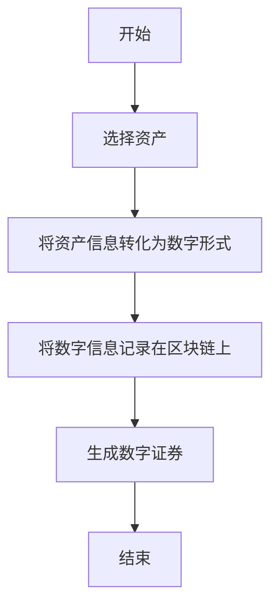
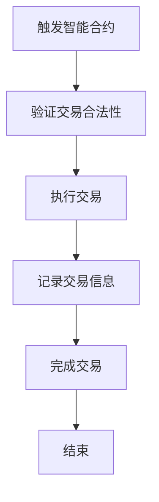
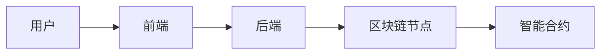

                 


# 《企业估值中的区块链数字资产证券化平台评估》

> **关键词**：企业估值、区块链、数字资产证券化、智能合约、评估模型  
> **摘要**：本文详细探讨了区块链技术在企业估值中的应用，重点分析了数字资产证券化平台的评估方法。通过介绍区块链的核心原理、数字资产证券化的实现流程，以及构建评估模型的步骤，本文为读者提供了从理论到实践的全面指导。

---

# 第1章: 企业估值与数字资产证券化平台的背景介绍

## 1.1 企业估值的现状与挑战

### 1.1.1 传统企业估值方法的局限性
传统的企业估值方法依赖于财务报表和市场数据，但存在以下问题：
- 数据不透明：企业财务数据可能经过调整或修饰，难以真实反映企业价值。
- 评估周期长：传统估值需要大量人工计算和分析，耗时较长。
- 主观性较强：估值结果受评估师主观判断影响较大。

### 1.1.2 数字化转型对企业估值的影响
数字化转型为企业估值带来了新的机遇和挑战：
- 数据来源多样化：企业可以通过大数据分析获取更多维度的估值信息。
- 估值效率提升：通过自动化工具，企业可以快速完成估值计算。
- 透明度提高：区块链技术的应用使得估值数据更加透明和可追溯。

### 1.1.3 区块链技术在企业估值中的潜力
区块链技术的特点使其在企业估值中具有广泛应用潜力：
- 数据不可篡改：区块链上的数据一旦记录，无法被篡改，保证了估值数据的真实性。
- 去中心化：区块链的去中心化特性可以减少人为干预，提高估值结果的客观性。
- 智能合约：通过智能合约自动执行估值规则，提高估值过程的效率和准确性。

## 1.2 数字资产证券化的核心概念与特点

### 1.2.1 数字资产的定义与分类
数字资产是指以数字形式存在的资产，包括：
- 加密货币（如比特币、以太坊）。
- 数字证券（如股票、债券的数字化形式）。
- 数字艺术品（如NFT）。

### 1.2.2 数字资产证券化的定义
数字资产证券化是指将传统资产（如企业股权、房地产）转化为数字形式的证券，通过区块链技术进行发行和交易。

### 1.2.3 数字资产证券化与传统证券化的区别
数字资产证券化与传统证券化的区别主要体现在以下几个方面：
- **发行方式**：数字资产证券化通过区块链技术实现去中心化发行，传统证券化依赖于中介机构。
- **交易效率**：数字资产证券化的交易可以实时完成，传统证券化需要通过多个中间机构，耗时较长。
- **透明度**：数字资产证券化通过区块链实现数据透明，传统证券化数据往往不公开。

## 1.3 区块链技术在数字资产证券化中的作用

### 1.3.1 区块链技术的核心优势
区块链技术在数字资产证券化中的核心优势包括：
- **数据不可篡改**：区块链上的数据一旦记录，无法被修改，保证了数字资产的真实性和可信度。
- **去中心化**：区块链的去中心化特性减少了对中介机构的依赖，降低了交易成本。
- **智能合约**：通过智能合约自动执行交易规则，确保交易的公平性和透明性。

### 1.3.2 数字资产证券化的实现流程
数字资产证券化的实现流程可以分为以下几个步骤：
1. **资产上链**：将传统资产转化为数字形式，并记录在区块链上。
2. **智能合约部署**：编写智能合约，定义资产发行、转让和结算的规则。
3. **交易验证**：通过区块链网络验证交易的合法性和有效性。
4. **资产发行与流通**：数字资产通过区块链网络进行发行和流通。

## 1.4 本章小结
本章介绍了企业估值的传统方法及其局限性，探讨了数字化转型对企业估值的影响，以及区块链技术在数字资产证券化中的潜力和作用。通过分析数字资产证券化的核心概念和实现流程，读者可以初步理解区块链技术在企业估值中的重要性。

---

# 第2章: 数字资产证券化平台的核心概念与联系

## 2.1 数字资产证券化的核心要素

### 2.1.1 数字资产的发行与流通
数字资产的发行与流通是数字资产证券化的核心环节：
- **发行**：通过区块链技术将传统资产转化为数字形式，并记录在区块链上。
- **流通**：数字资产通过区块链网络进行转让和交易，确保交易的透明性和安全性。

### 2.1.2 证券化的流程与规则
数字资产证券化的流程包括：
1. **资产选择**：选择适合证券化的资产（如企业股权、房地产）。
2. **资产上链**：将资产信息记录在区块链上，并生成数字证券。
3. **智能合约部署**：编写智能合约，定义资产发行、转让和结算的规则。
4. **交易验证**：通过区块链网络验证交易的合法性和有效性。

### 2.1.3 平台的参与者与角色
数字资产证券化平台的参与者包括：
- **企业**：资产的持有者，负责将资产转化为数字形式。
- **投资者**：购买数字资产的个人或机构。
- **监管机构**：负责监管数字资产证券化的合规性。
- **交易所**：提供数字资产的交易和结算服务。

## 2.2 数字资产证券化的实体关系图

```mermaid
er
actor: 投资者
actor: 企业
actor: 监管机构
actor: 交易所
```

通过上述实体关系图可以看出，数字资产证券化平台的参与者包括投资者、企业、监管机构和交易所。投资者购买数字资产，企业负责发行资产，监管机构负责监管合规性，交易所提供交易服务。

## 2.3 数字资产证券化的核心算法原理

### 2.3.1 资产上链的算法流程



### 2.3.2 智能合约的执行逻辑



### 2.3.3 资产评估的数学模型
资产评估的数学模型如下：

$$
\text{资产价值} = \sum_{i=1}^{n} w_i \times v_i
$$

其中，\( w_i \) 是第 \( i \) 个评估指标的权重，\( v_i \) 是第 \( i \) 个评估指标的值。

---

# 第3章: 区块链技术在数字资产证券化中的应用原理

## 3.1 区块链技术的核心原理

### 3.1.1 分布式账本的实现
区块链的分布式账本通过多个节点共同维护，确保数据的安全性和一致性。

### 3.1.2 去中心化共识机制
区块链的共识机制（如PoW、PoS）确保了链上数据的正确性和一致性。

### 3.1.3 智能合约的执行环境
区块链上的智能合约通过特定的虚拟机（如以太坊的EVM）执行，确保合约的自动性和可信性。

## 3.2 数字资产证券化的区块链实现

### 3.2.1 资产上链的流程
数字资产上链的流程包括：
1. 将资产信息转化为数字形式。
2. 将数字信息记录在区块链上。
3. 生成数字证券。

### 3.2.2 智能合约的编写与部署
智能合约的编写与部署流程包括：
1. 编写合约代码。
2. 部署合约到区块链网络。
3. 测试合约功能。

### 3.2.3 交易的验证与确认
交易的验证与确认流程包括：
1. 交易发起方提交交易请求。
2. 区块链网络验证交易的合法性。
3. 交易确认并记录在区块链上。

---

# 第4章: 数字资产证券化平台的评估模型

## 4.1 评估模型的构建

### 4.1.1 评估指标的设计
评估指标的设计需要考虑以下几个方面：
- 资产的流动性。
- 资产的安全性。
- 资产的透明性。

### 4.1.2 评估流程的设计
评估流程的设计包括：
1. 收集资产数据。
2. 计算各评估指标的权重。
3. 计算资产的综合价值。

## 4.2 评估模型的数学公式

$$
\text{综合价值} = \sum_{i=1}^{n} w_i \times v_i
$$

其中，\( w_i \) 是第 \( i \) 个评估指标的权重，\( v_i \) 是第 \( i \) 个评估指标的值。

---

# 第5章: 数字资产证券化平台的安全性与合规性

## 5.1 平台的安全性设计

### 5.1.1 智能合约的安全性
智能合约的安全性是数字资产证券化平台的核心。需要确保合约代码的正确性和合约执行的可靠性。

### 5.1.2 数据隐私的保护
数字资产证券化平台需要保护投资者的隐私数据，防止数据泄露和滥用。

## 5.2 平台的合规性设计

### 5.2.1 监管机构的合规要求
数字资产证券化平台需要符合相关监管机构的合规要求，确保平台的合法性和合规性。

### 5.2.2 平台的透明性设计
数字资产证券化平台需要通过区块链技术实现数据的透明性和可追溯性，确保平台的公正性和可信性。

---

# 第6章: 数字资产证券化平台的系统架构与设计

## 6.1 系统功能设计

### 6.1.1 资产发行功能
资产发行功能包括资产信息的录入、数字证券的生成和发行。

### 6.1.2 资产交易功能
资产交易功能包括交易订单的提交、交易的验证和确认。

## 6.2 系统架构设计



---

# 第7章: 数字资产证券化平台的项目实战

## 7.1 环境安装

### 7.1.1 安装区块链开发环境
安装以太坊开发环境，包括Geth、Solidity等工具。

### 7.1.2 安装智能合约开发工具
安装Remix等智能合约开发工具。

## 7.2 核心功能实现

### 7.2.1 资产上链实现
编写智能合约，实现资产的上链和发行。

### 7.2.2 交易验证实现
编写交易验证逻辑，确保交易的合法性和有效性。

---

# 第8章: 总结与展望

## 8.1 总结
本文详细探讨了区块链技术在企业估值中的应用，分析了数字资产证券化平台的核心概念和实现流程，提出了评估模型和系统架构设计方案。通过实际案例分析，验证了数字资产证券化平台的可行性和有效性。

## 8.2 展望
未来，随着区块链技术的不断发展，数字资产证券化平台将在企业估值中发挥更大的作用。需要进一步研究智能合约的安全性、数据隐私保护和平台的合规性，确保数字资产证券化平台的健康发展。

---

通过以上内容，读者可以全面了解区块链数字资产证券化平台的评估方法和实际应用，为企业的估值和数字化转型提供有力支持。

