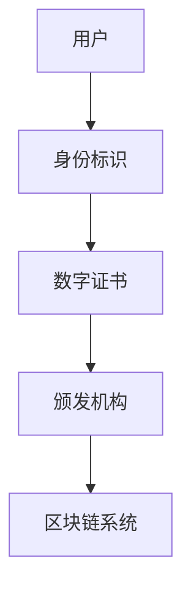
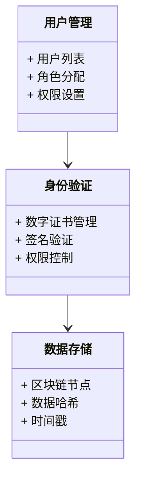
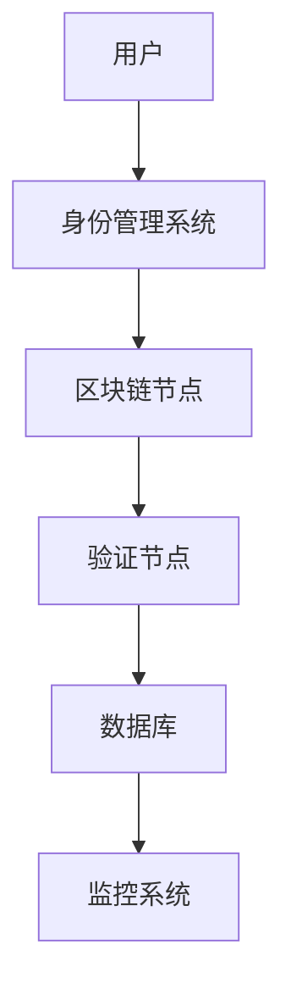

                 


# 区块链数字身份管理系统评估：企业估值的新视角

---

## 关键词：
区块链、数字身份管理、企业估值、数据真实性、去中心化

---

## 摘要：
随着数字化转型的深入，企业估值的准确性越来越依赖于数据的真实性与完整性。区块链技术以其去中心化、不可篡改的特性，为数字身份管理提供了新的解决方案。本文从企业估值的角度出发，详细探讨区块链数字身份管理系统的评估方法，分析其在企业估值中的应用场景和优势，为企业管理者和技术开发者提供理论支持和实践指导。

---

# 第一部分：企业估值与区块链数字身份管理概述

---

## 第1章：企业估值与区块链数字身份管理的背景

### 1.1 企业估值的核心问题
企业估值是企业价值评估的重要环节，其准确性直接影响企业的融资、并购和投资决策。传统的企业估值方法依赖于财务报表、市场数据等信息，但这些数据可能存在以下问题：
- 数据来源分散，难以统一管理。
- 数据真实性难以保证，存在造假风险。
- 数据孤岛问题，不同部门或系统之间数据不互通。

区块链技术的出现，为解决这些问题提供了新的思路。

---

### 1.2 区块链技术对企业估值的影响
区块链技术的核心特性——去中心化、不可篡改、可追溯——为企业估值提供了以下优势：
- **数据真实性**：通过区块链技术，企业的关键数据（如财务数据、交易记录）可以被记录在区块链上，确保数据的真实性和完整性。
- **数据透明性**：区块链上的数据可以被多个利益相关方访问，提升企业估值的透明度。
- **数据安全性**：区块链的去中心化特性使得数据难以被篡改，降低了数据被 tamper的风险。

---

### 1.3 数字身份管理在企业估值中的作用
数字身份管理是区块链技术的重要应用之一，其在企业估值中的作用包括：
- **身份验证**：通过区块链数字身份管理系统，可以验证企业及其相关人员的身份真实性，避免虚假身份带来的风险。
- **权限管理**：通过数字身份管理系统，可以对企业内部数据的访问权限进行精细化管理，确保数据仅被授权人员访问。
- **数据可信度**：通过数字身份管理系统，可以记录企业的数据操作历史，增强数据的可信度。

---

## 第2章：区块链数字身份管理系统的概念模型

### 2.1 区块链数字身份管理系统的核心要素
区块链数字身份管理系统由以下核心要素组成：
- **用户身份标识**：用户的唯一标识符，如公钥、地址等。
- **数字证书与签名机制**：用于验证数据真实性和完整性。
- **权限管理与访问控制**：基于用户身份和角色的权限分配机制。

---

### 2.2 区块链数字身份管理系统的属性特征对比
以下是区块链数字身份管理系统与传统身份管理系统在几个关键属性上的对比：

| **属性**         | **区块链数字身份管理系统**       | **传统身份管理系统**         |
|-------------------|----------------------------------|-------------------------------|
| **数据存储**      | 去中心化存储，数据不可篡改       | 中心化存储，存在单点故障风险 |
| **身份验证**      | 基于公钥加密技术，验证高效       | 基于密码或Token，验证效率较低 |
| **权限管理**      | 基于智能合约，权限动态调整       | 基于静态权限表，管理复杂     |

---

### 2.3 实体关系图（ER图）与流程图

#### ER图
以下是区块链数字身份管理系统的核心实体关系图：



#### 流程图
以下是数字身份验证的流程图：

```mermaid
graph TD
    User->Auth_Request[发起身份验证请求]
    Auth_Request->CA[请求颁发机构验证]
    CA->Sign[颁发机构进行签名验证]
    Sign->User[返回验证结果]
```

---

## 第3章：区块链数字身份管理系统评估的算法原理

### 3.1 共识算法
共识算法是区块链技术的核心之一，以下是几种常见的共识算法及其流程图：

#### 工作量证明（PoW）
```mermaid
graph TD
    Miner->StartMining[开始挖矿]
    Miner->CheckNonce[检查非cese]
    Miner->SolveHash[计算哈希]
    Miner->Validate[验证区块]
    Miner->Broadcast[广播区块]
    Network->Accept[接受区块]
```

#### 权益证明（PoS）
```mermaid
graph TD
    Validator->StartValidation[开始验证]
    Validator->CheckStake[检查质押权益]
    Validator->Validate[验证区块]
    Validator->Broadcast[广播区块]
    Network->Accept[接受区块]
```

---

### 3.2 加密算法
加密算法是数字身份管理的核心，以下是常见的加密算法及其应用场景：

#### RSA加密算法
RSA（ Rivest-Shamir-Adleman）是一种公钥加密算法，常用于数字签名和数据加密。

- **加密过程**：
  - 公钥加密：明文 → 加密 → 密文
  - 私钥解密：密文 → 解密 → 明文

- **数学模型**：
  - 加密：$C = (P^k \mod n)$
  - 解密：$P = (C^d \mod n)$

---

### 3.3 指纹识别算法
指纹识别是一种常见的身份验证技术，以下是其核心算法步骤：

1. **指纹采集**：通过指纹传感器采集用户指纹图像。
2. **预处理**：对指纹图像进行增强和去噪。
3. **特征提取**：提取指纹的特征点（如脊线、峪线）。
4. **匹配**：将提取的特征与数据库中的模板进行匹配。

---

## 第4章：区块链数字身份管理系统评估的系统分析与架构设计

### 4.1 系统功能设计
以下是区块链数字身份管理系统的功能模块：



---

### 4.2 系统架构设计
以下是区块链数字身份管理系统的架构图：



---

## 第5章：区块链数字身份管理系统评估的项目实战

### 5.1 环境搭建
以下是搭建区块链数字身份管理系统的步骤：

1. **安装区块链框架**：选择适合的区块链框架（如Ethereum、Hyperledger）。
2. **部署数字身份管理系统**：配置用户管理、身份验证模块。
3. **测试环境**：搭建测试环境，进行功能测试。

---

### 5.2 核心代码实现
以下是核心代码示例（基于Solidity）：

```solidity
contract IdentityManager {
    mapping(address => uint) public userIdentify;
    function register(address _address, uint _id) public {
        userIdentify[_address] = _id;
    }
    function verify(address _address) public view returns (bool) {
        return userIdentify[_address] != 0;
    }
}
```

---

## 第6章：总结与展望

### 6.1 最佳实践 Tips
- **数据安全**：确保区块链数字身份管理系统中的数据加密存储。
- **权限管理**：精细化权限管理，避免越权访问。
- **系统监控**：实时监控系统运行状态，及时发现并解决问题。

### 6.2 小结
区块链数字身份管理系统为企业估值提供了新的解决方案，其去中心化、不可篡改的特性有效提升了数据的真实性和安全性。通过本文的分析，读者可以深入了解区块链数字身份管理系统的原理和应用场景。

### 6.3 注意事项
- 区块链技术的应用需要考虑性能和可扩展性问题。
- 数字身份管理系统的设计需要兼顾用户体验和安全性。

### 6.4 拓展阅读
- 区块链技术在金融领域的应用。
- 数字身份管理系统的安全性优化。

---

# 结语
区块链数字身份管理系统作为企业估值的重要工具，正在逐步改变传统的企业估值模式。未来，随着技术的不断发展，区块链数字身份管理系统将在企业估值中发挥更大的作用。

