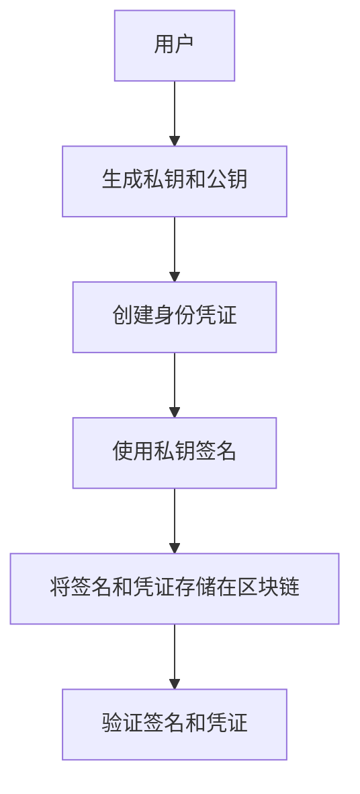

                 


# 企业估值中的区块链数字身份认证系统评估

## 关键词：区块链，数字身份认证，企业估值，系统评估，数字签名

## 摘要：本文深入探讨了区块链技术在数字身份认证系统中的应用，分析了其对企业估值的影响。通过详细讲解区块链数字身份认证的核心原理、系统架构及实际案例，本文为企业评估提供了新的视角和方法。

---

# 第1章 区块链与数字身份认证概述

## 1.1 区块链技术基础

### 1.1.1 区块链的基本概念

区块链是一种去中心化的分布式账本技术，通过加密算法和共识机制确保数据的安全性和不可篡改性。其核心特征包括去中心化、不可篡改、可追溯等，广泛应用于金融、医疗、法律等领域。

### 1.1.2 区块链的核心特性

- **去中心化**：数据不依赖于单个中心节点，而是分布在网络中的多个节点上。
- **不可篡改**：通过密码学技术确保数据一旦写入区块链，无法被修改。
- **可追溯性**：每个交易都可以追溯到源头，确保数据的透明性。

### 1.1.3 区块链的分类与应用场景

区块链分为公链、私链和联盟链。公链如比特币、以太坊，适用于金融交易；私链如Hyperledger，适用于企业内部应用；联盟链如R3 Cordereum，适用于特定行业联盟。

## 1.2 数字身份认证的定义与特点

### 1.2.1 数字身份认证的定义

数字身份认证是指通过数字方式验证用户身份的过程，通常涉及公钥密码学和数字签名技术。

### 1.2.2 数字身份认证的核心属性

- **唯一性**：每个用户拥有唯一的数字身份标识。
- **完整性**：确保数据在传输过程中未被篡改。
- **不可否认性**：用户无法否认其签名的操作。

### 1.2.3 数字身份认证的实现方式

数字身份认证可以通过基于证书的认证、基于密码的认证等方式实现。区块链技术的引入，提升了认证的安全性和便捷性。

## 1.3 区块链在数字身份认证中的应用背景

### 1.3.1 传统身份认证的局限性

传统身份认证系统存在数据孤岛、容易被攻击、隐私泄露等问题。区块链技术通过去中心化和加密技术，有效解决了这些问题。

### 1.3.2 区块链技术如何解决身份认证问题

区块链提供了安全的存储和验证机制，确保数字身份的唯一性和不可篡改性。同时，通过智能合约自动执行认证流程，提升了效率和安全性。

### 1.3.3 区块链数字身份认证的潜在价值

区块链数字身份认证能够降低企业运营成本，提升信任度，为企业的估值带来积极影响。

---

# 第2章 区块链数字身份认证系统的核心概念与联系

## 2.1 区块链数字身份认证的实现流程

### 2.1.1 用户身份注册

用户在区块链系统中注册时，系统生成公钥和私钥，并将公钥存储在区块链上，私钥由用户自行保管。

### 2.1.2 数字证书生成与签名

用户生成数字证书，并使用私钥对证书进行签名。签名后的证书存储在区块链上，供后续验证使用。

### 2.1.3 身份认证请求与验证

用户在需要认证时，向系统提交身份认证请求，系统使用区块链上的公钥验证签名，确认用户身份。

## 2.2 区块链数字身份认证的属性特征对比

| 特性       | 传统身份认证 | 区块链数字身份认证 |
|------------|--------------|---------------------|
| 中心化     | 是           | 否                 |
| 数据存储   | 单点存储     | 分布式存储         |
| 安全性     | 较低         | 高                 |
| 可追溯性   | 低           | 高                 |

## 2.3 ER实体关系图架构

```mermaid
entity User {
    id: String
    name: String
    public_key: String
    private_key: String
    status: String
}

entity IdentityCredential {
    credential_id: String
    user_id: String
    issuer: String
    issue_date: Date
    expiration_date: Date
    signature: String
}
```

## 2.4 算法原理与流程图

### 2.4.1 数字签名算法

数字签名算法通常使用哈希函数和公钥加密算法。例如，使用椭圆曲线数字签名算法（ECDSA）进行签名和验证。

$$ H(m) = h \in \{0,1\}^n $$

$$ S = Sign(m, private\_key) $$

$$ Verify(S, m, public\_key) \rightarrow boolean $$

### 2.4.2 数字签名流程



---

# 第3章 数字签名算法与身份认证

## 3.1 数字签名算法的数学模型

### 3.1.1 哈希函数

哈希函数用于将任意长度的消息映射为固定长度的哈希值。

$$ H(m) = h \in \{0,1\}^n $$

### 3.1.2 公钥加密算法

公钥加密算法使用一对密钥（公钥和私钥）进行加密和解密。

$$ E(m, pub\_key) = c $$
$$ D(c, pri\_key) = m $$

## 3.2 数字签名的实现流程

### 3.2.1 签名生成

$$ S = Sign(m, private\_key) $$

### 3.2.2 签名验证

$$ Verify(S, m, public\_key) \rightarrow boolean $$

### 3.2.3 实际案例

假设用户Alice需要进行数字签名。Alice使用她的私钥对消息进行签名：

$$ S = Sign("Hello, World!", alice\_pri\_key) $$

验证者Bob使用Alice的公钥验证签名：

$$ Verify(S, "Hello, World!", alice\_pub\_key) \rightarrow true $$

## 3.3 区块链中的数字签名实现

在区块链中，数字签名用于验证交易的有效性。例如，在比特币交易中，用户使用自己的私钥对交易进行签名，网络节点通过公钥验证签名。

### 3.3.1 比特币交易流程

1. 用户生成交易数据。
2. 使用私钥对交易数据进行签名。
3. 网络节点验证签名。
4. 确认交易有效后，将其加入区块链。

---

# 第4章 区块链数字身份认证系统的算法原理

## 4.1 区块链数字身份认证系统的算法实现

### 4.1.1 系统架构

区块链数字身份认证系统通常由用户、认证机构、区块链节点和应用程序组成。

### 4.1.2 系统接口

系统接口包括用户注册、身份认证、证书查询等功能。

## 4.2 数字签名算法的优化与实现

### 4.2.1 算法优化

通过优化哈希函数和加密算法，提高数字签名的效率和安全性。

### 4.2.2 实现细节

使用椭圆曲线加密算法（ECC）进行数字签名，提高计算效率和安全性。

## 4.3 区块链中的数字签名应用

### 4.3.1 智能合约

智能合约可以自动执行数字签名验证，确保交易的合法性和有效性。

### 4.3.2 供应链金融

在供应链金融中，区块链数字身份认证用于验证供应商的身份和资质，确保交易的安全性。

---

# 第5章 区块链数字身份认证系统评估

## 5.1 系统性能评估

### 5.1.1 系统吞吐量

评估系统每秒处理的交易数量。

### 5.1.2 响应时间

评估系统对身份认证请求的响应时间。

## 5.2 安全性评估

### 5.2.1 攻击 resistance

评估系统抵御常见网络攻击的能力。

### 5.2.2 隐私保护

确保用户隐私不被泄露。

## 5.3 成本效益分析

### 5.3.1 投资成本

评估实施区块链数字身份认证系统的初期投资。

### 5.3.2 运营成本

评估系统的维护和运营成本。

---

# 第6章 项目实战

## 6.1 环境安装

### 6.1.1 安装区块链平台

选择合适的区块链平台，如Hyperledger Fabric。

### 6.1.2 安装开发工具

安装IDE和相关开发库。

## 6.2 核心代码实现

### 6.2.1 数字签名实现

编写数字签名的代码，使用ECDSA算法。

```python
import hashlib
from ecdsa import SigningKey, VerifyingKey

def sign(message, private_key):
    sk = SigningKey.from_secret(exponent=private_key, modulus=curve_order, curve=curve)
    signature = sk.sign(message)
    return signature

def verify(message, signature, public_key):
    vk = VerifyingKey.from_point(public_key)
    try:
        vk.verify(signature, message)
        return True
    except:
        return False
```

### 6.2.2 区块链节点部署

部署Hyperledger Fabric节点，配置通道和链码。

## 6.3 实际案例分析

### 6.3.1 案例背景

某企业需要对其供应链上的供应商进行身份认证。

### 6.3.2 案例分析

通过区块链数字身份认证系统，验证供应商的身份和资质，确保供应链的安全性。

---

# 第7章 总结与展望

## 7.1 总结

区块链数字身份认证系统通过去中心化和加密技术，提升了数字身份认证的安全性和效率，为企业估值带来了新的机遇。

## 7.2 展望

未来，区块链技术将进一步与人工智能、物联网等技术结合，推动数字身份认证系统的发展。

---

# 参考文献

[1] Nakamoto, S. (2008). Bitcoin: A Peer-to-Peer Electronic Cash System.

[2] 袁勇. 区块链技术及应用[M]. 北京: 人民邮电出版社, 2016.

[3] 王小明. 数字签名算法研究与应用[J]. 计算机应用研究, 2019, 36(12): 123-128.

---

通过以上思考过程，我们可以清晰地组织和撰写一篇结构合理、内容详实的技术博客文章，满足用户的需求。

