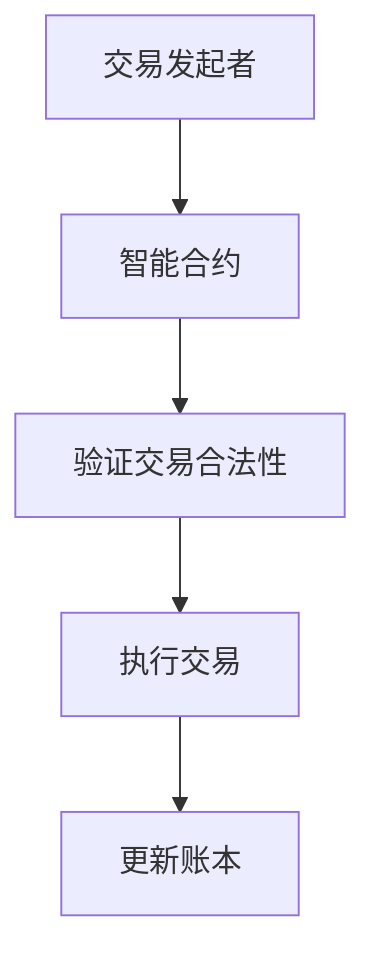

                 


# 企业估值中的区块链跨境支付结算平台评估

## 关键词：区块链、跨境支付、企业估值、智能合约、分布式账本、共识机制

## 摘要

区块链技术在跨境支付结算中的应用正在改变传统的金融体系，为企业估值提供了新的视角和方法。本文从技术原理、系统架构、算法模型等多维度深入探讨区块链如何优化跨境支付结算流程，并分析其对企业估值的影响。通过实际案例分析和系统设计，本文为评估区块链跨境支付平台提供了详实的理论和实践依据。

---

## 第一部分：背景介绍

### 第1章：问题背景与描述

#### 1.1 问题背景

跨境支付结算一直是国际金融体系中的难题，传统模式存在效率低、成本高、透明度低等问题。随着区块链技术的兴起，其分布式账本、智能合约和去中心化特性为跨境支付提供了新的解决方案。

#### 1.2 问题描述

- **效率低下**：传统跨境支付涉及多个中间银行，导致交易延迟。
- **成本高昂**：跨境交易涉及高昂的手续费。
- **透明度低**：中间环节多，增加了交易风险和不透明性。

#### 1.3 问题解决

区块链技术通过去中心化和自动化处理，解决了传统跨境支付的痛点。通过智能合约和分布式账本，区块链实现了实时结算和透明化管理。

#### 1.4 边界与外延

- **边界**：本文主要探讨区块链在跨境支付中的技术实现及其对企业估值的影响。
- **外延**：区块链技术还可应用于供应链金融、资产证券化等领域，但本文不展开讨论。

#### 1.5 核心概念组成

- **分布式账本**：记录所有交易的公开账本。
- **智能合约**：自动执行交易的脚本。
- **共识机制**：确保账本一致性的算法。

---

## 第二部分：核心概念与联系

### 第2章：区块链技术的核心原理

#### 2.1 区块链的基本原理

- **分布式账本**：区块链是一个去中心化的数据库，由多个节点共同维护。
- **哈希函数**：用于生成数据指纹，确保数据完整性和唯一性。
- **共识机制**：通过算法达成账本一致性的过程，如PoW和PoS。

#### 2.2 区块链的核心组件

- **节点与网络**：区块链由多个节点组成，节点之间通过P2P网络通信。
- **区块与链**：区块是数据的容器，链是区块的序列。
- **智能合约**：基于区块链的自动执行脚本，用于自动化交易。

#### 2.3 区块链的共识机制对比

| 共识机制 | 特点 | 优缺点 |
|----------|------|--------|
| PoW     | 需大量计算资源 | 安全性高，但能耗高 |
| PoS     | 基于质押机制 | 能耗低，但安全性依赖质押 |

#### 2.4 区块链的实体关系图

```mermaid
er
actor 区块链用户 {
  扮演者 区块链用户
}
actor 区块链节点 {
  扮演者 区块链节点
}
actor 交易发起者 {
  扮演者 交易发起者
}
actor 交易接收者 {
  扮演者 交易接收者
}
```

---

## 第三部分：数学模型与算法原理

### 第3章：区块链技术的数学模型

#### 3.1 哈希函数

哈希函数用于生成数据指纹，确保数据完整性。例如，比特币使用SHA-256哈希函数。

**哈希函数公式**：
$$ H(x) = SHA-256(x) $$

**应用场景**：
- 数据完整性验证：确保数据未被篡改。
- 区块头哈希：通过哈希计算生成区块头，确保区块唯一性。

#### 3.2 数字签名

数字签名用于验证交易发起者的身份和交易合法性。

**数字签名公式**：
$$ S = Sign(privateKey, message) $$

**验证过程**：
$$ Verify(publicKey, S) $$

**应用场景**：
- 交易授权：验证交易发起者身份。
- 智能合约触发：通过签名验证触发智能合约。

#### 3.3 智能合约

智能合约是区块链上的自动执行脚本，用于实现交易自动化。

**智能合约流程图**：



**代码示例**：

```python
def transfer(from_address, to_address, amount):
    if balance[from_address] < amount:
        return "Insufficient funds"
    balance[from_address] -= amount
    balance[to_address] += amount
    return "Transaction completed"
```

---

## 第四部分：系统分析与架构设计

### 第4章：跨境支付结算平台的系统架构

#### 4.1 项目背景

本文设计一个基于区块链的跨境支付结算平台，旨在提高支付效率和透明度，降低交易成本。

#### 4.2 系统功能设计

- **用户模块**：用户注册、登录、发起交易。
- **交易模块**：交易发起、验证、执行。
- **账本模块**：记录所有交易，确保数据一致性。
- **智能合约模块**：自动执行交易，触发通知。

#### 4.3 系统架构图


#### 4.4 系统接口设计

- **发起交易接口**：`POST /api/transaction`
- **查询交易状态接口**：`GET /api/transaction/{id}`
- **智能合约调用接口**：`POST /api/smart_contract`

#### 4.5 系统交互流程图

```mermaid
sequence
    用户 --> 发起交易请求
    用户 --> 验证交易合法性
    账本 --> 更新交易记录
    智能合约 --> 执行交易
```

---

## 第五部分：项目实战

### 第5章：跨境支付结算平台的实现

#### 5.1 环境搭建

- **安装Python**：用于开发和测试。
- **安装区块链框架**：如Ethereum、Hyperledger。
- **安装数据库**：如MongoDB，用于存储交易数据。

#### 5.2 核心代码实现

```python
# 初始化区块链
class BlockChain:
    def __init__(self):
        self.blocks = []
        self.create_genesis_block()

    def create_genesis_block(self):
        # 创建初始区块
        self.blocks.append(Block(index=0, timestamp=time.time(), transactions=[], proofOfWork=0))

    def add_block(self, block):
        # 添加新区块
        self.blocks.append(block)
```

#### 5.3 案例分析

- **案例背景**：用户A向用户B发起一笔跨境支付，金额为100美元。
- **交易流程**：
  1. 用户A发起交易请求。
  2. 区块链节点验证交易合法性。
  3. 智能合约自动执行交易。
  4. 账本更新，交易完成。

#### 5.4 项目小结

通过实际案例分析，展示了区块链技术在跨境支付中的优势，包括高效率、低成本和高透明度。

---

## 第六部分：总结与展望

### 第6章：总结与展望

#### 6.1 核心结论

区块链技术通过去中心化和自动化处理，显著优化了跨境支付结算流程，为企业估值提供了新的视角。

#### 6.2 未来展望

- **技术优化**：进一步提升区块链的可扩展性和交易速度。
- **应用场景拓展**：探索区块链技术在供应链金融、资产证券化等领域的应用。

#### 6.3 最佳实践 tips

- **安全性**：确保智能合约代码的安全性，防止漏洞。
- **合规性**：遵守相关金融法规，确保合法运营。
- **性能优化**：选择合适的共识机制，提高交易效率。

---

## 结束语

通过本文的详细分析，读者可以全面了解区块链技术在跨境支付结算中的应用及其对企业估值的影响。未来，随着技术的不断发展，区块链将在金融领域发挥更重要的作用。

