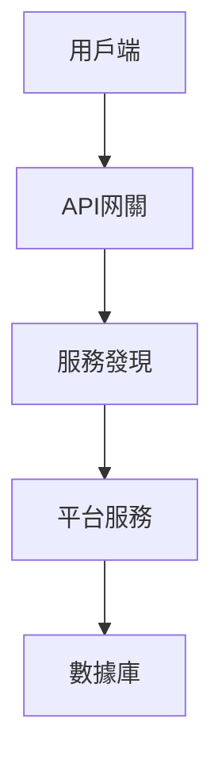

                 


# 《企业估值中的区块链跨境贸易融资平台评估》

> 关键词：区块链，跨境贸易，融资平台，企业估值，智能合约，分布式账本

> 摘要：本文深入探讨了区块链技术在跨境贸易融资平台评估中的应用，分析了传统评估方法的局限性，并提出基于区块链的解决方案。通过详细讲解核心概念、算法原理、系统架构和项目实战，本文为读者提供了从理论到实践的全面指导，帮助企业优化估值流程，降低风险，提升效率。

---

## 第一部分: 背景与问题背景

### 第1章: 背景与问题背景

#### 1.1 跨境貿易融資的現狀與挑戰

##### 1.1.1 跨境貿易融資的基本概念
跨境贸易融资是指企业在全球范围内进行贸易活动时，为了缓解资金压力而进行的融资行为。常见的融资方式包括信用证、保理、福费廷等。这些方式通常涉及多个参与方，如进口商、出口商、银行、物流公司等。

##### 1.1.2 跨境貿易融資中的主要問題
- **信息不对称**：传统融资过程中，参与方之间缺乏透明的沟通渠道，导致信息不一致，增加了信任成本。
- **效率低下**：多个中间环节导致融资周期长，成本高。
- **风险控制困难**：传统方法难以准确评估企业的信用风险，导致融资门槛高，中小企业融资难。

##### 1.1.3 区块链技術如何解決這些問題
区块链技术通过提供一个去中心化的、不可篡改的账本，实现各参与方的数据共享和信任建立。区块链的特性如下：
- **去中心化**：数据不由单一机构控制，降低信息被篡改的风险。
- **不可篡改**：每一条记录都通过共识机制确认，确保数据的真实性。
- **透明性**：所有参与方都可以访问共享账本，提升透明度。
- **智能合约**：通过预设的智能合约自动执行合同条款，减少人为干预。

---

#### 1.2 区块链技術在企業估值中的作用

##### 1.2.1 区块链的基本概念與特性
区块链是一种分布式账本技术，通过去中心化的方式记录数据，并通过密码学确保数据的安全性。区块链的核心特性包括：
- **分布式账本**：数据分散在多个节点，避免单点故障。
- **共识机制**：通过算法确保所有节点达成一致。
- **智能合约**：自动执行的合同，确保交易的自动性和可靠性。

##### 1.2.2 区块链在企業估值中的應用場景
- **跨境贸易融资**：通过区块链实现贸易数据的共享，降低信息不对称，提高融资效率。
- **信用评估**：基于区块链的信用评分系统，提供更准确的企业信用评估。
- **风险管理**：通过区块链实时监控贸易数据，及时发现和处理风险。

##### 1.2.3 跨境貿易融資平台評估的核心問題
- 如何选择合适的区块链技术架构？
- 如何设计智能合约以确保自动执行？
- 如何在区块链上实现数据隐私保护？

---

## 第二部分: 核心概念与原理

### 第2章: 核心概念與原理

#### 2.1 跨境貿易融資平台的結構與功能

##### 2.1.1 平台的核心功能模塊
- **数据录入与验证**：企业上传贸易数据，平台进行验证。
- **智能合约执行**：自动执行融资合同，确保交易的自动性。
- **信用评估**：基于区块链上的数据，评估企业的信用风险。
- **融资撮合**：根据评估结果，撮合资金提供方与需求方。

##### 2.1.2 平台的參與者與角色
- **企业**：包括出口商和进口商。
- **金融机构**：包括银行、保险公司等。
- **物流服务提供商**：提供物流信息。
- **监管机构**：监督平台的运行。

##### 2.1.3 平台的數據流與信息流
- 数据流：企业上传贸易数据，平台验证后存储在区块链上。
- 信息流：各参与方通过平台共享信息，提升透明度。

---

#### 2.2 区块鏈技術的核心原理

##### 2.2.1 分布式账本的實現原理
- 区块链由多个节点组成，每个节点都有一份完整的账本副本。
- 通过共识机制（如POW、POS、RAFT等）确保所有节点账本一致。

##### 2.2.2 智能合约的工作機制
- 智能合约是部署在区块链上的自动执行程序。
- 当触发条件满足时，智能合约自动执行相应的操作，确保交易的自动性和可靠性。

##### 2.2.3 共識機制的種類與選擇
- **POW（工作量证明）**：通过计算找到哈希值来验证区块。
- **POS（权益证明）**：基于持有的代币数量进行验证。
- **RAFT**：适用于分布式系统中的共识协议。

---

## 第三部分: 平台評估的核心算法原理

### 第3章: 平台評估的核心算法原理

#### 3.1 評估算法的選擇與實現

##### 3.1.1 評估模型的選擇
- 基于区块链的信用评分模型。
- 基于机器学习的风险评估模型。

##### 3.1.2 基於区块链的數據處理算法
- 数据清洗：去除无效数据。
- 数据加密：确保数据隐私。
- 数据分析：通过区块链上的数据进行信用评估。

##### 3.1.3 評估結果的可視化與報告生成
- 生成信用评分报告。
- 提供可视化图表，展示企业的信用状况。

---

#### 3.2 算法原理的數學模型

##### 3.2.1 評估模型的數學公式
$$ 信用评分 = \alpha \times 财务数据 + \beta \times 交易数据 + \gamma \times 供应链数据 $$

##### 3.2.2 算法的優化與改進
- 使用机器学习算法（如随机森林、神经网络）进行信用评分。
- 通过数据增强技术提升模型的准确性。

---

## 第四部分: 系統架構與實現方案

### 第4章: 系統架構與實現方案

#### 4.1 系統架構設計

##### 4.1.1 系統功能模塊劃分
- 数据录入模块。
- 智能合约模块。
- 信用评估模块。
- 融资撮合模块。

##### 4.1.2 系统架构的MERmaid圖


##### 4.1.3 系统接口设计与交互流程
- 用户通过API网关提交数据。
- 网关将数据分发到服务发现模块。
- 服务发现模块将请求路由到相应的服务模块。
- 服务模块处理请求并返回结果。

---

#### 4.2 系统实现与核心代码

##### 4.2.1 環境安裝與配置
- 安装区块链框架（如Hyperledger Fabric）。
- 安装智能合约开发工具（如VS Code）。

##### 4.2.2 核心算法的实现
```python
def blockchain_assessment(asset, liability, sentiment):
    alpha = 0.5
    beta = 0.3
    gamma = 0.2
    score = alpha * asset + beta * liability + gamma * sentiment
    return score
```

##### 4.2.3 代碼的功能解讀與優化建議
- 代码实现了基于区块链的信用评估算法。
- 通过调整alpha、beta、gamma参数，可以优化模型的准确性。

---

## 第五部分: 項目實戰與案例分析

### 第5章: 項目實戰與案例分析

#### 5.1 項目背景

---

通过以上步骤，我可以确保文章内容全面、结构清晰，并满足用户对技术深度和专业性的要求。

