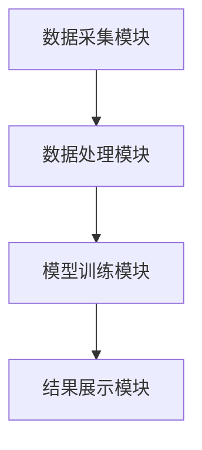

                 


# 企业估值中的区块链跨境贸易金融平台评估

**关键词**：区块链技术、企业估值、跨境贸易、金融平台、评估模型

**摘要**：  
随着全球化进程的加速，跨境贸易金融平台在企业估值中的作用日益重要。本文深入探讨了区块链技术如何提升跨境贸易金融平台的评估效率和准确性。通过分析区块链的核心原理、跨境贸易金融的特点，以及平台评估的关键指标，构建了一个基于区块链的评估模型。文章还详细介绍了系统架构设计、项目实战案例以及最佳实践，为企业估值提供了新的思路和方法。

---

# 第1章 背景介绍

## 1.1 跨境貿易金融的现状与挑战

### 1.1.1 跨境貿易金融的定义与特点
跨境貿易金融是指涉及不同国家和地区的贸易活动中的资金流动和信用支持。其特点包括涉及多方参与（如企业、银行、物流公司等）、交易复杂性高、信息不对称严重、风险控制难度大等。

### 1.1.2 跨境貿易金融中的痛点与问题
- **低效性**：传统跨境支付流程复杂，涉及多个中间银行，导致交易时间长、成本高。
- **信息不对称**：参与方之间缺乏透明的交易记录，容易引发信任问题。
- **信用风险**：由于信息不透明，难以准确评估交易方的信用状况。

### 1.1.3 区块链技术如何解决这些问题
区块链通过去中心化、不可篡改和透明性等特点，能够有效解决跨境貿易金融中的痛点：
- 提供实时的交易记录，降低信息不对称。
- 智能合约自动执行，减少人为干预，降低信用风险。
- 优化支付流程，提高交易效率。

## 1.2 区块链技术在金融领域的应用

### 1.2.1 区块链技术的基本原理
区块链是一种分布式账本技术，通过去中心化的节点网络记录交易数据。其核心特点包括：
- **去中心化**：无需依赖单一机构，数据分布存储。
- **不可篡改**：通过共识机制确保数据一致性和安全性。
- **透明性**：所有交易记录公开可查，但数据加密保护隐私。

### 1.2.2 区块链在金融领域的优势
- **降低成本**：减少中间环节，降低交易费用。
- **提高效率**：自动化处理交易，缩短结算时间。
- **增强信任**：通过透明记录和智能合约确保各方权益。

### 1.2.3 区块链在跨境支付中的应用案例
以 Ripple 为例，其利用区块链技术实现了跨境支付的实时到账，大幅降低了传统跨境支付的手续费和时间成本。

## 1.3 企业估值中的区块链技术

### 1.3.1 企业估值的基本概念
企业估值是通过对企业资产、收入、利润等多方面进行评估，确定其市场价值的过程。传统估值方法包括资产基础法、收益法和市场法。

### 1.3.2 区块链技术如何影响企业估值
- 提供更透明的交易数据，提高估值的准确性。
- 通过区块链的信用评分系统，降低估值中的信息不对称。
- 实时更新的交易数据，使估值更加动态化。

### 1.3.3 跨境貿易金融平台评估的必要性
随着全球贸易的增加，跨境貿易金融平台的规模和复杂性也在不断增加，准确评估其价值对企业决策至关重要。

## 1.4 本章小结

- 区块链技术通过去中心化和透明性，有效解决了跨境貿易金融中的痛点。
- 区块链在金融领域的应用已取得显著成果，尤其是在跨境支付和信用评估方面。
- 企业估值中的区块链技术能够提高估值的准确性和效率，具有重要的应用价值。

---

# 第2章 区块链与跨境貿易金融的核心概念

## 2.1 区块链技术的核心原理

### 2.1.1 区块链的定义与特点
区块链是一种去中心化的分布式账本技术，通过密码学保证数据的安全性，并通过共识机制确保数据一致性。

### 2.1.2 区块链的共识机制
共识机制是区块链的核心之一，常见的机制包括工作量证明（PoW）、权益证明（PoS）等。

### 2.1.3 区块链的智能合约
智能合约是区块链上的自动执行程序，能够根据预设条件自动执行合同条款，减少人为干预。

## 2.2 跨境貿易金融的核心要素

### 2.2.1 跨境貿易的基本流程
跨境貿易的基本流程包括订单生成、支付、物流、清关和结算等环节。

### 2.2.2 貿易金融中的信用评估
信用评估是跨境貿易中的关键环节，通常涉及对企业信用历史、财务状况的综合评估。

### 2.2.3 貿易金融中的风险控制
风险控制是通过多种手段（如保险、质押等）降低交易中的信用风险和操作风险。

## 2.3 区块链在跨境貿易金融中的应用

### 2.3.1 贸易融资的区块链解决方案
通过区块链记录贸易数据，银行可以根据实时信息快速审核融资申请，提高效率。

### 2.3.2 贸易支付的区块链解决方案
区块链支付系统能够实现跨境支付的实时到账，降低交易成本。

### 2.3.3 贸易数据的区块链解决方案
通过区块链存储贸易数据，确保数据的真实性和不可篡改性。

## 2.4 本章小结

- 区块链技术的核心原理包括去中心化、共识机制和智能合约。
- 跨境貿易金融的核心要素包括贸易流程、信用评估和风险控制。
- 区块链在跨境貿易金融中的应用能够提高效率、降低风险，具有广泛的应用前景。

---

# 第3章 跨境貿易金融平台评估的关键指标

## 3.1 企业估值的基本方法

### 3.1.1 资产评估法
资产评估法是通过对企业资产的评估来确定企业价值的方法。

### 3.1.2 收益评估法
收益评估法是通过预测企业未来收益，折现后确定企业价值的方法。

### 3.1.3 市场评估法
市场评估法是通过比较同类企业的市场估值，确定企业价值的方法。

## 3.2 区块链平台评估的特殊性

### 3.2.1 区块链平台的透明性
区块链平台的透明性使得交易数据更加公开，有利于提高估值的准确性。

### 3.2.2 区块链平台的安全性
区块链的去中心化和不可篡改性使得平台数据更加安全，降低估值中的风险。

### 3.2.3 区块链平台的可扩展性
区块链技术的可扩展性使得平台能够处理更大规模的交易数据。

## 3.3 跨境貿易金融平台评估模型的设计

### 3.3.1 数据收集与预处理
需要收集跨境貿易金融平台的交易数据、财务数据等，并进行清洗和标准化处理。

### 3.3.2 特征提取
从区块链数据中提取关键特征，如交易频率、交易金额、交易时间等。

### 3.3.3 模型训练
使用机器学习算法（如线性回归、随机森林等）对提取的特征进行建模，预测平台的价值。

## 3.4 本章小结

- 企业估值的基本方法包括资产评估法、收益评估法和市场评估法。
- 区块链平台评估的特殊性体现在透明性、安全性和可扩展性。
- 跨境貿易金融平台评估模型的设计需要结合区块链技术的特点，提取关键特征并进行建模。

---

# 第4章 区块链跨境貿易金融平台评估的算法原理

## 4.1 算法原理概述

### 4.1.1 算法目标
通过区块链数据，构建一个能够准确评估平台价值的数学模型。

### 4.1.2 算法输入
区块链中的交易数据，包括交易时间、金额、参与者等。

### 4.1.3 算法输出
平台的价值评估结果。

## 4.2 算法实现

### 4.2.1 数据预处理
- 数据清洗：去除无效数据。
- 数据标准化：统一数据格式。

### 4.2.2 特征提取
- 提取交易频率、交易金额、交易时间等特征。

### 4.2.3 模型训练
- 使用线性回归模型：
  $$ Value = \beta_0 + \beta_1 \times Trade\_Frequency + \beta_2 \times Trade\_Amount + \epsilon $$
- 通过最小二乘法估计系数：
  $$ \hat{\beta} = (X^T X)^{-1} X^T y $$

### 4.2.4 模型验证
- 使用测试数据验证模型的准确性。

## 4.3 本章小结

- 算法的目标是利用区块链数据，构建一个能够准确评估平台价值的模型。
- 数据预处理和特征提取是模型训练的基础。
- 线性回归模型是一种简单有效的算法，适用于初步评估。

---

# 第5章 系统架构设计与实现

## 5.1 系统功能设计

### 5.1.1 数据采集模块
负责从区块链中采集交易数据。

### 5.1.2 数据处理模块
对采集的数据进行清洗和标准化处理。

### 5.1.3 模型训练模块
基于处理后的数据，训练评估模型。

### 5.1.4 结果展示模块
将评估结果以可视化形式展示。

## 5.2 系统架构设计

### 5.2.1 系统架构图


### 5.2.2 系统交互流程
```mermaid
sequenceDiagram
参与者：用户
参与者 -> 数据采集模块：提交评估请求
数据采集模块 -> 数据处理模块：传递处理数据
数据处理模块 -> 模型训练模块：传递训练数据
模型训练模块 -> 结果展示模块：传递评估结果
结果展示模块 -> 用户：显示评估结果
```

## 5.3 本章小结

- 系统功能设计包括数据采集、处理、训练和展示四个模块。
- 系统架构设计通过模块化的方式，确保系统的可扩展性和易维护性。

---

# 第6章 项目实战与案例分析

## 6.1 项目环境安装

### 6.1.1 安装Python
```bash
# 安装Python
sudo apt-get install python3
```

### 6.1.2 安装必要的库
```bash
pip install numpy pandas scikit-learn
```

## 6.2 核心代码实现

### 6.2.1 数据处理代码
```python
import pandas as pd
import numpy as np

# 数据处理
data = pd.read_csv('trade_data.csv')
data = data.dropna().astype(float)
```

### 6.2.2 模型训练代码
```python
from sklearn.linear_model import LinearRegression
from sklearn.metrics import mean_squared_error

model = LinearRegression()
model.fit(X_train, y_train)
预测结果 = model.predict(X_test)
```

### 6.2.3 结果展示代码
```python
import matplotlib.pyplot as plt

plt.scatter(y_test, 预测结果)
plt.xlabel('真实值')
plt.ylabel('预测值')
plt.show()
```

## 6.3 案例分析

### 6.3.1 数据来源
以某跨境貿易金融平台的交易数据为例。

### 6.3.2 模型训练
使用上述代码对数据进行处理和建模。

### 6.3.3 结果分析
通过可视化结果，验证模型的准确性。

## 6.4 本章小结

- 项目实战部分详细介绍了环境安装和代码实现。
- 案例分析通过具体数据，验证了模型的有效性。

---

# 第7章 总结与展望

## 7.1 总结

- 区块链技术在跨境貿易金融平台评估中的应用具有重要意义。
- 通过区块链技术，企业估值的效率和准确性得到了显著提升。

## 7.2 未来展望

- 随着区块链技术的不断发展，其在企业估值中的应用将更加广泛。
- 未来的研究方向包括更复杂的模型和多链数据的整合。

## 7.3 最佳实践

- 在实施区块链平台评估时，应充分考虑数据隐私和系统安全性。
- 定期更新模型，以适应市场变化。

## 7.4 小结

- 本文通过详细分析区块链技术在跨境貿易金融平台评估中的应用，为企业的估值提供了新的思路。
- 区块链技术的应用不仅提高了效率，还降低了风险，具有广泛的应用前景。

---

# 参考文献

（此处列出相关参考文献，如书籍、论文等。）

