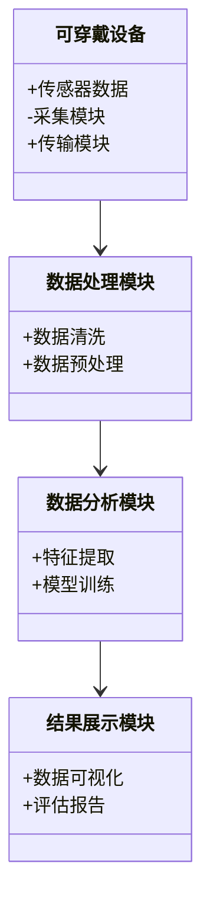
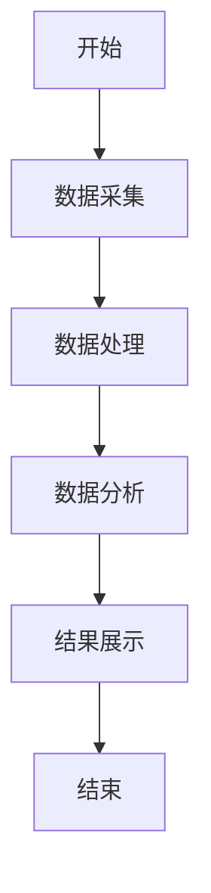

                 


# 企业估值中的可穿戴医疗设备评估

> 关键词：企业估值，可穿戴医疗设备，设备评估，算法原理，系统架构设计，项目实战

> 摘要：  
本文深入探讨了可穿戴医疗设备在企业估值中的评估方法与技术实现。通过分析可穿戴设备的核心技术特点、评估模型的构建以及系统的架构设计，结合实际案例和算法实现，为企业在估值过程中提供了一套系统的解决方案。文章从背景、理论、算法、系统设计、实战到总结，层层递进，为企业估值中的可穿戴医疗设备评估提供了全面的技术指导。

---

## 第1章 可穿戴医疗设备的基本概念

### 1.1 可穿戴医疗设备的定义与分类

#### 1.1.1 可穿戴医疗设备的定义  
可穿戴医疗设备是指能够佩戴在人体上的医疗设备，通过传感器技术采集人体生理数据，并通过无线通信技术将数据传输到终端设备或云端进行分析。这类设备通常用于健康监测、疾病预防和辅助治疗。

#### 1.1.2 可穿戴医疗设备的分类  
根据功能和应用场景，可穿戴医疗设备可以分为以下几类：
- **健康监测类**：如智能手表、健康手环，主要用于监测心率、血压、血氧等生理指标。
- **疾病辅助治疗类**：如智能胰岛素泵、心脏起搏器，用于慢性病的治疗和管理。
- **运动与健身类**：如运动追踪器、智能穿戴设备，用于运动数据分析和健身指导。

#### 1.1.3 可穿戴医疗设备的市场现状  
近年来，随着技术的进步和人们对健康的关注增加，可穿戴医疗设备市场呈现快速增长态势。根据市场研究机构的数据，全球可穿戴医疗设备市场规模预计在未来几年内将保持年均两位数的增长率。

---

### 1.2 可穿戴医疗设备在企业估值中的应用背景

#### 1.2.1 企业估值的基本概念  
企业估值是指通过对企业的财务状况、市场表现、管理团队、技术实力等多方面因素的综合评估，确定企业价值的过程。在医疗行业，企业估值尤为重要，因为它直接影响企业的融资、并购和投资决策。

#### 1.2.2 可穿戴医疗设备在企业估值中的作用  
可穿戴医疗设备为企业估值提供了新的数据源和评估维度。通过实时采集的生理数据，企业可以更准确地评估员工健康状况、优化人力资源管理，从而提升企业的整体价值。

#### 1.2.3 可穿戴医疗设备对企业价值的影响  
通过可穿戴设备采集的员工健康数据，企业可以更好地预防和管理健康风险，降低医疗成本，提高员工 productivity。这些因素都会对企业的整体价值产生积极影响。

---

## 第2章 企业估值中的可穿戴医疗设备评估核心概念

### 2.1 可穿戴医疗设备评估的核心要素

#### 2.1.1 设备性能指标  
设备性能指标包括传感器精度、数据传输稳定性、电池续航能力等，这些指标直接影响设备的可靠性和可用性。

#### 2.1.2 用户行为数据  
用户行为数据包括设备使用频率、数据采集的准确性、用户反馈等，这些数据可以帮助企业更好地了解设备的使用效果。

#### 2.1.3 企业需求匹配度  
企业需求匹配度是指设备的功能与企业实际需求的契合程度，这是评估设备是否适合企业的重要标准。

---

### 2.2 可穿戴医疗设备评估的理论基础

#### 2.2.1 数据驱动的估值方法  
数据驱动的估值方法通过分析海量数据，利用统计学和机器学习技术，构建评估模型，从而实现对企业价值的精准评估。

#### 2.2.2 机器学习在估值中的应用  
机器学习技术可以通过对历史数据的学习，识别数据中的潜在规律，从而辅助企业估值。

#### 2.2.3 统计学模型在设备评估中的作用  
统计学模型可以帮助企业识别设备的关键性能指标，并通过数据分析，评估设备的综合性能。

---

### 2.3 可穿戴医疗设备评估的核心模型

#### 2.3.1 基于传感器数据的评估模型  
该模型通过分析传感器采集的数据，评估设备的性能指标，如心率、血压等。

#### 2.3.2 基于用户行为数据的评估模型  
该模型通过分析用户的使用行为，评估设备的易用性和用户体验。

#### 2.3.3 综合评估模型  
综合评估模型将传感器数据和用户行为数据结合，从多个维度综合评估设备的性能。

---

## 第3章 可穿戴医疗设备评估的算法原理

### 3.1 评估算法概述

#### 3.1.1 机器学习算法在设备评估中的应用  
机器学习算法，如支持向量机（SVM）和随机森林（Random Forest），可以用于设备性能的分类和预测。

#### 3.1.2 统计学模型在设备评估中的应用  
统计学模型，如线性回归，可以用于设备性能的回归分析。

#### 3.1.3 深度学习算法在设备评估中的应用  
深度学习算法，如卷积神经网络（CNN）和循环神经网络（RNN），可以用于设备数据的特征提取和分类。

---

### 3.2 算法原理详细讲解

#### 3.2.1 线性回归模型  
线性回归模型是一种常用的统计学模型，用于预测设备性能指标。其数学表达式为：
$$ y = \beta_0 + \beta_1 x + \epsilon $$
其中，$y$ 是目标变量，$x$ 是自变量，$\beta_0$ 是截距，$\beta_1$ 是回归系数，$\epsilon$ 是误差项。

#### 3.2.2 支持向量机模型  
支持向量机（SVM）是一种监督学习算法，常用于分类和回归问题。其核心思想是通过寻找最优超平面，将数据点分到不同的类别中。

#### 3.2.3 神经网络模型  
神经网络模型是一种深度学习算法，通过多层神经元的连接，可以实现复杂的特征提取和分类任务。

---

### 3.3 算法实现与优化

#### 3.3.1 算法实现步骤  
1. 数据预处理：清洗数据，处理缺失值和异常值。
2. 特征提取：从原始数据中提取有用的特征。
3. 模型训练：使用训练数据训练模型。
4. 模型评估：使用测试数据评估模型性能。
5. 模型优化：调整模型参数，提高模型性能。

#### 3.3.2 算法优化方法  
- 参数调优：通过网格搜索等方法找到最优参数。
- 特征选择：通过特征重要性分析，选择关键特征。
- 模型集成：通过集成学习方法，提高模型的泛化能力。

#### 3.3.3 算法性能评估  
通过准确率、召回率、F1分数等指标，评估模型的性能。

---

## 第4章 可穿戴医疗设备评估的系统架构设计

### 4.1 系统架构概述

#### 4.1.1 系统功能模块划分  
系统功能模块包括数据采集模块、数据处理模块、数据分析模块和结果展示模块。

#### 4.1.2 系统架构设计原则  
系统架构设计应遵循高内聚、低耦合的原则，确保系统的可扩展性和可维护性。

#### 4.1.3 系统架构的优缺点分析  
优点：系统架构清晰，模块之间耦合度低；缺点：初期开发成本较高。

---

### 4.2 系统功能设计

#### 4.2.1 数据采集模块  
数据采集模块负责采集设备的传感器数据，包括心率、血压、血氧等。

#### 4.2.2 数据处理模块  
数据处理模块对采集到的数据进行清洗和预处理，确保数据的准确性和完整性。

#### 4.2.3 数据分析模块  
数据分析模块利用机器学习算法，对数据进行建模和分析，生成评估结果。

#### 4.2.4 结果展示模块  
结果展示模块将评估结果以可视化的方式展示给用户，包括图表和报告。

---

### 4.3 系统架构设计图

#### 4.3.1 系统架构类图  


#### 4.3.2 系统架构流程图  


---

## 第5章 项目实战

### 5.1 环境安装与配置

#### 5.1.1 Python环境安装  
安装Python和必要的库，如NumPy、Pandas、Scikit-learn、TensorFlow。

#### 5.1.2 数据采集工具安装  
安装设备驱动和数据采集工具，确保设备与系统的正常连接。

---

### 5.2 系统核心实现

#### 5.2.1 数据采集模块实现  
```python
import serial

# 连接设备
ser = serial.Serial('COM3', 9600)
data = ser.readline().decode()
print(data)
```

#### 5.2.2 数据处理模块实现  
```python
import pandas as pd
import numpy as np

# 数据清洗
data = pd.read_csv('data.csv')
data.dropna(inplace=True)
data = data[~data['value'].isnull()]
```

#### 5.2.3 数据分析模块实现  
```python
from sklearn.linear_model import LinearRegression

# 线性回归模型训练
model = LinearRegression()
model.fit(X_train, y_train)
```

#### 5.2.4 结果展示模块实现  
```python
import matplotlib.pyplot as plt

# 可视化结果
plt.scatter(X_test, y_test, color='blue')
plt.plot(X_test, model.predict(X_test), color='red')
plt.xlabel('X')
plt.ylabel('Y')
plt.show()
```

---

### 5.3 实际案例分析

#### 5.3.1 案例背景  
某医疗设备企业希望评估其可穿戴设备的性能指标，以优化产品设计和提升企业价值。

#### 5.3.2 数据分析与结果展示  
通过对传感器数据的分析，发现设备的心率监测精度较高，但血压监测精度有待提升。

---

### 5.4 项目总结与经验分享

#### 5.4.1 项目总结  
本项目通过可穿戴医疗设备的数据采集和分析，帮助企业优化了设备性能，提升了企业价值。

#### 5.4.2 经验分享  
在项目实施过程中，需要注意数据的准确性和完整性，合理选择算法和模型，确保系统的稳定性和可靠性。

---

## 第6章 最佳实践与总结

### 6.1 最佳实践

#### 6.1.1 注意事项  
- 数据采集过程中，确保数据的准确性和完整性。
- 算法选择时，结合实际需求和数据特点，选择合适的模型。
- 系统设计时，注重模块化和可扩展性。

#### 6.1.2 小结  
通过本文的分析和实践，我们可以看到，可穿戴医疗设备在企业估值中的应用具有广阔前景，但也需要在技术实现和系统设计上不断优化。

#### 6.1.3 注意事项  
- 在实际应用中，需要注意数据隐私和安全问题。
- 系统的维护和更新要及时，确保设备的性能和用户体验。

---

### 6.2 拓展阅读

#### 6.2.1 推荐书籍  
- 《深入理解机器学习》
- 《数据驱动的企业估值方法》

#### 6.2.2 推荐博客  
- [可穿戴设备的技术博客](https://example.com)
- [企业估值的实践博客](https://example.com)

---

## 总结

通过本文的详细讲解，我们了解了可穿戴医疗设备在企业估值中的重要作用和技术实现方法。从核心概念到算法原理，再到系统设计和实战应用，我们为企业估值提供了一套完整的解决方案。未来，随着技术的不断发展，可穿戴医疗设备在企业估值中的应用将更加广泛和深入。

---

