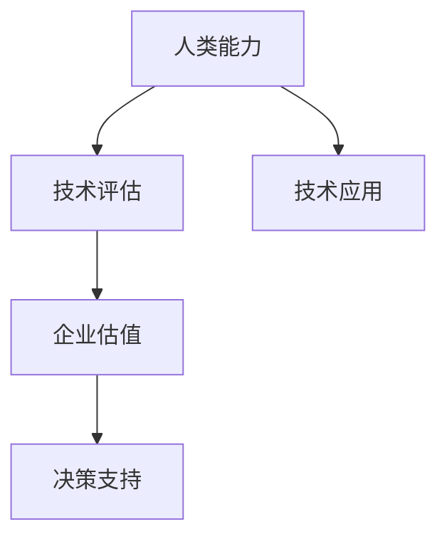
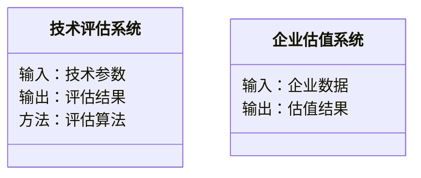
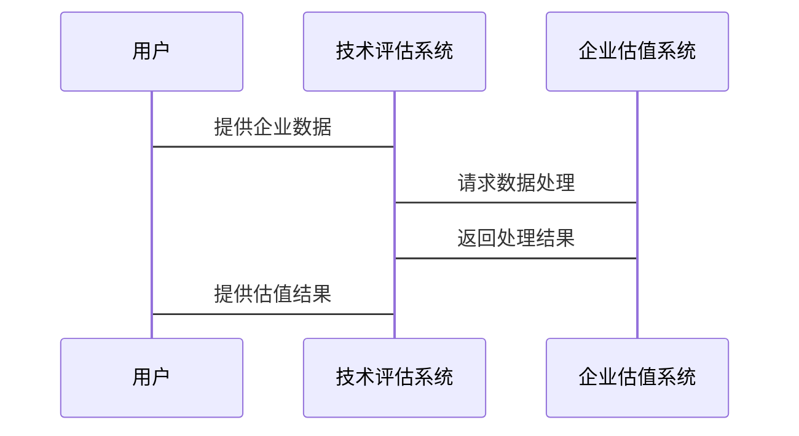

                 


# 企业估值中的增强人类能力技术评估

## 关键词：
- 企业估值、技术评估、人类能力、增强技术、评估系统

## 摘要：
本文详细探讨了在企业估值过程中，如何利用技术手段增强人类能力，以提高评估的准确性和效率。通过分析技术评估的核心原理、算法模型和系统架构，结合实际案例，展示了如何将技术评估应用于企业估值，并提出了最佳实践和未来发展方向。

---

# 第一部分：企业估值中的增强人类能力技术评估背景介绍

## 第1章：问题背景与描述

### 1.1 企业估值的传统方法与挑战
- **传统估值方法的局限性**：如DCF模型和市盈率法，依赖大量假设，主观性强，耗时长，容易受人为误差影响。
- **人工评估的低效性与误差**：人类能力有限，难以处理复杂数据和多维度分析，导致评估结果可能不准确。
- **技术评估在现代企业估值中的作用**：通过技术手段，如机器学习和大数据分析，提升评估的客观性和效率。

### 1.2 增强人类能力技术的定义与范围
- **技术增强能力的定义**：利用技术工具和算法，增强人类在数据处理、分析和决策方面的能力。
- **技术评估的范围与边界**：涵盖数据收集、分析、预测和优化，但不涉及企业的具体业务策略。
- **人类能力与技术的结合方式**：通过技术工具辅助，提升人类在估值中的分析能力，而非完全替代人类。

### 1.3 问题解决与应用前景
- **技术评估如何解决传统估值问题**：通过自动化数据处理和高级算法，减少人为误差，提高评估效率。
- **技术评估的潜在应用场景**：适用于复杂企业或大规模数据的估值，特别是在高风险和不确定环境下的决策支持。
- **技术评估的未来发展趋势**：随着AI和大数据技术的发展，技术评估将更加智能化和实时化。

### 1.4 核心概念结构与核心要素
- **技术评估的核心要素**：数据源、分析模型、算法工具、评估标准。
- **人类能力与技术的交互关系**：技术作为辅助工具，增强人类的分析能力，而人类负责模型的选择和结果的解读。
- **企业估值中的技术评估框架**：包括数据采集、模型构建、评估执行和结果分析四个阶段。

---

## 第2章：核心概念与联系

### 2.1 技术评估的核心原理
- **技术评估的基本原理**：通过技术工具，对企业的财务数据、市场数据和行业数据进行分析，生成评估结果。
- **技术与人类能力的相互作用**：技术工具提供数据支持和计算能力，人类负责模型设计和结果解释。

### 2.2 核心概念对比分析
- **技术评估与传统估值方法的对比**：
| 对比维度 | 技术评估 | 传统估值 |
|----------|----------|-----------|
| 数据处理 | 高效、自动化 | 低效、依赖人工 |
| 分析深度 | 深度、多维度 | 单一、有限 |
| 精确度 | 高 | 中等 |
- **人类能力与技术的对比分析**：
| 对比维度 | 人类能力 | 技术能力 |
|----------|----------|-----------|
| 数据处理速度 | 较慢 | 快 |
| 分析深度 | 较浅 | 深 |
| 精确度 | 中等 | 高 |
- **不同技术评估方法的优缺点**：
| 方法 | 优点 | 缺点 |
|------|------|------|
| 机器学习 | 高精度、适应性强 | 需大量数据，复杂难懂 |
| 数据挖掘 | 发现隐藏模式 | �易受数据质量影响 |
| 统计分析 | 简单明了 | 适合简单问题 |

### 2.3 实体关系图


---

## 第3章：算法原理与数学模型

### 3.1 技术评估的数学模型
- **技术评估的基本公式**：
$$ V = f(T, H) $$
其中，$V$是估值，$T$是技术因素，$H$是人类能力因素。

- **机器学习模型**：
$$ f(T, H) = \text{预测值} $$
通过训练数据，模型学习技术因素和技术与人类能力的交互作用，生成估值。

### 3.2 概率论与统计学应用
- **技术评估的概率模型**：
$$ P(V | T, H) $$
表示在技术因素$T$和人类能力$H$下，估值$V$的概率分布。
- **统计分析在技术评估中的应用**：
使用回归分析预测企业价值，如多元线性回归模型：
$$ V = \beta_0 + \beta_1 T_1 + \beta_2 T_2 + \epsilon $$
其中，$\beta_i$是回归系数，$\epsilon$是误差项。

### 3.3 优化算法
- **线性规划在技术评估中的应用**：
最大化企业价值，约束条件包括技术限制和人类能力限制。
$$ \max \text{Value} = aT + bH $$
- **遗传算法在技术评估中的应用**：
通过基因编码技术因素，进行适应度评估，选择最优解。

---

## 第4章：系统分析与架构设计

### 4.1 问题场景分析
- **技术评估系统的功能需求**：
    - 数据采集：收集企业财务数据和市场数据。
    - 数据处理：清洗和预处理数据。
    - 模型构建：训练机器学习模型。
    - 评估执行：生成估值结果。
- **企业估值中的技术评估场景**：
    - 高管决策支持：提供准确的估值结果。
    - 投资决策：帮助投资者评估企业价值。
- **系统的输入输出分析**：
    - 输入：企业数据、市场数据。
    - 输出：估值结果、决策建议。

### 4.2 系统功能设计
- **领域模型设计**：


### 4.3 系统架构设计


### 4.4 系统交互设计
- **交互流程**：


---

## 第5章：项目实战

### 5.1 环境安装与数据准备
- **环境安装**：
    - 安装Python、机器学习库（如scikit-learn、TensorFlow）。
    - 安装数据分析工具（如Pandas、NumPy）。
- **数据准备**：
    - 收集企业的财务数据、市场数据和行业数据。

### 5.2 核心代码实现
```python
import pandas as pd
from sklearn.linear_model import LinearRegression

# 数据加载
data = pd.read_csv('企业数据.csv')

# 特征选择
features = data[['营收', '净利润', '行业平均']]
target = data['企业价值']

# 模型训练
model = LinearRegression()
model.fit(features, target)

# 估值预测
new_data = pd.DataFrame({'营收': [预测营收], '净利润': [预测净利润], '行业平均': [行业平均]})
predicted_value = model.predict(new_data)
print('预测企业价值:', predicted_value[0])
```

### 5.3 实际案例分析
- **案例分析**：
    - 某科技公司，营收增长迅速，但净利润较低，行业平均市盈率高。
    - 使用机器学习模型预测其估值，结果为高于行业平均水平。

### 5.4 代码解读与分析
- **代码解读**：
    - 使用线性回归模型，基于营收、净利润和行业平均市盈率预测企业价值。
- **结果分析**：
    - 预测结果需结合行业趋势和市场环境进行调整，模型结果仅作为参考。

---

## 第6章：总结与展望

### 6.1 最佳实践 tips
- **数据质量**：确保数据的准确性和完整性。
- **模型选择**：根据具体情况选择合适的算法。
- **结果验证**：结合行业知识验证模型的准确性。

### 6.2 小结
技术评估在企业估值中的应用显著提高了评估的准确性和效率，但其成功依赖于高质量的数据和有效的模型选择。

### 6.3 注意事项
- 避免过度依赖技术，忽视人类判断。
- 定期更新模型，适应市场变化。

### 6.4 拓展阅读
- 推荐阅读《机器学习实战》和《企业估值分析》。

---

# 结语
通过技术增强能力，企业估值过程更加高效和准确。未来，随着技术的进步，技术评估将在更多领域发挥重要作用。

