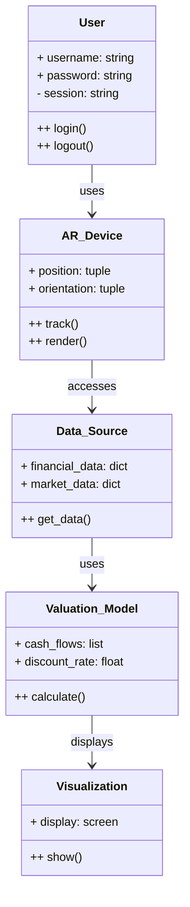
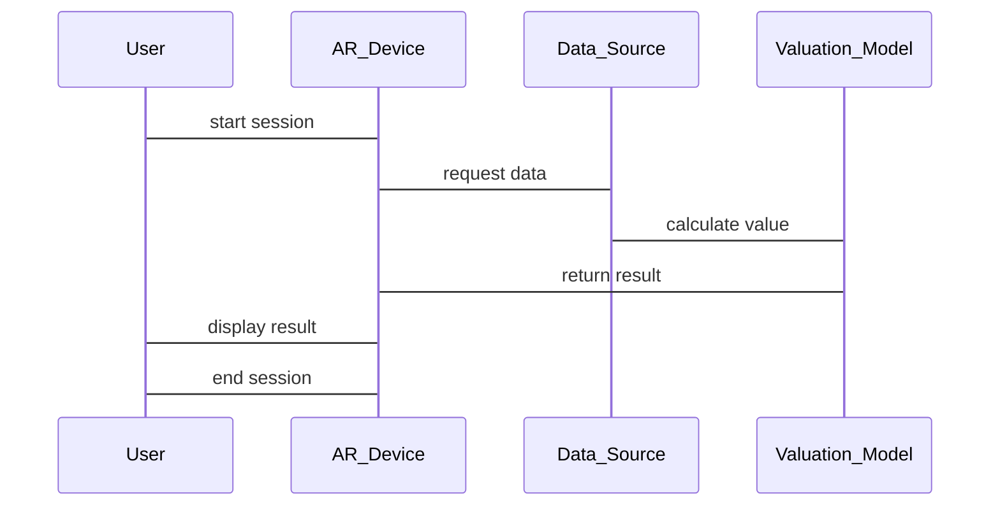

                 


# 《企业估值中的增强现实应用评估》

> 关键词：企业估值，增强现实，AR技术，估值模型，可视化分析，技术应用

> 摘要：本文深入探讨了增强现实（AR）技术在企业估值中的应用，分析了其在提升估值效率、准确性和可视化效果方面的优势。文章从AR的基本概念、企业估值的核心要素出发，详细阐述了AR在估值中的核心算法原理、系统架构设计，以及实际项目中的应用案例。通过理论与实践相结合的方式，为读者提供了全面的视角，展示了如何利用AR技术优化企业估值流程。

---

# 第一部分：增强现实与企业估值基础

## 第1章：增强现实与企业估值概述

### 1.1 增强现实的基本概念

#### 1.1.1 增强现实的定义与技术原理
增强现实（Augmented Reality, AR）是一种将数字信息叠加在物理世界上的技术，通过摄像头、传感器和算法，将虚拟内容与真实环境进行实时交互和融合。AR的核心技术包括图像识别、定位跟踪、三维建模和实时渲染。

#### 1.1.2 增强现实的核心特征
- **实时性**：AR需要实时捕捉环境数据并进行处理。
- **交互性**：用户可以通过手势、语音等方式与AR内容互动。
- **沉浸性**：AR通过叠加虚拟内容，增强用户的沉浸感。
- **精准性**：AR需要高精度的定位和跟踪技术。

#### 1.1.3 增强现实与虚拟现实的区别
- **虚拟现实（VR）**：完全沉浸于虚拟环境，脱离现实世界。
- **增强现实（AR）**：在现实环境中叠加虚拟内容，保持与现实世界的联系。

### 1.2 企业估值的基本概念

#### 1.2.1 企业估值的定义与方法
企业估值是通过对企业的财务数据、市场表现、行业地位等因素进行分析，估算其市场价值的过程。常用方法包括DCF模型、市盈率法、市净率法等。

#### 1.2.2 企业估值的核心要素
- **财务数据**：收入、利润、现金流等。
- **市场环境**：行业趋势、竞争状况、宏观经济因素。
- **企业特质**：品牌价值、管理团队、技术创新能力。

#### 1.2.3 企业估值的传统应用场景
- **并购交易**：评估目标企业价值。
- **投资决策**：帮助投资者评估投资标的的价值。
- **融资活动**：企业融资时的估值依据。

### 1.3 增强现实在企业估值中的应用背景

#### 1.3.1 企业估值中的痛点与挑战
- **数据复杂性**：企业估值涉及大量数据，传统方法处理效率低。
- **信息不对称**：投资者和企业之间的信息传递不充分。
- **可视化不足**：传统估值方法难以直观展示企业价值。

#### 1.3.2 增强现实如何解决估值问题
- **数据可视化**：通过AR技术，将复杂的财务数据转化为直观的3D模型或动态图表。
- **实时交互**：用户可以通过AR设备实时查看企业数据的变化情况，提升估值的互动性和实时性。
- **沉浸式体验**：AR技术能够提供沉浸式的估值环境，帮助用户更好地理解和分析数据。

#### 1.3.3 增强现实与企业估值的结合场景
- **企业财务数据可视化**：将企业的财务数据以3D形式呈现，帮助用户更好地理解数据。
- **实时市场分析**：通过AR技术，实时显示市场波动对企业估值的影响。
- **虚拟路演**：企业可以通过AR技术进行虚拟路演，向投资者展示企业的价值。

## 1.4 本章小结
本章从增强现实的基本概念出发，详细介绍了企业估值的核心要素和传统应用场景。同时，分析了AR技术在企业估值中的应用背景及其优势，为后续章节的深入探讨奠定了基础。

---

## 第2章：增强现实与企业估值的核心概念

### 2.1 增强现实的核心概念与原理

#### 2.1.1 增强现实的实现技术
- **图像识别**：通过摄像头捕捉环境图像，识别特定目标。
- **定位跟踪**：利用传感器和算法，确定设备在空间中的位置和姿态。
- **三维建模**：将虚拟物体建模为三维物体，与现实环境无缝融合。
- **实时渲染**：通过高性能图形处理，实现虚拟内容的实时叠加。

#### 2.1.2 增强现实的感知与交互机制
- **视觉感知**：通过摄像头捕捉环境信息，识别用户视线方向。
- **手势交互**：用户可以通过手势操作虚拟物体。
- **语音交互**：通过语音指令控制AR设备。

#### 2.1.3 增强现实的计算与渲染流程
1. **数据采集**：通过摄像头和传感器获取环境数据。
2. **目标识别**：识别环境中特定目标（如桌子、墙壁）。
3. **虚拟内容生成**：根据目标位置生成虚拟内容。
4. **渲染与叠加**：将虚拟内容与现实环境实时叠加，呈现给用户。

#### 2.1.4 增强现实的性能优化
- **算法优化**：通过优化目标识别和跟踪算法，提升AR的运行效率。
- **硬件加速**：利用高性能GPU进行实时渲染。

### 2.2 企业估值的核心概念与模型

#### 2.2.1 企业估值的主要方法
- **DCF模型**：通过现金流折现法估算企业价值。
- **市盈率法**：基于市盈率倍数进行估值。
- **市净率法**：基于市净率倍数进行估值。

#### 2.2.2 企业估值的关键指标
- **收入增长率**：企业收入的增长速度。
- **净利润率**：企业净利润与收入的比例。
- **自由现金流**：企业产生的自由现金流。

#### 2.2.3 企业估值的数学模型
$$ 企业价值 = 现金流 \times 折现率 $$

### 2.3 增强现实与企业估值的关联性分析

#### 2.3.1 增强现实如何提升企业估值的准确性
- **数据可视化**：通过AR技术，将复杂的财务数据转化为直观的3D模型或动态图表，帮助用户更好地理解数据。
- **实时更新**：AR技术可以实时更新企业数据，确保估值结果的准确性。
- **多维度分析**：AR技术可以同时展示企业的财务、市场和行业数据，提供多维度的分析视角。

#### 2.3.2 增强现实如何优化企业估值的效率
- **减少数据处理时间**：通过AR技术，可以快速处理大量数据，提高估值效率。
- **简化操作流程**：用户可以通过AR设备进行操作，减少传统估值中的繁琐步骤。
- **提升用户参与度**：通过AR技术，用户可以更直观地参与估值过程，提高效率。

#### 2.3.3 增强现实如何增强企业估值的可视化效果
- **三维模型展示**：通过AR技术，将企业的财务数据转化为三维模型，帮助用户更好地理解。
- **动态图表展示**：通过AR技术，实时展示企业的财务数据变化情况。
- **虚拟场景交互**：用户可以通过AR设备与虚拟场景进行交互，提升用户体验。

## 2.4 本章小结
本章详细阐述了增强现实的核心概念与技术原理，并分析了其与企业估值的关联性。通过对比传统估值方法，展示了AR技术在提升估值效率、准确性和可视化效果方面的优势。

---

## 第3章：增强现实与企业估值的核心算法原理

### 3.1 增强现实的核心算法

#### 3.1.1 增强现实的图像识别算法
图像识别是AR技术的核心算法之一，主要通过以下步骤实现：
1. **图像采集**：通过摄像头获取环境图像。
2. **特征提取**：从图像中提取特征点。
3. **目标识别**：通过特征匹配，识别目标物体。
4. **图像校正**：对图像进行几何校正，确保虚拟内容与现实环境对齐。

#### 3.1.2 增强现实的定位跟踪算法
定位跟踪是AR技术的关键算法，主要通过以下步骤实现：
1. **传感器数据采集**：获取设备的位置和姿态数据。
2. **特征匹配**：通过特征点匹配，确定设备在空间中的位置。
3. **姿态估计**：通过优化算法，计算设备的姿态。
4. **实时跟踪**：通过不断更新位置和姿态，实现实时跟踪。

#### 3.1.3 增强现实的三维建模算法
三维建模是AR技术的重要算法，主要通过以下步骤实现：
1. **数据采集**：通过多角度拍摄目标物体，获取三维数据。
2. **点云生成**：将采集的数据转换为点云。
3. **表面重建**：通过算法重建物体的表面。
4. **模型优化**：对模型进行优化，提升渲染效果。

### 3.2 企业估值的核心算法

#### 3.2.1 企业估值的现金流折现算法
现金流折现法（DCF模型）是企业估值的核心算法之一，其公式为：
$$ 企业价值 = \sum_{t=1}^{n} \frac{CF_t}{(1 + r)^t} $$
其中，$CF_t$ 表示第t年的自由现金流，$r$ 表示折现率。

#### 3.2.2 企业估值的市场倍数法
市场倍数法是另一种常用的企业估值方法，其公式为：
$$ 企业价值 = 市盈率 \times 净利润 $$

#### 3.2.3 增强现实与企业估值的算法结合
- **数据融合**：通过AR技术，将企业的财务数据与市场数据进行融合，提升估值的准确性。
- **实时计算**：通过AR技术，实时计算企业的估值变化，提供动态的估值结果。
- **可视化展示**：通过AR技术，将企业的估值结果以三维模型或动态图表的形式展示给用户。

### 3.3 增强现实与企业估值的算法实现

#### 3.3.1 算法实现步骤
1. **数据采集**：获取企业的财务数据和市场数据。
2. **数据处理**：对数据进行清洗和预处理。
3. **模型训练**：通过机器学习算法训练估值模型。
4. **实时渲染**：将虚拟内容与现实环境进行实时叠加，展示估值结果。

#### 3.3.2 算法实现代码
以下是一个简单的现金流折现算法的Python代码示例：

```python
import numpy as np

def discounted_cash_flow(cash_flows, discount_rate):
    n = len(cash_flows)
    present_value = 0
    for t in range(n):
        present_value += cash_flows[t] / (1 + discount_rate) ** t
    return present_value

# 示例数据
cash_flows = [100, 200, 300]
discount_rate = 0.1

# 计算现值
present_value = discounted_cash_flow(cash_flows, discount_rate)
print("现值:", present_value)
```

#### 3.3.3 算法实现的数学模型
$$ 现值 = \sum_{t=1}^{n} \frac{CF_t}{(1 + r)^t} $$

---

## 第4章：系统分析与架构设计

### 4.1 问题场景介绍
本章将从企业估值的实际应用场景出发，设计一个基于AR技术的企业估值系统。该系统能够实时展示企业的财务数据和市场数据，帮助用户更好地理解和分析企业价值。

### 4.2 系统功能设计

#### 4.2.1 领域模型设计
以下是一个简单的领域模型类图，展示了系统的核心模块及其关系：



#### 4.2.2 系统架构设计
以下是一个基于分层架构的设计：


#### 4.2.3 系统接口设计
以下是系统的主要接口及其交互流程：



### 4.3 本章小结
本章通过设计一个基于AR技术的企业估值系统，展示了AR技术在企业估值中的实际应用。通过领域模型和系统架构图，明确了系统的各个模块及其关系，为后续的实现提供了清晰的指导。

---

## 第5章：项目实战

### 5.1 环境安装与配置

#### 5.1.1 系统要求
- **操作系统**：Windows 10或更高版本，macOS 10.15或更高版本，Linux（推荐Ubuntu）
- **硬件要求**：支持AR的设备（如智能手机、平板电脑、AR眼镜）
- **软件要求**：安装Python 3.8或更高版本，安装必要的库（如NumPy、OpenCV、PyTorch）

#### 5.1.2 安装依赖库
```bash
pip install numpy opencv-python matplotlib scikit-learn
```

### 5.2 系统核心实现

#### 5.2.1 AR设备的定位与跟踪
以下是一个简单的AR设备定位算法的Python代码示例：

```python
import cv2
import numpy as np

def ar_tracking(image):
    # 图像处理
    gray = cv2.cvtColor(image, cv2.COLOR_BGR2GRAY)
    # 特征检测
    corners = cv2.findChessboardCorners(gray, (6, 9), None)
    return corners

# 示例图像
image = cv2.imread('test.jpg')
corners = ar_tracking(image)
print("检测到的角点数量:", len(corners))
```

#### 5.2.2 数据可视化与渲染
以下是一个简单的三维数据可视化代码示例：

```python
import matplotlib.pyplot as plt
from mpl_toolkits.mplot3d import Axes3D

fig = plt.figure()
ax = fig.add_subplot(111, projection='3d')

# 生成数据
x = np.random.rand(100)
y = np.random.rand(100)
z = np.random.rand(100)

# 绘制三维散点图
ax.scatter(x, y, z, c='r', marker='o')
ax.set_xlabel('X')
ax.set_ylabel('Y')
ax.set_zlabel('Z')
plt.show()
```

#### 5.2.3 企业估值的实时计算
以下是一个简单的现金流折现算法的Python代码示例：

```python
def discounted_cash_flow(cash_flows, discount_rate):
    n = len(cash_flows)
    present_value = 0
    for t in range(n):
        present_value += cash_flows[t] / (1 + discount_rate) ** t
    return present_value

# 示例数据
cash_flows = [100, 200, 300]
discount_rate = 0.1

# 计算现值
present_value = discounted_cash_flow(cash_flows, discount_rate)
print("现值:", present_value)
```

### 5.3 项目实战小结
本章通过实际项目案例，展示了如何将AR技术应用于企业估值。通过环境安装、核心代码实现和实际案例分析，帮助读者更好地理解AR技术在企业估值中的具体应用。

---

## 第6章：最佳实践与注意事项

### 6.1 最佳实践

#### 6.1.1 小结
通过本章的分析，我们总结了AR技术在企业估值中的优势和应用场景，同时提出了实际操作中的注意事项。

#### 6.1.2 注意事项
- **数据准确性**：确保企业的财务数据准确无误。
- **设备兼容性**：选择合适的AR设备，确保系统兼容性。
- **用户培训**：对用户进行充分的培训，确保其能够正确使用AR设备。

#### 6.1.3 拓展阅读
- **推荐书籍**：《增强现实技术与应用》
- **推荐论文**：《基于增强现实的企业估值方法研究》

### 6.2 本章小结
本章从实际操作的角度，提出了AR技术在企业估值中的最佳实践和注意事项，同时提供了相关的拓展阅读资料，帮助读者进一步深入学习。

---

## 第7章：总结与展望

### 7.1 本章总结
通过本文的深入探讨，我们展示了AR技术在企业估值中的巨大潜力。从AR的基本概念到系统架构设计，再到实际项目实现，全面分析了AR技术在提升企业估值效率、准确性和可视化效果方面的优势。

### 7.2 未来展望
随着AR技术的不断发展，其在企业估值中的应用将更加广泛。未来的研究方向包括：
- **实时计算优化**：进一步提升AR设备的计算效率。
- **数据融合技术**：研究如何更好地融合企业内外部数据。
- **用户体验优化**：通过优化交互设计，提升用户的使用体验。

---

# 《企业估值中的增强现实应用评估》结语

本文通过理论与实践相结合的方式，全面探讨了AR技术在企业估值中的应用。从AR的基本概念到系统架构设计，再到实际项目实现，展示了AR技术在提升企业估值效率、准确性和可视化效果方面的巨大潜力。未来，随着AR技术的不断发展，其在企业估值中的应用将更加广泛和深入。

---

**注**：本文内容基于理论分析与实践探索，实际应用中需结合具体场景和需求进行调整。

