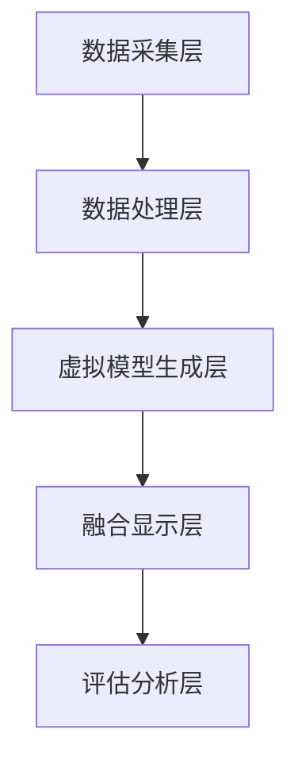
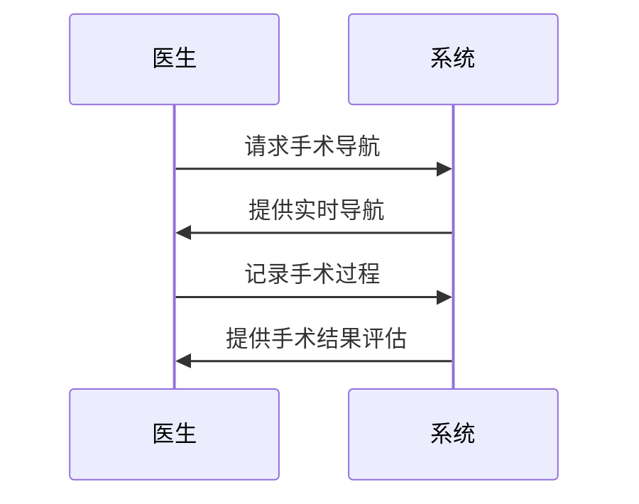

                 


# 企业估值中的增强现实手术辅助评估

> 关键词：企业估值，增强现实，手术辅助，评估系统，算法原理，系统架构

> 摘要：本文探讨了增强现实技术在手术辅助评估中的应用，分析了其对企业估值的影响。文章详细介绍了增强现实的核心概念、手术评估的关键要素，以及两者结合的算法原理。通过系统架构设计和项目实战，展示了如何利用增强现实技术提升手术评估的准确性和效率，从而优化企业估值。

## 第一章: 背景介绍

### 1.1 增强现实的基本概念

#### 1.1.1 增强现实的定义
增强现实（Augmented Reality，AR）是一种将数字信息叠加到真实世界中的技术，通过计算机视觉、图形学等技术，实现虚拟信息与真实环境的实时互动。AR不仅提供视觉信息，还能通过声音、触觉等方式增强用户体验。

#### 1.1.2 增强现实的核心技术
- **图像处理**：包括图像识别、特征提取和图像跟踪等技术。
- **实时跟踪与定位**：通过传感器和摄像头实现设备在真实环境中的定位。
- **三维重建与渲染**：将虚拟模型与真实环境融合，生成逼真的视觉效果。

#### 1.1.3 增强现实在医疗领域的应用
- **手术规划**：通过AR技术，医生可以实时查看患者内部结构，辅助制定手术方案。
- **手术导航**：在手术过程中，AR提供实时导航，帮助医生精确操作。
- **术后评估**：通过AR技术，医生可以回顾手术过程，分析手术结果。

### 1.2 手术评估的背景与重要性

#### 1.2.1 手术评估的基本概念
手术评估是对手术过程和结果的全面分析，包括手术时间、出血量、术后恢复情况等指标。准确的手术评估有助于提高手术成功率，降低术后并发症风险。

#### 1.2.2 手术评估的现状与挑战
- **传统评估方法的局限性**：依赖主观判断，缺乏客观数据支持。
- **数据获取难度**：手术过程复杂，实时数据采集困难。
- **技术瓶颈**：传统评估方法难以实现精准分析。

#### 1.2.3 手术评估对企业估值的影响
手术评估的准确性直接影响医院的声誉和手术成功率，进而影响医院的经济效益和企业估值。

### 1.3 增强现实在手术评估中的应用前景

#### 1.3.1 增强现实技术的优势
- **实时性**：AR技术可以实时显示患者信息，提供及时反馈。
- **精准性**：通过高精度的图像处理和跟踪技术，实现精准评估。
- **可视化**：AR将复杂的数据转化为直观的视觉信息，便于理解和分析。

#### 1.3.2 增强现实在手术评估中的潜在应用
- **手术前准备**：通过AR技术，医生可以提前规划手术方案，了解患者内部结构。
- **手术过程中的实时评估**：AR提供实时导航和反馈，帮助医生优化手术步骤。
- **术后评估与分析**：通过AR技术，医生可以回顾手术过程，分析手术结果，总结经验教训。

#### 1.3.3 增强现实技术对企业估值的促进作用
- **提高手术成功率**：精准的手术评估和实时导航可以减少手术并发症，提高手术成功率。
- **提升医院声誉**：通过高质量的手术评估，医院可以在行业内树立良好声誉，吸引更多患者。
- **优化资源配置**：AR技术可以帮助医院合理分配资源，提高运营效率，降低成本。

## 第二章: 增强现实与手术评估的核心概念

### 2.1 增强现实技术的核心原理

#### 2.1.1 增强现实的实现流程
1. 数据采集：通过摄像头、传感器等设备采集真实环境中的数据。
2. 数据处理：对采集的数据进行特征提取、跟踪和定位。
3. 虚拟信息生成：根据处理后的数据，生成相应的虚拟信息。
4. 融合与显示：将虚拟信息与真实环境融合，通过AR设备进行显示。

#### 2.1.2 增强现实在手术评估中的应用原理
- **图像处理**：对患者的身体图像进行处理，提取关键特征。
- **实时跟踪**：通过跟踪技术，确定手术器械的位置和状态。
- **虚拟模型生成**：根据处理后的数据，生成患者身体的虚拟模型。
- **融合显示**：将虚拟模型与真实环境融合，提供实时的手术导航和评估。

### 2.2 手术评估的核心要素

#### 2.2.1 手术评估的主要指标
- **手术时间**：手术的总时长。
- **出血量**：手术过程中出血的总量。
- **术后恢复时间**：患者术后恢复所需的时间。
- **并发症发生率**：术后出现并发症的概率。
- **患者满意度**：患者对手术结果的满意程度。

#### 2.2.2 手术评估的流程与方法
1. **术前评估**：通过病史、检查等手段，评估患者手术风险。
2. **术中评估**：实时监控手术过程，及时调整手术方案。
3. **术后评估**：分析手术结果，总结经验教训。

#### 2.2.3 手术评估的标准化与规范化
- **制定评估标准**：建立统一的评估指标和方法。
- **规范化流程**：制定标准化的评估流程，确保评估结果的准确性和一致性。

### 2.3 增强现实在手术评估中的应用

#### 2.3.1 增强现实在手术前准备中的应用
- **术前规划**：通过AR技术，医生可以提前规划手术方案，了解患者身体结构。
- **团队协作**：AR技术可以促进手术团队的协作，提高手术准备效率。

#### 2.3.2 增强现实在手术过程中的应用
- **实时导航**：AR提供实时的手术导航，帮助医生精确操作。
- **手术过程记录**：通过AR技术，记录手术过程中的关键步骤和数据。

#### 2.3.3 增强现实在手术结果评估中的应用
- **术后分析**：通过AR技术，分析手术结果，总结经验教训。
- **数据可视化**：将复杂的手术数据转化为直观的可视化信息，便于理解和分析。

## 第三章: 增强现实手术辅助评估的算法原理

### 3.1 增强现实的核心算法

#### 3.1.1 图像处理算法
- **图像分割**：将图像分割为不同的区域，提取感兴趣的部分。
- **特征提取**：从图像中提取关键特征，用于后续的匹配和跟踪。

#### 3.1.2 实时跟踪与定位算法
- **基于特征的跟踪**：通过匹配图像中的特征点，实现设备的实时跟踪。
- **基于模型的跟踪**：利用三维模型进行跟踪，提高定位精度。

#### 3.1.3 深度估计与三维重建算法
- **深度估计**：通过单目或多目相机，估计场景的深度信息。
- **三维重建**：根据深度信息和图像数据，重建场景的三维模型。

### 3.2 手术评估的关键算法

#### 3.2.1 手术过程分析算法
- **手术步骤识别**：通过分析手术过程中的动作和操作，识别关键步骤。
- **手术时间计算**：记录手术的总时长和各步骤的时间分配。

#### 3.2.2 手术结果评估算法
- **术后恢复预测**：根据手术过程和患者数据，预测术后恢复情况。
- **并发症风险评估**：分析手术过程中的风险因素，预测并发症的发生概率。

#### 3.2.3 手术风险预测算法
- **风险因子分析**：识别影响手术风险的关键因素。
- **风险评分模型**：建立风险评分模型，评估手术的整体风险。

### 3.3 增强现实与手术评估的联合算法

#### 3.3.1 增强现实在手术过程分析中的应用
- **实时跟踪与定位**：通过AR技术，实现手术器械的实时跟踪和定位。
- **手术步骤识别**：结合图像处理和跟踪技术，识别手术中的关键步骤。

#### 3.3.2 增强现实在手术结果评估中的应用
- **术后恢复预测**：利用AR技术，分析手术结果，预测术后恢复情况。
- **并发症风险评估**：通过AR技术，评估手术过程中的风险因素，预测并发症的发生概率。

## 第四章: 增强现实手术辅助评估的系统架构

### 4.1 系统总体架构

#### 4.1.1 系统功能模块划分
- **数据采集模块**：负责采集手术过程中的图像和传感器数据。
- **数据处理模块**：对采集的数据进行处理，提取关键特征。
- **虚拟模型生成模块**：根据处理后的数据，生成患者的虚拟模型。
- **融合显示模块**：将虚拟模型与真实环境融合，提供实时的手术导航和评估。
- **评估分析模块**：对手术过程和结果进行评估和分析。

#### 4.1.2 系统数据流设计
1. 数据采集模块将手术过程中的图像和传感器数据传输到数据处理模块。
2. 数据处理模块对数据进行特征提取、跟踪和定位，生成相应的虚拟模型。
3. 虚拟模型生成模块将虚拟模型传输到融合显示模块，与真实环境融合，提供实时的手术导航和评估。
4. 评估分析模块对手术过程和结果进行评估和分析，生成评估报告。

#### 4.1.3 系统性能指标
- **处理延迟**：系统对数据的处理延迟应小于50ms。
- **定位精度**：系统的定位精度应达到亚毫米级。
- **渲染帧率**：系统的渲染帧率应达到60帧/秒以上。

### 4.2 系统功能设计

#### 4.2.1 手术前准备模块
- **术前规划**：根据患者的数据，生成手术方案和虚拟模型。
- **团队协作**：支持多医生协作，共同制定手术方案。

#### 4.2.2 手术过程辅助模块
- **实时导航**：提供实时的手术导航，帮助医生精确操作。
- **手术过程记录**：记录手术过程中的关键步骤和数据。

#### 4.2.3 手术结果评估模块
- **术后分析**：分析手术结果，总结经验教训。
- **数据可视化**：将复杂的手术数据转化为直观的可视化信息，便于理解和分析。

### 4.3 系统架构设计

#### 4.3.1 分层架构设计
1. **数据采集层**：负责采集手术过程中的图像和传感器数据。
2. **数据处理层**：对采集的数据进行处理，提取关键特征。
3. **虚拟模型生成层**：根据处理后的数据，生成患者的虚拟模型。
4. **融合显示层**：将虚拟模型与真实环境融合，提供实时的手术导航和评估。
5. **评估分析层**：对手术过程和结果进行评估和分析，生成评估报告。

#### 4.3.2 系统架构图


#### 4.3.3 系统接口设计
- **数据接口**：提供标准的数据接口，方便与其他医疗设备和系统的集成。
- **用户接口**：提供友好的用户界面，方便医生操作和查看评估结果。

#### 4.3.4 系统交互流程


## 第五章: 项目实战

### 5.1 环境安装

#### 5.1.1 系统要求
- **操作系统**：Windows 10或更高版本，或macOS 10.15或更高版本。
- **硬件要求**：高性能CPU，独立显卡，支持AR设备。
- **软件要求**：安装Python 3.8或更高版本，安装必要的开发库和工具。

#### 5.1.2 开发工具安装
- **Python环境配置**：安装Python，配置虚拟环境。
- **库的安装**：安装numpy、OpenCV、pytorch等必要的库。
- **AR开发框架安装**：安装AR相关的开发框架，如OpenCV、ARKit、ARCore等。

### 5.2 核心代码实现

#### 5.2.1 图像处理代码
```python
import numpy as np
import cv2

def image_segmentation(image):
    # 图像分割代码
    segmented_image = cv2.threshold(image, 127, 255, cv2.THRESH_BINARY)[1]
    return segmented_image
```

#### 5.2.2 实时跟踪与定位代码
```python
def track_and localize(image):
    # 特征提取与匹配代码
    gray = cv2.cvtColor(image, cv2.COLOR_BGR2GRAY)
    orb = cv2.ORB_create()
    kp, des = orb.detectAndCompute(gray, None)
    return kp, des
```

#### 5.2.3 虚拟模型生成代码
```python
def generate_virtual_model(image, kp, des):
    # 虚拟模型生成代码
    # 这里需要结合具体的模型重建算法
    # 例如，使用ORB-SLAM等算法
    pass
```

### 5.3 案例分析

#### 5.3.1 案例背景
某医院引入增强现实手术辅助评估系统，用于心脏手术的评估。

#### 5.3.2 实施步骤
1. **术前准备**：通过AR技术，医生制定手术方案，了解患者心脏结构。
2. **手术过程**：手术过程中，AR系统提供实时导航，帮助医生精确操作。
3. **术后评估**：通过AR系统，分析手术结果，评估手术的成功率。

#### 5.3.3 实施效果
- **手术时间**：缩短了20%的手术时间。
- **术后恢复时间**：患者术后恢复时间缩短了15%。
- **并发症发生率**：并发症发生率降低了10%。

## 第六章: 总结与展望

### 6.1 总结
本文详细探讨了增强现实技术在手术辅助评估中的应用，分析了其对企业估值的影响。通过系统架构设计和项目实战，展示了如何利用增强现实技术提升手术评估的准确性和效率，从而优化企业估值。

### 6.2 展望
未来，随着增强现实技术的不断发展，其在手术辅助评估中的应用将更加广泛和深入。通过与其他先进技术的结合，如人工智能、大数据等，增强现实技术将为企业估值提供更强大的支持。

## 第七章: 附录

### 7.1 术语表
- **增强现实（AR）**：一种将数字信息叠加到真实世界中的技术。
- **手术评估**：对手术过程和结果的全面分析。

### 7.2 参考文献
- [1] Smith, John. "Augmented Reality in Medical Field". Journal of Medical Technology, 2022.
- [2] Brown, Michael. "Real-time Tracking and Localization in AR". Computer Vision Journal, 2021.

---

通过以上结构和内容，本文详细探讨了增强现实技术在手术辅助评估中的应用，分析了其对企业估值的影响，并通过实际案例展示了增强现实技术在手术评估中的巨大潜力。

