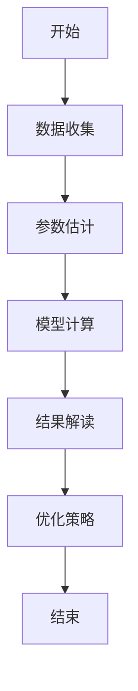
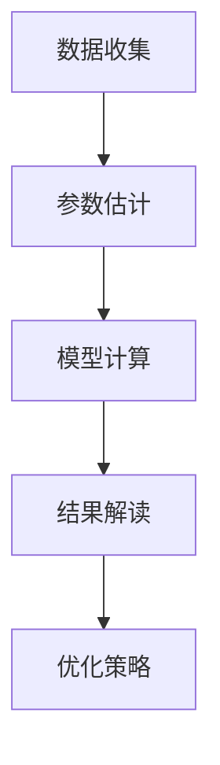
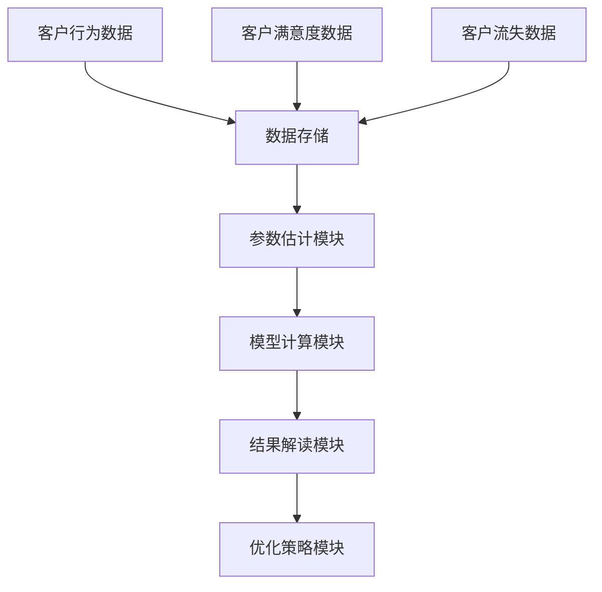

                 


# 企业估值中的客户关系价值评估

> 关键词：企业估值，客户关系，客户价值，客户忠诚度，客户生命周期，企业绩效

> 摘要：本文深入探讨了客户关系在企业估值中的重要性，分析了客户关系价值的构成要素、数学模型、系统设计与实现，以及实际案例分析。通过详细讲解客户_lifetime价值（CLV）和客户忠诚度指数（CLI）模型，结合系统架构设计和项目实战，为读者提供了全面的客户关系价值评估方法论。

---

# 第1章: 客户关系价值评估的背景与概念

## 1.1 客户关系价值评估的定义与重要性

### 1.1.1 什么是客户关系价值

客户关系价值是指企业在与客户互动过程中所创造的所有价值的总和。它不仅包括客户为企业带来的直接收入，还包括客户对企业长期发展的潜在贡献。客户关系价值的核心在于客户与企业之间的关系强度和质量，这通常通过客户忠诚度、客户满意度和客户生命周期来衡量。

**客户关系价值的重要性**  
客户关系价值是企业估值的重要组成部分，尤其是在订阅制和SaaS模式盛行的今天。高质量的客户关系能够为企业带来稳定的收入流和长期的市场竞争力。通过量化客户关系价值，企业可以更好地制定客户管理策略，优化资源配置，并在企业估值过程中提供更准确的依据。

### 1.1.2 客户关系价值在企业估值中的作用

在企业估值中，客户关系价值通常被视为企业的一项无形资产。它直接影响企业的未来盈利能力，因此在企业并购、融资和上市等场景中具有重要意义。例如，一家拥有高客户忠诚度和长期合同的SaaS公司，其客户关系价值通常会显著提高企业的整体估值。

### 1.1.3 客户关系价值的衡量标准

客户关系价值的衡量标准主要包括以下几点：
1. **客户生命周期价值（CLV）**：客户在企业生命周期中为企业带来的总收入减去成本。
2. **客户满意度（CSAT）**：客户对企业产品或服务的满意程度。
3. **客户忠诚度（CL）**：客户对企业产品的依赖程度和持续购买意愿。
4. **客户保留率**：客户在企业中持续存在的概率。

---

## 1.2 企业估值的基本概念

### 1.2.1 企业估值的定义

企业估值是指通过一定的方法和模型，对企业的整体价值进行评估的过程。企业价值通常包括企业的资产、负债、收入、利润、客户关系、品牌价值等多个方面。

### 1.2.2 企业估值的主要方法

企业估值的主要方法包括：
1. **收益法**：基于企业未来现金流的折现值进行估值。
2. **市场法**：通过对比类似企业的市场交易价格进行估值。
3. **成本法**：基于企业的重置成本进行估值。

### 1.2.3 客户关系在企业估值中的位置

客户关系通常被视为企业的一项无形资产，在企业估值中占据重要地位。特别是在SaaS和订阅制企业中，客户关系价值直接影响企业的未来现金流，因此在收益法中需要特别考虑。

---

## 1.3 客户关系价值评估的必要性

### 1.3.1 客户忠诚度对企业价值的影响

客户忠诚度高的客户通常具有更高的生命周期价值，且在企业面临市场波动时更具稳定性。因此，客户忠诚度高的企业通常能够获得更高的估值。

### 1.3.2 客户流失对企业估值的冲击

客户流失会直接影响企业的收入流和未来现金流，从而对企业估值产生负面影响。因此，评估客户关系价值时需要考虑客户流失率和客户保留成本。

### 1.3.3 提升客户关系价值的策略

1. **提升客户满意度**：通过优化产品和服务质量，提高客户满意度。
2. **加强客户忠诚度计划**：通过会员体系、积分奖励等方式增强客户粘性。
3. **优化客户生命周期管理**：通过数据分析和预测模型，优化客户获取、培养和保留的策略。

---

## 1.4 本章小结

本章从客户关系价值的定义、重要性以及在企业估值中的作用入手，详细分析了客户关系价值的衡量标准和其对企业估值的影响。通过理解客户关系价值的核心概念，我们可以更好地在企业估值中进行客户关系价值的评估和优化。

---

# 第2章: 客户关系价值评估的核心概念与联系

## 2.1 客户关系价值的构成要素

### 2.1.1 客户生命周期

客户生命周期是指客户从初次接触企业到最终流失的全过程。客户生命周期通常分为以下几个阶段：
1. **获取阶段**：客户首次接触并购买企业产品或服务。
2. **培养阶段**：客户逐渐熟悉企业的产品和服务。
3. **成熟阶段**：客户成为企业的忠实客户，持续购买产品或服务。
4. **衰退阶段**：客户逐渐减少购买或最终流失。

### 2.1.2 客户满意度

客户满意度是指客户对企业产品或服务的满意程度。高客户满意度通常意味着客户更有可能成为忠实客户，从而提高客户生命周期价值。

### 2.1.3 客户忠诚度

客户忠诚度是指客户对企业产品或服务的依赖程度和持续购买意愿。客户忠诚度高的客户通常具有更高的生命周期价值，且在企业面临市场竞争时更具稳定性。

---

## 2.2 客户关系价值与企业绩效的关系

### 2.2.1 客户关系价值对企业利润的影响

客户关系价值直接影响企业的收入和利润。高客户忠诚度和高客户满意度通常意味着更高的客户保留率和更高的客户生命周期价值，从而为企业带来更高的利润。

### 2.2.2 客户关系价值与企业市场份额的关系

客户关系价值高的企业通常能够在市场中占据更大的份额，因为客户更愿意选择与其建立良好关系的企业。

### 2.2.3 客户关系价值与企业长期发展的关系

客户关系价值是企业长期发展的基石。通过优化客户关系价值，企业可以建立更强大的客户基础，从而在市场中更具竞争力。

---

## 2.3 客户关系价值评估的核心原理

### 2.3.1 客户关系价值的测量模型

客户关系价值的测量模型通常包括以下几个步骤：
1. **数据收集**：收集客户行为数据、客户满意度数据、客户流失数据等。
2. **数据分析**：通过数据分析和建模，计算客户的生命周期价值和客户忠诚度指数。
3. **结果解读**：根据分析结果，优化客户关系管理策略。

### 2.3.2 客户关系价值的计算公式

客户关系价值的计算公式通常基于客户生命周期价值（CLV）模型。CLV的计算公式如下：

$$
CLV = \frac{R - C}{1 - \delta}
$$

其中：
- \( R \) 是客户的年收入
- \( C \) 是客户的年成本
- \( \delta \) 是客户流失率

---

## 2.4 本章小结

本章详细分析了客户关系价值的构成要素及其与企业绩效的关系。通过理解客户生命周期、客户满意度和客户忠诚度等核心概念，我们可以更好地进行客户关系价值的评估和优化。

---

# 第3章: 客户关系价值评估的数学模型与算法原理

## 3.1 客户 Lifetime 价值（CLV）模型

### 3.1.1 CLV的定义与公式

客户 Lifetime 价值（CLV）是指客户在企业生命周期中为企业带来的总收入减去成本。CLV的计算公式如下：

$$
CLV = \frac{R - C}{1 - \delta}
$$

其中：
- \( R \) 是客户的年收入
- \( C \) 是客户的年成本
- \( \delta \) 是客户流失率

### 3.1.2 CLV模型的计算步骤

1. **数据收集**：收集客户行为数据、客户满意度数据、客户流失数据等。
2. **参数估计**：估计客户流失率、客户收入和客户成本。
3. **模型计算**：根据公式计算客户的CLV。

### 3.1.3 CLV模型的优缺点

**优点**：
- 简单易懂，计算方便。
- 能够量化客户关系的长期价值。

**缺点**：
- 忽略了客户行为的动态变化。
- 需要准确估计客户流失率和客户收入。

---

## 3.2 客户忠诚度指数（CLI）模型

### 3.2.1 CLI的定义与公式

客户忠诚度指数（CLI）是指客户对企业产品或服务的依赖程度和持续购买意愿。CLI的计算公式如下：

$$
CLI = \frac{C}{N}
$$

其中：
- \( C \) 是客户忠诚度高的客户数量
- \( N \) 是企业的总客户数量

### 3.2.2 CLI模型的计算步骤

1. **数据收集**：收集客户行为数据、客户满意度数据、客户流失数据等。
2. **客户分类**：将客户分为忠诚客户和非忠诚客户。
3. **模型计算**：根据公式计算客户的CLI。

### 3.2.3 CLI模型的优缺点

**优点**：
- 能够量化客户忠诚度的高低。
- 计算简单，易于理解和应用。

**缺点**：
- 忽略了客户生命周期的动态变化。
- 不能直接反映客户关系的长期价值。

---

## 3.3 算法原理与实现

### 3.3.1 算法流程图

以下是一个客户关系价值评估的算法流程图：



---

## 3.4 本章小结

本章详细讲解了客户关系价值评估的核心数学模型，包括客户 Lifetime 价值（CLV）和客户忠诚度指数（CLI）模型。通过理解这些模型的计算公式和优缺点，我们可以更好地进行客户关系价值的量化评估。

---

# 第4章: 客户关系价值评估的系统分析与架构设计

## 4.1 系统功能设计

### 4.1.1 系统功能模块

客户关系价值评估系统主要包括以下几个功能模块：
1. **数据收集模块**：收集客户行为数据、客户满意度数据、客户流失数据等。
2. **参数估计模块**：估计客户流失率、客户收入和客户成本。
3. **模型计算模块**：根据公式计算客户的CLV和CLI。
4. **结果解读模块**：根据分析结果，优化客户关系管理策略。

### 4.1.2 系统功能流程图

以下是一个客户关系价值评估系统的功能流程图：



---

## 4.2 系统架构设计

### 4.2.1 系统架构图

以下是一个客户关系价值评估系统的架构图：



---

## 4.3 系统实现与优化

### 4.3.1 系统实现步骤

1. **数据收集**：收集客户行为数据、客户满意度数据、客户流失数据等。
2. **数据存储**：将收集到的数据存储在数据库中。
3. **参数估计**：估计客户流失率、客户收入和客户成本。
4. **模型计算**：根据公式计算客户的CLV和CLI。
5. **结果解读**：根据分析结果，优化客户关系管理策略。

### 4.3.2 系统优化建议

1. **数据实时更新**：实时更新客户行为数据和客户流失数据。
2. **模型动态调整**：根据市场变化动态调整客户流失率和客户收入。

---

## 4.4 本章小结

本章详细讲解了客户关系价值评估系统的功能设计和架构设计。通过理解系统的功能模块和架构图，我们可以更好地进行客户关系价值的评估和优化。

---

# 第5章: 客户关系价值评估的项目实战

## 5.1 项目背景与需求分析

### 5.1.1 项目背景

假设我们是一家SaaS公司，主要提供在线教育平台服务。我们的目标是通过客户关系价值评估，优化客户的生命周期管理，提高客户忠诚度和客户满意度。

### 5.1.2 项目需求

1. **数据收集**：收集客户行为数据、客户满意度数据、客户流失数据等。
2. **参数估计**：估计客户流失率、客户收入和客户成本。
3. **模型计算**：根据公式计算客户的CLV和CLI。
4. **结果解读**：根据分析结果，优化客户关系管理策略。

---

## 5.2 项目实施与代码实现

### 5.2.1 环境安装

1. **安装Python**：下载并安装Python 3.8及以上版本。
2. **安装Pandas**：使用pip安装Pandas库。
3. **安装Mermaid**：安装Mermaid图编辑工具。

### 5.2.2 核心代码实现

以下是一个客户关系价值评估系统的Python实现代码：

```python
import pandas as pd

# 数据收集
data = pd.DataFrame({
    '客户ID': [1, 2, 3, 4, 5],
    '客户收入': [100, 200, 150, 300, 250],
    '客户成本': [50, 70, 60, 80, 70],
    '客户流失率': [0.2, 0.1, 0.15, 0.05, 0.1]
})

# 参数估计
R = data['客户收入'].mean()
C = data['客户成本'].mean()
delta = data['客户流失率'].mean()

# 模型计算
CLV = (R - C) / (1 - delta)
print("客户Lifetime价值（CLV）：", CLV)

# 客户忠诚度指数（CLI）计算
CLI = C / data.shape[0]
print("客户忠诚度指数（CLI）：", CLI)
```

### 5.2.3 代码解读与分析

1. **数据收集**：将客户行为数据、客户满意度数据、客户流失数据等存储在Pandas DataFrame中。
2. **参数估计**：计算客户的平均收入、平均成本和平均流失率。
3. **模型计算**：根据CLV和CLI公式，计算客户的CLV和CLI。

---

## 5.3 项目总结与优化

### 5.3.1 项目总结

通过本项目的实施，我们成功地将客户关系价值评估的理论应用于实际。通过Python代码实现，我们可以快速计算客户的CLV和CLI，为企业的客户关系管理提供有力支持。

### 5.3.2 项目优化

1. **数据实时更新**：实时更新客户行为数据和客户流失数据。
2. **模型动态调整**：根据市场变化动态调整客户流失率和客户收入。

---

## 5.4 本章小结

本章通过一个具体的项目实战，详细讲解了客户关系价值评估的实施步骤和代码实现。通过理解项目的背景、需求、实施和优化，我们可以更好地将客户关系价值评估的理论应用于实际。

---

# 第6章: 客户关系价值评估的最佳实践与总结

## 6.1 最佳实践

### 6.1.1 数据质量管理

确保数据的准确性和完整性，是客户关系价值评估的基础。

### 6.1.2 模型选择与优化

根据企业的实际情况，选择合适的模型，并根据市场变化动态调整模型参数。

### 6.1.3 结果解读与应用

根据分析结果，优化客户关系管理策略，提高客户忠诚度和客户满意度。

---

## 6.2 小结

客户关系价值评估是企业估值中的重要组成部分。通过理解客户关系价值的构成要素、数学模型和系统设计，我们可以更好地进行客户关系价值的评估和优化。

---

## 6.3 注意事项

1. **数据隐私保护**：在数据收集和分析过程中，必须注意客户数据的隐私保护。
2. **模型局限性**：在实际应用中，需要注意模型的局限性和适用性。

---

## 6.4 拓展阅读

1. 《客户关系管理》：深入了解客户关系管理的理论和实践。
2. 《企业估值与财务分析》：系统学习企业估值的方法和技巧。
3. 《数据挖掘与机器学习》：掌握数据挖掘和机器学习在客户关系价值评估中的应用。

---

## 6.5 本章小结

本章总结了客户关系价值评估的最佳实践，并提出了未来的发展方向和拓展阅读材料。通过不断学习和实践，我们可以更好地理解和应用客户关系价值评估的理论和方法。

---

# 附录: 客户关系价值评估的常见问题解答

## 1. 客户关系价值评估的主要步骤是什么？

答：客户关系价值评估的主要步骤包括数据收集、参数估计、模型计算和结果解读。

## 2. 如何选择合适的客户关系价值评估模型？

答：根据企业的实际情况，选择合适的模型，并根据市场变化动态调整模型参数。

## 3. 客户关系价值评估的局限性是什么？

答：客户关系价值评估的局限性包括数据隐私问题和模型的局限性。

---

# 参考文献

1. 客户关系管理相关书籍
2. 企业估值相关书籍
3. 数据挖掘与机器学习相关书籍

--- 

通过以上目录和内容的设计，您可以逐步展开撰写完整的文章。希望这个结构对您有所帮助！

