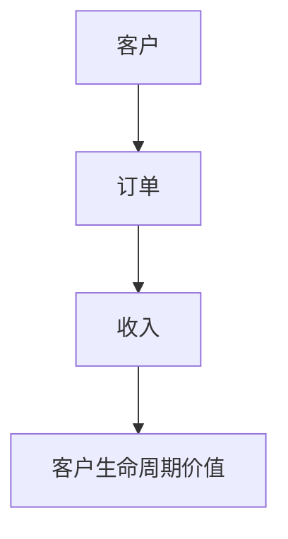
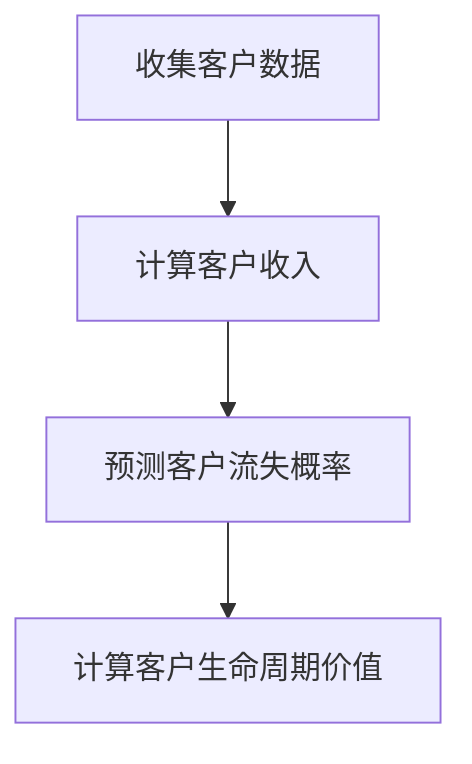
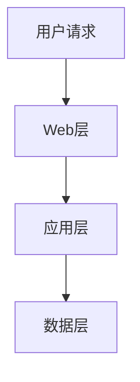
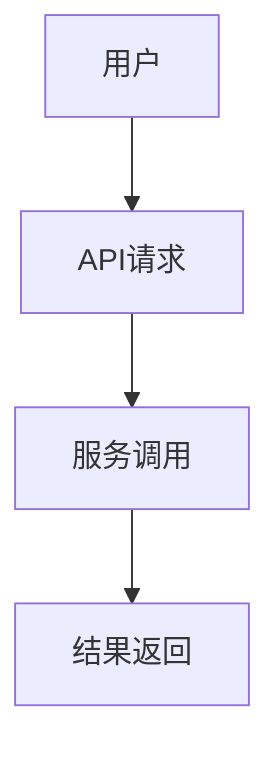

                 


# 《企业估值中的客户终身价值计算》

---

## 关键词：客户终身价值（CLV）、企业估值、客户生命周期、数据驱动决策、人工智能算法

---

## 摘要：客户终身价值（Customer Lifetime Value, CLV）是企业在进行客户管理和估值时的重要指标，它通过分析客户在企业生命周期中的价值贡献，帮助企业优化客户关系管理、制定精准营销策略，并最终实现企业价值最大化。本文将从CLV的核心概念、算法原理、系统架构到项目实战进行详细分析，深入探讨如何在企业估值中科学、准确地计算客户终身价值。

---

# 第1章: 客户终身价值（CLV）概述

## 1.1 客户终身价值的核心概念

### 1.1.1 什么是客户终身价值
客户终身价值（CLV）是指一个客户在其整个生命周期内为企业带来的总收入减去相关成本的净现值。CLV不仅是客户价值管理的重要工具，也是企业制定客户策略、优化资源配置的关键依据。

### 1.1.2 CLV的计算意义
CLV的计算帮助企业：
- 识别高价值客户，优化客户分层管理。
- 制定精准营销策略，提升客户忠诚度。
- 评估客户获取和维护的成本效益。
- 优化企业资源配置，提高整体运营效率。

### 1.1.3 CLV与企业估值的关系
CLV是连接客户价值与企业估值的桥梁，通过对客户未来价值的预测，企业可以更准确地评估自身市场价值和财务表现。

## 1.2 CLV的计算背景与问题背景

### 1.2.1 传统估值方法的局限性
传统的估值方法往往只关注客户的短期价值，忽视了客户生命周期中长期价值的积累。这种片面的估值方式可能导致企业错失高潜力客户或过度投资低价值客户。

### 1.2.2 客户价值在企业战略中的重要性
在数字化时代，客户价值不再仅仅体现在交易金额上，而是体现在客户与企业的长期互动中。通过CLV，企业可以更全面地评估客户的价值贡献，从而制定更有针对性的客户管理策略。

### 1.2.3 CLV在现代企业中的应用现状
随着大数据和人工智能技术的发展，CLV的计算方法逐渐成熟，已被广泛应用于金融、零售、医疗、教育等多个行业。企业通过CLV分析，显著提升了客户管理效率和市场竞争力。

## 1.3 CLV的核心问题与边界

### 1.3.1 CLV的核心问题
- 如何准确预测客户未来收入？
- 如何评估客户流失对CLV的影响？
- 如何平衡客户获取成本与生命周期价值？

### 1.3.2 CLV的边界与外延
CLV的计算范围通常限定在企业能够直接影响的客户行为和经济收益，不考虑外部市场波动和宏观环境的影响。

### 1.3.3 CLV与其他估值方法的区别
与传统估值方法相比，CLV更注重客户个体差异和生命周期阶段的动态变化，能够提供更精准的客户价值评估。

## 1.4 本章小结
本章通过定义CLV、分析其计算意义和应用背景，明确了CLV在企业估值中的重要性。接下来将深入探讨CLV的核心概念和计算方法。

---

# 第2章: 客户终身价值的核心概念与联系

## 2.1 CLV的核心要素与组成

### 2.1.1 客户生命周期的概念
客户生命周期包括获取、激活、 retention、衰退和流失五个阶段。不同阶段的客户行为和价值贡献存在显著差异。

### 2.1.2 CLV的构成要素
- **收入流**：客户在生命周期中为企业带来的总收入。
- **成本**：获取、维护和管理客户所产生的各项成本。
- **时间价值**：考虑资金的时间价值，对未来的收入进行贴现。

### 2.1.3 CLV的数学模型结构
CLV的计算模型通常基于客户的行为数据和财务数据，结合概率论和贴现现值法进行建模。

## 2.2 CLV的核心概念属性对比

### 2.2.1 不同客户阶段的价值差异
通过对比不同生命周期阶段的客户价值，企业可以制定更有针对性的客户管理策略。

### 2.2.2 客户行为与价值的关系
客户行为（如购买频率、购买金额）直接影响其CLV。通过分析客户行为数据，企业可以更准确地预测客户价值。

### 2.2.3 CLV与企业收益的关系
CLV是企业收益的重要组成部分，通过优化CLV，企业可以显著提升整体收益和市场价值。

## 2.3 CLV的ER实体关系图



---

## 2.4 本章小结
本章通过分析CLV的核心要素和构成结构，帮助企业更好地理解客户生命周期与企业收益的关系。接下来将深入探讨CLV的算法原理和实际应用。

---

# 第3章: 客户终身价值的算法原理

## 3.1 CLV的计算模型

### 3.1.1 基于WTP模型的CLV计算
WTP（Wang、Tao、Peng）模型是一种基于客户行为数据的CLV计算方法，适用于数据量较大的场景。

### 3.1.2 基于Markov链模型的CLV计算
Markov链模型通过分析客户在不同生命周期阶段之间的转移概率，预测客户未来的价值贡献。

### 3.1.3 其他常用CLV模型
- **线性回归模型**：基于客户特征变量进行预测。
- **决策树模型**：通过客户分层分析，预测客户价值。

## 3.2 CLV算法的数学模型

### 3.2.1 CLV的基本公式
$$ CLV = \frac{R}{d} \times \left(1 - \frac{1}{(1 + d)^n}\right) $$

其中：
- \( R \) 是客户年收入贡献
- \( d \) 是贴现率
- \( n \) 是客户生命周期长度

### 3.2.2 CLV的扩展公式
$$ CLV = \sum_{t=1}^{n} \frac{R_t}{(1 + d)^t} $$

其中：
- \( R_t \) 是第 \( t \) 年的收入贡献
- \( d \) 是贴现率

## 3.3 CLV算法的流程图



---

## 3.4 本章小结
本章通过介绍CLV的计算模型和数学公式，详细阐述了CLV的算法原理。接下来将探讨CLV在系统中的实际应用。

---

# 第4章: 客户终身价值的系统分析与架构设计

## 4.1 系统功能设计

### 4.1.1 数据采集模块
- 收集客户的基本信息、交易记录和行为数据。

### 4.1.2 模型训练模块
- 基于机器学习算法，训练CLV预测模型。

### 4.1.3 结果展示模块
- 可视化展示客户CLV分布和趋势分析。

## 4.2 系统架构设计



---

## 4.3 接口设计与交互流程图



---

## 4.4 本章小结
本章通过系统功能设计和架构设计，展示了CLV计算的实际应用场景。接下来将通过项目实战进一步验证CLV的计算方法。

---

# 第5章: 项目实战

## 5.1 环境安装与数据准备

### 5.1.1 安装Python环境
```bash
pip install numpy pandas scikit-learn
```

### 5.1.2 数据准备
- 数据集包括客户ID、交易金额、交易时间、客户属性等。

## 5.2 核心代码实现

### 5.2.1 数据处理
```python
import pandas as pd
import numpy as np
from sklearn.model_selection import train_test_split
from sklearn.linear_model import LinearRegression

# 数据加载
data = pd.read_csv('customer_data.csv')

# 数据清洗
data.dropna(inplace=True)

# 数据分割
X = data[['age', 'gender', 'income']]
y = data['revenue']

X_train, X_test, y_train, y_test = train_test_split(X, y, test_size=0.2)
```

### 5.2.2 模型训练
```python
# 训练线性回归模型
model = LinearRegression()
model.fit(X_train, y_train)

# 模型预测
y_pred = model.predict(X_test)
```

### 5.2.3 结果分析
```python
print('模型解释力：', model.score(X_test, y_test))
print('客户CLV预测值：', y_pred[:5])
```

## 5.3 案例分析与结果解读

### 5.3.1 案例分析
以某零售企业为例，通过CLV计算模型，预测客户的生命周期价值。

### 5.3.2 结果解读
- 预测结果表明，高收入客户的CLV显著高于低收入客户。
- 客户流失概率较高的客户需要重点关注和维护。

## 5.4 本章小结
本章通过实际项目案例，展示了CLV计算的具体操作和应用效果。接下来将总结CLV计算的最佳实践和注意事项。

---

# 第6章: 最佳实践与注意事项

## 6.1 小结
CLV是企业客户管理的重要工具，通过科学计算和分析，可以帮助企业优化客户关系管理，提升整体收益。

## 6.2 注意事项
- 数据质量是CLV计算的关键，需确保数据的完整性和准确性。
- 模型选择需结合企业实际需求和数据特征。
- 定期更新模型参数，以应对市场变化和客户需求变化。

## 6.3 拓展阅读
- 《Customer Lifetime Value: Theory and Practice》
- 《Data-Driven Marketing: The Use of Big Data and Machine Learning in Customer Management》

---

## 附录: 核心代码与工具推荐

### 附录A: 核心代码汇总
```python
import pandas as pd
import numpy as np
from sklearn.model_selection import train_test_split
from sklearn.linear_model import LinearRegression

# 数据加载
data = pd.read_csv('customer_data.csv')

# 数据清洗
data.dropna(inplace=True)

# 数据分割
X = data[['age', 'gender', 'income']]
y = data['revenue']

X_train, X_test, y_train, y_test = train_test_split(X, y, test_size=0.2)

# 训练线性回归模型
model = LinearRegression()
model.fit(X_train, y_train)

# 模型预测
y_pred = model.predict(X_test)

# 模型评估
print('模型解释力：', model.score(X_test, y_test))
print('客户CLV预测值：', y_pred[:5])
```

### 附录B: 工具推荐
- 数据处理工具：Pandas、NumPy
- 模型训练工具：Scikit-learn、XGBoost
- 可视化工具：Matplotlib、Seaborn
- 开发框架：Django、Flask

---

## 结语

通过本文的详细讲解，我们深入探讨了客户终身价值（CLV）的计算方法及其在企业估值中的应用。希望读者能够通过本文掌握CLV的核心概念和实际操作方法，为企业客户管理提供有力支持。

