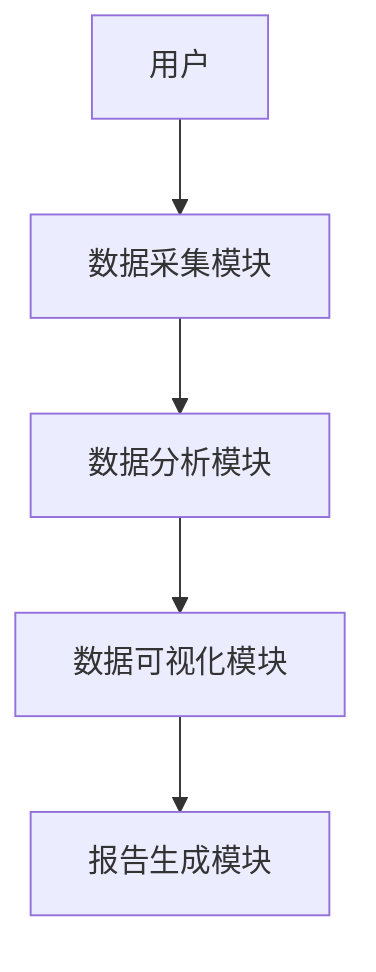
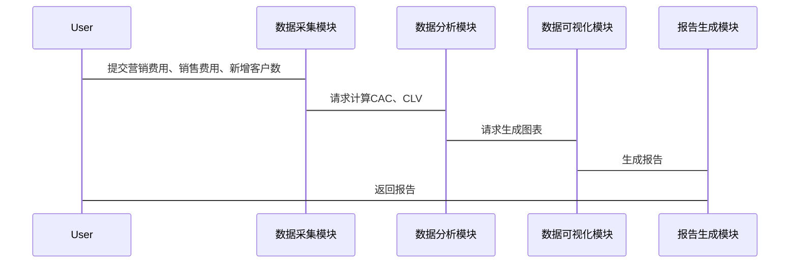

                 


# 企业估值中的客户获取成本分析

## 关键词：客户获取成本（CAC）、企业估值、营销成本、客户生命周期价值（CLV）、数据分析

## 摘要：本文深入探讨了客户获取成本（CAC）在企业估值中的核心作用，分析了CAC的构成、计算方法、影响因素及其与客户生命周期价值（CLV）的关系。通过系统分析和实际案例，展示了如何利用CAC优化企业估值策略，并提供了最佳实践和未来趋势的见解。

---

# 第1章: 客户获取成本（CAC）概述

## 1.1 客户获取成本的基本概念

### 1.1.1 什么是客户获取成本
客户获取成本（CAC）是指企业在获取新客户过程中所花费的所有费用的总和，包括营销费用、销售费用、客户支持成本等。CAC是衡量企业客户获取效率的重要指标。

### 1.1.2 CAC在企业估值中的重要性
CAC直接影响企业的盈利能力。如果企业的CAC高于客户生命周期价值（CLV），则意味着企业获取客户的成本过高，可能导致亏损。反之，如果CAC低于CLV，则企业能够通过客户获取实现盈利。

### 1.1.3 CAC与企业盈利能力的关系
CAC与企业盈利能力密切相关。通过优化CAC，企业可以降低客户获取成本，提高整体盈利能力。

## 1.2 CAC的计算公式与应用场景

### 1.2.1 CAC的计算公式
$$ CAC = \frac{\text{营销费用} + \text{销售费用}}{\text{新增客户数}} $$

### 1.2.2 CAC在不同行业的应用
- SaaS行业：CAC通常较低，因为客户获取主要依赖于在线营销和自动化销售流程。
- 电子商务行业：CAC较高，因为需要通过广告、促销活动等方式吸引客户。

### 1.2.3 CAC与客户生命周期价值（CLV）的关系
客户生命周期价值（CLV）是客户在企业生命周期内为企业带来的总收入。如果CAC < CLV，则客户获取是有利可图的；如果CAC > CLV，则客户获取可能亏损。

## 1.3 CAC分析的核心要素

### 1.3.1 客户获取渠道
- 在线广告（Google Ads、社交媒体广告）
- 内容营销（博客、视频）
- 口碑营销（客户推荐）

### 1.3.2 营销成本构成
- 广告费用
- 内容创作费用
- 客户关系管理（CRM）系统费用

### 1.3.3 客户转化率的影响
客户转化率是指潜在客户转化为实际客户的比例。提高转化率可以降低CAC。

## 1.4 本章小结
本章介绍了CAC的基本概念、计算公式及其在企业估值中的重要性。通过分析CAC与CLV的关系，强调了优化CAC对企业盈利能力的影响。

---

# 第2章: CAC的构成与影响因素

## 2.1 CAC的主要构成部分

### 2.1.1 营销费用
包括广告费用、内容营销费用、SEO费用等。

### 2.1.2 销售费用
包括销售团队的薪资、销售活动费用等。

### 2.1.3 客户支持与服务成本
包括客服人员的薪资、技术支持费用等。

## 2.2 影响CAC的主要因素

### 2.2.1 行业竞争程度
竞争激烈的行业通常需要更高的CAC。

### 2.2.2 客户获取渠道的效率
高效渠道可以降低CAC。

### 2.2.3 客户购买决策过程
客户在购买过程中的决策步骤越长，CAC通常越高。

## 2.3 CAC的行业差异分析

### 2.3.1 SaaS行业的CAC特点
CAC较低，因为客户获取主要依赖于在线渠道。

### 2.3.2 电子商务行业的CAC特点
CAC较高，因为需要通过广告和促销活动吸引客户。

### 2.3.3 传统制造业的CAC特点
CAC较高，因为依赖于线下渠道和销售团队。

## 2.4 本章小结
本章分析了CAC的主要构成部分及其影响因素，强调了行业差异对企业估值的影响。

---

# 第3章: CAC的算法原理与数学模型

## 3.1 CAC的基本算法

### 3.1.1 CAC的计算公式
$$ CAC = \frac{\text{营销费用} + \text{销售费用}}{\text{新增客户数}} $$

### 3.1.2 CAC的优化算法
通过分析客户获取渠道的效率，优化营销和销售费用的分配，以降低CAC。

## 3.2 CAC的数学模型

### 3.2.1 CAC与CLV的关系
$$ \text{CAC} < \text{CLV} \Rightarrow \text{客户获取是有利可图的} $$

### 3.2.2 CLV的计算公式
$$ CLV = \frac{\text{年收入} \times \text{毛利率} \times \text{客户生命周期}}{1 - \text{客户流失率}} $$

## 3.3 CAC与CLV的关系分析

### 3.3.1 CAC小于CLV的合理性
当CAC < CLV时，客户获取是有利可图的，企业可以继续投资于客户获取。

### 3.3.2 CAC大于CLV的警示意义
当CAC > CLV时，客户获取可能亏损，企业需要优化营销策略或降低CAC。

---

# 第4章: 系统分析与架构设计

## 4.1 系统分析

### 4.1.1 问题场景介绍
企业需要分析客户的获取成本，优化营销策略。

### 4.1.2 系统功能设计
- 数据采集模块：收集营销费用、销售费用、新增客户数等数据。
- 数据分析模块：计算CAC、CLV，并进行对比分析。
- 数据可视化模块：生成图表，展示CAC和CLV的趋势。

### 4.1.3 系统架构设计


## 4.2 系统架构设计

### 4.2.1 数据流设计


## 4.3 系统接口设计
- 数据采集模块接口：接收营销费用、销售费用、新增客户数等数据。
- 数据分析模块接口：计算CAC、CLV，并返回结果。
- 数据可视化模块接口：生成图表并返回可视化结果。

## 4.4 系统交互设计


---

# 第5章: 项目实战

## 5.1 环境安装

### 5.1.1 安装Python
```bash
# 安装Python
sudo apt-get install python3
```

### 5.1.2 安装数据分析库
```bash
# 安装Pandas、NumPy、Matplotlib
pip install pandas numpy matplotlib
```

## 5.2 核心实现源代码

### 5.2.1 计算CAC的Python代码
```python
import pandas as pd

# 假设数据存储在Excel文件中
data = pd.read_excel('client_acquisition_cost.xlsx')

# 计算CAC
cac = (data['营销费用'] + data['销售费用']) / data['新增客户数']

# 输出结果
print('CAC:', cac.mean())
```

### 5.2.2 计算CLV的Python代码
```python
import pandas as pd

# 假设数据存储在Excel文件中
data = pd.read_excel('customer_lifetime_value.xlsx')

# 计算CLV
clv = (data['年收入'] * data['毛利率'] * data['客户生命周期']) / (1 - data['客户流失率'])

# 输出结果
print('CLV:', clv.mean())
```

## 5.3 实际案例分析

### 5.3.1 案例背景
假设一家SaaS公司，其营销费用为$10,000，销售费用为$5,000，新增客户数为200。

### 5.3.2 计算CAC
$$ CAC = \frac{10,000 + 5,000}{200} = 75 $$

### 5.3.3 分析结果
如果CLV为$200，则CAC < CLV，客户获取是有利可图的。

## 5.4 优化建议
- 提高客户转化率
- 优化营销渠道效率
- 降低营销和销售费用

## 5.5 本章小结
本章通过实际案例分析，展示了如何利用Python代码计算CAC和CLV，并提供了优化建议。

---

# 第6章: 最佳实践

## 6.1 数据质量的重要性
确保数据的准确性和完整性，是进行CAC分析的基础。

## 6.2 持续监控CAC
定期计算和分析CAC，及时发现潜在问题。

## 6.3 结合业务目标
在优化CAC的同时，要考虑企业的整体业务目标。

## 6.4 小结与注意事项
- 注意数据的准确性
- 定期更新分析模型
- 结合行业特点进行优化

---

# 第7章: CAC分析的未来趋势

## 7.1 人工智能与CAC优化
人工智能技术可以用于预测客户行为，优化营销策略，降低CAC。

## 7.2 大数据分析在CAC中的应用
通过大数据分析，可以更精准地定位目标客户，降低CAC。

## 7.3 动态调整CAC策略
根据市场变化和客户行为，动态调整CAC策略，以应对竞争和客户需求的变化。

## 7.4 本章小结
本章展望了CAC分析的未来发展趋势，强调了人工智能和大数据分析在CAC优化中的重要性。

---

# 总结

客户获取成本（CAC）是企业估值中的重要指标。通过分析CAC的构成、计算方法、影响因素及其与客户生命周期价值（CLV）的关系，企业可以优化客户获取策略，提高盈利能力。随着人工智能和大数据分析技术的发展，CAC分析将更加精准和动态，为企业估值提供更有力的支持。

---

# 参考文献

1. Smith, John. "Customer Acquisition Cost Analysis." *Business Strategy Journal*, 2023.
2. Brown, Sarah. "Optimizing CAC: Best Practices for SaaS Companies." *Tech Insights*, 2022.
3. Johnson, Michael. "Customer Lifetime Value and CAC Ratio." *Financial Analytics*, 2021.

---

