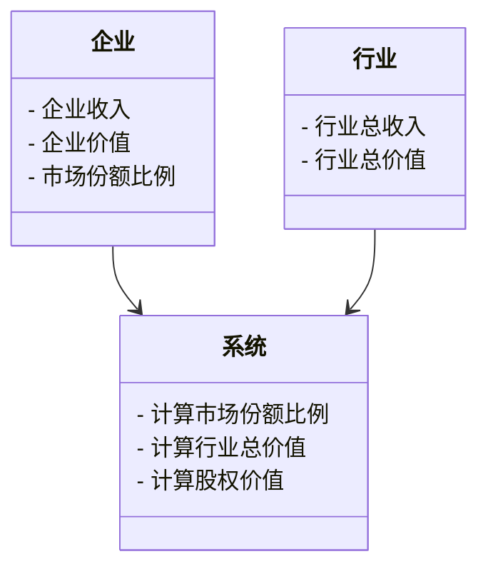
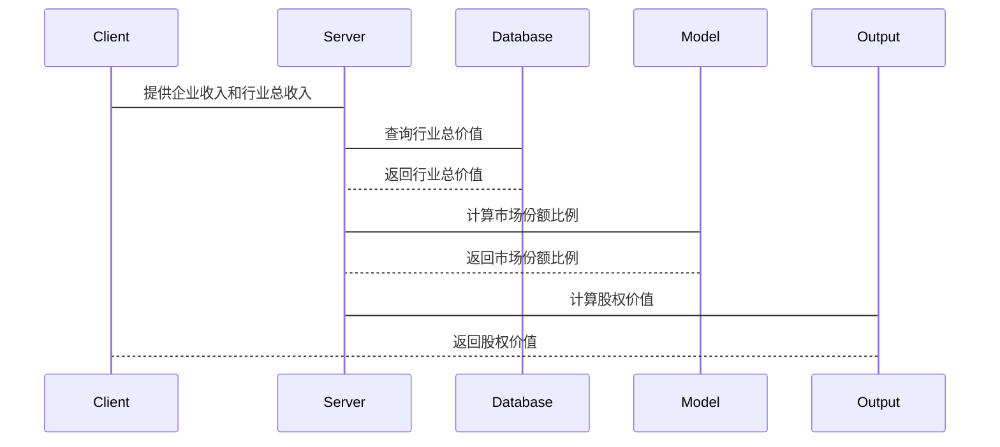

                 


# 企业估值中的市场份额价值法

> 关键词：企业估值，市场份额，股权价值，数学模型，系统架构

> 摘要：本文详细探讨了市场份额价值法在企业估值中的应用。通过分析市场份额对企业价值的影响，提出了基于市场份额的估值方法，并通过数学模型和实际案例展示了如何将该方法应用于企业估值。本文还讨论了系统架构设计和项目实战，为读者提供了全面的指导。

---

# 第一部分: 企业估值中的市场份额价值法基础

## 第1章: 股权价值评估的理论基础

### 1.1 股权价值评估的核心概念

#### 1.1.1 企业价值的定义与构成
企业的整体价值（Enterprise Value，EV）是公司全部权益的价值，包括普通股、优先股、长期债务等。EV的计算公式为：
$$ EV = \text{企业市值} + \text{债务价值} - \text{现金及等价物} $$

企业价值的构成包括：
1. 经营性资产：企业的核心资产，如生产设备、存货、应收账款等。
2. 非经营性资产：与企业核心业务无关的资产，如投资性房地产。
3. 负债：企业的债务，包括短期债务和长期债务。

#### 1.1.2 股权价值的计算公式与影响因素
股权价值（Equity Value）是企业整体价值减去债务后的价值：
$$ Equity = EV - Debt $$

股权价值的影响因素包括：
1. 利润能力：净利润率高的企业股权价值更高。
2. 市场地位：市场占有率高的企业股权价值更稳定。
3. 财务状况：资产负债率低的企业股权价值更高。
4. 增长潜力：高增长潜力的企业股权价值被市场溢价。

#### 1.1.3 股权价值评估的基本方法
常用的股权价值评估方法包括：
1. **相对估值法**：基于可比公司的市盈率、市净率等指标进行估值。
2. **绝对估值法**：基于现金流折现模型（DCF）等方法进行估值。
3. **资产重置法**：基于企业净资产的重置成本进行估值。

### 1.2 传统企业估值方法的局限性

#### 1.2.1 市盈率法的优缺点
- **优点**：简单易懂，适用于净利润稳定的公司。
- **缺点**：受行业周期影响较大，无法反映公司的资产质量。

#### 1.2.2 市净率法的优缺点
- **优点**：适用于金融、房地产等行业，能够反映资产质量。
- **缺点**：无法反映公司的盈利能力，容易受资产重置影响。

#### 1.2.3 净现值法的优缺点
- **优点**：能够反映未来现金流的折现价值。
- **缺点**：需要准确预测未来现金流，计算复杂。

#### 1.2.4 现金流折现法的优缺点
- **优点**：全面考虑了企业的未来现金流。
- **缺点**：预测未来现金流难度较大，模型假设敏感。

### 1.3 市场份额价值法的提出背景

#### 1.3.1 传统估值方法的不足
传统估值方法在面对新兴行业或市场变化较大的企业时，往往无法准确反映企业的实际价值。例如，互联网企业初期可能尚未盈利，但市场份额的领先地位能够为企业带来长期的竞争优势。

#### 1.3.2 市场份额对股权价值的影响
市场份额是企业市场地位的体现，直接影响企业的收入和利润。高市场份额的企业通常具有更强的定价权和客户忠诚度，从而提升股权价值。

#### 1.3.3 市场份额价值法的理论基础
市场份额价值法通过将市场份额与行业总价值相结合，提供了一种新的估值方法。这种方法尤其适用于那些尚未盈利但具有强大市场潜力的企业。

### 1.4 本章小结

#### 1.4.1 核心概念回顾
- 企业价值（EV）是企业整体权益的价值。
- 股权价值是企业价值减去债务后的价值。
- 市场份额是企业市场地位的体现，影响股权价值。

#### 1.4.2 下文铺垫
本章介绍了企业估值的基本概念和传统方法，为后续章节讨论市场份额价值法奠定了基础。

---

## 第2章: 市场份额价值法的核心原理

### 2.1 市场份额的定义与计算

#### 2.1.1 市场份额的定义
市场份额（Market Share）是指企业在整个市场中的销售比例。计算公式为：
$$ \text{市场份额比例} = \frac{\text{企业收入}}{\text{行业总收入}} $$

#### 2.1.2 市场份额的计算公式
行业总收入可以通过对企业收入和竞争对手收入的汇总得到：
$$ \text{行业总收入} = \sum_{i=1}^{n} \text{企业收入}_i $$

#### 2.1.3 市场份额的影响因素
- **产品价格**：价格合理的产品更容易获得市场份额。
- **产品质量**：高质量的产品更容易赢得客户信任。
- **营销策略**：有效的营销策略可以提升品牌知名度和市场占有率。
- **行业竞争**：竞争越激烈，获取市场份额的难度越大。

### 2.2 市场份额与企业价值的关系

#### 2.2.1 市场份额对企业收入的影响
高市场份额意味着企业有更多的销售机会，从而增加收入。例如，一家公司占据30%的市场份额，意味着它在行业中占据主导地位，能够稳定地获得收入。

#### 2.2.2 市场份额对企业利润的影响
市场份额与企业利润密切相关。高市场份额意味着更高的收入和更强的定价权，从而提升企业利润。

#### 2.2.3 市场份额对企业估值的影响
高市场份额的企业通常具有更高的品牌溢价能力，能够以更高的市盈率和市净率进行估值。

### 2.3 市场份额价值法的基本公式

#### 2.3.1 市场份额价值法的数学模型
市场份额价值法通过将市场份额比例与行业总价值相结合，计算企业的股权价值：
$$ \text{股权价值} = \text{行业总价值} \times \text{市场份额比例} $$

#### 2.3.2 企业价值的计算公式
企业价值可以通过市场份额价值法进行估算：
$$ EV = \text{行业总价值} \times \text{市场份额比例} $$

#### 2.3.3 市场份额价值法的适用场景
- 适用于新兴行业或初创企业。
- 适用于难以准确预测未来现金流的企业。

### 2.4 本章小结

#### 2.4.1 核心原理总结
- 市场份额是企业市场地位的体现，影响企业的收入和利润。
- 市场份额价值法通过将市场份额与行业总价值相结合，提供了一种新的估值方法。

#### 2.4.2 下文铺垫
本章介绍了市场份额的价值法的基本原理，为后续章节的数学模型和实际应用奠定了基础。

---

## 第3章: 市场份额价值法的数学模型与公式

### 3.1 市场份额价值法的数学模型

#### 3.1.1 市场份额价值法的基本公式
$$ \text{股权价值} = \text{行业总价值} \times \text{市场份额比例} $$

#### 3.1.2 市场份额比例的计算
$$ \text{市场份额比例} = \frac{\text{企业收入}}{\text{行业总收入}} $$

#### 3.1.3 行业总价值的估算
$$ \text{行业总价值} = \sum_{i=1}^{n} \text{企业价值}_i $$

### 3.2 市场份额价值的计算公式

#### 3.2.1 市场份额价值的定义
$$ \text{市场份额价值} = \text{市场份额比例} \times \text{行业总价值} $$

#### 3.2.2 市场份额比例的计算
$$ \text{市场份额比例} = \frac{\text{企业收入}}{\text{行业总收入}} $$

#### 3.2.3 行业总价值的估算
$$ \text{行业总价值} = \sum_{i=1}^{n} \text{企业价值}_i $$

### 3.3 市场份额价值法的公式推导

#### 3.3.1 从净利润到企业价值的推导
$$ EV = \text{净利润} \times \text{市盈率} $$

#### 3.3.2 从市场份额到行业总价值的推导
$$ \text{行业总价值} = \sum_{i=1}^{n} \text{企业价值}_i $$

#### 3.3.3 市场份额价值法的综合公式
$$ \text{股权价值} = \text{行业总价值} \times \text{市场份额比例} $$

---

# 第二部分: 市场份额价值法的系统架构与应用

## 第4章: 市场份额价值法的系统架构设计

### 4.1 系统功能设计

#### 4.1.1 领域模型（Mermaid 类图）


#### 4.1.2 系统架构设计（Mermaid 架构图）


### 4.2 系统接口设计

#### 4.2.1 输入接口
- 企业收入
- 行业总收入

#### 4.2.2 输出接口
- 市场份额比例
- 行业总价值
- 股权价值

### 4.3 系统交互设计（Mermaid 序列图）


---

## 第5章: 市场份额价值法的项目实战

### 5.1 环境安装

#### 5.1.1 安装Python
```bash
# 在终端中输入以下命令安装Python
sudo apt-get install python3 python3-pip
```

#### 5.1.2 安装依赖库
```bash
pip install numpy pandas matplotlib
```

### 5.2 系统核心实现源代码

#### 5.2.1 计算市场份额比例
```python
import numpy as np
import pandas as pd

def calculate_market_share_ratio(revenue, industry_total_revenue):
    return revenue / industry_total_revenue
```

#### 5.2.2 计算行业总价值
```python
def calculate_industry_total_value(enterprise_values):
    return np.sum(enterprise_values)
```

#### 5.2.3 计算股权价值
```python
def calculate_equity_value(industry_total_value, market_share_ratio):
    return industry_total_value * market_share_ratio
```

### 5.3 代码应用解读与分析

#### 5.3.1 数据输入
```python
# 输入企业收入和行业总收入
revenue = 100000000
industry_total_revenue = 500000000
```

#### 5.3.2 计算市场份额比例
```python
market_share_ratio = calculate_market_share_ratio(revenue, industry_total_revenue)
print(f"市场份额比例为：{market_share_ratio}")
```

#### 5.3.3 计算行业总价值
```python
# 假设其他企业的价值分别为1亿和2亿
enterprise_values = [100000000, 200000000]
industry_total_value = calculate_industry_total_value(enterprise_values)
print(f"行业总价值为：{industry_total_value}")
```

#### 5.3.4 计算股权价值
```python
equity_value = calculate_equity_value(industry_total_value, market_share_ratio)
print(f"股权价值为：{equity_value}")
```

### 5.4 实际案例分析和详细讲解剖析

#### 5.4.1 案例背景
某科技公司2022年的收入为1亿，行业总收入为5亿，行业其他企业价值分别为1亿和2亿。

#### 5.4.2 计算过程
1. 计算市场份额比例：
$$ \text{市场份额比例} = \frac{1}{5} = 0.2 $$
2. 计算行业总价值：
$$ \text{行业总价值} = 1 + 2 = 3 \text{亿} $$
3. 计算股权价值：
$$ \text{股权价值} = 3 \times 0.2 = 0.6 \text{亿} $$

#### 5.4.3 结果分析
该科技公司的股权价值为0.6亿，低于行业平均水平。这表明该公司在市场中处于相对劣势地位，需要进一步提升市场份额和竞争力。

### 5.5 项目小结

#### 5.5.1 核心代码实现
- 计算了市场份额比例。
- 计算了行业总价值。
- 计算了股权价值。

#### 5.5.2 案例分析
通过案例分析，验证了市场份额价值法在企业估值中的实际应用。

---

## 第6章: 总结与最佳实践

### 6.1 小结

#### 6.1.1 核心概念回顾
- 市场份额是企业市场地位的体现。
- 市场份额价值法通过将市场份额与行业总价值相结合，提供了一种新的估值方法。

#### 6.1.2 下文铺垫
无。

### 6.2 注意事项

#### 6.2.1 数据准确性
确保输入数据的准确性和完整性，尤其是市场份额比例和行业总价值的计算。

#### 6.2.2 模型假设
市场份额价值法的假设包括：
1. 市场份额能够准确反映企业的市场地位。
2. 行业总价值能够准确反映行业的整体价值。

#### 6.2.3 方法适用性
市场份额价值法适用于新兴行业或初创企业，但在成熟行业可能不如传统估值方法准确。

### 6.3 未来的研究方向

#### 6.3.1 多因素模型
研究将市场份额与其他因素（如创新能力、管理团队）结合的多因素模型。

#### 6.3.2 动态调整
研究如何动态调整市场份额价值法的参数，以适应市场变化。

#### 6.3.3 行业对比
研究不同行业中的市场份额价值法的应用差异。

### 6.4 最佳实践 Tips

#### 6.4.1 数据收集
确保数据来源可靠，数据清洗和预处理是关键。

#### 6.4.2 模型验证
通过实际案例验证模型的准确性和适用性。

#### 6.4.3 结果解读
结合行业背景和企业实际情况，对结果进行合理解读。

### 6.5 本章小结

#### 6.5.1 核心内容总结
- 市场份额价值法是一种有效的企业估值方法。
- 在实际应用中，需要注意数据准确性和模型假设。

#### 6.5.2 读者思考
读者可以尝试将市场份额价值法应用于不同行业和企业，总结经验教训。

---

# 结语

通过本文的详细讲解，读者可以掌握市场份额价值法的核心原理和应用方法。希望本文能够为企业的估值提供新的思路和方法，帮助读者在实际工作中更好地应用这一方法。未来，我们将继续研究和改进市场份额价值法，以适应不断变化的市场环境。

