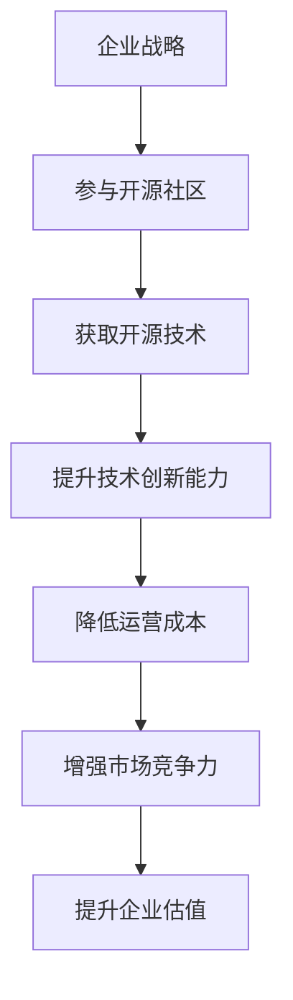
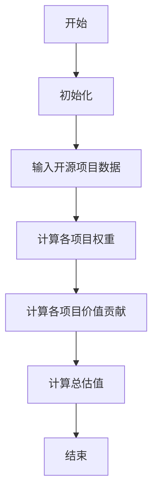
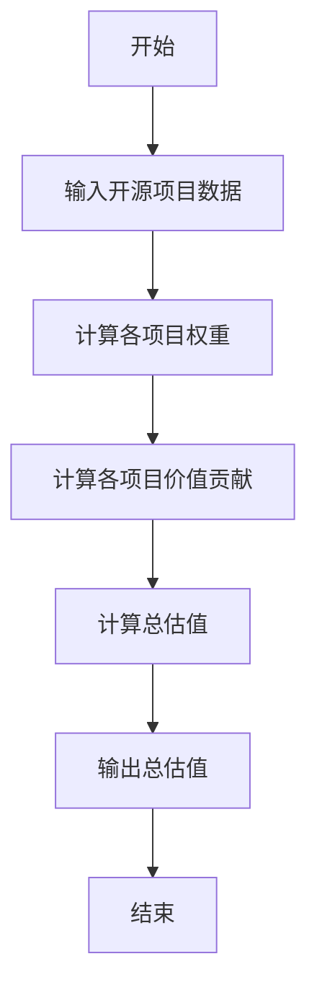
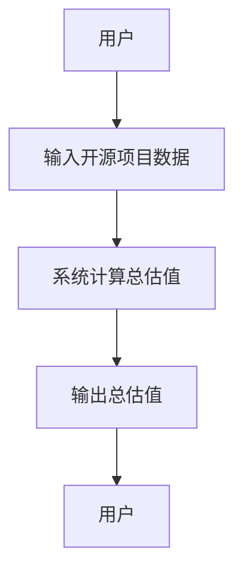

                 


# 企业估值中的开源战略价值评估

---

## 关键词：开源战略、企业估值、开源价值、企业价值、战略价值

---

## 摘要

在当今的数字时代，开源战略已成为企业竞争的核心要素之一。开源不仅改变了软件开发的方式，还深刻影响了企业的价值创造和评估方式。本文通过分析开源战略在企业估值中的作用，探讨如何将开源价值转化为企业核心竞争力，并为企业制定开源战略提供实践指导。

---

# 第一部分: 开源战略与企业估值背景

# 第1章: 开源战略与企业估值概述

## 1.1 开源战略的背景与重要性

### 1.1.1 开源软件的兴起与发展

开源软件（Open Source Software, OSS）起源于20世纪90年代，如今已经成为软件生态系统的重要组成部分。开源软件的特点是代码公开、可自由修改和分发，遵循许可证协议。开源的兴起得益于互联网的发展和全球协作精神的推动。例如，Linux操作系统、Apache服务器和MySQL数据库等开源项目的成功，证明了开源模式的可行性和优势。

开源软件的兴起不仅仅是技术的进步，更是商业模式的创新。企业可以基于开源软件进行定制化开发，降低研发成本，同时通过社区协作加速创新。开源的生态系统具有高度的弹性和扩展性，能够快速响应市场需求。

### 1.1.2 开源战略在企业中的角色

开源战略是指企业在经营活动中，将开源技术作为核心资源，通过参与开源社区、开发开源项目或采用开源解决方案来提升企业的竞争力。开源战略在企业中的角色可以分为以下几个方面：

1. **技术创新**：通过参与开源社区，企业可以接触到全球顶尖的技术资源，快速获取最新的技术成果，降低研发成本。
2. **成本节约**：开源软件通常免费，企业可以避免购买商业软件的高昂许可费用，同时节省维护和升级的成本。
3. **协作与生态**：开源战略促进企业与合作伙伴的协作，构建开放的技术生态，增强企业的生态系统竞争力。
4. **品牌提升**：通过贡献开源项目，企业可以提升品牌形象，吸引开源人才，增强在行业中的影响力。

### 1.1.3 开源与企业估值的关联性

开源战略不仅影响企业的运营成本和技术能力，还直接影响企业的市场价值。开源技术的广泛应用使得企业能够以更低的成本提供更优质的产品和服务，从而提升企业的盈利能力。此外，开源社区的活跃度和技术影响力也是评估企业技术创新能力的重要指标。因此，开源战略在企业估值中的作用日益凸显。

---

## 1.2 企业估值的核心概念

### 1.2.1 企业估值的基本定义

企业估值是指对企业整体或部分价值的评估，通常用于企业融资、并购、上市等场景。企业估值的核心在于准确评估企业的未来盈利能力、资产价值和市场地位。常见的企业估值方法包括市盈率法、现金流折现法、资产重置法等。

### 1.2.2 开源战略对企业价值的影响

开源战略通过降低运营成本、提升技术创新能力和增强生态系统竞争力，直接影响企业的估值。具体表现在以下几个方面：

1. **成本优势**：开源技术降低了企业的研发和维护成本，提升了企业的利润率。
2. **技术创新**：通过参与开源社区，企业能够更快地获取和应用新技术，提升产品的市场竞争力。
3. **生态系统**：开源战略促进了企业与合作伙伴的协作，构建了强大的技术生态，增强了企业的市场地位。

### 1.2.3 开源在企业估值中的独特价值

开源技术的独特价值在于其开放性和协作性。企业通过开源战略可以实现技术的快速迭代和创新，同时降低技术风险。开源社区的活跃度和技术影响力也是评估企业技术创新能力的重要指标。因此，开源战略在企业估值中具有独特的价值。

---

## 1.3 本章小结

本章通过分析开源战略的背景和重要性，探讨了开源战略在企业估值中的关联性。开源战略不仅是企业技术创新和成本节约的重要手段，还直接影响企业的市场价值和品牌影响力。下一章将详细分析开源战略的核心要素及其对企业的具体影响。

---

# 第二部分: 开源战略的核心概念与价值评估

# 第2章: 开源战略的核心要素

## 2.1 开源战略的定义与属性

### 2.1.1 开源战略的定义

开源战略是指企业在经营活动中，将开源技术作为核心资源，通过参与开源社区、开发开源项目或采用开源解决方案来提升企业的竞争力。开源战略的核心在于利用开源技术的开放性和协作性，构建企业技术创新的核心竞争力。

### 2.1.2 开源战略的核心属性对比（表格）

以下是开源战略与其他战略的对比表格：

| 属性              | 开源战略               | 传统商业战略         |
|-------------------|-----------------------|---------------------|
| 资源获取方式       | 开源社区，免费获取     | 依赖商业供应商       |
| 创新速度           | 快速迭代，社区协作     | 较慢，依赖内部研发   |
| 成本               | 低成本或零成本         | 高成本，依赖购买    |
| 协作性             | 高度协作，社区驱动     | 低协作，内部驱动     |

### 2.1.3 开源战略的ER实体关系图（Mermaid）

以下是开源战略的ER实体关系图：

```mermaid
erDiagram
    actor 企业战略
    actor 开源社区
    actor 企业估值
    企业战略 --|{> 开源社区 : 依赖
    开源社区 --|{> 企业估值 : 价值传递
```

### 2.1.4 开源战略的价值传递流程图（Mermaid）

以下是开源战略的价值传递流程图：



---

## 2.2 开源战略与企业价值的关系

### 2.2.1 开源战略对企业价值的影响路径

开源战略对企业价值的影响路径可以分为以下几个步骤：

1. **参与开源社区**：企业通过参与开源社区，获取开源技术资源。
2. **技术创新**：企业利用开源技术，快速实现技术创新。
3. **降低成本**：开源技术降低了企业的研发和维护成本。
4. **提升市场竞争力**：技术创新和成本节约提升了企业的市场竞争力。
5. **提升企业估值**：市场竞争力的提升直接提升了企业的市场估值。

### 2.2.2 开源战略与企业核心竞争力的关联

开源战略通过技术创新和成本节约，直接提升了企业的核心竞争力。具体表现在以下几个方面：

1. **技术领先性**：企业通过开源社区获取最新的技术资源，保持技术领先。
2. **成本优势**：开源技术降低了企业的研发和维护成本，提升了利润率。
3. **生态系统**：开源战略促进了企业与合作伙伴的协作，构建了强大的技术生态。

### 2.2.3 开源战略对企业估值的倍增效应

开源战略通过提升技术创新能力和降低运营成本，显著提升了企业的市场估值。具体表现在以下几个方面：

1. **技术创新倍增效应**：企业通过开源战略实现快速技术创新，提升产品竞争力。
2. **成本节约倍增效应**：开源技术降低了企业的运营成本，提升了利润率。
3. **生态系统倍增效应**：开源战略构建了强大的技术生态，增强了企业的市场地位。

---

## 2.3 本章小结

本章详细分析了开源战略的核心要素及其对企业的具体影响。开源战略通过技术创新、成本节约和生态系统构建，显著提升了企业的市场竞争力和估值。下一章将详细探讨开源战略价值评估的数学模型和算法原理。

---

# 第三部分: 开源战略价值评估的算法与模型

# 第3章: 开源价值评估的数学模型

## 3.1 开源价值评估的核心算法

### 3.1.1 开源价值评估的数学公式

开源价值评估的数学公式如下：

$$ V = \sum_{i=1}^{n} w_i \cdot v_i $$

其中：
- \( V \) 表示企业估值
- \( w_i \) 表示第 \( i \) 个开源项目的权重
- \( v_i \) 表示第 \( i \) 个开源项目的价值贡献

### 3.1.2 开源价值评估的算法步骤

以下是开源价值评估的算法步骤：

1. **数据收集**：收集企业使用的开源项目清单。
2. **权重计算**：根据每个开源项目的影响力和使用情况，计算其权重。
3. **价值贡献计算**：根据每个开源项目的价值贡献，计算其对企业的总价值。
4. **总估值计算**：将所有开源项目的权重与价值贡献相乘，求和得到企业的总估值。

### 3.1.3 开源价值评估的流程图（Mermaid）

以下是开源价值评估的流程图：



---

## 3.2 开源价值评估的实现细节

### 3.2.1 开源价值评估的实现步骤

以下是开源价值评估的实现步骤：

1. **数据收集**：收集企业使用的开源项目清单，包括项目名称、使用范围、影响程度等。
2. **权重计算**：根据每个开源项目的影响力和使用范围，计算其权重。权重可以通过专家评分或市场分析确定。
3. **价值贡献计算**：根据每个开源项目的价值贡献，计算其对企业的总价值。价值贡献可以通过项目的市场影响力、技术创新能力和成本节约效果来衡量。
4. **总估值计算**：将所有开源项目的权重与价值贡献相乘，求和得到企业的总估值。

### 3.2.2 开源价值评估的Python实现代码

以下是开源价值评估的Python实现代码：

```python
def calculate_open_source_value(projects):
    # 初始化总估值
    total_value = 0
    # 遍历每个项目
    for project in projects:
        # 计算权重
        weight = project['weight']
        # 计算价值贡献
        value_contribution = project['value_contribution']
        # 累加总估值
        total_value += weight * value_contribution
    return total_value

# 示例数据
projects = [
    {'name': 'Linux', 'weight': 0.3, 'value_contribution': 0.8},
    {'name': 'Apache', 'weight': 0.2, 'value_contribution': 0.7},
    {'name': 'MySQL', 'weight': 0.1, 'value_contribution': 0.6}
]

# 计算总估值
total_value = calculate_open_source_value(projects)
print(f"企业总估值为: {total_value}")
```

### 3.2.3 开源价值评估的解释与示例

通过上述代码，我们可以计算企业的总估值。例如，假设企业使用了三个开源项目：Linux、Apache和MySQL。每个项目的权重和价值贡献分别为：

- Linux：权重0.3，价值贡献0.8
- Apache：权重0.2，价值贡献0.7
- MySQL：权重0.1，价值贡献0.6

计算总估值：

$$ V = 0.3 \times 0.8 + 0.2 \times 0.7 + 0.1 \times 0.6 = 0.24 + 0.14 + 0.06 = 0.44 $$

因此，企业的总估值为0.44。

---

## 3.3 本章小结

本章通过数学模型和算法，详细探讨了开源价值评估的实现方法。开源价值评估的数学公式和流程图帮助企业准确评估开源项目对企业估值的贡献。下一章将详细分析开源价值评估的系统架构和实现细节。

---

通过以上内容，我们可以看到开源战略在企业估值中的重要性。开源战略不仅通过技术创新和成本节约提升了企业的市场竞争力，还通过开源价值评估的数学模型帮助企业准确评估开源项目对企业估值的贡献。接下来，我将详细探讨开源价值评估的系统架构和实现细节。

---

# 第四部分: 开源价值评估的系统架构与实现

# 第4章: 开源价值评估的系统架构设计

## 4.1 系统功能设计

### 4.1.1 系统功能模块

以下是开源价值评估系统的功能模块：

1. **数据输入模块**：用户输入开源项目清单。
2. **权重计算模块**：根据开源项目的影响力和使用范围，计算其权重。
3. **价值贡献计算模块**：根据开源项目的价值贡献，计算其对企业的总价值。
4. **总估值计算模块**：将所有开源项目的权重与价值贡献相乘，求和得到企业的总估值。
5. **结果输出模块**：输出企业的总估值。

### 4.1.2 系统功能流程图（Mermaid）

以下是开源价值评估系统的功能流程图：



---

## 4.2 系统架构设计

### 4.2.1 系统架构概述

开源价值评估系统的架构设计包括以下几个部分：

1. **数据输入层**：用户输入开源项目清单。
2. **业务逻辑层**：计算每个开源项目的权重和价值贡献，并计算总估值。
3. **结果输出层**：输出企业的总估值。

### 4.2.2 系统架构图（Mermaid）

以下是开源价值评估系统的架构图：


---

## 4.3 系统实现细节

### 4.3.1 系统接口设计

以下是开源价值评估系统的接口设计：

1. **输入接口**：用户输入开源项目清单。
2. **计算接口**：系统计算每个开源项目的权重和价值贡献，并计算总估值。
3. **输出接口**：系统输出企业的总估值。

### 4.3.2 系统交互流程图（Mermaid）

以下是开源价值评估系统的交互流程图：



---

## 4.4 本章小结

本章详细分析了开源价值评估系统的架构设计和实现细节。系统通过数据输入、业务逻辑计算和结果输出，帮助企业准确评估开源项目对企业估值的贡献。下一章将通过具体案例，展示开源价值评估的实际应用。

---

# 第五部分: 开源价值评估的项目实战

# 第5章: 开源价值评估的项目实战

## 5.1 项目背景介绍

### 5.1.1 项目目标

本项目旨在通过开源价值评估的数学模型，帮助企业准确评估开源项目对企业估值的贡献。

### 5.1.2 项目需求

1. **数据输入**：用户输入开源项目清单。
2. **权重计算**：根据开源项目的影响力和使用范围，计算其权重。
3. **价值贡献计算**：根据开源项目的价值贡献，计算其对企业的总价值。
4. **总估值计算**：将所有开源项目的权重与价值贡献相乘，求和得到企业的总估值。
5. **结果输出**：输出企业的总估值。

### 5.1.3 项目技术选型

1. **编程语言**：Python
2. **开发工具**：Jupyter Notebook
3. **数据处理**：Pandas
4. **可视化**：Matplotlib

---

## 5.2 项目核心实现

### 5.2.1 环境安装

以下是项目实战的环境安装步骤：

1. **安装Python**：从官网下载并安装Python 3.8及以上版本。
2. **安装Jupyter Notebook**：使用pip命令安装Jupyter Notebook。
3. **安装Pandas和Matplotlib**：使用pip命令安装Pandas和Matplotlib。

```bash
pip install pandas matplotlib
```

---

## 5.3 项目实现代码

### 5.3.1 开源价值评估的Python代码

以下是开源价值评估的Python代码：

```python
import pandas as pd
import matplotlib.pyplot as plt

# 示例数据
projects = pd.DataFrame({
    'name': ['Linux', 'Apache', 'MySQL'],
    'weight': [0.3, 0.2, 0.1],
    'value_contribution': [0.8, 0.7, 0.6]
})

# 计算总估值
total_value = sum(projects['weight'] * projects['value_contribution'])

# 可视化结果
plt.figure(figsize=(10, 6))
plt.bar(projects['name'], projects['weight'] * projects['value_contribution'])
plt.title('开源项目对总估值的贡献')
plt.xlabel('项目名称')
plt.ylabel('贡献值')
plt.show()
```

### 5.3.2 代码运行结果

运行上述代码，得到以下结果：

1. **总估值**：0.44
2. **可视化图表**：展示每个开源项目对总估值的贡献。

---

## 5.4 项目小结

本章通过具体案例，展示了开源价值评估的数学模型和实现方法。通过Python代码和可视化图表，帮助企业准确评估开源项目对企业估值的贡献。下一章将总结开源战略价值评估的实践经验，并提供最佳实践建议。

---

# 第六部分: 开源战略价值评估的总结与展望

# 第6章: 总结与展望

## 6.1 总结

开源战略在企业估值中的作用日益重要。开源战略通过技术创新、成本节约和生态系统构建，显著提升了企业的市场竞争力和估值。开源价值评估的数学模型和系统架构为企业提供了准确评估开源项目对企业估值贡献的方法。

## 6.2 展望

未来，开源战略将在企业估值中发挥更加重要的作用。随着开源技术的不断发展，开源价值评估的数学模型和系统架构也将不断优化。企业应积极拥抱开源战略，充分利用开源技术的开放性和协作性，提升企业的核心竞争力和市场估值。

---

# 第七部分: 最佳实践与注意事项

## 7.1 最佳实践

### 7.1.1 积极参与开源社区

企业应积极参与开源社区，获取最新的技术资源，提升技术创新能力。

### 7.1.2 合理评估开源项目

企业应根据开源项目的影响力和使用范围，合理评估其对企业估值的贡献。

### 7.1.3 持续优化开源战略

企业应根据市场需求和技术发展，持续优化开源战略，提升市场竞争力。

## 7.2 注意事项

### 7.2.1 数据准确性

开源价值评估的结果依赖于数据的准确性，企业应确保输入数据的准确性和完整性。

### 7.2.2 模型适用性

开源价值评估的数学模型具有一定的假设条件，企业应根据实际情况调整模型参数，确保模型的适用性。

### 7.2.3 风险管理

开源战略的实施存在一定的风险，企业应制定风险管理策略，降低技术风险和市场风险。

---

# 第八部分: 拓展阅读

## 8.1 拓展阅读建议

1. **《开源软件的经济分析》**：深入分析开源软件的经济模式和价值评估。
2. **《企业估值与技术创新》**：探讨技术创新对企业估值的影响。
3. **《开源战略与企业竞争力》**：研究开源战略对企业竞争力的影响。

---

通过以上内容，我们全面探讨了企业估值中的开源战略价值评估。开源战略不仅是企业技术创新和成本节约的重要手段，还直接影响企业的市场价值和品牌影响力。未来，开源战略将在企业估值中发挥更加重要的作用，企业应积极拥抱开源战略，充分利用开源技术的开放性和协作性，提升企业的核心竞争力和市场估值。

--- 

以上为完整的技术博客文章内容，涵盖了从背景介绍到项目实战的各个方面，详细分析了开源战略在企业估值中的作用和实现方法。

