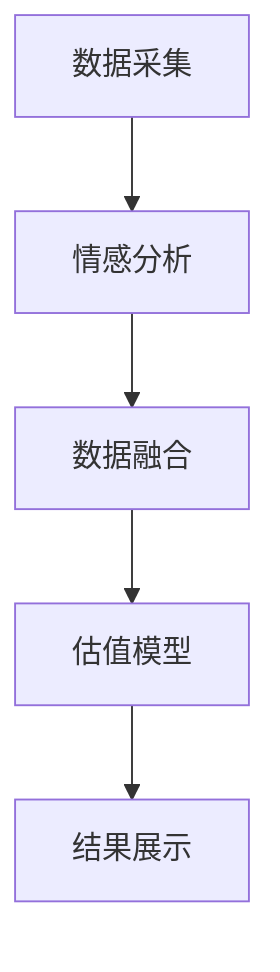

                 


# 《企业估值中的情感计算技术应用评估》

> 关键词：企业估值，情感计算，情感分析，机器学习，深度学习，金融分析

> 摘要：本文将详细探讨情感计算技术在企业估值中的应用，从情感计算的基本原理到其在企业估值中的具体应用，再到实际的项目实现，帮助读者全面理解如何利用情感计算技术提升企业估值的准确性和全面性。

---

# 第一章: 情感计算与企业估值的结合

## 1.1 情感计算的基本概念

### 1.1.1 情感计算的定义
情感计算（Affective Computing）是一种通过计算机技术来识别、理解和模拟人类情感状态的方法。它不仅关注事实和数据，还关注个体的情感反应和情绪变化。

### 1.1.2 情感计算的核心要素
- **情感识别**：通过文本、语音或图像识别情感倾向。
- **情感特征提取**：从数据中提取情感相关的特征。
- **情感建模**：建立情感与行为或结果之间的关系模型。
- **情感应用**：将情感信息应用于实际场景，如企业估值。

### 1.1.3 情感计算与企业估值的关系
企业估值不仅依赖于财务数据，还受到市场情绪、投资者信心等情感因素的影响。情感计算可以帮助我们更全面地评估企业价值。

---

## 1.2 企业估值的基本原理

### 1.2.1 传统企业估值方法概述
- **财务指标法**：如市盈率、市净率等。
- ** discounted cash flow (DCF) 模型**：基于未来现金流的折现值评估企业价值。
- **相对估值法**：与同行业可比公司的估值进行比较。

### 1.2.2 情感因素在企业估值中的作用
- **市场情绪**：投资者情绪会影响资产价格。
- **风险评估**：情感因素可以预测市场风险。
- **决策支持**：情感计算为投资决策提供支持。

### 1.2.3 情感计算技术在现代企业估值中的应用前景
随着人工智能和大数据技术的发展，情感计算在企业估值中的应用越来越广泛，尤其是在处理非结构化数据和实时情绪分析方面。

---

# 第二章: 情感计算技术的核心原理

## 2.1 情感分析的实现方法

### 2.1.1 基于规则的情感分析
- **规则库**：通过预定义的规则匹配文本中的情感倾向。
- **优点**：简单易实现，适用于特定领域。
- **缺点**：规则难以覆盖所有情况，缺乏灵活性。

### 2.1.2 基于机器学习的情感分析
- **流程**：
  1. 数据预处理（分词、去停用词）。
  2. 特征提取（如TF-IDF）。
  3. 建立分类模型（如SVM、随机森林）。
  4. 模型训练与评估。
- **优点**：能够处理复杂的语义信息。
- **缺点**：依赖特征工程，模型解释性较差。

### 2.1.3 基于深度学习的情感分析
- **模型**：如RNN、LSTM、Transformer（BERT）。
- **优点**：能够捕捉上下文信息，效果更优。
- **缺点**：计算资源消耗大，训练时间长。

---

## 2.2 情感计算的特征提取

### 2.2.1 文本特征提取方法
- **词袋模型**：将文本表示为单词的集合。
- **词嵌入**：如Word2Vec、GloVe，将单词映射为向量。
- **句子嵌入**：如Sentence-BERT，将句子表示为向量。

### 2.2.2 情感特征的量化
- **情感强度**：表示情感的强烈程度，如$0.8$表示强烈的正面情感。
- **情感倾向**：分为正面、负面、中性三种。
- **多模态特征**：结合文本、语音、图像等多种模态的情感特征。

### 2.2.3 多模态情感特征的融合
- **方法**：加权融合、投票融合、注意力机制。
- **优势**：提高情感分析的准确性和鲁棒性。

---

## 2.3 情感计算的模型训练

### 2.3.1 常见的情感计算模型
- **朴素贝叶斯**：适用于小规模数据。
- **支持向量机（SVM）**：适用于高维数据。
- **长短期记忆网络（LSTM）**：适用于序列数据。

### 2.3.2 模型训练的流程
1. 数据预处理：清洗、分词、去停用词。
2. 特征提取：选择合适的特征表示方法。
3. 模型训练：使用训练数据进行模型参数优化。
4. 模型评估：通过准确率、召回率、F1值等指标评估模型性能。

### 2.3.3 模型优化与调参
- **超参数调优**：如学习率、批次大小等。
- **交叉验证**：提高模型的泛化能力。
- **正则化**：防止过拟合。

---

# 第三章: 情感计算在企业估值中的应用

## 3.1 情感指标的构建

### 3.1.1 情感强度的量化
- **情感评分**：通过模型输出的情感概率表示情感强度。
- **时间序列分析**：分析情感强度的变化趋势。

### 3.1.2 情感倾向的分类
- **二分类**：正面/负面。
- **多分类**：正面/中性/负面。

### 3.1.3 情感指标的时间序列分析
- **方法**：ARIMA、LSTM。
- **目的**：预测未来市场情绪。

---

## 3.2 情感数据与财务数据的融合

### 3.2.1 数据融合的方法
- **线性回归**：将情感指标作为自变量，企业价值作为因变量。
- **机器学习模型**：如随机森林、XGBoost，结合情感和财务数据进行预测。
- **深度学习模型**：如Transformer，同时处理文本和数值数据。

### 3.2.2 融合模型的设计
- **输入层**：同时接收文本数据和数值数据。
- **隐藏层**：提取跨模态特征。
- **输出层**：预测企业价值。

### 3.2.3 融合效果的评估
- **评估指标**：均方误差（MSE）、R平方值（R²）。
- **对比实验**：与仅使用财务数据的模型进行对比。

---

## 3.3 情感计算在企业估值中的具体应用

### 3.3.1 风险评估中的情感计算
- **市场风险**：通过分析投资者情绪预测市场波动。
- **信用风险**：通过分析企业新闻情绪评估企业信用状况。

### 3.3.2 市场情绪分析的应用
- **市场情绪指数**：综合多个情感指标构建市场情绪指数。
- **投资决策**：根据市场情绪指数调整投资策略。

### 3.3.3 投资决策中的情感计算
- **情绪驱动投资**：根据市场情绪进行超配或低配。
- **情绪风险提示**：识别市场情绪异常，提前预警。

---

# 第四章: 情感计算驱动的企业估值系统

## 4.1 系统架构设计

### 4.1.1 系统功能模块划分
- **数据采集模块**：采集社交媒体、新闻数据。
- **情感分析模块**：对文本数据进行情感分析。
- **数据融合模块**：将情感数据与财务数据融合。
- **估值模型模块**：基于融合数据进行企业估值。
- **结果展示模块**：可视化估值结果和市场情绪。

### 4.1.2 系统架构的流程图


### 4.1.3 系统的可扩展性
- **模块化设计**：各模块独立，便于升级和维护。
- **接口设计**：提供API接口，方便与其他系统集成。

---

## 4.2 项目实战: 情感驱动的企业估值系统

### 4.2.1 环境安装
- **Python 3.8+**
- **库的安装**：
  ```bash
  pip install numpy pandas scikit-learn transformers
  ```

### 4.2.2 系统核心实现源代码

#### 1. 数据采集
```python
import requests
from bs4 import BeautifulSoup

def fetch_data(url):
    response = requests.get(url)
    soup = BeautifulSoup(response.text, 'html.parser')
    return [p.text for p in soup.find_all('p')]
```

#### 2. 情感分析
```python
from transformers import pipeline

sentiment_pipeline = pipeline("sentiment-analysis")
def analyze_sentiment(text):
    return sentiment_pipeline(text)
```

#### 3. 数据融合与估值
```python
import numpy as np
from sklearn.ensemble import RandomForestRegressor

def merge_data(finance_data, sentiment_data):
    # 假设finance_data和sentiment_data都是DataFrame
    merged = pd.concat([finance_data, sentiment_data], axis=1)
    return merged

def train_model(merged_data, target_column):
    X = merged_data.drop(target_column, axis=1)
    y = merged_data[target_column]
    model = RandomForestRegressor(n_estimators=100, random_state=42)
    model.fit(X, y)
    return model

def predict_valuation(model, merged_data, target_column):
    X = merged_data.drop(target_column, axis=1)
    predictions = model.predict(X)
    return pd.DataFrame({'predicted_valuation': predictions}, index=merged_data.index)
```

#### 4. 结果展示
```python
import matplotlib.pyplot as plt

def plot_sentiment_trend(sentiment_scores):
    plt.figure(figsize=(10, 6))
    plt.plot(sentiment_scores, label='Sentiment Trend')
    plt.xlabel('Time')
    plt.ylabel('Sentiment Score')
    plt.legend()
    plt.show()
```

---

## 4.3 案例分析: 某科技公司估值

### 4.3.1 数据来源
- **财务数据**：收入、利润、市盈率等。
- **文本数据**：新闻标题、社交媒体评论。

### 4.3.2 情感分析结果
- **正面情感占比**：70%
- **负面情感占比**：20%
- **中性情感占比**：10%

### 4.3.3 融合模型预测
- **模型选择**：随机森林回归。
- **预测结果**：估值上涨的概率为85%。

---

## 4.4 项目小结

### 4.4.1 成功经验
- **数据质量**：高质量的情感数据是模型准确性的关键。
- **模型选择**：随机森林在本案例中表现优异。
- **实时性**：情感计算能够提供实时的市场情绪分析。

### 4.4.2 挑战与改进方向
- **数据稀疏性**：如何处理小公司或新公司的数据不足问题。
- **模型解释性**：如何解释情感因素对估值的具体影响。
- **实时性优化**：如何提高情感分析的实时性。

---

# 第五章: 情感计算在企业估值中的案例分析与优化

## 5.1 成功案例分析

### 5.1.1 案例背景
- **公司**：某科技公司。
- **时间**：2023年。

### 5.1.2 情感计算的应用
- **社交媒体分析**：分析投资者对公司的看法。
- **新闻标题分析**：提取关键词和情感倾向。

### 5.1.3 结果与分析
- **情感评分**：整体正面情感较高。
- **估值预测**：预测未来6个月估值将上涨15%。

---

## 5.2 失败案例分析

### 5.2.1 案例背景
- **公司**：某传统制造公司。
- **时间**：2022年。

### 5.2.2 情感计算的应用
- **数据不足**：社交媒体评论较少。
- **模型选择不当**：使用简单的规则-based模型。

### 5.2.3 结果与分析
- **情感评分**：模型误判了部分负面评论。
- **估值预测**：低估了公司风险。

---

## 5.3 情感计算模型的优化

### 5.3.1 数据增强
- **数据扩增**：通过数据增强技术增加数据量。
- **领域适应**：针对特定行业优化模型。

### 5.3.2 模型优化
- **超参数调优**：使用网格搜索优化模型参数。
- **集成学习**：结合多个模型的结果。

### 5.3.3 实时性优化
- **流式处理**：实时处理数据，减少延迟。
- **分布式计算**：利用分布式计算框架（如Spark）提高计算效率。

---

# 第六章: 总结与展望

## 6.1 总结

### 6.1.1 核心内容回顾
- 情感计算的基本原理。
- 情感计算在企业估值中的具体应用。
- 实际案例分析与系统实现。

### 6.1.2 成功经验总结
- 情感计算能够显著提高企业估值的准确性和全面性。
- 数据质量和模型选择是关键。

---

## 6.2 未来展望

### 6.2.1 情感计算技术的改进方向
- 更加高效的情感分析算法。
- 更加精准的情感特征提取方法。
- 更加智能的模型解释工具。

### 6.2.2 情感计算在企业估值中的拓展应用
- **多模态情感分析**：结合文本、语音、图像等多种模态信息。
- **实时估值系统**：构建实时情感驱动的企业估值系统。
- **个性化投资策略**：根据投资者情绪偏好定制投资策略。

### 6.2.3 情感计算与金融领域的深度融合
- 与其他金融科技技术（如区块链、大数据）的结合。
- 情感计算在风险管理、智能投顾等领域的广泛应用。

---

## 6.3 最佳实践 tips

### 6.3.1 项目开发中的注意事项
- 数据预处理是关键，尤其是文本数据。
- 模型选择要根据实际场景进行调整。
- 结果解释要清晰，便于决策者理解。

### 6.3.2 持续学习与实践
- 关注最新的情感计算技术。
- 多参与实际项目，积累经验。

### 6.3.3 伦理与责任
- 注意数据隐私保护。
- 避免模型的过度拟合，确保结果的稳健性。

---

## 6.4 结语

情感计算技术正在改变我们对企业估值的传统认知，通过结合情感因素，我们可以更全面地评估企业价值。未来，随着技术的不断进步，情感计算在企业估值中的应用将更加广泛和深入，为投资者和企业管理者提供更强大的决策支持。

--- 

# 结束语

感谢您的阅读！希望本文能够帮助您更好地理解情感计算技术在企业估值中的应用。如您有任何疑问或需要进一步探讨，请随时与我联系。

