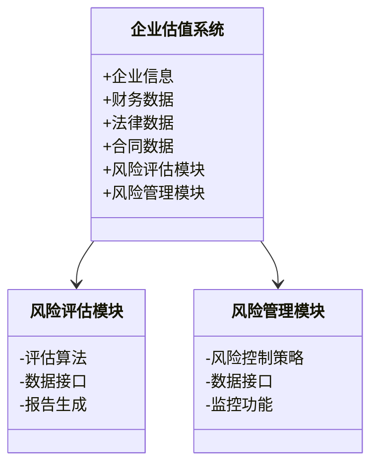
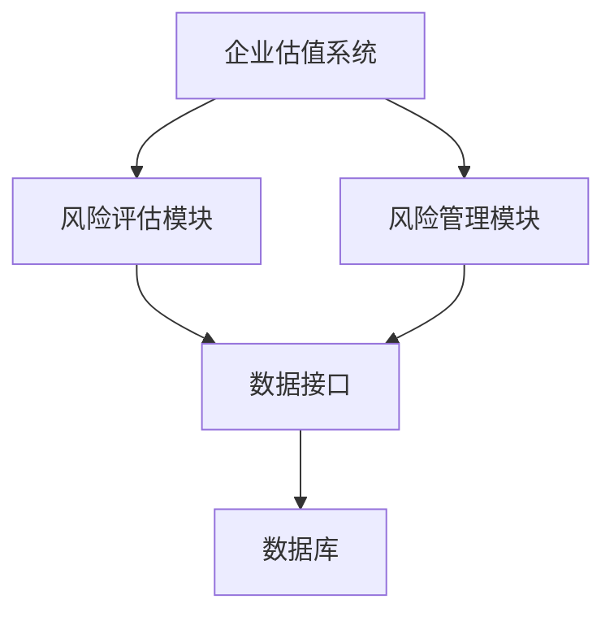

                 


# 企业估值中的或有负债处理方法

> 关键词：企业估值，或有负债，风险管理，财务模型，法律影响

> 摘要：或有负债是企业在经营过程中可能产生的潜在负债，其处理方法直接影响企业估值和财务健康。本文从或有负债的定义、分类、识别方法入手，结合财务模型、法律影响和风险管理策略，详细阐述了企业在估值过程中处理或有负债的最佳实践。通过实际案例分析和系统架构设计，本文为读者提供了从理论到实践的全面指导。

---

## 第1章: 或有负债的基本概念与分类

### 1.1 或有负债的定义与特征

#### 1.1.1 或有负债的定义
或有负债（Contingent Liabilities）是指企业在未来可能发生的债务，其存在取决于某些特定条件的满足。这些条件可能涉及法律诉讼、合同纠纷、担保责任或其他不确定性事件。

#### 1.1.2 或有负债的分类
| 分类标准 | 类型             | 描述                                                                 |
|----------|------------------|----------------------------------------------------------------------|
| 性质     | 纯粹或有负债     | 仅涉及企业自身，如未决诉讼、产品质量问题等。                                         |
|          | 关联方或有负债   | 涉及关联方的债务，如担保、连带责任等。                                                 |
| 期限     | 短期或有负债     | 可能在未来一年内发生的债务。                                                         |
|          | 长期或有负债     | 可能在未来一年以上发生的债务。                                                       |
| 影响     | 重大或有负债     | 可能对企业的财务状况或经营结果产生重大影响。                                         |
|          | 一般或有负债     | 对企业的影响较小或不确定性较高。                                                     |

#### 1.1.3 或有负债与其它负债的对比
以下是或有负债与其他负债的对比分析：

| 对比维度 | 或有负债             | 确定性负债         |
|----------|----------------------|--------------------|
| 确定性   | 不确定，取决于特定条件 | 确定，已发生或即将发生 |
| 时间性   | 可能在未来发生      | 当前已发生或明确将发生 |
| 金额     | 不确定或可估计       | 金额明确或可计量     |
| 影响性   | 可能对企业估值影响大 | 对企业估值影响较小   |

---

### 1.2 或有负债在企业估值中的重要性

#### 1.2.1 或有负债对企业价值的影响
或有负债可能影响企业的财务健康状况，进而影响其估值。例如，未决诉讼可能导致企业面临巨额赔偿，从而降低企业价值。

#### 1.2.2 或有负债的潜在风险与机会
或有负债可能隐藏着风险，但也可能为企业提供机会。例如，通过合理的风险管理，企业可以将潜在负债转化为竞争优势。

#### 1.2.3 或有负债在企业并购中的作用
在企业并购中，或有负债的处理是谈判的重要内容。买方需要评估目标企业的或有负债，以避免潜在风险。

---

## 第2章: 或有负债的法律与税务影响

### 2.1 或有负债的法律属性

#### 2.1.1 或有负债的法律定义
或有负债在法律上通常被视为一种潜在的债务，其存在取决于特定条件的满足。例如，合同中的担保条款可能构成或有负债。

#### 2.1.2 或有负债的法律后果
或有负债可能引发法律纠纷，如诉讼、仲裁或其他法律程序。企业在处理或有负债时，需要考虑法律后果对企业估值的影响。

#### 2.1.3 或有负债的法律风险管理
企业应通过法律顾问、保险等方式，降低或有负债的法律风险。

### 2.2 或有负债的税务处理

#### 2.2.1 或有负债的税务定义
或有负债在税务上的处理通常较为复杂，可能涉及递延税款或其他税务调整。

#### 2.2.2 或有负债的税务影响
或有负债可能影响企业的税务负担，例如，未决诉讼可能导致企业计提准备金，从而减少应纳税所得额。

#### 2.2.3 或有负债的税务风险管理
企业应通过合理的税务规划，降低或有负债的税务影响。

---

## 第3章: 或有负债的识别与评估方法

### 3.1 或有负债的识别方法

#### 3.1.1 财务报表分析法
通过分析企业的财务报表，识别潜在的或有负债。例如，检查资产负债表中的未决诉讼、担保等事项。

#### 3.1.2 合同审查法
审查企业的合同，识别可能引发或有负债的条款，例如担保、连带责任等。

#### 3.1.3 事件驱动法
通过关注企业的经营环境，识别可能引发或有负债的事件，例如诉讼、环保问题等。

### 3.2 或有负债的评估方法

#### 3.2.1 蒙特卡洛模拟法
通过蒙特卡洛模拟，评估或有负债的可能金额和发生概率。例如，模拟不同情景下的负债金额。

#### 3.2.2 情景分析法
通过情景分析，评估或有负债在不同情况下的影响。例如，分析最乐观、最可能、最悲观三种情景。

#### 3.2.3 贝叶斯概率法
通过贝叶斯概率，更新或有负债的概率分布，基于新的信息调整初始评估。

---

## 第4章: 或有负债的风险管理与控制

### 4.1 或有负债的风险识别

#### 4.1.1 风险来源分析
识别可能引发或有负债的风险来源，例如法律纠纷、环保问题等。

#### 4.1.2 风险影响评估
评估或有负债对企业的财务状况和经营结果的影响，例如可能的损失金额、影响范围等。

#### 4.1.3 风险优先级排序
根据风险的影响程度和发生概率，对风险进行优先级排序。

### 4.2 或有负债的风险控制策略

#### 4.2.1 风险规避策略
通过调整经营策略，避免潜在的或有负债。例如，避免签订可能引发连带责任的合同。

#### 4.2.2 风险转移策略
通过保险、担保等方式，将风险转移给第三方。例如，购买责任保险，将部分风险转移给保险公司。

#### 4.2.3 风险缓解策略
通过内部管理措施，降低或有负债的发生概率。例如，加强合同审查，避免签订不合理条款。

---

## 第5章: 或有负债的财务处理与报告

### 5.1 或有负债的财务处理方法

#### 5.1.1 或有负债的确认与计量
根据会计准则，确认或有负债的存在，并合理计量其金额。例如，计提相应的准备金。

#### 5.1.2 或有负债的列报与披露
在财务报表中，按照会计准则的要求，披露或有负债的相关信息。例如，在附注中详细说明或有负债的性质和金额。

#### 5.1.3 或有负债的财务影响分析
分析或有负债对企业财务状况和经营结果的影响，例如对净利润、现金流的影响。

### 5.2 或有负债的财务风险管理

#### 5.2.1 财务风险的识别与评估
识别可能引发或有负债的财务风险，评估其影响程度。

#### 5.2.2 财务风险的控制与缓解
通过合理的财务策略，降低或有负债的财务影响。例如，通过融资手段，改善资本结构，降低财务风险。

#### 5.2.3 财务风险管理的案例分析
通过实际案例，分析企业如何通过财务风险管理，降低或有负债的影响。

---

## 第6章: 或有负债处理的系统架构与算法实现

### 6.1 系统需求分析

#### 6.1.1 问题场景介绍
企业需要一个系统，用于识别、评估和管理或有负债。系统需要支持多维度的分析和预测。

#### 6.1.2 项目目标设定
开发一个智能化的或有负债管理系统，支持企业进行风险评估和管理。

#### 6.1.3 项目范围界定
系统需要涵盖或有负债的识别、评估、报告和风险管理功能。

### 6.2 系统功能设计

#### 6.2.1 领域模型设计
以下是或有负债管理系统的领域模型设计：



#### 6.2.2 系统架构设计
以下是或有负债管理系统的架构设计：

```mermaid
client
    --> server
    server
        --> 数据库
        --> 应用逻辑
            --> 算法模块
            --> 报告生成模块
```

### 6.3 算法与数学模型

#### 6.3.1 算法实现
以下是蒙特卡洛模拟的Python代码示例：

```python
import random

def monte_carlo_simulation(iterations=10000):
    results = []
    for _ in range(iterations):
        # 模拟或有负债金额
        liability = random.uniform(0, 100)
        results.append(liability)
    return results

# 执行模拟
results = monte_carlo_simulation()
# 计算平均值
average_liability = sum(results) / len(results)
print(f"平均或有负债金额为：{average_liability}")
```

#### 6.3.2 数学公式
以下是蒙特卡洛模拟的概率密度函数：

$$
f(x) = \frac{1}{b-a} \quad \text{其中} \quad a \leq x \leq b
$$

---

## 第7章: 项目实战与案例分析

### 7.1 环境安装

#### 7.1.1 系统环境
需要安装Python、Jupyter Notebook、Mermaid工具等。

### 7.2 核心实现

#### 7.2.1 风险评估模块实现
以下是风险评估模块的Python代码：

```python
import pandas as pd
import numpy as np

# 模拟数据
data = {
    '项目': ['A', 'B', 'C', 'D'],
    '或有负债金额': [50, 30, 70, 40],
    '概率': [0.2, 0.3, 0.1, 0.4]
}

df = pd.DataFrame(data)

# 计算期望值
expected_liability = np.sum(df['或有负债金额'] * df['概率'])
print(f"期望或有负债金额为：{expected_liability}")
```

#### 7.2.2 系统架构实现
以下是系统架构的Mermaid图：



### 7.3 案例分析

#### 7.3.1 案例背景
某企业面临一项未决诉讼，可能需要承担500万元的赔偿责任，概率为20%。

#### 7.3.2 案例分析
使用蒙特卡洛模拟评估或有负债的期望值：

$$
E = 500 \times 0.2 = 100 \text{万元}
$$

### 7.4 代码解读与分析

#### 7.4.1 风险评估模块代码解读
上述Python代码通过模拟数据，计算或有负债的期望值，帮助企业在估值过程中量化或有负债的影响。

---

## 第8章: 小结与展望

### 8.1 小结
本文从或有负债的定义、分类、识别方法入手，结合财务模型、法律影响和风险管理策略，详细阐述了企业在估值过程中处理或有负债的最佳实践。通过实际案例分析和系统架构设计，本文为读者提供了从理论到实践的全面指导。

### 8.2 注意事项
企业在处理或有负债时，应充分考虑法律、税务和财务风险，避免低估或忽略潜在负债的影响。

### 8.3 拓展阅读
建议读者进一步阅读以下内容：
- 财务风险管理相关书籍
- 法律风险与企业估值
- 蒙特卡洛模拟在金融领域的应用

---

通过本文的分析，读者可以全面了解或有负债的处理方法，并能够在实际工作中灵活应用这些方法，提升企业的估值准确性和风险管理能力。

