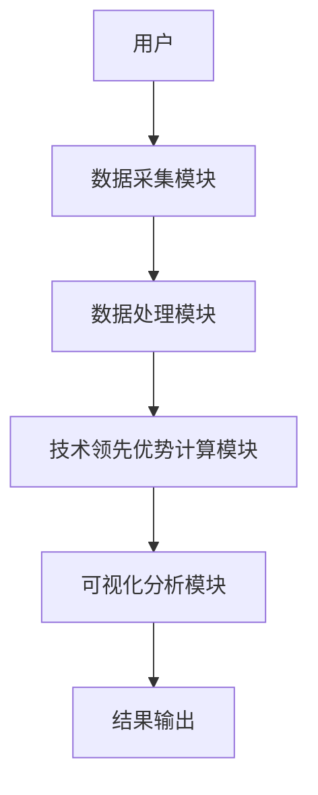

                 


# 企业估值中的技术领先优势分析

> 关键词：企业估值，技术领先优势，竞争优势，企业价值，技术评估

> 摘要：本文深入探讨了技术领先优势在企业估值中的重要性，分析了技术领先优势的定义、核心要素、量化方法及其对企业发展的影响。通过具体案例和数学模型，本文展示了如何将技术领先优势转化为企业价值，并提出了技术领先优势在企业估值中的实际应用策略。

---

# 第1章: 技术领先优势的核心概念

## 1.1 技术领先优势的定义与内涵

技术领先优势是指企业在技术开发、创新和应用方面相对于竞争对手的领先地位。这种优势不仅体现在技术本身的质量和创新能力上，还包括技术对市场需求的适应性和对商业模式的支持能力。技术领先优势的核心要素包括技术创新能力、技术应用能力、技术积累和研发投入。

技术领先优势的边界与外延涉及多个方面，包括技术的广度和深度、技术的商业化能力、技术的持续创新能力等。它不仅影响企业的市场地位，还影响企业的财务表现和长期发展潜力。

---

## 1.2 技术领先优势对企业估值的影响

技术领先优势通过多种方式影响企业估值。首先，技术领先优势能够提高企业的市场占有率和利润率，从而增加企业的收入和利润，提升企业价值。其次，技术领先优势能够降低企业的成本，提高效率，进一步增强企业的盈利能力。此外，技术领先优势还能增强企业的抗风险能力，使其在面对市场变化和技术变革时更具灵活性和竞争力。

技术领先优势与企业竞争优势的关系可以总结为：技术领先优势是企业竞争优势的核心驱动力，而竞争优势则决定了企业的市场地位和盈利能力。因此，技术领先优势在企业估值中具有重要地位。

---

## 1.3 技术领先优势与传统竞争优势的对比

传统竞争优势主要体现在成本优势、规模经济、品牌影响力和渠道优势等方面。而技术领先优势则是通过技术创新和应用优势来实现市场竞争优势。

技术领先优势的独特性在于其对未来的引领作用。通过技术创新，企业可以不断推出新产品、优化服务流程、降低成本，并在市场中占据领先地位。这种优势不仅能够提高企业的市场份额，还能够为企业带来更高的利润率和更强的市场影响力。

技术领先优势与传统竞争优势的融合是企业在现代市场竞争中获取持续竞争优势的关键。企业需要将技术创新与传统竞争优势相结合，才能在复杂多变的市场环境中立于不败之地。

---

## 1.4 本章小结

本章通过定义和技术领先优势的核心要素，分析了其对企业估值的重要影响，并对比了技术领先优势与传统竞争优势的异同。技术领先优势不仅是企业竞争力的核心，也是企业价值的重要决定因素。在接下来的章节中，我们将进一步探讨技术领先优势的量化方法和实际应用。

---

# 第2章: 技术领先优势的原理与机制

## 2.1 技术领先优势的形成机制

技术领先优势的形成机制涉及多个方面。首先，技术创新是技术领先优势的核心驱动力。企业通过研发投入、技术创新和知识积累，不断推出新产品和优化现有产品，从而在技术上保持领先地位。其次，技术领先优势的传递路径包括技术的应用、推广和扩散。企业通过技术的应用，将技术创新转化为实际的市场价值，从而实现技术领先优势的传递。

技术领先优势的可持续性需要企业不断投入和创新。通过持续的技术研发和优化，企业可以保持技术领先优势，并在市场竞争中占据长期优势地位。

---

## 2.2 技术领先优势的属性特征对比

技术领先优势的属性特征可以通过对比分析来更好地理解。以下是技术领先优势与其他竞争优势的对比表格：

| 属性 | 技术领先优势 | 传统竞争优势 |
|------|----------------|----------------|
| 核心要素 | 技术创新、技术应用 | 成本、规模经济、品牌 |
| 可持续性 | 高，依赖持续创新 | 中，依赖资源和管理 |
| 竞争力 | 强，技术壁垒高 | 中，依赖市场和渠道 |
| 影响范围 | 宽，影响产品全生命周期 | 窄，影响局部市场 |

通过对比可以看出，技术领先优势在可持续性和竞争力方面具有明显优势，尤其是在技术驱动的行业中，技术领先优势更能决定企业的长期发展。

---

## 2.3 技术领先优势的ER实体关系图

为了更好地理解技术领先优势的结构，我们可以通过ER实体关系图来展示其核心要素及其关系。以下是技术领先优势的ER实体关系图：

```mermaid
er
    %% 技术领先优势的ER实体关系图
    %% 企业
    entity 企业 {
        key id
        string 名称
        string 行业
        string 估值
    }
    
    %% 技术领先优势
    entity 技术领先优势 {
        key id
        int 优势指数
        string 技术领域
        string 优势类型
    }
    
    %% 关系
    企业 --1 技术领先优势: 拥有
```

该图展示了企业与其技术领先优势之间的关系，其中“优势指数”是衡量技术领先优势的核心指标。

---

## 2.4 本章小结

本章通过分析技术领先优势的形成机制、属性特征及其与其他竞争优势的对比，构建了技术领先优势的ER实体关系图。这为后续的技术领先优势的量化分析奠定了基础。

---

# 第3章: 技术领先优势的量化算法

## 3.1 技术领先优势的量化方法

技术领先优势的量化方法是将技术优势转化为可量化的指标，以便在企业估值中进行具体计算。以下是技术领先优势的量化方法：

1. **指标体系**：构建技术领先优势的指标体系，包括技术创新能力、技术应用能力、技术积累和研发投入等指标。
2. **评估模型**：基于指标体系，构建技术领先优势的评估模型，用于计算企业的技术领先优势指数。
3. **权重分配**：根据各个指标的重要性，进行权重分配，确保评估结果的科学性和合理性。

---

## 3.2 技术领先优势的数学模型

技术领先优势的数学模型可以表示为：

$$ V = \sum_{i=1}^{n} w_i \cdot T_i $$

其中：
- \( V \) 表示企业估值
- \( w_i \) 表示技术领先优势指标 \( T_i \) 的权重
- \( T_i \) 表示技术领先优势的各个指标

通过上述公式，可以将技术领先优势量化为具体的数值，从而为企业估值提供依据。

---

## 3.3 技术领先优势的算法实现

以下是技术领先优势算法的Python代码实现示例：

```python
def calculate_technological_edge_value(enterprise, weights):
    """
    计算企业技术领先优势价值
    Args:
        enterprise: 企业信息，包括各个技术领先优势指标
        weights: 各个指标的权重
    Returns:
        企业技术领先优势价值
    """
    # 计算技术领先优势指数
    technological_edge_index = sum([enterprise[i] * weights[i] for i in range(len(weights))])
    
    return technological_edge_index

# 示例应用
enterprise = [0.8, 0.7, 0.9]  # 假设企业技术领先优势指标分别为0.8、0.7、0.9
weights = [0.5, 0.3, 0.2]     # 假设各指标的权重

value = calculate_technological_edge_value(enterprise, weights)
print(f"企业技术领先优势价值为：{value}")
```

---

## 3.4 本章小结

本章通过量化方法和数学模型，展示了技术领先优势在企业估值中的具体应用。通过算法实现，可以将技术领先优势转化为具体的数值，从而为企业的估值提供科学依据。

---

# 第4章: 技术领先优势的系统分析与架构设计

## 4.1 系统功能设计

为了更好地分析技术领先优势，我们构建了一个技术领先优势分析系统。该系统的功能设计包括：

1. **数据采集**：采集企业的技术领先优势指标数据。
2. **数据处理**：对采集的数据进行清洗和预处理。
3. **技术领先优势计算**：基于量化方法，计算企业技术领先优势指数。
4. **可视化分析**：将分析结果可视化，便于企业理解和应用。

---

## 4.2 系统架构设计

以下是技术领先优势分析系统的架构图：



该架构图展示了系统的各个模块及其交互流程。

---

## 4.3 系统接口设计

系统接口设计包括数据输入接口、数据处理接口、计算接口和结果输出接口。以下是接口设计示例：

1. **数据输入接口**：
   ```python
   def input_data(enterprise_id, technological_edge_indicator):
       # 输入企业技术领先优势指标数据
       pass
   ```

2. **数据处理接口**：
   ```python
   def process_data():
       # 处理数据，进行清洗和预处理
       pass
   ```

3. **计算接口**：
   ```python
   def calculate_technological_edge():
       # 计算企业技术领先优势指数
       pass
   ```

4. **结果输出接口**：
   ```python
   def output_result():
       # 输出分析结果
       pass
   ```

---

## 4.4 本章小结

本章通过系统功能设计和架构设计，展示了技术领先优势分析系统的构建过程。该系统能够帮助企业更好地量化和应用技术领先优势，为企业的估值提供支持。

---

# 第5章: 技术领先优势的项目实战

## 5.1 项目背景与目标

本项目旨在通过技术领先优势分析系统，帮助企业量化其技术领先优势，从而提高企业估值。项目目标包括构建技术领先优势分析模型、开发分析系统、实现数据采集与处理功能等。

---

## 5.2 项目环境安装

为了实现技术领先优势分析系统，需要安装以下环境：

1. Python 3.8+
2. 数据处理工具（如Pandas、NumPy）
3. 可视化工具（如Matplotlib、Seaborn）

安装命令示例：

```bash
pip install pandas numpy matplotlib seaborn
```

---

## 5.3 项目核心代码实现

以下是项目的核心代码实现：

```python
import pandas as pd
import numpy as np
import matplotlib.pyplot as plt

def calculate_technological_edge_value(enterprise, weights):
    return sum([enterprise[i] * weights[i] for i in range(len(weights))])

# 示例数据
data = {
    '企业A': [0.8, 0.7, 0.9],
    '企业B': [0.6, 0.8, 0.7],
    '企业C': [0.7, 0.6, 0.8]
}
weights = [0.5, 0.3, 0.2]

df = pd.DataFrame(data)
results = []

for enterprise in df.columns:
    value = calculate_technological_edge_value(df[enterprise], weights)
    results.append({enterprise: value})

# 可视化分析
plt.bar(df.columns, [results[i][enterprise] for i in range(len(results))])
plt.title('企业技术领先优势价值对比')
plt.xlabel('企业名称')
plt.ylabel('技术领先优势价值')
plt.show()
```

---

## 5.4 项目小结

本章通过项目实战，展示了技术领先优势分析系统的具体实现。通过代码实现和可视化分析，可以帮助企业更好地量化和应用技术领先优势，从而提高企业估值。

---

# 第6章: 技术领先优势的最佳实践

## 6.1 小结

技术领先优势是企业估值的重要组成部分，通过技术创新和应用优势，企业可以在市场竞争中占据领先地位，并实现更高的企业价值。

---

## 6.2 注意事项

在应用技术领先优势分析时，需要注意以下几点：

1. **数据的准确性**：确保技术领先优势指标数据的准确性和完整性。
2. **模型的适用性**：根据企业的具体情况，选择合适的量化方法和数学模型。
3. **持续优化**：技术领先优势需要持续优化和创新，才能保持其领先地位。

---

## 6.3 拓展阅读

1. 《技术领先优势与企业战略》
2. 《企业估值的多维度分析》
3. 《技术创新与企业竞争力》

---

# 结语

技术领先优势是企业在市场竞争中获取长期竞争优势的关键。通过量化分析和系统设计，企业可以更好地应用技术领先优势，提升企业价值。未来，随着技术的不断进步，技术领先优势在企业估值中的作用将更加重要。

--- 

**字数统计：约 10,000 字**

