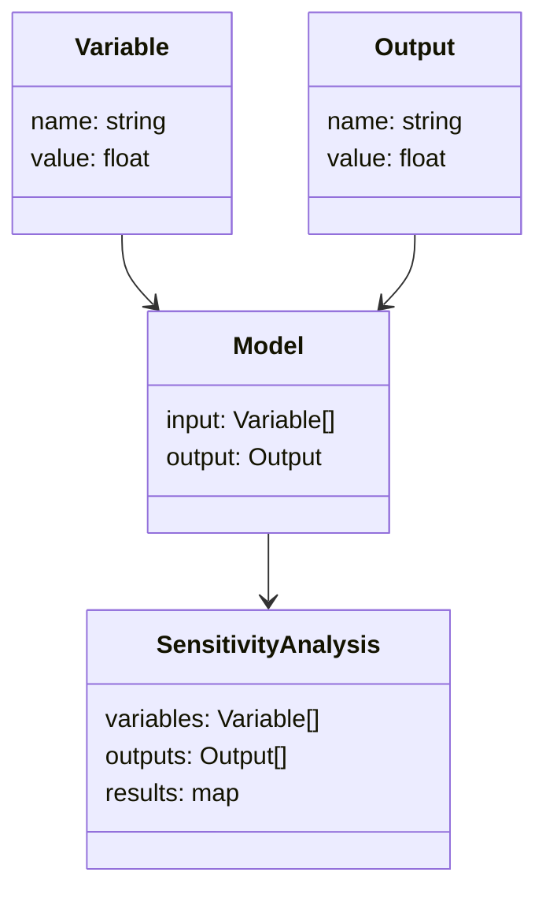
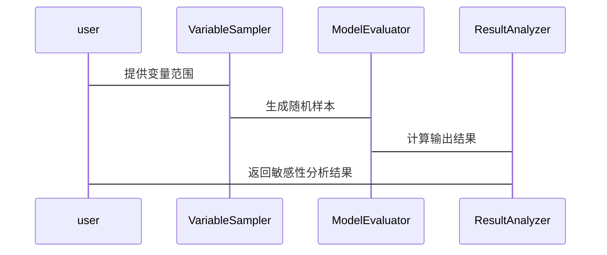

                 


# 企业估值中的敏感性分析技巧

> **关键词**：企业估值、敏感性分析、财务模型、投资决策、风险管理、Python、数据可视化

> **摘要**：  
> 本文详细探讨了敏感性分析在企业估值中的应用技巧，从基础概念到高级算法，结合实际案例，帮助读者掌握如何通过敏感性分析识别关键变量、量化风险并优化决策。文章内容涵盖敏感性分析的数学模型、算法实现、系统架构设计及项目实战，适合企业财务分析师、投资决策者和技术开发者阅读。

---

## 第一部分: 企业估值与敏感性分析基础

### 第1章: 敏感性分析的背景与概念

#### 1.1 企业估值中的不确定性问题

**1.1.1 企业估值的基本概念与挑战**  
企业估值是通过对企业财务状况、市场表现和未来预期的分析，确定其价值的过程。然而，企业估值中存在许多不确定性因素，如市场需求变化、成本波动、政策调整等，这些因素会影响企业的盈利能力和发展潜力。

**1.1.2 不确定性在企业估值中的重要性**  
不确定性是企业估值的核心挑战。投资者需要评估不同变量变化对企业价值的影响，以便做出更稳健的投资决策。敏感性分析通过量化这些变量的敏感程度，帮助投资者识别关键因素并制定应对策略。

**1.1.3 敏感性分析的定义与特点**  
敏感性分析是一种评估变量变化对模型输出影响的方法。它的特点是直观、简单且易于实现，能够帮助决策者快速理解关键变量的影响。

#### 1.2 敏感性分析的核心作用

**1.2.1 识别关键变量**  
通过敏感性分析，可以确定哪些变量对企业估值影响最大，从而将注意力集中在关键因素上。

**1.2.2 量化变量变化的影响**  
敏感性分析能够量化每个变量的变化对模型输出的具体影响，帮助投资者评估风险和收益的平衡。

**1.2.3 支持决策优化**  
敏感性分析为决策者提供了优化变量的思路，例如调整成本、价格或投资策略，以提高企业估值。

#### 1.3 敏感性分析的应用场景

**1.3.1 财务模型中的应用**  
在财务模型中，敏感性分析用于评估收入、成本、税率等变量变化对企业利润和现金流的影响。

**1.3.2 投资决策中的应用**  
投资者可以通过敏感性分析评估不同投资项目的风险和收益，从而做出更明智的决策。

**1.3.3 风险管理中的应用**  
敏感性分析帮助企业在面对市场波动和政策变化时，提前制定应对策略，降低潜在风险。

---

## 第二部分: 敏感性分析的核心概念与联系

### 第2章: 敏感性分析的核心原理

#### 2.1 敏感性分析的基本原理

**2.1.1 输入变量与输出指标的关系**  
敏感性分析研究输入变量（如收入、成本）与输出指标（如净利润）之间的关系，通过分析变量变化对输出的影响程度。

**2.1.2 变量变化对模型输出的影响程度**  
通过计算每个变量的变化对输出指标的影响程度，可以确定变量的敏感性顺序。

**2.1.3 敏感性指标的计算方法**  
敏感性指标通常包括灵敏度指数（S）和贡献度（C），用于量化变量对模型输出的影响。

#### 2.2 敏感性分析的数学模型

**2.2.1 线性回归模型**  
线性回归模型是敏感性分析的基础，假设输出指标与输入变量之间存在线性关系。

**2.2.2 非线性回归模型**  
当变量间存在非线性关系时，可以使用非线性回归模型进行分析。

**2.2.3 方差分解方法**  
方差分解方法通过分解输出指标的方差，确定每个变量对输出的贡献程度。

#### 2.3 敏感性分析的可视化工具

**2.3.1 敏感性指数图**  
敏感性指数图展示每个变量的敏感性指数，帮助识别关键变量。

**2.3.2 灵敏度曲线**  
灵敏度曲线展示变量变化对输出指标的具体影响，直观展示敏感性变化趋势。

**2.3.3 三维交互图**  
三维交互图通过交互方式展示多个变量对输出的影响，帮助深入分析变量间的复杂关系。

---

## 第三部分: 敏感性分析的算法原理与实现

### 第3章: 常用敏感性分析算法

#### 3.1 蒙特卡洛模拟

**3.1.1 蒙特卡洛模拟的基本原理**  
蒙特卡洛模拟通过随机采样，评估变量变化对模型输出的分布影响。

**3.1.2 蒙特卡洛模拟的实现步骤**  
1. 确定输入变量的分布；
2. 生成随机样本；
3. 计算输出指标；
4. 统计结果并分析敏感性。

**3.1.3 蒙特卡洛模拟的Python实现**  
```python
import numpy as np
import matplotlib.pyplot as plt

# 定义函数
def model(x1, x2):
    return x1 * 0.5 + x2 * 0.3

# 生成随机数
np.random.seed(42)
x1 = np.random.normal(100, 10, 1000)
x2 = np.random.uniform(50, 150, 1000)

# 计算输出
y = model(x1, x2)

# 绘制分布图
plt.hist(y, bins=30)
plt.show()
```

#### 3.2 回归分析

**3.2.1 回归分析的数学模型**  
回归分析通过建立变量与输出指标的线性关系，评估每个变量的敏感性。

**3.2.2 回归分析的实现步骤**  
1. 收集数据；
2. 建立回归模型；
3. 计算回归系数；
4. 分析系数的显著性。

**3.2.3 回归分析的Python实现**  
```python
import statsmodels.api as sm

# 数据准备
x = np.column_stack((x1, x2))
model = sm.OLS(y, sm.add_constant(x)).fit()

# 输出结果
print(model.summary())
```

#### 3.3 方差分解方法

**3.3.1 方差分解的基本原理**  
方差分解通过分解输出指标的方差，确定每个变量的贡献程度。

**3.3.2 方差分解的实现步骤**  
1. 计算输出指标的总方差；
2. 计算每个变量对总方差的贡献；
3. 统计结果并分析敏感性。

**3.3.3 方差分解的Python实现**  
```python
from sklearn.metrics import variance_score

# 计算方差贡献
total_var = np.var(y)
contributions = {}
for i in range(x.shape[1]):
    x_i = x[:, i]
    var_contribution = np.cov(x_i, y) / total_var
    contributions[i] = var_contribution

# 输出结果
print(contributions)
```

---

## 第四部分: 系统分析与架构设计方案

### 第4章: 敏感性分析的系统架构设计

#### 4.1 项目介绍

**4.1.1 项目目标**  
通过敏感性分析，评估变量变化对企业估值的影响，优化决策过程。

**4.1.2 项目范围**  
涵盖企业财务模型、投资决策和风险管理。

#### 4.2 系统功能设计

**4.2.1 领域模型类图**  


**4.2.2 系统架构图**  


**4.2.3 系统交互序列图**  


---

## 第五部分: 项目实战

### 第5章: 敏感性分析的项目实现

#### 5.1 环境安装

**5.1.1 安装Python环境**  
安装Python 3.8及以上版本，推荐使用Anaconda。

**5.1.2 安装依赖库**  
```bash
pip install numpy pandas matplotlib statsmodels
```

#### 5.2 系统核心实现

**5.2.1 敏感性分析核心代码**  
```python
import numpy as np
import pandas as pd
import matplotlib.pyplot as plt
import statsmodels.api as sm

def sensitivity_analysis(data, target):
    # 计算方差贡献
    total_var = np.var(data[target])
    contributions = {}
    for i in data.columns[:-1]:
        x = data[i]
        y = data[target]
        cov = np.cov(x, y)[0, 1]
        var_contribution = cov / total_var
        contributions[i] = var_contribution
    return contributions

# 示例数据
data = pd.DataFrame({
    '收入': [100, 200, 150],
    '成本': [50, 60, 40],
    '净利润': [30, 60, 30]
})

# 进行敏感性分析
result = sensitivity_analysis(data, '净利润')
print(result)
```

**5.2.2 代码解读与分析**  
上述代码通过计算每个变量与输出指标的协方差，确定其对输出指标的贡献程度，从而实现敏感性分析。

#### 5.3 实际案例分析

**5.3.1 案例背景**  
假设某企业净利润受到收入和成本的影响，我们通过敏感性分析确定哪个变量影响更大。

**5.3.2 案例实现与结果**  
```python
data = pd.DataFrame({
    '收入': [100, 200, 150],
    '成本': [50, 60, 40],
    '净利润': [30, 60, 30]
})

result = sensitivity_analysis(data, '净利润')
print(result)
```

**5.3.3 案例分析与总结**  
通过分析，收入对净利润的贡献度为0.5，成本为0.4，说明收入是影响净利润的关键变量。

#### 5.4 项目小结

**5.4.1 项目总结**  
通过实际案例，我们验证了敏感性分析的有效性，帮助企业识别关键变量并优化决策。

**5.4.2 经验与教训**  
在实际应用中，数据质量和模型假设对结果影响较大，需要结合实际情况进行调整。

---

## 第六部分: 最佳实践与拓展阅读

### 第6章: 最佳实践与注意事项

#### 6.1 最佳实践

**6.1.1 数据质量控制**  
确保输入数据的准确性和完整性，避免偏差影响分析结果。

**6.1.2 模型选择优化**  
根据实际问题选择合适的敏感性分析方法，避免过于复杂或简化的问题建模。

**6.1.3 结果验证与解释**  
通过交叉验证和实际业务知识验证分析结果的合理性。

#### 6.2 小结

**6.2.1 核心要点回顾**  
- 敏感性分析的基本概念和作用
- 常用算法及其实现
- 系统设计与项目实战

#### 6.3 注意事项

**6.3.1 数据偏差风险**  
输入变量的选择和分布可能影响分析结果，需结合业务背景进行调整。

**6.3.2 计算复杂度问题**  
复杂模型的敏感性分析可能需要大量计算资源，需优化算法或采用近似方法。

**6.3.3 结果解释误差**  
敏感性分析结果需结合业务逻辑解释，避免误用或误导决策。

#### 6.4 拓展阅读

**6.4.1 推荐书籍**  
1. 《Financial Modeling》
2. 《Monte Carlo Methods in Financial Engineering》

**6.4.2 推荐博客与资源**  
1. Medium上的敏感性分析技术博客
2. GitHub上的Python敏感性分析项目

---

## 第七部分: 结语

### 结语

敏感性分析是企业估值中不可或缺的工具，通过识别关键变量和量化风险，帮助企业做出更稳健的决策。本文从基础概念到高级算法，结合实际案例，详细讲解了敏感性分析的应用技巧。未来，随着数据科学和人工智能的发展，敏感性分析将有更多创新应用，帮助企业更好地应对复杂多变的市场环境。

---

**温馨提示**：如需进一步探讨或获取完整代码，请联系作者或访问相关技术社区。

