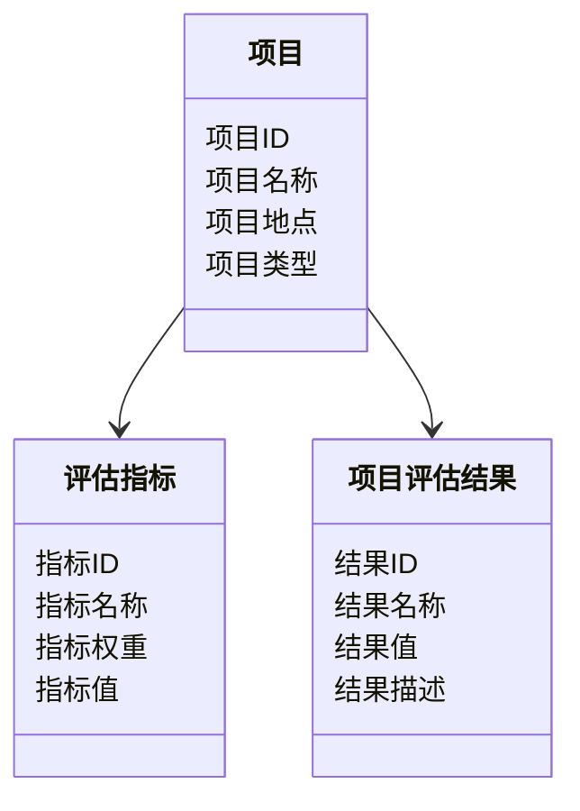
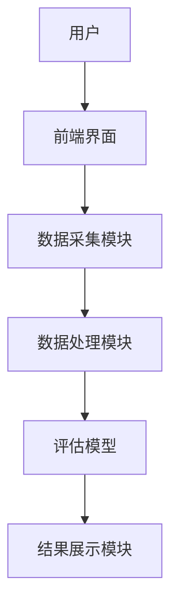

                 


# 企业估值中的数字孪生城市项目评估

## 关键词：数字孪生城市，企业估值，项目评估，数据驱动，实时动态

## 摘要：数字孪生城市作为现代城市规划和管理的重要技术手段，其在企业估值中的应用日益广泛。本文从数字孪生城市的基本概念出发，深入探讨其在项目评估中的核心作用，结合实际案例分析，详细阐述数字孪生城市项目评估的方法与流程。通过构建数学模型和算法，本文提出了一套基于数字孪生技术的企业估值优化方案，为企业在数字孪生城市背景下的项目评估提供了新的思路和实践指导。

---

## 第1章 数字孪生城市项目评估的背景与概念

### 1.1 数字孪生城市的基本概念

#### 1.1.1 数字孪生城市的定义
数字孪生城市（Digital Twin City）是一种通过数字技术构建的虚拟城市模型，能够实时反映物理城市的状态、属性和行为。它利用大数据、人工智能、物联网等技术，将城市的基础设施、交通、环境、经济活动等要素数字化，并通过动态交互实现虚实结合的可视化管理。

#### 1.1.2 数字孪生城市的技术基础
数字孪生城市的构建依赖于以下核心技术：
1. **大数据技术**：收集和处理城市中的海量数据。
2. **人工智能**：用于数据分析、模式识别和智能决策。
3. **物联网**：连接城市中的各种物理设备和传感器。
4. **虚拟现实（VR）/增强现实（AR）**：提供沉浸式的可视化体验。

#### 1.1.3 数字孪生城市的应用价值
数字孪生城市在城市规划、交通管理、环境保护、经济分析等领域具有重要应用价值。它能够帮助城市管理者更好地理解城市运行状态，优化资源配置，提升城市运营效率。

---

### 1.2 企业估值中的数字孪生城市项目评估背景

#### 1.2.1 企业估值的基本概念
企业估值是通过对企业的财务状况、市场表现、发展潜力等多方面因素的综合分析，确定企业价值的过程。传统的估值方法包括DCF模型（ discounted cash flow）、市盈率法等，但这些方法往往依赖于历史数据和假设，缺乏动态性和实时性。

#### 1.2.2 数字孪生技术在企业估值中的应用场景
数字孪生技术通过构建虚拟的企业模型，实时反映企业的运营状态、市场变化和潜在风险，为估值提供更精准的数据支持。例如：
1. **实时数据分析**：通过传感器和物联网技术，实时监控企业的生产、销售、库存等数据。
2. **动态情景模拟**：通过数字孪生模型，模拟不同市场条件下的企业表现，帮助评估其潜在价值。
3. **风险可视化**：通过可视化工具，将企业的潜在风险直观呈现，为估值提供参考。

#### 1.2.3 数字孪生城市项目评估的必要性
随着城市化进程的加快和市场竞争的加剧，企业需要更加精准的估值方法来应对复杂多变的市场环境。数字孪生城市项目评估通过整合城市数据和企业数据，为企业估值提供了更全面的视角，能够帮助企业更好地应对市场变化和城市规划中的挑战。

---

## 第2章 数字孪生城市与企业估值的关系

### 2.1 数字孪生城市的技术特征

#### 2.1.1 数据驱动的特性
数字孪生城市的核心是数据，通过大数据技术实时采集和分析城市中的各类数据，为企业的估值提供可靠的数据支持。

#### 2.1.2 虚实结合的特性
数字孪生城市通过虚拟模型与物理城市实时互动，能够动态反映企业的运营状态和市场环境变化，为企业估值提供动态参考。

#### 2.1.3 实时动态的特性
数字孪生城市能够实时更新数据和模型，帮助企业及时捕捉市场变化和城市运行中的新信息，从而优化估值结果。

---

### 2.2 企业估值的核心要素

#### 2.2.1 财务指标分析
传统的财务指标，如净利润、营业收入、资产负债率等，是企业估值的重要依据。但这些指标往往滞后于实际情况，无法反映企业的实时动态。

#### 2.2.2 市场价值评估
市场价值评估依赖于企业的市场地位、行业竞争状况等因素。数字孪生城市通过实时数据分析，能够更准确地评估企业的市场价值。

#### 2.2.3 风险评估
数字孪生城市通过构建风险模型，能够识别和评估企业在城市运营中的潜在风险，如自然灾害、政策变化等，为估值提供更全面的视角。

---

### 2.3 数字孪生城市在企业估值中的应用

#### 2.3.1 数据支持的精准评估
数字孪生城市通过整合城市中的各类数据，为企业估值提供更全面的数据支持，帮助评估人员更精准地分析企业的财务状况和市场表现。

#### 2.3.2 虚实结合的动态分析
数字孪生城市通过虚拟模型与物理城市的互动，能够动态分析企业的运营状态和市场环境变化，为企业估值提供实时反馈。

#### 2.3.3 项目风险的可视化评估
通过数字孪生模型的可视化功能，企业可以更直观地识别和评估潜在风险，如自然灾害、政策变化对企业的影响，从而优化估值结果。

---

## 第3章 数字孪生城市项目评估的核心概念与联系

### 3.1 核心概念原理

#### 3.1.1 数字孪生模型的构建原理
数字孪生模型的构建基于以下步骤：
1. 数据采集：通过传感器和物联网技术采集城市中的各类数据。
2. 数据处理：对采集到的数据进行清洗、整合和分析。
3. 模型构建：基于数据构建虚拟的城市模型。
4. 实时更新：根据实时数据动态更新模型，确保模型与实际城市保持一致。

#### 3.1.2 项目评估的数学模型
项目评估的数学模型通常包括以下几个部分：
1. 数据输入：企业的财务数据、市场数据等。
2. 模型构建：基于数据构建评估模型，如回归模型、时间序列模型等。
3. 计算与分析：通过模型计算企业的估值。
4. 结果输出：输出估值结果，并提供相关建议。

#### 3.1.3 虚实结合的评估方法
虚实结合的评估方法通过将虚拟模型与实际数据相结合，能够更准确地反映企业的运营状态和市场环境变化。

---

### 3.2 核心概念属性对比表

| 概念       | 数据驱动 | 实时动态 | 虚实结合 |
|------------|----------|----------|----------|
| 数字孪生模型 | 是       | 是       | 是       |
| 项目评估    | 是       | 否       | 否       |

---

### 3.3 ER实体关系图

```mermaid
erd
    entity 项目评估 {
        key 项目ID
        attribute 项目名称
        attribute 项目地点
        attribute 项目类型
    }
    entity 评估指标 {
        key 指标ID
        attribute 指标名称
        attribute 指标权重
        attribute 指标值
    }
    entity 项目评估结果 {
        key 结果ID
        attribute 结果名称
        attribute 结果值
        attribute 结果描述
    }
    relation 项目评估 - 评估指标 {
        role 项目评估.项目ID -> 评估指标.指标ID
    }
    relation 项目评估 - 项目评估结果 {
        role 项目评估.项目ID -> 项目评估结果.结果ID
    }
```

---

## 第4章 数字孪生城市项目评估的算法原理

### 4.1 算法原理概述

#### 4.1.1 算法选择
在数字孪生城市项目评估中，通常选择回归分析（Regression Analysis）或机器学习模型（如随机森林、神经网络）来进行估值。

#### 4.1.2 算法流程
1. 数据采集与预处理：采集城市中的各类数据，并进行清洗和特征提取。
2. 模型训练：基于预处理后的数据，训练评估模型。
3. 模型评估：通过测试数据评估模型的准确性。
4. 模型部署：将模型部署到实际应用场景中，实时更新和分析数据。

---

### 4.2 算法实现

#### 4.2.1 回归分析模型

```python
import pandas as pd
import numpy as np
from sklearn.linear_model import LinearRegression
from sklearn.metrics import mean_squared_error

# 数据加载
data = pd.read_csv('project_data.csv')

# 特征和目标变量分离
X = data[['feature1', 'feature2', 'feature3']]
y = data['target']

# 模型训练
model = LinearRegression()
model.fit(X, y)

# 模型预测
y_pred = model.predict(X)

# 模型评估
mse = mean_squared_error(y, y_pred)
print(f'Mean Squared Error: {mse}')
```

#### 4.2.2 机器学习模型

```python
from sklearn.ensemble import RandomForestRegressor
from sklearn.model_selection import train_test_split

# 数据加载
data = pd.read_csv('project_data.csv')

# 特征和目标变量分离
X = data[['feature1', 'feature2', 'feature3']]
y = data['target']

# 数据分割
X_train, X_test, y_train, y_test = train_test_split(X, y, test_size=0.2, random_state=42)

# 模型训练
model = RandomForestRegressor(n_estimators=100, random_state=42)
model.fit(X_train, y_train)

# 模型预测
y_pred = model.predict(X_test)

# 模型评估
mse = mean_squared_error(y_test, y_pred)
print(f'Mean Squared Error: {mse}')
```

---

## 第5章 数字孪生城市项目评估的系统架构设计

### 5.1 项目场景介绍
假设我们正在评估一个位于数字孪生城市中的商业综合体项目，目标是通过数字孪生技术优化其估值。

---

### 5.2 系统功能设计

#### 5.2.1 领域模型类图



---

### 5.3 系统架构设计

#### 5.3.1 系统架构图



---

### 5.4 系统接口设计

#### 5.4.1 数据接口
1. 数据采集接口：从物联网设备获取实时数据。
2. 数据处理接口：对数据进行清洗和特征提取。

#### 5.4.2 模型接口
1. 模型训练接口：训练评估模型。
2. 模型预测接口：进行项目估值。

---

## 第6章 数字孪生城市项目评估的项目实战

### 6.1 环境安装
需要安装以下工具和库：
- Python 3.x
- Pandas
- Scikit-learn
- Mermaid
- Jupyter Notebook

---

### 6.2 核心代码实现

#### 6.2.1 数据预处理

```python
import pandas as pd
import numpy as np

# 数据加载
data = pd.read_csv('project_data.csv')

# 数据清洗
data.dropna(inplace=True)

# 特征提取
features = data[['feature1', 'feature2', 'feature3']]
target = data['target']
```

#### 6.2.2 模型训练与评估

```python
from sklearn.linear_model import LinearRegression
from sklearn.metrics import mean_squared_error

# 模型训练
model = LinearRegression()
model.fit(features, target)

# 模型预测
y_pred = model.predict(features)

# 模型评估
mse = mean_squared_error(target, y_pred)
print(f'Mean Squared Error: {mse}')
```

---

### 6.3 代码功能解读
上述代码展示了如何通过线性回归模型进行项目评估。首先，加载数据并进行清洗，然后提取特征并训练模型，最后进行预测和评估。

---

## 第7章 数字孪生城市项目评估的最佳实践

### 7.1 小结
数字孪生城市项目评估通过整合城市数据和企业数据，为企业估值提供了更全面的视角。通过构建虚拟模型和实时数据分析，能够更精准地评估企业的价值和潜在风险。

### 7.2 注意事项
1. 数据的实时性和准确性是项目评估的关键。
2. 模型的选择和优化需要结合企业的实际情况。
3. 需要定期更新模型和数据，以应对城市环境的变化。

### 7.3 拓展阅读
1. 《数字孪生技术及其应用》
2. 《企业估值方法与模型》
3. 《大数据与人工智能在城市规划中的应用》

---

## 总结
数字孪生城市项目评估是企业估值领域的重要创新，通过数字技术的引入，能够更精准地评估企业的价值和潜在风险。未来，随着数字孪生技术的不断发展，其在企业估值中的应用将更加广泛和深入。

