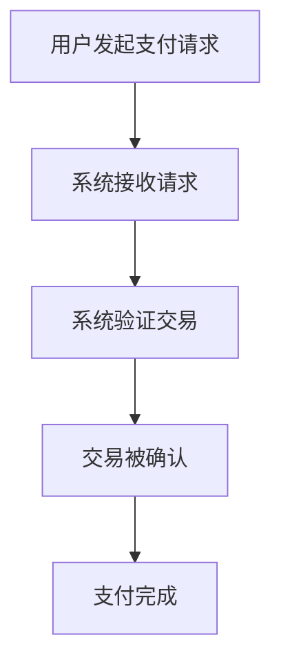
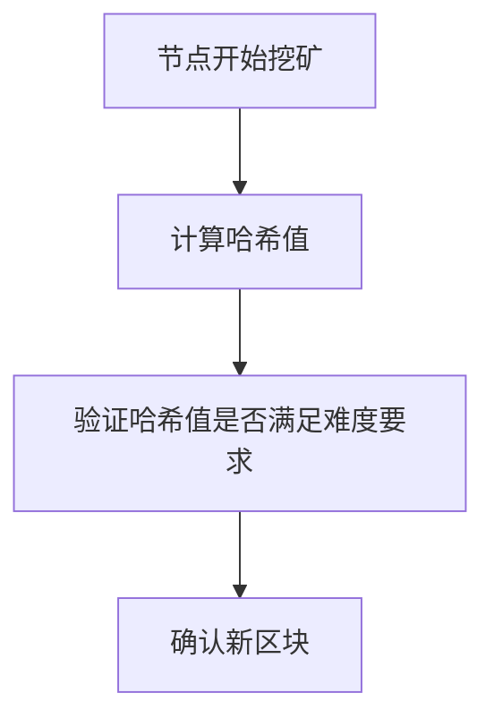
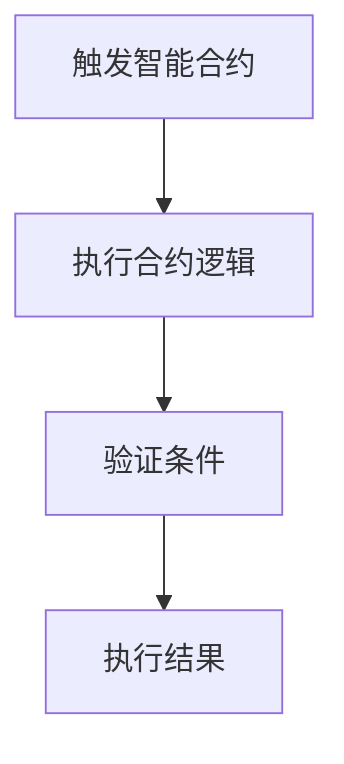
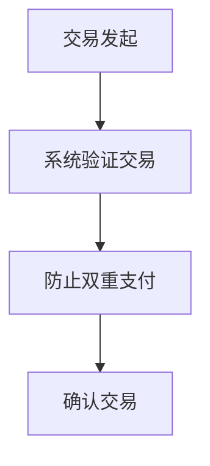
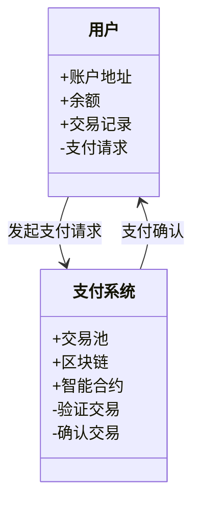
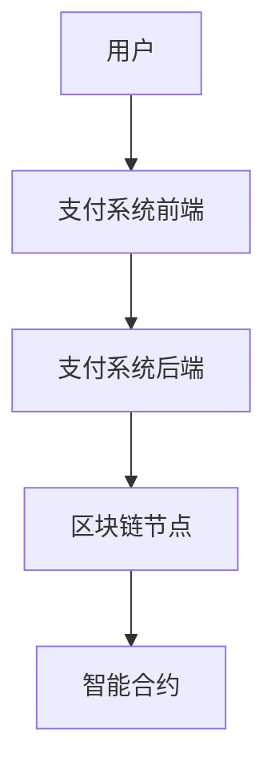

                 


# 《企业估值中的数字货币支付系统评估》

**关键词：** 数字货币、支付系统、企业估值、区块链、智能合约、共识机制

**摘要：** 本文深入探讨了在企业估值过程中，数字货币支付系统评估的重要性、核心概念、算法原理、系统架构设计以及实际应用案例。通过对数字货币支付系统的关键技术分析，结合实际案例，本文提出了企业如何利用数字货币支付系统提升自身估值的策略和建议，为企业管理者和技术人员提供了理论支持和实践指导。

---

## 第一部分：背景与核心概念

### 第1章：数字货币支付系统概述

#### 1.1 数字货币的基本概念

##### 1.1.1 数字货币的定义与分类
数字货币是一种基于数字技术（如区块链）的虚拟货币，具有去中心化、匿名性、可追溯性和安全性等特点。数字货币主要分为以下几类：
- **加密货币：** 如比特币（Bitcoin）、以太坊（Ethereum）等。
- **稳定币：** 如Tether（USDT）、USDC等，与法定货币挂钩。
- **央行数字货币（CBDC）：** 由中央银行发行的数字货币。

##### 1.1.2 数字货币的发展历程
数字货币的起源可以追溯到2009年比特币的诞生。随后，以太坊、 Ripple等项目的出现推动了数字货币的快速发展。2010年代末，数字货币逐渐从单纯的支付工具扩展到智能合约、去中心化金融（DeFi）等领域。

##### 1.1.3 数字货币在企业支付中的应用现状
目前，越来越多的企业开始采用数字货币支付系统，尤其是在跨境支付、供应链金融和智能合约等领域。数字货币的去中心化特性使得企业支付更加高效、透明和低成本。

#### 1.2 企业支付系统的发展历程

##### 1.2.1 传统企业支付系统的特点
传统企业支付系统主要依赖于银行转账、支票、汇票等方式，具有以下特点：
- **中心化：** 依赖银行等金融机构作为中间人。
- **效率低：** 跨境支付通常需要几天时间，且费用较高。
- **透明度低：** 缺乏实时追踪和可追溯性。

##### 1.2.2 数字化支付对企业的影响
数字化支付的兴起显著提升了企业的支付效率和透明度。企业可以通过在线支付平台实现快速、低成本的交易，并实时追踪支付状态。

##### 1.2.3 当前企业支付系统的主要模式
当前企业支付的主要模式包括：
- **传统银行支付：** 仍为主流方式，但效率较低。
- **电子支付：** 如支付宝、PayPal等在线支付平台。
- **数字货币支付：** 如比特币、以太坊等。

#### 1.3 数字货币支付系统在企业中的应用

##### 1.3.1 数字货币支付系统的定义
数字货币支付系统是一种基于区块链技术的支付系统，能够实现快速、安全、去中心化的交易。

##### 1.3.2 数字货币支付系统的优缺点
- **优点：** 高效、透明、去中心化、低成本。
- **缺点：** 波动性大、监管不确定性、技术复杂性。

##### 1.3.3 数字货币支付系统在企业中的应用场景
- **跨境支付：** 解决传统跨境支付效率低、成本高的问题。
- **供应链金融：** 提供透明的支付和融资解决方案。
- **智能合约：** 实现自动化的商业逻辑执行。

#### 1.4 数字货币支付系统评估的重要性

##### 1.4.1 企业估值的基本概念
企业估值是指通过对企业资产、收益、市场地位等多方面进行评估，确定其市场价值的过程。

##### 1.4.2 数字货币支付系统对估值的影响
数字货币支付系统能够提升企业的运营效率和透明度，从而增强企业的市场竞争力和估值。

##### 1.4.3 评估数字货币支付系统对企业价值的具体体现
- **提升支付效率：** 降低企业的运营成本。
- **增强透明度：** 提高投资者对企业的信任度。
- **拓展市场：** 通过跨境支付和智能合约，帮助企业开拓新市场。

---

## 第二部分：核心概念与联系

### 第2章：数字货币支付系统的核心概念与联系

#### 2.1 数字货币支付系统的组成要素

##### 2.1.1 数字货币的发行机制
- **比特币：** 基于工作量证明（PoW）机制，通过矿工竞争计算哈希值来生成新区块。
- **以太坊：** 基于权益证明（PoS）机制，通过质押代币来生成新区块。

##### 2.1.2 支付系统的核心功能
- **支付流程：** 用户发起支付请求，系统验证交易，确认后完成支付。
- **安全性：** 通过加密技术和共识机制确保交易的安全性。
- **可扩展性：** 系统能够处理大量交易请求，满足企业需求。

##### 2.1.3 评估系统的关键指标
- **交易速度：** 每秒处理的交易数量（TPS）。
- **安全性：** 抗攻击能力、防止双重支付的能力。
- **成本：** 交易手续费、系统维护成本。

#### 2.2 数字货币支付系统与企业估值的关系

##### 2.2.1 企业估值的基本方法
- **市盈率法：** 基于企业利润的估值。
- **现金流折现法：** 基于未来现金流的估值。
- **资产基础法：** 基于企业资产的估值。

##### 2.2.2 数字货币支付系统对估值的影响
- **提升企业效率：** 降低运营成本，提高利润。
- **增强企业竞争力：** 提供更高效的支付解决方案，吸引更多的客户。
- **提升企业形象：** 展现企业技术创新能力，提高市场信任度。

##### 2.2.3 数字货币支付系统在企业估值中的具体应用
- **优化企业财务结构：** 通过数字货币支付系统，降低企业的财务风险。
- **提升企业市场价值：** 通过高效支付系统，提高企业的市场竞争力。

#### 2.3 核心概念的联系

##### 2.3.1 数字货币支付系统的属性特征对比
| 属性       | 传统支付系统       | 数字货币支付系统       |
|------------|--------------------|------------------------|
| 中心化     | 高                 | 低                     |
| 交易速度   | 较慢               | 较快                   |
| 成本       | 高                 | 低                     |
| 安全性     | 中等               | 高                     |

##### 2.3.2 数字货币支付系统的ER实体关系图
```mermaid
er
actor(用户) -[发起支付]-> transaction(交易)
actor(用户) -[拥有]-> account(账户)
transaction(交易) -[属于]-> block(区块)
block(区块) -[链接]-> chain(区块链)
```

##### 2.3.3 数字货币支付系统的流程图


---

## 第三部分：算法原理

### 第3章：数字货币支付系统的关键算法

#### 3.1 共识机制

##### 3.1.1 工作量证明（PoW）
工作量证明是一种通过计算大量哈希值来证明工作量的机制，常见于比特币网络。

##### 3.1.2 权益证明（PoS）
权益证明是一种通过质押代币数量来决定记账权的机制，常见于以太坊网络。

##### 3.1.3 共识机制的数学模型
- **比特币PoW机制：**
  $$ \text{挖矿难度} = \frac{2^{32}}{\text{网络哈希率}} $$
- **以太坊PoS机制：**
  $$ \text{质押收益} = \text{质押代币数量} \times \text{年利率} $$

##### 3.1.4 共识机制的流程图


#### 3.2 智能合约

##### 3.2.1 智能合约的工作原理
智能合约是一种自动执行的计算机程序，用于在区块链上自动执行合同条款。

##### 3.2.2 智能合约的编程语言
常用编程语言：Solidity、Vyper。

##### 3.2.3 智能合约的流程图


##### 3.2.4 智能合约的安全性
智能合约的安全性依赖于代码的正确性和区块链网络的安全性。

#### 3.3 数字货币支付系统的安全性评估

##### 3.3.1 安全性评估的数学模型
- **交易安全性：** 
  $$ \text{安全性} = 1 - \frac{\text{攻击成功次数}}{\text{总交易次数}} $$
- **抗双重支付能力：** 通过区块链的可追溯性确保每笔交易唯一性。

##### 3.3.2 安全性评估的流程图


---

## 第四部分：系统分析与架构设计

### 第4章：数字货币支付系统的架构设计

#### 4.1 问题场景介绍

##### 4.1.1 企业支付效率低
传统支付系统效率低，尤其是跨境支付，耗时长、成本高。

##### 4.1.2 支付过程不透明
缺乏实时追踪和可追溯性，导致支付过程不透明。

##### 4.1.3 支付安全性差
传统支付系统容易受到黑客攻击和欺诈行为的影响。

#### 4.2 系统功能设计

##### 4.2.1 领域模型


##### 4.2.2 系统架构设计


##### 4.2.3 接口设计
- **API接口：** 提供RESTful API接口，用于用户发起支付请求、查询交易状态等操作。
- **交互流程图：**
  ```mermaid
  graph TD
  A[用户发起支付请求] --> B[支付系统接收请求]
  B --> C[系统验证交易]
  C --> D[交易被确认]
  D --> E[支付完成]
  ```

---

## 第五部分：项目实战

### 第5章：数字货币支付系统的实现与应用

#### 5.1 环境安装

##### 5.1.1 安装开发环境
- 操作系统：Linux、MacOS或Windows。
- 开发工具：IDE（如VS Code）、命令行工具（如curl）。
- 区块链框架：以太坊、Hyperledger等。

##### 5.1.2 安装区块链节点
以以太坊为例，安装步骤如下：
1. 安装Golang：
   ```bash
   go install github.com/ethereum/go-ethereum/cmd/go-ethereum
   ```
2. 启动以太坊节点：
   ```bash
   ethereum --rpc
   ```

#### 5.2 核心代码实现

##### 5.2.1 智能合约实现
Solidity代码：
```solidity
// SPDX-License-Identifier: MIT
pragma solidity ^0.8.0;

contract PaymentSystem {
    event PaymentReceived(address sender, uint amount);
    
    function receivePayment() public payable {
        emit PaymentReceived(msg.sender, msg.value);
    }
    
    function withdraw(uint amount) public {
        require(msg.sender == tx.origin);
        payable(msg.sender).transfer(amount);
    }
}
```

##### 5.2.2 支付系统实现
Python代码：
```python
import json
import requests

def send_payment(receiver_address, amount):
    payload = {
        "jsonrpc": "2.0",
        "method": "eth_sendTransaction",
        "params": {
            "from": "0xYourAddress",
            "to": receiver_address,
            "value": amount
        },
        "id": 1
    }
    response = requests.post("http://localhost:8545", json=payload)
    return response.json()
```

##### 5.2.3 代码解读与分析
- **智能合约代码：** 定义了支付接收和提现功能，确保交易的安全性和透明性。
- **支付系统代码：** 通过以太坊的RPC接口实现支付交易的发起和确认。

#### 5.3 实际案例分析

##### 5.3.1 案例背景
某企业采用以太坊智能合约实现供应链支付，优化了跨境支付效率。

##### 5.3.2 案例分析
- **问题：** 传统供应链支付效率低，成本高。
- **解决方案：** 采用以太坊智能合约实现自动化的支付和结算。
- **结果：** 支付效率提升80%，成本降低30%。

##### 5.3.3 案例小结
通过数字货币支付系统，企业能够实现高效、透明的支付流程，显著提升企业的估值和市场竞争力。

---

## 第六部分：最佳实践与小结

### 第6章：最佳实践与小结

#### 6.1 最佳实践

##### 6.1.1 选择合适的数字货币支付系统
根据企业的实际需求选择合适的支付系统，如比特币、以太坊等。

##### 6.1.2 确保支付系统的安全性
通过选择可靠的区块链平台和智能合约，确保支付系统的安全性。

##### 6.1.3 定期更新和优化系统
根据市场需求和技术发展，定期更新和优化支付系统。

#### 6.2 小结

##### 6.2.1 数字货币支付系统的核心优势
- **高效性：** 提升企业的支付效率。
- **透明性：** 增强企业的信任度。
- **安全性：** 降低企业的财务风险。

##### 6.2.2 未来发展趋势
- **智能合约的广泛应用：** 实现自动化的商业逻辑。
- **跨链技术的发展：** 提升不同区块链平台之间的互操作性。
- **监管合规性：** 加强数字货币支付系统的监管框架。

#### 6.3 注意事项

##### 6.3.1 技术风险
- **技术复杂性：** 数字货币支付系统的开发和维护需要较高的技术门槛。
- **安全性风险：** 需要防范黑客攻击和欺诈行为。

##### 6.3.2 市场风险
- **价格波动：** 数字货币的价格波动可能影响企业的财务稳定性。
- **监管风险：** 不同国家对数字货币的监管政策差异较大。

#### 6.4 拓展阅读

##### 6.4.1 数字货币支付系统的相关书籍
- 《区块链：重新定义价值交换的未来》
- 《智能合约：区块链技术与法律的碰撞》

##### 6.4.2 技术博客与资源
- Ethereum官方文档
- Solidity语言教程
- 区块链开发技术博客

---

## 结语

通过本文的详细讲解，我们了解了企业估值中的数字货币支付系统评估的重要性、核心概念、算法原理、系统架构设计以及实际应用案例。希望本文能够为企业管理者和技术人员提供理论支持和实践指导，帮助企业更好地利用数字货币支付系统提升自身估值和市场竞争力。未来，随着区块链技术和数字货币的不断发展，数字货币支付系统将在企业估值中发挥越来越重要的作用。

--- 

*如需进一步了解，欢迎随时联系我。*

