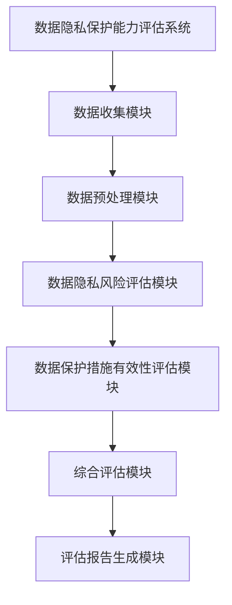

                 


# 企业估值中的数据隐私保护能力评估

> 关键词：数据隐私保护，企业估值，数据资产评估，隐私风险，数据安全

> 摘要：数据隐私保护能力评估是企业估值中的关键因素，本文详细分析了数据隐私保护能力评估的核心概念、算法原理、系统架构、项目实战及最佳实践。

---

# 第一部分: 数据隐私保护能力评估的背景与重要性

## 第1章: 数据隐私保护能力评估的背景介绍

### 1.1 数据隐私保护的背景与现状

#### 1.1.1 数据隐私保护的背景
随着数字经济的快速发展，数据已成为企业的核心资产。数据隐私保护的重要性日益凸显，尤其是在企业估值中，数据隐私保护能力直接影响企业的市场价值。近年来，数据泄露事件频发，企业因数据隐私保护不当而遭受的损失不断增加，这使得数据隐私保护能力成为企业估值的重要考量因素。

#### 1.1.2 数据隐私保护的重要性
数据隐私保护不仅是法律要求，更是企业维护客户信任和市场竞争优势的关键。在数字化转型中，企业需要通过有效的数据隐私保护措施来确保数据的机密性、完整性和可用性，从而提升企业的市场竞争力和抗风险能力。

#### 1.1.3 数据隐私保护与企业估值的关系
数据隐私保护能力直接影响企业的市场价值。一方面，良好的数据隐私保护能力可以降低企业的法律风险和声誉损失；另一方面，数据隐私保护能力的强弱会直接影响企业数据资产的价值，从而影响企业的整体估值。

### 1.2 数据隐私保护能力评估的核心概念

#### 1.2.1 数据隐私保护能力的定义
数据隐私保护能力是指企业在收集、存储、处理和使用数据的过程中，保护数据隐私的能力。这种能力包括技术手段、管理措施和制度规范等多个方面。

#### 1.2.2 数据隐私保护能力的特征
- **安全性**：数据在存储和传输过程中不被未经授权的第三方访问。
- **合规性**：符合相关法律法规和行业标准。
- **可追溯性**：能够追踪数据的流向和使用情况。
- **透明性**：用户能够了解企业如何处理他们的数据。

#### 1.2.3 数据隐私保护能力评估的边界与外延
数据隐私保护能力评估的边界包括企业的数据收集、存储、处理和使用环节，而外延则包括数据隐私保护的技术手段、管理措施和制度规范。

---

## 第2章: 数据隐私保护能力评估的核心概念与联系

### 2.1 数据隐私保护能力评估的核心原理

#### 2.1.1 数据隐私保护能力的评估指标
- 数据敏感性：数据的重要性和敏感程度。
- 数据保护措施：技术手段和管理措施的有效性。
- 数据隐私风险：数据泄露的可能性和影响范围。

#### 2.1.2 数据隐私保护能力评估的数学模型
$$ \text{数据隐私保护能力} = \frac{\text{数据保护措施的有效性}}{\text{数据隐私风险}} $$

---

### 2.2 数据隐私保护能力与企业估值的关系

#### 2.2.1 数据隐私保护能力对企业估值的影响
良好的数据隐私保护能力可以提升企业的市场信任度，降低法律风险，从而提升企业的市场价值。

#### 2.2.2 数据隐私保护能力与企业竞争力的关系
数据隐私保护能力是企业核心竞争力的重要组成部分，尤其是在数据驱动的业务模式下，数据隐私保护能力直接影响企业的市场地位和盈利能力。

---

## 第3章: 数据隐私保护能力评估的算法原理

### 3.1 数据隐私保护能力评估的算法原理

#### 3.1.1 基于数据重要性的评估方法
使用熵值法对数据的敏感性进行评估，计算数据隐私风险。

#### 3.1.2 数据隐私保护能力评估的流程
1. 数据收集与预处理。
2. 数据隐私风险评估。
3. 数据保护措施的有效性评估。
4. 数据隐私保护能力综合评估。

---

### 3.2 数据隐私保护能力评估的数学模型

#### 3.2.1 数据隐私风险评估
$$ \text{数据隐私风险} = \sum_{i=1}^{n} p_i \times v_i $$
其中，$p_i$ 是数据泄露的概率，$v_i$ 是数据泄露的影响。

#### 3.2.2 数据保护措施的有效性评估
$$ \text{数据保护措施的有效性} = 1 - \sum_{i=1}^{m} e_i $$
其中，$e_i$ 是数据保护措施的缺陷。

---

## 第4章: 数据隐私保护能力评估的系统分析与架构设计

### 4.1 系统功能设计

#### 4.1.1 数据隐私保护能力评估系统架构


---

## 第5章: 数据隐私保护能力评估的项目实战

### 5.1 项目实战案例

#### 5.1.1 案例介绍
以一家互联网企业为例，评估其数据隐私保护能力。

#### 5.1.2 环境安装
安装必要的数据处理工具和评估系统。

#### 5.1.3 核心代码实现
```python
import pandas as pd
from sklearn.metrics import accuracy_score

def data_privacy_risk Assessment(data):
    # 数据预处理
    data = data.dropna()
    # 数据隐私风险评估
    risk = 0
    for feature in data.columns:
        if data[feature].dtype == 'object':
            risk += 1
    return risk

data = pd.read_csv('data.csv')
risk = data_privacy_risk Assessment(data)
print('数据隐私风险:', risk)
```

---

## 第6章: 数据隐私保护能力评估的总结与展望

### 6.1 总结

### 6.2 展望

---

通过以上分析，我们可以看出，数据隐私保护能力评估是企业估值中的重要环节，企业需要通过有效的数据隐私保护措施来提升自身的市场竞争力和抗风险能力。

