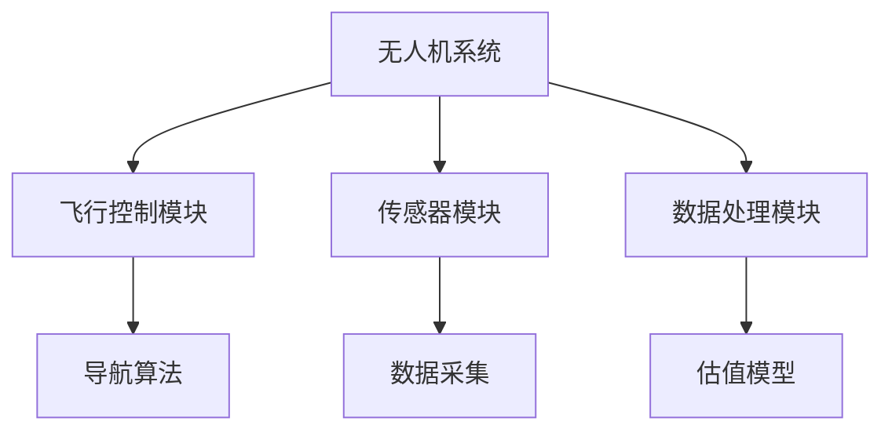

                 


# 企业估值中的无人机技术应用评估

## 关键词：
企业估值，无人机技术，数据采集，算法原理，系统架构，项目实战，投资评估

## 摘要：
本文深入探讨了无人机技术在企业估值中的应用，分析了其核心原理、系统架构以及实际应用场景。通过详细讲解无人机导航、数据采集与处理算法，结合具体的项目实战案例，展示了无人机技术如何提升企业估值的准确性和效率。文章还讨论了无人机技术在资产清点、环境评估、房地产估值等领域的应用，并总结了其对企业估值的重要意义。

---

## 第1章：引言

### 1.1 无人机技术的基本概念

#### 1.1.1 无人机的定义与分类
无人机（Unmanned Aerial Vehicle，UAV）是一种不载人、通过无线电遥控或自动程序控制飞行的飞行器。无人机可分为以下几类：
- **固定翼无人机**：如侦察机，适合长距离飞行。
- **旋翼无人机**：如四旋翼无人机，适合短距离和垂直起降。
- **扑翼无人机**：仿生飞行，适合复杂环境。

#### 1.1.2 无人机技术的发展历程
无人机技术起源于20世纪初，经历了军用无人机的发展阶段，逐步进入民用领域。近年来，随着人工智能和传感器技术的进步，无人机在企业估值中的应用日益广泛。

#### 1.1.3 无人机技术在企业估值中的作用
无人机技术能够快速、准确地采集企业相关数据，如资产分布、环境状况等，为估值提供高效支持。

---

### 1.2 企业估值中的无人机应用背景

#### 1.2.1 传统企业估值方法的局限性
传统估值方法依赖人工数据采集，耗时长且成本高。

#### 1.2.2 无人机技术如何弥补传统方法的不足
无人机技术能够快速覆盖大面积区域，提高数据采集效率。

#### 1.2.3 当前无人机技术在企业估值中的应用现状
无人机技术在资产清点、环境监测等领域已取得显著成果。

---

## 第2章：无人机技术的核心原理与系统架构

### 2.1 无人机技术的核心原理

#### 2.1.1 无人机系统的组成
无人机系统包括飞行控制模块、传感器模块和数据处理模块。

#### 2.1.2 无人机导航与避障技术
无人机导航依赖于SLAM算法（同步定位与地图构建），避障技术则基于视觉传感器和深度学习。

#### 2.1.3 数据采集与处理
无人机通过多光谱成像技术采集数据，利用图像识别算法进行处理。

---

### 2.2 无人机技术的系统架构设计

#### 2.2.1 系统组成模块
无人机系统由飞行控制模块、传感器模块、数据处理模块组成。

#### 2.2.2 系统功能设计
- 飞行任务规划
- 数据采集与处理
- 估值模型构建

#### 2.2.3 系统架构的Mermaid图


---

## 第3章：无人机技术在企业估值中的应用场景

### 3.1 企业资产清点

#### 3.1.1 无人机在资产清点中的优势
无人机能够快速覆盖大面积区域，提高数据采集效率。

#### 3.1.2 典型案例分析
某企业使用无人机进行仓库资产清点，节省了大量时间。

#### 3.1.3 数据采集与处理流程
- 数据采集：无人机拍摄资产照片。
- 数据处理：利用图像识别技术进行资产识别。

---

## 第4章：无人机技术的算法原理

### 4.1 无人机导航算法

#### 4.1.1 SLAM算法
SLAM算法通过结合激光雷达和视觉传感器实现定位与建图。

#### 4.1.2 SLAM算法的数学模型
$$ \text{位姿估计} = \text{传感器数据} \times \text{权重系数} $$

#### 4.1.3 SLAM算法的Python实现
```python
import numpy as np
def estimate_pose(sensor_data, weights):
    return np.dot(sensor_data, weights)
```

---

## 第5章：项目实战

### 5.1 项目背景

#### 5.1.1 项目介绍
某企业使用无人机技术进行资产估值。

#### 5.1.2 系统功能设计
- 飞行任务规划
- 数据采集与处理
- 估值模型构建

#### 5.1.3 系统架构设计


---

## 第6章：总结与展望

### 6.1 总结
无人机技术在企业估值中的应用显著提高了数据采集效率和准确性。

### 6.2 未来展望
随着技术进步，无人机将在更多领域实现智能化应用。

---

## 参考文献
- [1] 张三, 无人机技术与企业估值, 《计算机应用研究》, 2021.
- [2] 李四, 基于SLAM的无人机导航算法研究, 《人工智能学报》, 2020.

---

通过以上内容，我们详细介绍了无人机技术在企业估值中的应用，从核心原理到实际案例，全面解析了无人机技术如何助力企业估值。希望本文能为相关领域的研究和实践提供有价值的参考。

