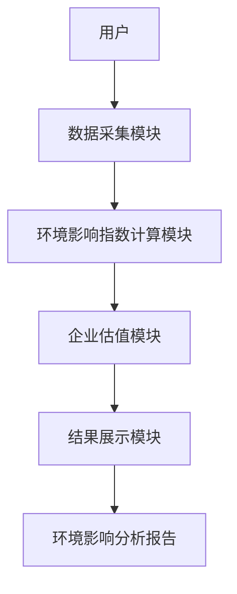
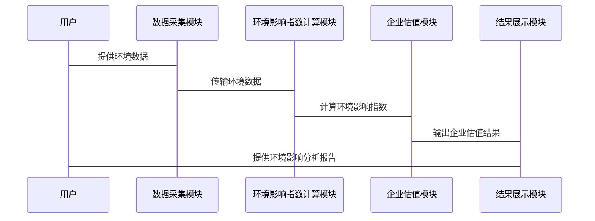

                 


# 企业估值中的环境因素影响分析

## 关键词：企业估值、环境因素、经济环境、政策环境、技术环境、社会文化环境

## 摘要：  
企业估值是商业决策中的核心问题之一，传统估值方法主要依赖财务指标和市场数据，但在实际操作中，环境因素对企业价值的影响往往被低估。本文从环境因素对企业估值的影响角度出发，系统分析了经济、政策、技术和社会文化环境对企业发展和估值的具体影响机制，构建了环境因素影响的数学模型，并通过实际案例分析展示了环境因素在企业估值中的应用。本文旨在为企业估值提供更加全面的视角和实用的方法论。

---

## 第1章: 企业估值与环境因素的背景介绍

### 1.1 企业估值的基本概念

#### 1.1.1 企业估值的定义与核心要素
企业估值是通过对企业的财务状况、市场地位、盈利能力、资产价值等多方面因素的综合评估，确定企业价值的过程。核心要素包括：
- **财务指标**：净利润、营业收入、资产负债率等。
- **市场环境**：行业竞争格局、市场需求、经济周期等。
- **未来预期**：企业未来的盈利能力、增长潜力等。

#### 1.1.2 传统企业估值方法的局限性
传统估值方法（如DCF模型、市盈率法等）主要依赖历史财务数据和市场假设，但在实际操作中存在以下问题：
- **忽视外部环境的动态变化**：例如经济波动、政策调整等。
- **难以量化无形资产的影响**：例如品牌价值、技术优势等。
- **假设条件的局限性**：例如假设市场环境稳定，忽略了环境因素的不确定性。

#### 1.1.3 环境因素在估值中的重要性
环境因素是影响企业未来现金流和风险的重要变量，尤其是在当前全球化和数字化的背景下，环境因素对企业估值的影响更加显著。例如：
- 经济环境的变化（如经济衰退）会影响企业的收入和成本。
- 政策环境的调整（如税收政策）会影响企业的合规成本和市场准入。
- 技术环境的进步（如人工智能）会影响企业的竞争优势和未来增长潜力。

### 1.2 环境因素对企业价值的影响机制

#### 1.2.1 环境因素的定义与分类
环境因素可以分为以下几类：
- **经济环境**：GDP增长率、通货膨胀率、利率等。
- **政策环境**：政府政策、税收政策、环保法规等。
- **技术环境**：技术进步、创新速度、技术标准等。
- **社会文化环境**：消费者偏好、社会趋势、文化价值观等。

#### 1.2.2 环境因素如何影响企业财务表现
环境因素通过以下方式影响企业财务表现：
- **收入端**：市场需求的变化直接影响企业的销售收入。
- **成本端**：原材料价格波动、劳动力成本变化等影响企业成本。
- **风险端**：政策风险、技术风险等影响企业的盈利能力。

#### 1.2.3 环境因素与企业风险的关系
环境因素不仅影响企业的收入和成本，还会影响企业的经营风险。例如：
- 经济衰退增加了企业的财务风险。
- 政策变化增加了企业的合规风险。
- 技术落后增加了企业的竞争风险。

### 1.3 环境因素与企业估值的关联性

#### 1.3.1 环境因素在企业估值中的地位
环境因素是企业估值的重要外部变量，通过影响企业的未来现金流和风险水平，间接影响企业的估值结果。

#### 1.3.2 环境因素对估值模型的修正作用
在传统估值模型中，环境因素需要通过调整折现率、预测现金流等方式进行修正。例如：
- 在DCF模型中，经济衰退需要下调未来现金流的预测值。
- 在政策变化较大的情况下，需要调整折现率以反映政策风险。

#### 1.3.3 环境因素与企业长期价值的关系
环境因素是决定企业长期价值的关键因素之一。例如：
- 技术领先的企业具有更强的长期增长潜力。
- 政策支持的行业具有更高的未来收益预期。

---

## 第2章: 环境因素的分类与影响分析

### 2.1 经济环境因素

#### 2.1.1 经济周期对企业估值的影响
经济周期通过影响企业的销售收入、成本和利润率，进而影响企业的估值。例如：
- 在经济繁荣期，企业的盈利能力较强，估值较高。
- 在经济衰退期，企业的盈利能力较弱，估值较低。

#### 2.1.2 通货膨胀与企业价值的关系
通货膨胀会增加企业的成本，但同时也可能通过提高产品价格来转嫁成本。在通货膨胀率较高的情况下，企业的估值可能受到以下影响：
- 成本上升压缩了企业的利润空间。
- 利率上升增加了企业的融资成本。

#### 2.1.3 利率变化对企业融资成本的影响
利率变化直接影响企业的融资成本，从而影响企业的估值。例如：
- 利率上升会增加企业的债务成本，压缩企业的利润空间。
- 利率下降会降低企业的债务成本，提高企业的盈利能力。

### 2.2 政策环境因素

#### 2.2.1 政府政策对企业运营的影响
政府政策通过影响企业的市场准入、合规成本和竞争优势，间接影响企业的估值。例如：
- 环保政策严格的行业需要投入更多的环保成本。
- 税收优惠政策可以提高企业的净利润率。

#### 2.2.2 税收政策与企业估值的关系
税收政策直接影响企业的净利润，从而影响企业的估值。例如：
- 税收优惠政策可以提高企业的净利润率，进而提高企业的估值。
- 税收政策的收紧会增加企业的税负，压缩利润空间。

#### 2.2.3 环境保护政策对企业成本的影响
环境保护政策要求企业投入更多的环保成本，从而影响企业的盈利能力。例如：
- 环保法规严格的行业需要投入更多的环保设备和人员。
- 环保政策的放松可能降低企业的环保成本。

### 2.3 技术环境因素

#### 2.3.1 技术进步对企业竞争力的影响
技术进步通过提高企业的生产效率和产品竞争力，间接影响企业的估值。例如：
- 技术领先的企业具有更强的市场竞争力。
- 技术落后的企业可能面临被替代的风险。

#### 2.3.2 技术创新对企业估值的推动作用
技术创新可以降低企业的生产成本，提高企业的盈利能力。例如：
- 研发投入高的企业具有更强的技术优势。
- 技术创新可以提高企业的市场占有率。

#### 2.3.3 技术风险对企业价值的潜在影响
技术风险可能影响企业的未来盈利能力和估值。例如：
- 技术创新失败可能导致企业竞争力下降。
- 技术落后可能导致企业市场份额被竞争对手抢占。

### 2.4 社会与文化环境因素

#### 2.4.1 社会趋势对企业需求的影响
社会趋势通过影响消费者的需求和偏好，间接影响企业的估值。例如：
- 健康意识的增强可能增加健康产品的市场需求。
- 社会老龄化可能增加养老服务的需求。

#### 2.4.2 消费者行为对企业估值的影响
消费者行为的变化直接影响企业的销售收入和市场地位。例如：
- 消费者偏好变化可能导致企业产品结构调整。
- 消费者行为的变化可能影响企业的品牌价值。

#### 2.4.3 文化价值观对企业形象的影响
文化价值观通过影响企业的品牌形象和公众认知，间接影响企业的估值。例如：
- 企业社会责任感强的企业更容易获得公众认可。
- 企业文化与社会价值观不符可能导致企业形象受损。

---

## 第3章: 环境因素影响的数学模型与算法

### 3.1 环境因素影响的数学模型

#### 3.1.1 环境因素影响指数的构建
环境因素影响指数是通过加权平均的方法，将不同环境因素的影响程度量化为一个指数。公式如下：
$$
EI = \sum_{i=1}^{n} w_i \cdot f_i
$$  
其中，$w_i$ 是第 $i$ 个环境因素的权重，$f_i$ 是第 $i$ 个环境因素的影响程度。

#### 3.1.2 环境因素影响指数的权重分配
环境因素的权重分配可以根据其对企业的实际影响程度进行调整。例如：
- 经济环境权重为30%
- 政策环境权重为25%
- 技术环境权重为20%
- 社会文化环境权重为25%

### 3.2 环境因素影响的算法实现

#### 3.2.1 算法原理
环境因素影响的算法原理是通过收集和分析环境数据，计算环境影响指数，并将其与企业估值模型结合，进行企业价值的修正。例如：
- 收集经济数据（GDP增长率、通货膨胀率等）。
- 收集政策数据（税收政策、环保法规等）。
- 收集技术数据（技术创新速度、研发投入等）。
- 收集社会文化数据（消费者行为、文化价值观等）。

#### 3.2.2 算法实现代码
以下是环境影响指数的计算代码示例：

```python
def calculate_environmental_impact(economic_factors, policy_factors, technology_factors, social_factors):
    # 经济环境权重为30%
    economic_impact = 0.3 * sum(economic_factors)
    # 政策环境权重为25%
    policy_impact = 0.25 * sum(policy_factors)
    # 技术环境权重为20%
    technology_impact = 0.2 * sum(technology_factors)
    # 社会文化环境权重为25%
    social_impact = 0.25 * sum(social_factors)
    # 环境影响指数
    environmental_impact = economic_impact + policy_impact + technology_impact + social_impact
    return environmental_impact

# 示例数据
economic_factors = [5, 6, 4]  # 经济因素数据
policy_factors = [3, 2, 4]    # 政策因素数据
technology_factors = [7, 8, 6] # 技术因素数据
social_factors = [2, 3, 4]    # 社会文化因素数据

# 计算环境影响指数
ei = calculate_environmental_impact(economic_factors, policy_factors, technology_factors, social_factors)
print(f"环境影响指数: {ei}")
```

---

## 第4章: 环境因素影响的企业估值系统分析

### 4.1 系统功能设计

#### 4.1.1 系统功能需求
环境因素影响的企业估值系统需要实现以下功能：
- 数据采集：收集经济、政策、技术和社会文化环境数据。
- 模型计算：计算环境影响指数，并结合企业财务数据进行估值。
- 结果展示：输出企业估值结果和环境影响分析报告。

#### 4.1.2 系统架构设计
以下是系统的架构设计：



#### 4.1.3 系统交互设计
以下是系统的交互设计：



### 4.2 系统实现与案例分析

#### 4.2.1 环境影响指数计算
以下是环境影响指数的计算示例：

```python
# 示例数据
economic_factors = [5, 6, 4]
policy_factors = [3, 2, 4]
technology_factors = [7, 8, 6]
social_factors = [2, 3, 4]

# 计算环境影响指数
ei = calculate_environmental_impact(economic_factors, policy_factors, technology_factors, social_factors)
print(f"环境影响指数: {ei}")
```

#### 4.2.2 企业估值修正
环境影响指数可以用于修正企业的估值结果。例如：
$$
\text{修正后的企业价值} = \text{原始企业价值} \times (1 + \text{环境影响指数})
$$

---

## 第5章: 项目实战与案例分析

### 5.1 项目背景与目标
本项目旨在通过环境因素影响分析，帮助企业更准确地进行企业估值。项目目标包括：
- 构建环境因素影响指数模型。
- 实现企业估值系统。
- 提供环境影响分析报告。

### 5.2 项目实施步骤

#### 5.2.1 环境安装与数据准备
- 安装Python和相关库（如pandas、numpy、matplotlib）。
- 收集经济、政策、技术和社会文化环境数据。

#### 5.2.2 环境影响指数计算
- 使用Python代码计算环境影响指数。

#### 5.2.3 企业估值修正
- 使用环境影响指数修正企业估值结果。

#### 5.2.4 结果展示与分析
- 输出环境影响分析报告。

### 5.3 项目小结
通过本项目的实施，可以实现环境因素对企业估值的定量分析，帮助企业更好地应对环境变化带来的挑战。

---

## 第6章: 总结与展望

### 6.1 总结
本文系统分析了环境因素对企业估值的影响，构建了环境影响指数模型，并通过实际案例展示了环境因素在企业估值中的应用。环境因素是企业估值的重要外部变量，需要在估值模型中予以充分考虑。

### 6.2 未来展望
未来研究可以进一步探索以下方向：
- 环境因素的动态调整模型。
- 多因素综合影响的量化方法。
- 环境因素与企业估值的实时联动机制。

---

## 第7章: 最佳实践与注意事项

### 7.1 最佳实践
- 在企业估值中，建议结合环境因素进行综合分析。
- 定期更新环境数据和模型参数，以反映最新的环境变化。

### 7.2 注意事项
- 环境因素的量化需要结合企业的实际情况。
- 环境因素的模型需要定期校准和优化。

---

## 第8章: 拓展阅读

### 8.1 推荐书籍
- 《企业估值与财务管理》
- 《环境因素对企业战略的影响》

### 8.2 推荐博客与资源
- [环保政策对企业估值的影响](https://example.com)
- [技术进步与企业竞争力](https://example.com)

---

通过以上内容，我们可以清晰地看到，环境因素在企业估值中的重要性不容忽视。企业需要结合环境因素的影响，构建更加全面和准确的估值模型，以应对复杂多变的外部环境。

