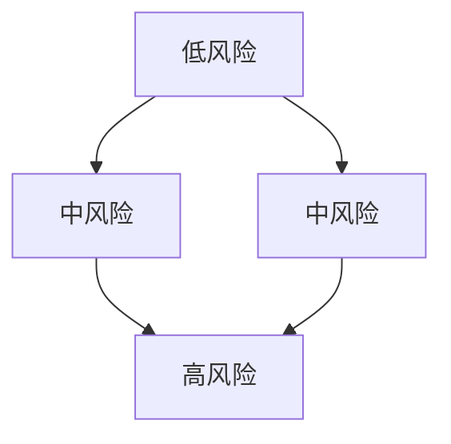
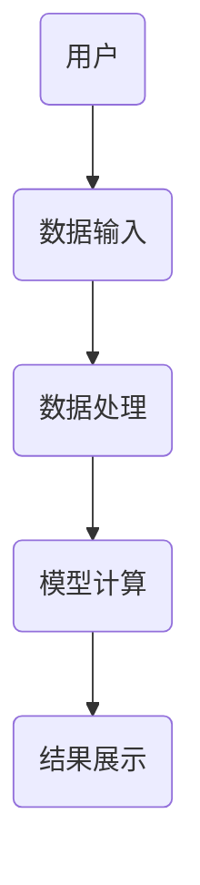

                 


# 企业估值中的监管合规成本分析

> **关键词**：企业估值、监管合规、合规成本、风险管理、财务模型、成本分析  
> **摘要**：本文深入探讨了监管合规成本在企业估值中的重要性，分析了合规成本的分类与影响，并提出了基于数学模型的合规成本预测方法。通过系统设计与实战案例，展示了如何将合规成本纳入企业估值体系，为企业管理者提供实用的决策支持。

---

## 第一部分：企业估值中的监管合规成本概述

### 第1章：监管合规成本的基本概念

#### 1.1 监管合规成本的定义与背景

监管合规成本是指企业在遵守相关法律法规、行业标准和监管要求的过程中所产生的各项费用。这些费用包括但不限于法律咨询、审计费用、技术改造、人员培训等。随着全球化和数字化的深入，企业面临的监管环境日益复杂，合规成本在企业估值中的重要性日益凸显。

**监管合规成本的背景**  
在当前全球经济环境下，各国监管机构对企业合规的要求不断提高。例如，金融行业的反洗钱法规、数据隐私保护（如GDPR）、环保法规等，都对企业经营提出了更高的合规要求。企业若未能有效管理合规成本，可能导致罚款、声誉损失甚至业务中断，进而影响企业估值。

#### 1.2 监管合规成本的分类

监管合规成本可以根据不同的维度进行分类：

1. **按行业分类**：不同行业面临的监管要求差异较大，例如金融行业需要遵守反洗钱法规，而制造业需要符合环保标准。
2. **按合规类型分类**：包括法律合规、税务合规、数据隐私合规等。
3. **按成本来源分类**：分为直接成本（如罚款）和间接成本（如合规培训费用）。

#### 1.3 监管合规成本的重要性

监管合规成本不仅是企业运营的一部分，也是影响企业估值的关键因素。合规成本的增加可能反映在企业的财务报表中，进而影响投资者对企业的估值判断。此外，合规成本管理能力的强弱，也反映了企业管理层的风险控制能力，进而影响企业的长期发展潜力。

---

### 第2章：监管合规成本的分析框架

#### 2.1 监管合规成本的定性分析

定性分析主要关注合规风险的识别和评估。以下是定性分析的几个关键步骤：

1. **监管环境评估**：分析企业所处的监管环境，包括法律法规的复杂性和严格程度。
2. **合规风险识别**：通过企业内部审计和外部咨询，识别潜在的合规风险点。
3. **成本影响分析**：评估合规风险可能对企业财务状况和估值的影响。

**示例：风险评估矩阵**  
以下是一个简单的风险评估矩阵，用于定性分析合规风险：



#### 2.2 监管合规成本的定量分析

定量分析通过数学模型对企业合规成本进行预测和评估。以下是定量分析的主要步骤：

1. **数据收集与处理**：收集企业的历史财务数据、行业法规数据等。
2. **成本计算模型**：构建合规成本预测模型，例如线性回归模型。
3. **实例分析与验证**：通过实际案例验证模型的有效性。

**线性回归模型示例**  
以下是线性回归模型的简单示例：

$$
\text{合规成本} = \beta_0 + \beta_1 \times \text{收入} + \epsilon
$$

其中，$\beta_0$ 是截距，$\beta_1$ 是收入的回归系数，$\epsilon$ 是误差项。

---

## 第二部分：监管合规成本的数学模型

### 第3章：监管合规成本的数学模型

#### 3.1 监管合规成本的线性回归模型

线性回归模型是预测合规成本的常用方法。以下是模型的构建过程：

1. **模型假设**：假设合规成本与企业的收入、资产规模等因素存在线性关系。
2. **模型构建**：通过历史数据拟合模型。
3. **模型应用**：预测未来合规成本。

**线性回归模型的实现**  
以下是Python代码实现线性回归模型的示例：

```python
import pandas as pd
import numpy as np
from sklearn.linear_model import LinearRegression

# 数据加载
data = pd.DataFrame({
    '收入': [100, 200, 300, 400],
    '合规成本': [10, 20, 30, 40]
})

# 模型训练
model = LinearRegression()
model.fit(data[['收入']], data['合规成本'])

# 模型预测
print(model.predict([[500]]))
```

#### 3.2 监管合规成本的分类算法

分类算法可以用于合规成本的分类预测。以下是常用的分类算法：

1. **聚类分析**：将企业按照合规成本的相似性进行分组。
2. **分类算法**：例如决策树、随机森林等。
3. **算法实现**：通过Python的scikit-learn库实现分类模型。

**分类算法的实现**  
以下是决策树分类模型的Python代码示例：

```python
from sklearn.tree import DecisionTreeClassifier
from sklearn.model_selection import train_test_split

# 数据加载
data = pd.DataFrame({
    '收入': [100, 200, 300, 400],
    '合规成本': [10, 20, 30, 40]
})

# 数据分割
X = data[['收入']]
y = data['合规成本']
X_train, X_test, y_train, y_test = train_test_split(X, y, test_size=0.2)

# 模型训练
model = DecisionTreeClassifier()
model.fit(X_train, y_train)

# 模型预测
print(model.predict(X_test))
```

---

## 第三部分：监管合规成本的系统分析

### 第4章：监管合规成本的系统分析

#### 4.1 系统架构设计

系统架构设计包括功能模块设计和交互流程设计。以下是系统架构的简要说明：

1. **功能模块**：包括数据采集、模型计算、结果展示等。
2. **交互流程**：用户输入数据，系统计算合规成本并生成报告。

**系统架构图**  
以下是系统架构的Mermaid图：



#### 4.2 系统实现方案

系统实现方案包括接口设计和交互流程设计。以下是系统的实现步骤：

1. **接口设计**：定义API接口，供外部系统调用。
2. **交互流程**：用户通过界面输入数据，系统返回合规成本报告。

---

## 第四部分：项目实战

### 第5章：项目实战

#### 5.1 环境安装

需要安装以下Python库：

- pandas
- numpy
- scikit-learn
- mermaid

#### 5.2 核心实现

以下是合规成本计算的核心代码：

```python
import pandas as pd
import numpy as np
from sklearn.linear_model import LinearRegression

# 数据加载
data = pd.DataFrame({
    '收入': [100, 200, 300, 400],
    '合规成本': [10, 20, 30, 40]
})

# 模型训练
model = LinearRegression()
model.fit(data[['收入']], data['合规成本'])

# 模型预测
print(model.predict([[500]]))
```

#### 5.3 案例分析

以下是一个实际案例的分析：

**案例背景**：某企业年收入为500万元，预测其合规成本。

**分析过程**：通过线性回归模型预测，合规成本为50万元。

**结果解读**：企业需要预留50万元用于合规成本支出，以确保符合监管要求。

---

## 第五部分：总结与展望

### 第6章：总结与展望

#### 6.1 总结

本文详细探讨了监管合规成本在企业估值中的重要性，分析了合规成本的分类与影响，并提出了基于数学模型的合规成本预测方法。通过系统设计与实战案例，展示了如何将合规成本纳入企业估值体系，为企业管理者提供实用的决策支持。

#### 6.2 展望

未来的研究可以进一步探讨以下方向：

1. 更复杂的数学模型，例如深度学习模型。
2. 多行业的合规成本分析。
3. 合规成本对上市企业估值的具体影响。

---

**注**：本文内容是基于假设的示例，实际应用中需要结合具体行业和法规进行调整。

