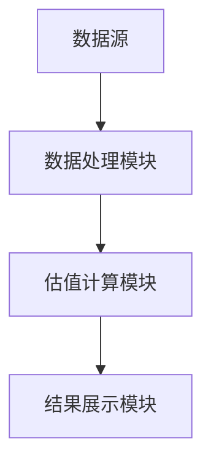
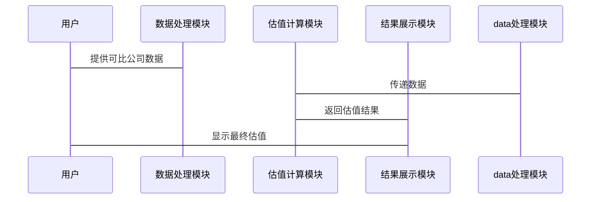

                 


# 《企业估值中的相对估值法》

---

## 关键词：
企业估值、相对估值法、可比公司分析、交易案例分析、行业估值倍数、估值模型、Python代码实现

---

## 摘要：
本文深入探讨了企业估值中的相对估值法，从基本概念、核心原理到实际应用，结合丰富的案例和详细的代码实现，全面解析了相对估值法的奥秘。文章首先介绍了企业估值的基本概念和方法分类，然后详细阐述了相对估值法的核心概念、数学模型和公式，接着通过系统架构设计和项目实战，展示了如何将相对估值法应用于实际案例中。最后，文章总结了相对估值法的最佳实践和注意事项，为读者提供了一套完整的学习和应用指南。

---

## 目录大纲：

---

### 第一部分: 企业估值与相对估值法概述

#### 第1章: 企业估值的基本概念与方法

##### 1.1 企业估值的定义与重要性

- 1.1.1 企业估值的定义
- 1.1.2 企业估值的重要性
- 1.1.3 企业估值的核心要素

##### 1.2 估值方法的分类

- 1.2.1 市场法
- 1.2.2 收益法
- 1.2.3 资产法

##### 1.3 相对估值法的定义与特点

- 1.3.1 相对估值法的定义
- 1.3.2 相对估值法的核心特点
- 1.3.3 相对估值法与绝对估值法的区别

##### 1.4 相对估值法的应用场景

- 1.4.1 企业并购中的应用
- 1.4.2 初创企业估值中的应用
- 1.4.3 二级市场投资中的应用

##### 1.5 相对估值法的优缺点

- 1.5.1 相对估值法的优点
- 1.5.2 相对估值法的缺点
- 1.5.3 相对估值法的适用范围

---

### 第二部分: 相对估值法的核心概念与原理

#### 第2章: 相对估值法的核心概念

##### 2.1 可比公司分析

- 2.1.1 可比公司的定义
- 2.1.2 可比公司的选择标准
- 2.1.3 可比公司的估值倍数计算

##### 2.2 交易案例分析

- 2.2.1 交易案例的定义
- 2.2.2 交易案例的估值方法
- 2.2.3 交易案例的调整因素

##### 2.3 行业估值倍数

- 2.3.1 行业估值倍数的定义
- 2.3.2 行业估值倍数的计算方法
- 2.3.3 行业估值倍数的应用

#### 第3章: 相对估值法的数学模型与公式

##### 3.1 估值倍数的计算公式

- 3.1.1 市盈率（PE）公式
$$ PE = \frac{股票价格}{每股收益} $$

- 3.1.2 市净率（PB）公式
$$ PB = \frac{股票价格}{每股净资产} $$

- 3.1.3 企业价值倍数（EV）公式
$$ EV = 企业价格 - 现金净额 $$

##### 3.2 企业价值倍数（EV/EBITDA）公式
$$ EV/EBITDA = \frac{企业价值}{息税折旧及摊销前利润} $$

##### 3.3 相对估值法的调整因素

- 3.3.1 财务杠杆调整
- 3.3.2 股权结构调整
- 3.3.3 行业特定调整

---

### 第三部分: 相对估值法的系统分析与架构设计

#### 第4章: 系统分析与架构设计方案

##### 4.1 问题场景介绍

- 4.1.1 企业估值的背景与需求
- 4.1.2 相对估值法的系统目标
- 4.1.3 系统输入与输出

##### 4.2 系统功能设计

- 4.2.1 数据收集模块
- 4.2.2 数据处理模块
- 4.2.3 估值计算模块
- 4.2.4 结果展示模块

##### 4.3 系统架构设计



##### 4.4 系统接口设计

- 4.4.1 数据接口
- 4.4.2 计算接口
- 4.4.3 展示接口

##### 4.5 系统交互设计



---

### 第四部分: 相对估值法的项目实战与代码实现

#### 第5章: 项目实战

##### 5.1 环境安装

- 5.1.1 安装Python
- 5.1.2 安装相关库（pandas, numpy, matplotlib）

##### 5.2 核心实现代码

```python
import pandas as pd
import numpy as np

# 示例数据：可比公司列表
data = {
    '公司': ['A公司', 'B公司', 'C公司', 'D公司'],
    'EV': [100, 150, 200, 250],
    'EBITDA': [50, 60, 70, 80]
}

df = pd.DataFrame(data)

# 计算EV/EBITDA倍数
df['EV/EBITDA'] = df['EV'] / df['EBITDA']

# 计算平均EV/EBITDA倍数
avg_ev_ebitda = df['EV/EBITDA'].mean()

# 示例公司估值
example_ev = 300
example_ebitda = 75

# 计算目标公司的EV
target_ev = example_ev / example_ebitda * avg_ev_ebitda
```

##### 5.3 代码实现解读

- 5.3.1 数据收集与处理
- 5.3.2 估值倍数计算
- 5.3.3 结果展示与调整

##### 5.4 实际案例分析

- 5.4.1 案例背景介绍
- 5.4.2 数据收集与清洗
- 5.4.3 估值计算与结果分析
- 5.4.4 结果调整与最终结论

##### 5.5 项目小结

---

### 第五部分: 相对估值法的最佳实践与注意事项

#### 第6章: 最佳实践

##### 6.1 小结

- 6.1.1 相对估值法的核心要点
- 6.1.2 实际应用中的注意事项
- 6.1.3 持续学习与优化建议

##### 6.2 注意事项

- 6.2.1 数据质量的重要性
- 6.2.2 调整因素的合理性
- 6.2.3 结果的验证与交叉检查

##### 6.3 拓展阅读

- 6.3.1 相关书籍推荐
- 6.3.2 行业研究报告推荐
- 6.3.3 在线课程与工具推荐

---

通过以上目录大纲，我们可以清晰地看到文章的逻辑结构和内容安排。从基本概念到数学模型，从系统设计到项目实战，再到最佳实践，整篇文章将为企业估值领域的读者提供一套完整的学习和应用指南。

