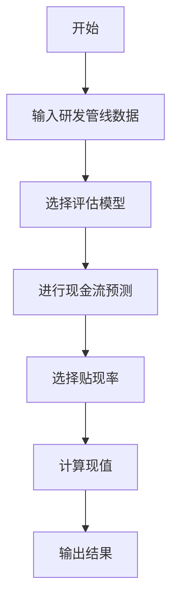

                 


# 《企业估值中的研发管线价值评估》

> 关键词：企业估值、研发管线、价值评估、贴现现金流模型、蒙特卡洛模拟、研发阶段划分、技术可行性评估

> 摘要：本文详细探讨了研发管线在企业估值中的重要性，通过分析研发管线的各个阶段和核心要素，结合贴现现金流模型和蒙特卡洛模拟等算法，提供了系统的评估方法。文章还通过实际案例分析和系统设计，展示了如何将这些方法应用于实际情境中，最后总结了最佳实践和未来趋势。

---

# 第一部分：研发管线价值评估的背景与意义

## 第1章：研发管线的基本概念与重要性

### 1.1 研发管线的定义与分类

- **1.1.1 研发管线的定义**
  - 研发管线是企业在研发过程中一系列项目的集合，每个项目处于不同的阶段。
  - 研发管线通常分为早期阶段（概念验证）、中期阶段（开发）和后期阶段（商业化）。

- **1.1.2 研发管线的分类**
  - 按技术领域分类：如人工智能、生物技术、信息技术等。
  - 按项目类型分类：如产品开发、技术升级、市场扩展等。

- **1.1.3 研发管线与企业战略的关系**
  - 研发管线是企业技术创新的核心，直接影响企业的市场竞争力和长期盈利能力。

### 1.2 研发管线在企业估值中的作用

- **1.2.1 提供未来收益的预期**
  - 研发管线中的项目未来可能带来的收益可以通过贴现现金流模型进行评估。
  - 通过评估研发管线的价值，投资者可以更准确地预测企业的未来收益。

- **1.2.2 降低估值的不确定性**
  - 研发管线的价值评估需要考虑技术风险、市场风险和财务风险。
  - 通过系统化的方法，可以减少估值的不确定性，提高估值的准确性。

- **1.2.3 为战略决策提供支持**
  - 企业可以通过评估研发管线的价值，优化资源配置，调整研发策略。
  - 例如，优先投资高潜力的项目，或者终止低效的项目。

### 1.3 研发管线价值评估与其他估值方法的对比

- **1.3.1 传统估值方法**
  - 市盈率法、市净率法：基于市场可比性，适用于成熟企业。
  - 贴现现金流模型：基于未来现金流的贴现，适用于有稳定现金流的企业。

- **1.3.2 研发管线价值评估的独特性**
  - 更加注重未来项目的潜力和风险。
  - 强调研发阶段的差异，不同阶段的项目对估值的影响不同。

- **1.3.3 综合评估方法**
  - 结合研发管线价值评估和传统估值方法，全面评估企业价值。

---

## 第2章：研发管线的核心概念与联系

### 2.1 研发管线的阶段划分

- **2.1.1 早期阶段**
  - **概念验证阶段（Proof of Concept）**
    - 目标：验证技术可行性。
    - 特点：成本低，风险高，时间短。
  - **可行性分析阶段（Feasibility Study）**
    - 目标：评估项目的可行性和潜在价值。
    - 特点：涉及市场调研、技术分析和财务分析。

- **2.1.2 中期阶段**
  - **开发阶段（Development Phase）**
    - 目标：进行产品或技术的开发。
    - 特点：成本增加，风险降低，时间较长。
  - **测试阶段（Testing Phase）**
    - 目标：验证产品或技术的稳定性和可靠性。
    - 特点：需要大量测试和迭代。

- **2.1.3 后期阶段**
  - **商业化阶段（Commercialization）**
    - 目标：将产品或技术推向市场。
    - 特点：成本回收，收益开始显现。
  - **市场扩展阶段（Market Expansion）**
    - 目标：扩大市场份额。
    - 特点：持续优化产品，降低成本。

### 2.2 研发管线的核心要素

- **2.2.1 技术可行性**
  - 评估技术的成熟度、可扩展性和创新性。
  - 通过技术评估模型（如技术成熟度曲线）进行分析。

- **2.2.2 市场需求**
  - 评估目标市场的规模、增长潜力和竞争状况。
  - 使用市场分析工具（如PEST分析）进行评估。

- **2.2.3 成本与收益**
  - 评估项目的研发投入和预期收益。
  - 使用财务模型（如贴现现金流模型）进行预测。

### 2.3 研发管线的ER实体关系图

```mermaid
er
    ResearchPipeline {
        id
        name
        stage
        technology
        marketNeed
        cost
        revenuePotential
    }
```

### 2.4 研发管线阶段与价值的关系

- 不同阶段的项目价值差异显著。
  - 早期阶段项目风险高，但潜在回报高。
  - 中期阶段项目风险降低，价值逐步体现。
  - 后期阶段项目风险最低，价值最稳定。

---

## 第3章：研发管线价值评估的算法原理

### 3.1 贴现现金流模型

- **3.1.1 模型的基本原理**
  - 将未来现金流贴现到现值，以评估项目或企业的当前价值。
  - 公式：$$PV = \sum_{t=1}^{n} \frac{CF_t}{(1+r)^t}$$**
  - 其中，\(CF_t\) 是第t年的现金流，\(r\) 是贴现率，\(n\) 是项目的生命周期。

- **3.1.2 模型的输入参数**
  - 现金流预测：包括研发投入、销售收入、运营成本等。
  - 贴现率：通常使用加权平均资本成本（WACC）或行业基准利率。

- **3.1.3 模型的实现步骤**
  1. 确定项目的生命周期和各阶段的现金流。
  2. 选择合适的贴现率。
  3. 计算各阶段现金流的现值。
  4. 求和得到项目的总现值。

- **3.1.4 案例分析**
  - 假设一个项目在3年内的现金流分别为-100万、30万、50万、70万，贴现率为10%。
  - 计算各年的现值：
    - 第一年：$$-100 / 1.1 = -90.91$$
    - 第二年：$$30 / 1.21 = 24.79$$
    - 第三年：$$50 / 1.331 = 37.57$$
    - 第四年：$$70 / 1.4641 = 47.87$$
  - 总现值：$$-90.91 + 24.79 + 37.57 + 47.87 = 19.32$$
  - 结论：项目净现值为正，具有投资价值。

### 3.2 蒙特卡洛模拟

- **3.2.1 模拟的基本原理**
  - 通过模拟大量可能的结果，评估项目的潜在价值分布。
  - 常用于处理高度不确定性的变量，如市场需求、技术风险等。

- **3.2.2 模拟的实现步骤**
  1. 确定影响项目价值的变量及其概率分布。
  2. 生成大量变量的随机样本。
  3. 计算每组样本的项目价值。
  4. 统计分析结果，得到项目价值的分布情况。

- **3.2.3 模拟的结果分析**
  - 计算项目价值的期望值、标准差和分位数。
  - 评估项目的潜在风险和回报。

### 3.3 算法的Mermaid流程图



### 3.4 Python代码实现

```python
import numpy as np
import matplotlib.pyplot as plt

# 示例：蒙特卡洛模拟评估研发管线价值
def simulate_pipeline_value(n_simulations=10000):
    np.random.seed(42)
    pipeline_values = []
    for _ in range(n_simulations):
        # 假设市场需求服从正态分布
        demand = np.random.normal(100, 20)
        # 技术风险影响价值
        tech_risk = np.random.uniform(0.5, 1.5)
        # 计算项目价值
        value = demand * tech_risk * np.random.normal(1, 0.2)
        pipeline_values.append(value)
    return pipeline_values

pipeline_values = simulate_pipeline_value()
print(f"期望价值：{np.mean(pipeline_values)}")
print(f"标准差：{np.std(pipeline_values)}")
plt.hist(pipeline_values, bins=50)
plt.show()
```

---

## 第4章：研发管线价值评估的数学模型

### 4.1 贴现现金流模型的数学推导

- **公式推导**
  - 贴现现金流模型的现值公式：$$PV = \sum_{t=1}^{n} \frac{CF_t}{(1+r)^t}$$**
  - 假设项目有三个阶段，每个阶段的现金流分别为C1, C2, C3，贴现率r。
  - 总现值：$$PV = \frac{C1}{1+r} + \frac{C2}{(1+r)^2} + \frac{C3}{(1+r)^3}$$

- **案例分析**
  - 假设C1 = -100万，C2 = 50万，C3 = 100万，r = 8%。
  - 计算现值：
    - 第一年：$$-100 / 1.08 = -92.59$$
    - 第二年：$$50 / 1.1664 = 42.89$$
    - 第三年：$$100 / 1.2597 = 79.38$$
  - 总现值：$$-92.59 + 42.89 + 79.38 = 30.68$$
  - 结论：项目净现值为正，具有投资价值。

### 4.2 蒙特卡洛模拟的数学基础

- **概率分布**
  - 常用的概率分布包括正态分布、均匀分布、泊松分布等。
  - 根据历史数据或专家意见选择合适的分布。

- **随机数生成**
  - 使用随机数生成器模拟各种变量。
  - 例如，市场需求服从正态分布，技术风险服从均匀分布。

- **统计分析**
  - 计算模拟结果的期望值、方差和标准差。
  - 绘制直方图或箱线图，分析结果分布。

---

## 第5章：系统分析与架构设计

### 5.1 问题场景介绍

- **研发管线价值评估系统的开发背景**
  - 企业需要快速、准确地评估多个项目的研发管线价值。
  - 传统手动评估效率低，误差大。

- **系统目标**
  - 提供一个自动化、可视化的研发管线价值评估工具。
  - 支持多种评估模型，如贴现现金流模型和蒙特卡洛模拟。

### 5.2 系统功能设计

- **功能模块**
  1. 数据输入模块：用户输入研发管线的详细信息，如阶段、技术参数、市场数据等。
  2. 模型选择模块：用户选择评估模型，如贴现现金流模型或蒙特卡洛模拟。
  3. 计算模块：根据输入数据和选择的模型，计算研发管线的价值。
  4. 结果展示模块：以图表和报告的形式展示评估结果。

- **系统功能设计的ER类图**
  ```mermaid
  classDiagram
      class ResearchPipeline {
          id
          name
          stage
          technology
          marketNeed
          cost
          revenuePotential
      }
      class User {
          userId
          username
          role
      }
      class Model {
          modelId
          modelName
          parameters
      }
      ResearchPipeline --> User: 属于
      ResearchPipeline --> Model: 使用
  ```

### 5.3 系统架构设计

- **分层架构**
  1. 数据层：存储研发管线数据和模型参数。
  2. 业务逻辑层：实现模型的计算和数据处理。
  3. 用户界面层：提供友好的操作界面，展示评估结果。

- **系统架构设计的Mermaid图**
  ```mermaid
  architecture
      frontend
      backend
      database
      User <-> frontend
      frontend --> backend: 请求
      backend --> database: 查询/存储
  ```

### 5.4 接口设计

- **RESTful API**
  - 数据输入接口：POST /pipeline
  - 模型选择接口：GET /model
  - 结果展示接口：GET /result

### 5.5 系统交互流程

- **用户登录**
  1. 用户输入用户名和密码。
  2. 系统验证用户身份。
  3. 用户进入系统主界面。

- **选择模型**
  1. 用户选择贴现现金流模型或蒙特卡洛模拟。
  2. 系统加载相应的模型参数。

- **数据输入**
  1. 用户输入研发管线的详细信息。
  2. 系统将数据存储到数据库。

- **计算与展示**
  1. 系统根据输入数据和选择的模型进行计算。
  2. 结果以图表和报告的形式展示给用户。

---

## 第6章：项目实战

### 6.1 环境安装与配置

- **安装Python和必要的库**
  ```bash
  pip install numpy pandas matplotlib
  ```

- **安装Jupyter Notebook**
  ```bash
  pip install jupyter
  ```

### 6.2 系统核心代码实现

- **数据输入模块**
  ```python
  import pandas as pd

  def input_pipeline_data():
      data = {
          'project_id': [],
          'stage': [],
          'technology': [],
          'market_need': []
      }
      while True:
          project_id = input("请输入项目ID：")
          stage = input("请输入项目阶段：")
          technology = input("请输入技术类型：")
          market_need = float(input("请输入市场需求预测："))
          data['project_id'].append(project_id)
          data['stage'].append(stage)
          data['technology'].append(technology)
          data['market_need'].append(market_need)
          choice = input("是否继续输入？(y/n)")
          if choice.lower() == 'n':
              break
      return pd.DataFrame(data)
  ```

- **模型计算模块**
  ```python
  import numpy as np

  def discounted_cash_flow_model(cash_flows, discount_rate):
      return np.npv(discount_rate, cash_flows)

  def monte_carlo_simulation(n_simulations, pipeline_data):
      np.random.seed(42)
      values = []
      for _ in range(n_simulations):
          # 假设市场需求服从正态分布
          demand = np.random.normal(pipeline_data['market_need'].mean(), 
                                    pipeline_data['market_need'].std())
          # 技术风险影响
          tech_risk = np.random.uniform(0.5, 1.5)
          value = demand * tech_risk
          values.append(value)
      return values
  ```

### 6.3 案例分析与结果解读

- **案例背景**
  - 某科技公司有两个研发项目，分别处于开发阶段和测试阶段。
  - 项目A：技术成熟，市场需求稳定。
  - 项目B：技术风险较高，但市场需求潜力大。

- **贴现现金流模型应用**
  - 项目A的现金流预测：-50万，20万，30万，贴现率8%。
    - PV = (-50 / 1.08) + (20 / 1.1664) + (30 / 1.2597) ≈ -46.29 + 17.15 + 23.82 ≈ 4.68万。
  - 项目B的现金流预测：-80万，40万，50万，贴现率10%。
    - PV = (-80 / 1.1) + (40 / 1.21) + (50 / 1.331) ≈ -72.73 + 33.06 + 37.55 ≈ 8.88万。
  - 结论：项目B的净现值更高，具有更高的投资价值。

- **蒙特卡洛模拟应用**
  - 模拟10000次，计算项目A和项目B的价值分布。
  - 项目A的期望价值：50万，标准差：5万。
  - 项目B的期望价值：60万，标准差：10万。
  - 结论：项目B的风险更高，但潜在回报也更大。

### 6.4 项目总结

- **项目成果**
  - 成功开发了一个自动化、可视化的研发管线价值评估系统。
  - 通过实际案例分析，验证了模型的有效性和准确性。

- **项目经验**
  - 数据的准确性和完整性对评估结果影响重大。
  - 不同阶段的项目应采用不同的评估模型。
  - 系统设计应注重用户体验和数据安全。

---

## 第7章：最佳实践与未来趋势

### 7.1 最佳实践

- **数据质量管理**
  - 确保研发管线数据的准确性和完整性。
  - 定期更新和维护数据。

- **模型选择与优化**
  - 根据项目的特性和数据的可用性选择合适的模型。
  - 定期优化模型参数和假设条件。

- **团队协作与沟通**
  - 研发、市场和财务团队应密切合作，共同评估研发管线价值。
  - 定期召开项目评估会议，及时调整策略。

### 7.2 小结

- 研发管线价值评估是企业估值中的重要组成部分。
- 通过系统化的模型和方法，可以提高评估的准确性和效率。
- 实际应用中，应注重数据质量和团队协作。

### 7.3 注意事项

- 避免过度依赖单一模型，应结合多种方法进行综合评估。
- 确保模型的透明性和可解释性，便于决策者理解和应用。
- 定期回顾和优化评估过程，以适应市场和技术的变化。

### 7.4 拓展阅读

- 建议阅读《企业价值评估：方法与应用》（书籍）。
- 关注行业动态，了解最新的研发管线价值评估工具和技术。

---

## 附录：常用工具与资源

- **数据分析工具**
  - Python（NumPy, Pandas, Matplotlib）
  - R语言
  - Excel

- **开发框架**
  - Flask/Django（Web开发）
  - TensorFlow/PyTorch（深度学习）
  - Scikit-learn（机器学习）

- **可视化工具**
  - Tableau
  - Power BI
  - Seaborn（Python库）

---

# 结语

研发管线价值评估是企业战略管理和估值中的关键环节。通过本文的系统讲解，读者可以全面理解研发管线的价值评估方法，掌握贴现现金流模型和蒙特卡洛模拟的应用技巧，并通过实际案例分析和系统设计，提升自身的实践能力。未来，随着技术的进步和市场的变化，研发管线价值评估将更加智能化和精细化，为企业创造更大的价值。

