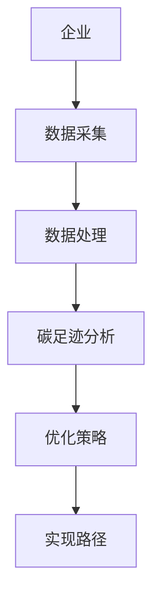
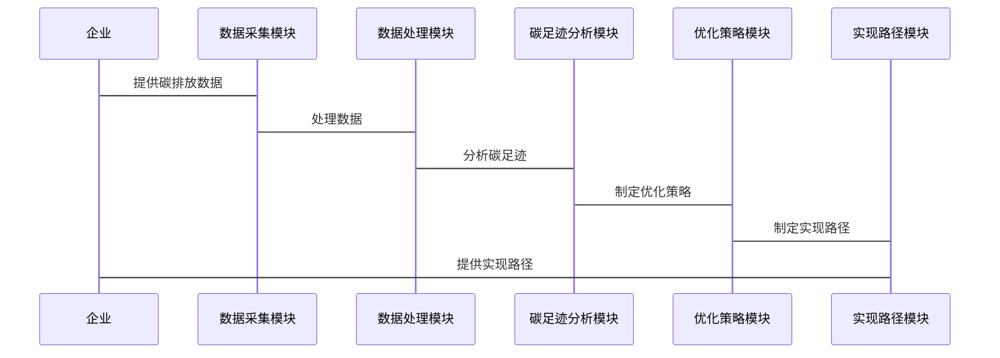

                 


# 企业估值中的碳中和战略评估

> 关键词：碳中和，企业估值，战略评估，碳排放，绿色金融

> 摘要：随着全球气候变化问题的加剧，碳中和已成为企业和国家可持续发展的重要战略目标。本文从企业估值的角度，系统分析碳中和战略评估的核心概念、方法和应用场景。通过详细的理论分析和实际案例，探讨碳中和如何影响企业财务表现和市场价值，为企业制定可持续发展战略提供理论依据和实践指导。

---

# 第一部分: 企业估值与碳中和战略评估的背景介绍

## 第1章: 碳中和战略评估的概述

### 1.1 碳中和的基本概念

#### 1.1.1 碳中和的定义与内涵
碳中和是指企业或组织在一定时间内，通过减少碳排放和增加碳汇，实现碳排放的净零目标。碳中和不仅仅是减少二氧化碳排放，还包括对整个供应链、生产过程和产品生命周期的全面管理。

#### 1.1.2 碳中和的目标与实现路径
碳中和的目标是实现温室气体排放的零净增长。实现路径包括能源转型、技术创新、管理优化和碳汇建设。企业需要通过技术创新和管理优化来降低碳排放，同时利用碳汇（如植树造林）来抵消剩余的碳排放。

#### 1.1.3 碳中和与企业发展的关系
碳中和不仅是企业履行社会责任的体现，也是企业提升核心竞争力的重要手段。通过实现碳中和，企业可以降低运营成本、优化品牌形象，同时在绿色金融市场中获得更多的融资机会。

### 1.2 碳中和战略对企业估值的影响

#### 1.2.1 碳中和对企业经营的影响
碳中和战略的实施会影响企业的生产成本、运营效率和市场竞争力。例如，采用清洁能源和低碳技术可以降低企业的能源成本，同时减少因碳排放而面临的罚款和惩罚。

#### 1.2.2 碳中和对企业财务表现的潜在影响
碳中和战略的实施可能会影响企业的财务表现，包括收入、成本和资产价值。例如，通过绿色债券融资可以降低企业的财务成本，同时减少因碳排放而可能面临的法律风险。

#### 1.2.3 碳中和对企业市场价值的重塑
碳中和战略的实施会影响企业的市场价值。投资者越来越关注企业的碳表现，碳中和企业更容易获得投资者的青睐，从而提升企业的市场价值。

### 1.3 碳中和战略评估的核心要素

#### 1.3.1 碳排放的量化方法
碳排放的量化是碳中和战略评估的基础。企业需要对自身的碳排放进行全面的量化，包括直接排放和间接排放。

#### 1.3.2 碳足迹分析的步骤与流程
碳足迹分析是碳中和战略评估的重要步骤。通过分析企业的碳足迹，可以识别碳排放的主要来源，并制定相应的减排策略。

#### 1.3.3 碳中和目标与企业战略的结合
碳中和目标需要与企业的发展战略相结合。企业需要制定长期的碳中和目标，并将其融入企业的日常运营和管理中。

## 第2章: 碳中和战略评估的必要性与挑战

### 2.1 碳中和战略评估的必要性

#### 2.1.1 碳中和对企业可持续发展的必要性
碳中和是企业实现可持续发展的必要条件。通过实现碳中和，企业可以减少对环境的影响，同时提升企业的社会形象和市场竞争力。

#### 2.1.2 碳中和对企业合规性的必要性
随着全球碳政策的不断加强，企业需要通过实现碳中和来满足相关的法律法规要求，避免因碳排放超标而面临的罚款和惩罚。

#### 2.1.3 碳中和对企业竞争优势的必要性
在绿色金融市场中，碳中和企业更容易获得融资支持，同时能够吸引更多的绿色投资，从而在市场竞争中占据优势地位。

### 2.2 碳中和战略评估的挑战

#### 2.2.1 碳排放数据的获取与准确性
碳排放数据的获取和准确性是碳中和战略评估的主要挑战。企业需要准确地量化自身的碳排放，但数据的获取和准确性可能受到技术、成本和政策的限制。

#### 2.2.2 碳中和技术的可行性和成本
碳中和技术的可行性和成本是另一个重要挑战。企业需要选择合适的低碳技术，并在成本可控的前提下实现碳中和目标。

#### 2.2.3 碳中和战略的长期性和不确定性
碳中和是一个长期的过程，且涉及许多不确定因素，如政策变化、技术进步和市场需求的变化。企业需要在不确定的环境中制定和实施碳中和战略。

---

# 第二部分: 碳中和战略评估的核心概念与理论基础

## 第3章: 碳中和战略评估的核心概念

### 3.1 碳中和战略评估的原理

碳中和战略评估的原理是通过量化企业的碳排放，分析企业的碳足迹，并制定相应的减排策略。企业需要通过技术创新和管理优化来降低碳排放，同时通过碳汇抵消剩余的碳排放。

### 3.2 碳中和战略评估的核心要素

#### 3.2.1 碳排放的量化方法
碳排放的量化是碳中和战略评估的基础。企业需要对自身的碳排放进行全面的量化，包括直接排放和间接排放。

#### 3.2.2 碳足迹分析的步骤与流程
碳足迹分析是碳中和战略评估的重要步骤。通过分析企业的碳足迹，可以识别碳排放的主要来源，并制定相应的减排策略。

#### 3.2.3 碳中和目标与企业战略的结合
碳中和目标需要与企业的发展战略相结合。企业需要制定长期的碳中和目标，并将其融入企业的日常运营和管理中。

### 3.3 碳中和战略评估的对比分析

#### 3.3.1 碳中和与传统企业估值的对比
碳中和与传统企业估值的主要区别在于碳中和考虑了企业的碳表现，而传统估值方法主要关注企业的财务表现。

#### 3.3.2 碳中和战略与企业风险管理的对比
碳中和战略与企业风险管理的区别在于碳中和战略关注的是企业的长期可持续发展，而风险管理关注的是企业短期的财务风险。

---

# 第三部分: 碳中和战略评估的算法原理

## 第4章: 碳中和战略评估的算法原理

### 4.1 碳中和战略评估的算法步骤

#### 4.1.1 碳排放的量化
碳排放的量化是碳中和战略评估的第一步。企业需要对自身的碳排放进行全面的量化，包括直接排放和间接排放。

#### 4.1.2 碳足迹分析
碳足迹分析是碳中和战略评估的重要步骤。通过分析企业的碳足迹，可以识别碳排放的主要来源，并制定相应的减排策略。

#### 4.1.3 碳中和目标的制定
碳中和目标的制定是碳中和战略评估的关键步骤。企业需要制定长期的碳中和目标，并将其融入企业的日常运营和管理中。

### 4.2 碳中和战略评估的数学模型

#### 4.2.1 碳排放的计算公式
碳排放的计算公式为：碳排放 = 活动水平 × 排放因子。

#### 4.2.2 碳足迹的计算公式
碳足迹的计算公式为：碳足迹 = 直接排放 + 间接排放。

#### 4.2.3 碳中和目标的实现路径
碳中和目标的实现路径包括能源转型、技术创新、管理优化和碳汇建设。

---

# 第四部分: 碳中和战略评估的系统分析

## 第5章: 碳中和战略评估的系统架构

### 5.1 碳中和战略评估的系统应用场景

#### 5.1.1 企业内部的碳管理
企业内部的碳管理是碳中和战略评估的重要应用场景。企业需要通过内部的碳管理来降低碳排放，实现碳中和目标。

#### 5.1.2 供应链的碳管理
供应链的碳管理是碳中和战略评估的重要应用场景。企业需要对供应链的碳排放进行全面管理，确保整个供应链的碳中和。

#### 5.1.3 市场的碳管理
市场的碳管理是碳中和战略评估的重要应用场景。企业需要通过市场的碳管理来提升企业的市场竞争力，同时满足投资者的绿色投资需求。

### 5.2 碳中和战略评估的系统功能设计

#### 5.2.1 数据采集与处理
数据采集与处理是碳中和战略评估系统的重要功能。系统需要采集企业的碳排放数据，并进行数据的处理和分析。

#### 5.2.2 碳足迹分析与优化
碳足迹分析与优化是碳中和战略评估系统的重要功能。系统需要对企业的碳足迹进行分析，并制定相应的优化策略。

#### 5.2.3 碳中和目标的实现路径
碳中和目标的实现路径是碳中和战略评估系统的重要功能。系统需要根据企业的实际情况，制定相应的实现路径。

### 5.3 碳中和战略评估的系统架构设计

#### 5.3.1 系统架构图
以下是碳中和战略评估系统的架构图：



#### 5.3.2 系统接口设计
系统接口设计是碳中和战略评估系统的重要部分。系统需要通过接口与企业内部的ERP系统、供应链系统等进行数据交互。

#### 5.3.3 系统交互流程图
以下是碳中和战略评估系统的交互流程图：



---

# 第五部分: 碳中和战略评估的项目实战

## 第6章: 碳中和战略评估的项目实战

### 6.1 碳中和战略评估的环境安装

#### 6.1.1 系统环境
建议使用Python 3.8及以上版本，安装必要的库，如pandas、numpy、scipy等。

#### 6.1.2 系统安装
安装必要的Python库：

```bash
pip install pandas numpy scipy matplotlib
```

### 6.2 碳中和战略评估的核心代码实现

#### 6.2.1 数据采集与处理
以下是数据采集与处理的Python代码：

```python
import pandas as pd
import numpy as np

# 读取碳排放数据
carbon_emission = pd.read_csv('carbon_emission.csv')

# 数据清洗
carbon_emission = carbon_emission.dropna()
carbon_emission = carbon_emission.drop_duplicates()
```

#### 6.2.2 碳足迹分析与优化
以下是碳足迹分析与优化的Python代码：

```python
import scipy as sp

# 计算碳足迹
carbon_footprint = carbon_emission.sum()

# 制定优化策略
def optimize_carbon():
    pass

optimize_carbon()
```

#### 6.2.3 碳中和目标的实现路径
以下是碳中和目标的实现路径的Python代码：

```python
import matplotlib.pyplot as plt

# 绘制碳排放趋势图
carbon_emission.plot()
plt.show()
```

### 6.3 碳中和战略评估的实际案例分析

#### 6.3.1 案例背景
某制造企业希望通过实现碳中和目标来提升企业的市场竞争力。

#### 6.3.2 数据分析
通过对企业的碳排放数据进行分析，识别出碳排放的主要来源，并制定相应的优化策略。

#### 6.3.3 实施路径
企业可以通过采用清洁能源、优化生产流程和增加碳汇来实现碳中和目标。

### 6.4 碳中和战略评估的项目小结

#### 6.4.1 项目总结
碳中和战略评估是企业实现可持续发展的重要手段。通过项目的实施，企业可以降低碳排放，优化品牌形象，同时在绿色金融市场中获得更多的融资机会。

#### 6.4.2 经验与教训
在项目的实施过程中，企业需要关注碳排放数据的准确性和碳中和技术的可行性。同时，企业需要制定长期的碳中和目标，并将其融入企业的日常运营和管理中。

---

# 第六部分: 碳中和战略评估的最佳实践

## 第7章: 碳中和战略评估的最佳实践

### 7.1 碳中和战略评估的小结

#### 7.1.1 碳中和战略评估的核心内容
碳中和战略评估的核心内容包括碳排放的量化、碳足迹分析和碳中和目标的制定。

#### 7.1.2 碳中和战略评估的关键成功因素
碳中和战略评估的关键成功因素包括数据的准确性、技术的可行性和目标的长期性。

### 7.2 碳中和战略评估的注意事项

#### 7.2.1 数据的准确性和完整性
碳中和战略评估需要准确和完整的碳排放数据。企业需要确保数据的准确性和完整性，以保证评估结果的可靠性。

#### 7.2.2 技术的可行性和成本
碳中和技术的可行性和成本是碳中和战略评估的重要因素。企业需要选择合适的低碳技术，并在成本可控的前提下实现碳中和目标。

#### 7.2.3 目标的长期性和可行性
碳中和目标的长期性和可行性是碳中和战略评估的重要因素。企业需要制定长期的碳中和目标，并确保目标的可行性和可实现性。

### 7.3 碳中和战略评估的未来趋势

#### 7.3.1 碳中和技术的创新与发展
碳中和技术的创新与发展是未来的重要趋势。随着技术的进步，企业将能够采用更加高效和经济的低碳技术。

#### 7.3.2 绿色金融的发展与应用
绿色金融的发展与应用是未来的重要趋势。随着绿色金融市场的不断发展，碳中和企业将获得更多融资机会。

#### 7.3.3 碳中和战略的全球化与合作
碳中和战略的全球化与合作是未来的重要趋势。企业需要加强国际合作，共同应对气候变化挑战。

### 7.4 碳中和战略评估的拓展阅读

#### 7.4.1 碳中和与可持续发展
碳中和是实现可持续发展的重要手段。通过实现碳中和，企业可以减少对环境的影响，同时提升企业的社会形象和市场竞争力。

#### 7.4.2 碳中和与绿色金融
碳中和与绿色金融密切相关。随着绿色金融市场的不断发展，碳中和企业将获得更多融资机会。

#### 7.4.3 碳中和与技术创新
碳中和与技术创新密切相关。通过技术创新，企业可以采用更加高效和经济的低碳技术，实现碳中和目标。

---

# 第八部分: 碳中和战略评估的总结

## 第8章: 碳中和战略评估的总结

### 8.1 碳中和战略评估的核心内容总结
碳中和战略评估的核心内容包括碳排放的量化、碳足迹分析和碳中和目标的制定。企业需要通过技术创新和管理优化来降低碳排放，同时通过碳汇抵消剩余的碳排放。

### 8.2 碳中和战略评估的未来展望
碳中和战略评估是企业实现可持续发展的重要手段。随着技术的进步和政策的不断完善，碳中和战略评估将为企业提供更多的机会和挑战。企业需要在不确定的环境中制定和实施碳中和战略，以实现长期的可持续发展。

### 8.3 碳中和战略评估的行动号召
企业需要积极行动，制定和实施碳中和战略。通过实现碳中和目标，企业可以降低运营成本、优化品牌形象，同时在绿色金融市场中获得更多的融资机会。

