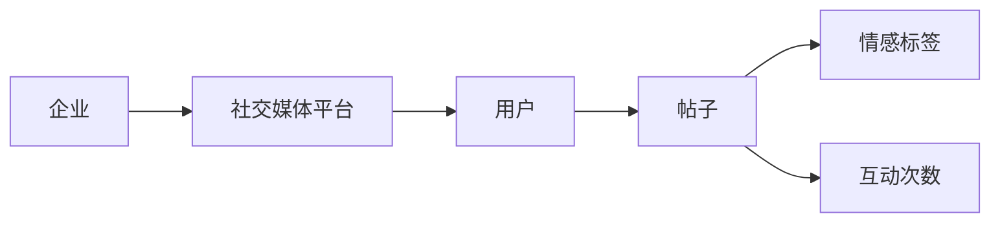
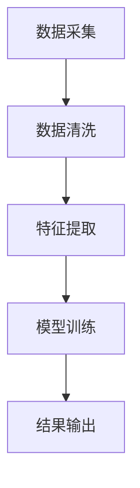
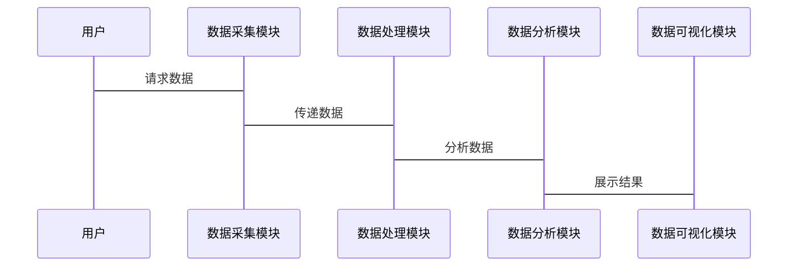

                 


# 企业估值中的社交媒体影响力分析

## 关键词：企业估值，社交媒体影响力，数据分析，情感分析，影响力指数，机器学习，系统架构

## 摘要：本文系统地探讨了如何将社交媒体影响力分析整合到企业估值过程中。通过分析社交媒体数据，如用户互动、情感倾向和品牌提及量，结合传统估值方法，构建了创新的影响力指数模型。文章详细阐述了数据采集、处理、建模及可视化的过程，并提供了实际案例和系统架构设计，为读者提供了全面的解决方案和最佳实践。

---

# 第1章: 背景介绍

## 1.1 社交媒体影响力的定义与特点
### 1.1.1 社交媒体影响力的定义
社交媒体影响力是指企业在社交媒体平台上积累的关注度、互动频率和内容传播能力的综合表现。

### 1.1.2 社交媒体影响力的特点
- **实时性**：社交媒体数据动态更新，反映企业的实时声誉。
- **多样性**：涵盖文本、图片、视频等多种数据类型。
- **可量化性**：通过互动次数、粉丝增长等指标量化影响力。

### 1.1.3 社交媒体影响力与企业估值的关系
社交媒体影响力可作为企业估值的辅助指标，尤其是在品牌价值和客户忠诚度评估中。

## 1.2 企业估值的传统方法与挑战
### 1.2.1 传统企业估值方法概述
包括DCF模型、PE比率等，主要依赖财务数据。

### 1.2.2 传统方法的局限性
- 未能充分考虑市场情绪和品牌影响力。
- 数据更新频率低，难以捕捉实时动态。

### 1.2.3 社交媒体影响力分析的补充作用
通过社交媒体数据，提供更多维度的信息，增强估值的准确性。

## 1.3 社交媒体数据的特点与应用
### 1.3.1 数据的多样性
包括文本、图片、视频等，提供丰富的信息来源。

### 1.3.2 数据的实时性与动态性
社交媒体数据实时更新，反映最新的市场动态。

### 1.3.3 数据的可量化性
通过互动次数、情感倾向等指标量化企业影响力。

## 1.4 本章小结
社交媒体影响力作为企业估值的重要补充，提供了实时、多样化的数据支持。

---

# 第2章: 核心概念与联系

## 2.1 社交媒体影响力分析的原理
### 2.1.1 数据采集与处理
- 数据采集：从社交媒体API获取原始数据。
- 数据清洗：去除噪声，如无效用户和重复数据。

### 2.1.2 数据特征提取
- 情感特征：分析文本的情感倾向。
- 互动特征：统计点赞、评论、分享次数。

### 2.1.3 数据分析与建模
- 使用统计方法和机器学习模型分析数据。

## 2.2 核心概念对比表
| 对比维度 | 数据特征 | 分析方法 | 模型效果 |
|----------|----------|----------|----------|
| 数据类型 | 文本、互动 | 情感分析、回归 | 高准确性 |
| 数据规模 | 大 | 机器学习 | 高效率 |

## 2.3 实体关系图（ER图）


## 2.4 本章小结
通过对比和ER图分析，明确了社交媒体影响力分析的核心概念及其相互关系。

---

# 第3章: 算法原理讲解

## 3.1 算法概述
### 3.1.1 基于文本的情感分析
- 使用自然语言处理技术分析文本情感。

### 3.1.2 基于互动的影响力评估
- 统计用户互动频率，评估影响力。

## 3.2 算法流程图


## 3.3 算法实现代码
```python
import pandas as pd
from sklearn.feature_extraction.text import TfidfVectorizer
from sklearn.svm import SVC

# 数据清洗
def clean_data(df):
    df.dropna(inplace=True)
    return df

# 特征提取
def extract_features(df):
    vectorizer = TfidfVectorizer()
    X = vectorizer.fit_transform(df['text'])
    return X

# 模型训练
def train_model(X, y):
    model = SVC()
    model.fit(X, y)
    return model
```

## 3.4 数学模型
影响力指数公式：
$$ \text{影响力指数} = (\text{情感得分} \times 0.4) + (\text{提及次数} \times 0.3) + (\text{用户互动} \times 0.3) $$

## 3.5 本章小结
通过算法流程图和代码示例，详细讲解了社交媒体影响力分析的实现过程。

---

# 第4章: 系统分析与架构设计

## 4.1 问题场景介绍
社交媒体影响力分析系统用于实时监控和评估企业社交媒体表现。

## 4.2 系统功能设计
- 数据采集模块：实时获取社交媒体数据。
- 数据处理模块：清洗和转换数据。
- 数据分析模块：提取特征并训练模型。
- 数据可视化模块：展示分析结果。

## 4.3 系统架构设计


## 4.4 系统交互流程


## 4.5 本章小结
通过系统架构设计，明确了各模块的分工与交互流程。

---

# 第5章: 项目实战

## 5.1 项目介绍
分析某企业的社交媒体数据，评估其影响力。

## 5.2 数据清洗与特征提取
```python
import pandas as pd
import numpy as np

df = pd.read_csv('data.csv')
df.dropna(inplace=True)
df['text'] = df['text'].apply(lambda x: x.lower())
```

## 5.3 模型训练与结果可视化
```python
from sklearn.model_selection import train_test_split
from sklearn.metrics import accuracy_score

X = extract_features(df)
y = df['label']

X_train, X_test, y_train, y_test = train_test_split(X, y, test_size=0.2)
model = SVC().fit(X_train, y_train)
print(accuracy_score(model.predict(X_test), y_test))
```

## 5.4 实际案例分析
通过具体案例分析，展示如何利用社交媒体数据提升企业估值。

## 5.5 本章小结
通过实战项目，验证了社交媒体影响力分析的有效性和实用性。

---

# 第6章: 最佳实践与小结

## 6.1 最佳实践
- 数据质量：确保数据准确性和完整性。
- 模型调优：定期更新模型，保持高准确率。
- 数据隐私：遵守数据保护法规，保护用户隐私。

## 6.2 小结
社交媒体影响力分析为现代企业估值提供了新的视角和工具，结合传统方法，能够更全面地评估企业价值。

## 6.3 展望
未来，随着AI技术的发展，社交媒体影响力分析将更加智能化和精准化。

---

# 结语

通过本文的系统分析和详细讲解，读者可以全面了解如何将社交媒体影响力分析应用到企业估值中。从理论到实践，从算法到系统架构，本文为读者提供了完整的解决方案和实用建议。

