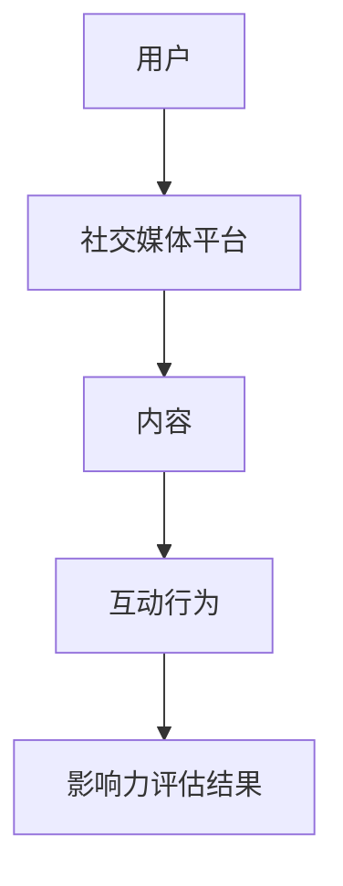
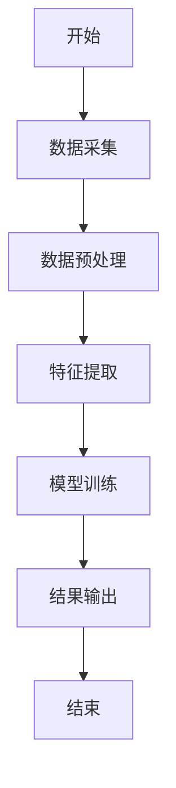
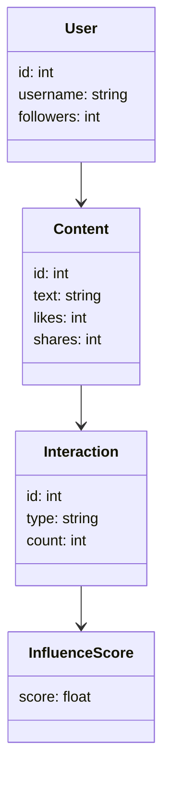
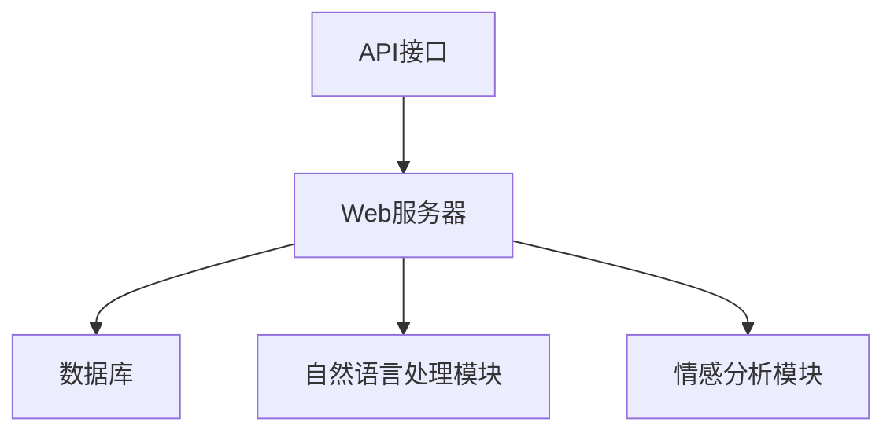

                 


# 企业估值中的社交媒体影响力评估

> 关键词：企业估值，社交媒体，影响力评估，数据挖掘，情感分析，网络分析，文本挖掘

> 摘要：随着社交媒体在商业中的影响力不断提升，企业估值的传统方法逐渐显现出其局限性。本文将深入探讨如何通过社交媒体数据来评估企业影响力，从而为企业的估值提供新的视角。文章从背景与问题背景出发，系统性地分析了社交媒体影响力评估的核心概念、算法原理、系统设计及项目实战，最终总结了最佳实践与未来趋势。

---

# 第一部分: 企业估值与社交媒体影响力评估概述

## 第1章: 背景与问题背景

### 1.1 企业估值的传统方法与局限性

#### 1.1.1 传统企业估值方法概述
传统企业估值方法主要包括财务指标分析、市场比较法和DCF模型等。这些方法主要依赖于企业的财务数据和市场环境分析，尽管在一定程度上能够反映企业的价值，但它们忽略了企业在数字化时代中重要的社交媒体影响力。

#### 1.1.2 社交媒体对企业估值的影响
社交媒体的兴起使得企业的品牌形象、用户互动和市场影响力成为重要的资产。例如，社交媒体上的负面舆情可能会显著降低企业的市场价值，而积极的用户互动则可能提升企业的品牌溢价能力。

#### 1.1.3 传统方法的局限性与改进需求
传统企业估值方法无法充分反映企业社交媒体资产的价值，导致估值结果可能存在偏差。因此，引入社交媒体影响力评估成为提升企业估值准确性的重要手段。

### 1.2 社交媒体数据的特性与价值

#### 1.2.1 社交媒体数据的多样性
社交媒体数据包括文本、图片、视频、用户评论、点赞、转发等，这些数据类型能够全面反映企业的品牌影响力和用户互动情况。

#### 1.2.2 数据的实时性与动态性
社交媒体数据具有实时更新的特点，能够反映企业在市场中的动态变化，为实时评估企业影响力提供数据支持。

#### 1.2.3 数据的可量化性与分析价值
通过数据挖掘和自然语言处理技术，社交媒体数据可以转化为可量化的指标，从而为企业估值提供新的维度。

### 1.3 社交媒体影响力评估的必要性

#### 1.3.1 企业品牌价值的衡量
社交媒体影响力可以直接反映企业的品牌知名度和用户忠诚度，从而为品牌价值评估提供重要依据。

#### 1.3.2 用户行为分析与市场洞察
通过分析社交媒体上的用户行为，企业可以更好地理解市场需求和用户偏好，从而优化市场策略。

#### 1.3.3 社交媒体对股价的影响
社交媒体上的舆论和互动可以显著影响企业的股价，特别是在突发事件发生时，社交媒体数据能够快速反映市场情绪。

### 1.4 问题描述与目标

#### 1.4.1 问题背景
随着社交媒体在商业中的广泛应用，如何量化企业社交媒体影响力并将其纳入企业估值体系成为一个重要研究课题。

#### 1.4.2 问题描述
本文旨在探讨如何通过社交媒体数据构建影响力评估模型，并将其应用于企业估值中。

#### 1.4.3 问题解决目标
本文的目标是提出一种基于社交媒体数据的企业影响力评估方法，从而提升企业估值的准确性和全面性。

#### 1.4.4 边界与外延
本文主要关注企业社交媒体影响力的定量评估，不涉及企业的其他资产和财务指标。

#### 1.4.5 核心要素组成
企业社交媒体影响力评估的核心要素包括用户基数、活跃度、内容质量和传播广度等。

---

## 第2章: 社交媒体影响力评估的核心概念与联系

### 2.1 核心概念原理

#### 2.1.1 社交媒体影响力定义
社交媒体影响力是指企业在社交媒体平台上所积累的用户关注量、互动频率、内容传播广度以及用户情感倾向的综合反映。

#### 2.1.2 影响力的多维度属性
社交媒体影响力具有多个维度，包括用户数量、互动频率、内容质量和传播范围等。

#### 2.1.3 影响力评估的指标体系
构建一个完整的社交媒体影响力评估指标体系，需要综合考虑多个维度，并赋予每个维度适当的权重。

### 2.2 核心概念属性特征对比表格

| 属性 | 描述 |
|------|------|
| 用户基数 | 关注企业的用户数量 |
| 活跃度 | 用户的互动频率，如点赞、评论、转发等 |
| 内容质量 | 内容的原创性和价值 |
| 传播广度 | 内容的转发和分享次数 |
| 用户情感倾向 | 用户对内容的情感态度，如正面、负面或中性 |

### 2.3 ER实体关系图架构



---

## 第3章: 社交媒体影响力评估的算法原理

### 3.1 算法原理概述

#### 3.1.1 基于文本挖掘的影响力评估
文本挖掘技术可以用于分析社交媒体上的文本内容，提取关键词和主题，从而评估内容的质量和影响力。

#### 3.1.2 基于情感分析的影响力评估
情感分析技术可以识别社交媒体上的用户情感倾向，从而评估企业的品牌形象和市场口碑。

#### 3.1.3 基于网络分析的影响力评估
网络分析技术可以研究社交媒体上的用户关系网络，评估企业的社交网络影响力和传播能力。

### 3.2 算法流程图



### 3.3 算法实现代码

```python
import pandas as pd
from sklearn.feature_extraction.text import TfidfVectorizer

# 数据预处理
def preprocess(text):
    return text.lower().strip()

# 特征提取
vectorizer = TfidfVectorizer(max_features=100)
X = vectorizer.fit_transform(data['content'])

# 模型训练
from sklearn.linear_model import LinearRegression
model = LinearRegression()
model.fit(X, data['influence_score'])
```

---

## 第4章: 系统分析与架构设计方案

### 4.1 系统功能设计

#### 4.1.1 领域模型类图



### 4.2 系统架构设计



---

## 第5章: 项目实战

### 5.1 环境安装

```bash
pip install numpy pandas scikit-learn
```

### 5.2 核心实现代码

```python
import pandas as pd
from sklearn.linear_model import LinearRegression

# 加载数据
data = pd.read_csv('social_media_data.csv')

# 特征工程
X = data[['followers', 'likes', 'shares']]
y = data['influence_score']

# 模型训练
model = LinearRegression()
model.fit(X, y)

# 预测结果
predicted_score = model.predict(X)
```

### 5.3 案例分析

假设我们有一家科技公司的社交媒体数据，通过上述模型可以预测其影响力评分，从而为企业的估值提供重要参考。

### 5.4 项目小结

通过项目实战，我们可以验证社交媒体影响力评估算法的有效性，并积累实际应用的经验。

---

## 第6章: 最佳实践与未来趋势

### 6.1 最佳实践

#### 6.1.1 数据清洗与特征选择
确保数据的准确性和完整性，选择合适的特征进行建模。

#### 6.1.2 模型优化
通过交叉验证和超参数调优，提升模型的预测精度。

#### 6.1.3 实时监控
建立实时监控机制，及时发现并应对社交媒体上的负面舆情。

### 6.2 小结

本文系统性地探讨了社交媒体影响力评估的理论与实践，为企业的估值提供了新的视角。

### 6.3 注意事项

在实际应用中，需要注意数据隐私和合规性问题，避免侵犯用户隐私。

### 6.4 拓展阅读

建议读者进一步阅读相关领域的最新研究，探索更多基于社交媒体数据的企业估值方法。

---

通过以上内容，我们可以看到，社交媒体影响力评估已经成为企业估值中不可或缺的一部分。未来，随着社交媒体数据的进一步丰富和技术的不断进步，社交媒体影响力评估将在企业估值中发挥更大的作用。

