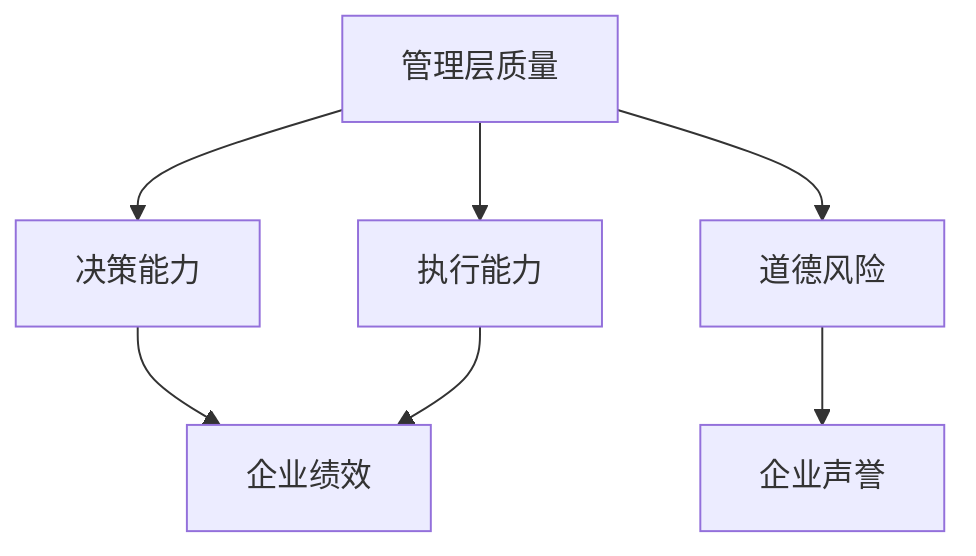
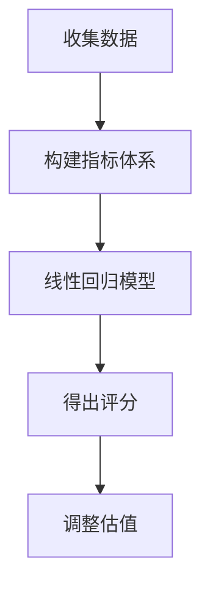
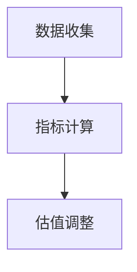
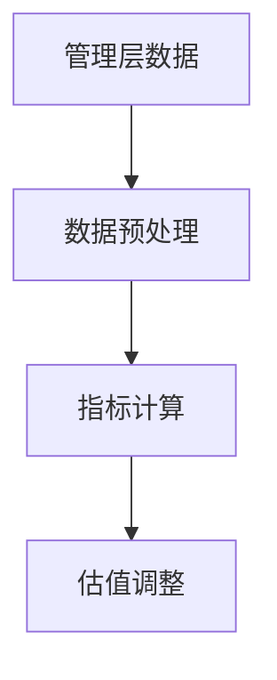
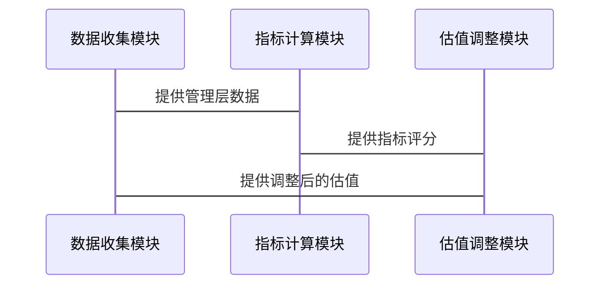

                 


```markdown
# 企业估值中的管理层质量评估

## 关键词：企业估值, 管理层质量, 评估标准, 评估方法, 评估模型, 评估流程, 评估工具

## 摘要：本文系统地探讨了在企业估值过程中，管理层质量评估的重要性、方法和实现路径。通过背景介绍、核心概念分析、算法原理阐述、系统架构设计、项目实战演示和最佳实践总结，全面解析了如何有效评估管理层质量对企业的价值影响，提供了可操作的评估框架和工具。

---

## 第一部分: 企业估值中的管理层质量评估背景介绍

### 第1章: 管理层质量评估的背景与问题背景

#### 1.1 问题背景

##### 1.1.1 企业估值的核心要素
企业在市场上的估值不仅仅取决于财务指标，还包括管理团队的能力、战略决策、创新能力和执行效率。管理层的质量直接影响企业的发展潜力和市场价值。

##### 1.1.2 管理层质量对企业估值的影响
管理层的质量决定了企业的战略方向、运营效率和风险控制能力。高能力的管理层能够优化资源配置，提升企业绩效，从而提高企业估值。

##### 1.1.3 当前企业估值中的问题与挑战
传统的企业估值方法往往忽视管理层的质量因素，导致估值结果不准确。管理层的决策失误或道德风险可能对企业的长期价值造成重大影响。

#### 1.2 问题描述

##### 1.2.1 管理层质量评估的定义
管理层质量评估是指对管理层的能力、决策能力、道德风险等方面进行系统性评价的过程。

##### 1.2.2 管理层质量评估的必要性
准确评估管理层质量有助于投资者和评估机构更好地判断企业的潜在价值，避免因管理层问题导致的估值偏差。

##### 1.2.3 管理层质量评估的边界与外延
评估范围包括管理层的决策能力、战略规划、团队协作、道德风险等方面，外延则涉及企业文化、组织结构和外部环境的影响。

#### 1.3 问题解决

##### 1.3.1 管理层质量评估的目标
通过评估管理层的质量，优化企业管理和决策，提升企业估值的准确性。

##### 1.3.2 管理层质量评估的方法与路径
采用定性分析与定量分析相结合的方法，从多个维度评估管理层质量。

##### 1.3.3 管理层质量评估的实现机制
通过构建评估模型，结合企业历史数据和市场表现，量化管理层对估值的影响。

#### 1.4 概念结构与核心要素

##### 1.4.1 管理层质量评估的核心要素
- **决策能力**：管理层在战略决策中的表现。
- **执行能力**：管理层执行战略的能力。
- **道德风险**：管理层的道德行为对企业的影响。

##### 1.4.2 核心要素之间的关系
管理层的决策能力和执行能力直接影响企业绩效，而道德风险则影响企业的声誉和长期发展。

##### 1.4.3 概念结构的可视化


---

### 第2章: 核心概念与联系

#### 2.1 管理层质量评估的核心原理

##### 2.1.1 管理层质量评估的理论基础
基于管理学和行为科学的理论，分析管理层的决策行为和管理风格对企业价值的影响。

##### 2.1.2 管理层质量评估的模型与框架
构建一个综合模型，从多个维度评估管理层质量，包括战略能力、领导力、团队协作等。

##### 2.1.3 管理层质量评估的关键因素
- **战略能力**：管理层制定和执行战略的能力。
- **领导力**：领导者激励团队和应对危机的能力。
- **团队协作**：管理层内部和与其他部门的协作效率。

#### 2.2 核心概念属性特征对比

##### 2.2.1 管理层能力与企业绩效的对比
| 属性 | 管理层能力 | 企业绩效 |
|------|------------|----------|
| 高能力 | 高          | 高        |
| 低能力 | 低          | 低        |
| 中等能力 | 中等        | 中等      |

##### 2.2.2 管理层决策与企业风险的对比
| 属性 | 管理层决策 | 企业风险 |
|------|------------|----------|
| 高质量决策 | 低          | 低        |
| 低质量决策 | 高          | 高        |
| 中等质量决策 | 中等        | 中等      |

##### 2.2.3 管理层道德与企业声誉的对比
| 属性 | 管理层道德 | 企业声誉 |
|------|------------|----------|
| 高道德 | 高          | 高        |
| 低道德 | 低          | 低        |
| 中等道德 | 中等        | 中等      |

#### 2.3 ER实体关系图
```mermaid
erDiagram
    actor 管理层角色 <<(ownertype) actor> {
        role_id : integer
        role_name : string
        responsibilities : string
    }
    entity 管理层

    管理层_角色 --> 管理层 : 关联
```

---

### 第3章: 管理层质量评估的算法原理

#### 3.1 算法流程

##### 3.1.1 管理层质量评估的算法步骤
1. 收集管理层的历史数据和市场表现数据。
2. 构建评估指标体系，包括战略能力、执行能力、道德风险等。
3. 使用线性回归模型量化管理层质量对估值的影响。
4. 通过数据分析得出管理层质量的评分。
5. 根据评分调整企业估值。

##### 3.1.2 算法流程图


##### 3.1.3 算法实现

###### 3.1.3.1 线性回归模型
$$
y = \beta_0 + \beta_1 x + \epsilon
$$
其中，\( y \) 是企业估值，\( x \) 是管理层质量评分，\( \beta_0 \) 和 \( \beta_1 \) 是回归系数。

###### 3.1.3.2 代码实现
```python
import numpy as np
from sklearn.linear_model import LinearRegression

# 示例数据
X = np.array([[1], [2], [3], [4], [5]])
y = np.array([2, 4, 5, 4, 6])

# 模型训练
model = LinearRegression()
model.fit(X, y)

# 预测
print(model.predict([[6]]))
```

---

### 第4章: 管理层质量评估的系统分析与架构设计

#### 4.1 系统功能设计

##### 4.1.1 问题场景
企业需要评估管理层的质量，以优化估值模型。

##### 4.1.2 系统功能
- 数据收集模块：收集管理层的历史数据。
- 指标计算模块：计算管理层质量评分。
- 估值调整模块：根据评分调整企业估值。

##### 4.1.3 功能流程图


#### 4.2 系统架构设计

##### 4.2.1 系统架构


##### 4.2.2 接口设计
- 数据接口：从数据库获取管理层数据。
- 模型接口：调用线性回归模型进行预测。
- 输出接口：输出估值调整结果。

##### 4.2.3 交互序列图


---

### 第5章: 管理层质量评估的项目实战

#### 5.1 环境安装

##### 5.1.1 环境要求
- Python 3.6+
- NumPy 和 scikit-learn 库

##### 5.1.2 安装依赖
```bash
pip install numpy scikit-learn
```

#### 5.2 核心代码实现

##### 5.2.1 数据预处理
```python
import pandas as pd
import numpy as np

# 加载数据
data = pd.read_csv('management.csv')
```

##### 5.2.2 指标计算
```python
from sklearn.preprocessing import StandardScaler
from sklearn.linear_model import LinearRegression

# 数据标准化
scaler = StandardScaler()
X_scaled = scaler.fit_transform(X)

# 模型训练
model = LinearRegression()
model.fit(X_scaled, y)

# 预测
predicted_valuation = model.predict(X_new_scaled)
```

#### 5.3 代码解读与分析
- 数据预处理：标准化处理确保各特征对模型的影响相同。
- 模型训练：线性回归模型用于预测管理层质量对估值的影响。
- 预测结果：根据管理层质量评分调整企业估值。

#### 5.4 案例分析
以某科技公司为例，分析管理层质量对估值的影响，展示模型的应用和结果解读。

#### 5.5 项目小结
总结项目成果，强调管理层质量评估对企业估值的重要性，以及模型的实际应用价值。

---

### 第6章: 管理层质量评估的最佳实践

#### 6.1 小结
总结管理层质量评估的核心内容和方法，强调其在企业估值中的重要性。

#### 6.2 注意事项
- 数据的准确性和完整性。
- 模型的适用性和可解释性。
- 结合企业实际情况进行调整和优化。

#### 6.3 拓展阅读
推荐相关书籍和文献，帮助读者深入学习管理层质量评估的理论和实践。

---

## 结语

企业估值中的管理层质量评估是一个复杂但关键的过程。通过系统的方法和工具，可以有效评估管理层的质量，优化企业估值。未来，随着数据分析技术的发展，管理层质量评估将更加精准和智能化，为企业价值创造更大的贡献。
```

