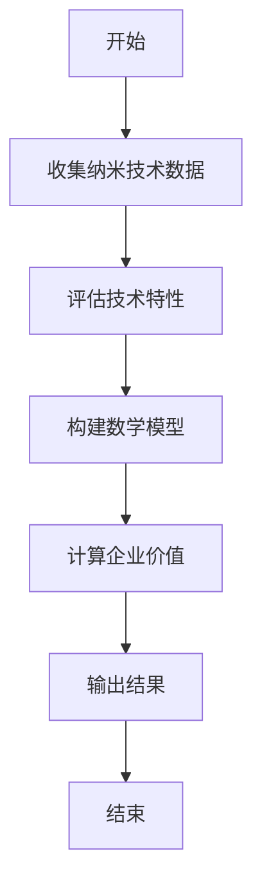
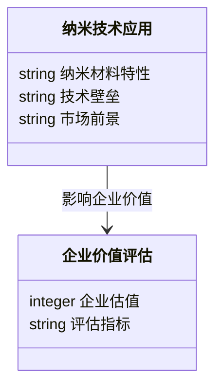
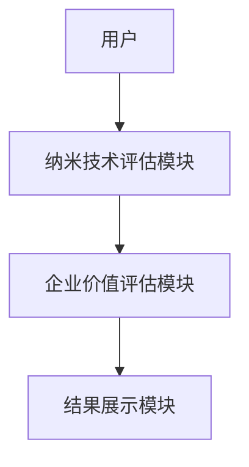

                 


# 企业估值中的纳米技术应用评估

## 关键词：企业估值，纳米技术，创新评估，收益模型，成本分摊，风险评估

## 摘要：  
本文探讨了纳米技术在企业估值中的应用与评估方法。首先介绍了纳米技术的基本概念及其对企业价值的影响，然后详细分析了纳米技术在企业估值中的核心概念、数学模型和算法原理。通过系统分析和项目实战，展示了如何将纳米技术应用评估整合到企业估值体系中，提供了丰富的案例和最佳实践建议。

---

# 第1章: 纳米技术与企业估值概述

## 1.1 纳米技术的基本概念

### 1.1.1 纳米技术的定义与特点  
纳米技术是指在纳米尺度（1-100纳米）对物质进行操控和加工的技术。其特点包括：  
1. **尺度效应**：纳米材料的物理、化学性质因尺度变化而显著不同。  
2. **表面效应**：纳米粒子的表面活性较高，具有独特的催化性能。  
3. **量子效应**：在纳米尺度下，物质的电子性质会发生量子化变化。  

### 1.1.2 纳米技术的核心应用领域  
1. **材料科学**：开发高强度、轻质的纳米材料。  
2. **医疗健康**：用于药物递送、诊断工具的开发。  
3. **电子器件**：制造高性能的纳米电子元件。  
4. **环境技术**：用于水处理、空气净化等领域。  

### 1.1.3 纳米技术对企业价值的影响  
纳米技术的应用可以显著提升企业的创新能力、产品附加值和市场竞争力。例如，采用纳米材料制造的产品可能具有更高的性能和更低的成本。

## 1.2 企业估值的基本方法

### 1.2.1 传统企业估值方法概述  
传统方法包括：  
1. **DCF模型**：基于现金流折现法。  
2. **相对估值法**：基于可比公司或行业平均市盈率等指标。  
3. **资产重置法**：基于资产的重置成本。  

### 1.2.2 纳米技术引入企业估值的新思路  
纳米技术的应用可能影响企业的未来收益，因此需要在估值中考虑其技术壁垒、市场前景和成本优势。

### 1.2.3 纳米技术应用对企业估值的挑战与机遇  
挑战包括技术不确定性、研发成本高昂；机遇包括技术创新带来的超额收益和市场溢价。

## 1.3 纳米技术在企业估值中的应用背景

### 1.3.1 纳米技术对企业创新的推动  
纳米技术的创新性使其成为企业差异化竞争的核心优势。

### 1.3.2 纳米技术对企业竞争力的影响  
通过提高产品性能、降低成本，纳米技术可以增强企业的市场地位。

### 1.3.3 纳米技术对企业未来收益的潜在贡献  
纳米技术的应用可能带来更高的销售溢价和市场占有率。

---

# 第2章: 纳米技术在企业估值中的核心概念

## 2.1 纳米技术应用的属性特征对比

### 2.1.1 纳米材料的物理特性与传统材料对比  
| 特性         | 纳米材料          | 传统材料         |
|--------------|------------------|------------------|
| 强度         | 显著提高         | 较低             |
| 导电性       | 可调控           | 固定             |
| 稳定性       | 更高             | 较低             |

### 2.1.2 纳米技术在不同行业的应用特点  
1. **制造业**：提高产品性能和生产效率。  
2. **医疗健康**：开发新型诊断工具和药物递送系统。  
3. **电子行业**：制造更小、更快的电子元件。  

### 2.1.3 纳米技术对企业成本和收益的影响  
1. **成本**：初期研发投入较高，但规模化生产后成本可能降低。  
2. **收益**：产品性能提升带来更高的售价和市场份额。  

## 2.2 纳米技术应用的ER实体关系图

```mermaid
erDiagram
    actor 纳米技术应用 {
        string 纳米材料特性
        string 技术壁垒
        string 市场前景
    }
    actor 企业价值评估 {
        integer 企业估值
        string 评估指标
    }
    纳米技术应用 --> 企业价值评估 : 影响企业价值
```

---

# 第3章: 纳米技术应用的数学模型与算法原理

## 3.1 纳米技术应用的数学模型

### 3.1.1 纳米技术应用的收益预测模型  
收益预测模型考虑纳米技术带来的额外收益，公式为：  
$$ \text{收益} = \text{产品售价} \times \text{销量} \times \text{技术溢价} $$  

### 3.1.2 纳米技术应用的成本分摊模型  
成本分摊模型用于分配纳米技术的研发和生产成本，公式为：  
$$ \text{单位成本} = \frac{\text{总成本}}{\text{产量}} $$  

### 3.1.3 纳米技术应用的风险评估模型  
风险评估模型考虑技术失败的概率，公式为：  
$$ \text{风险调整值} = \text{净现值} \times (1 - \text{失败概率}) $$  

## 3.2 纳米技术应用的算法流程图



## 3.3 纳米技术应用的Python代码实现

```python
def calculate_nanotechnology_impact(revenue, cost, risk):
    # 计算技术溢价
    premium = 1.2  # 假设技术溢价为20%
    # 计算净现值
    npv = (revenue * premium) - cost
    # 计算风险调整值
    adjusted_npv = npv * (1 - risk)
    return adjusted_npv

# 示例计算
revenue = 1000000
cost = 500000
risk = 0.1  # 10%的风险
impact = calculate_nanotechnology_impact(revenue, cost, risk)
print(f"纳米技术应用的净现值为：{impact}")
```

---

# 第4章: 纳米技术应用的系统分析与架构设计

## 4.1 系统功能设计

### 4.1.1 纳米技术应用的领域模型类图



### 4.1.2 系统架构图



---

# 第5章: 项目实战

## 5.1 环境配置

1. 安装Python和相关库（如NumPy、Matplotlib）。  
2. 准备纳米技术相关的数据和案例。  

## 5.2 核心代码实现

```python
import numpy as np
import matplotlib.pyplot as plt

def plot_nanotechnology_impact():
    # 示例数据
    nanotech_data = np.array([100, 200, 150, 250, 300])
    traditional_data = np.array([80, 120, 90, 180, 200])
    
    plt.figure(figsize=(10,6))
    plt.plot(nanotech_data, label='纳米技术应用', linestyle='--')
    plt.plot(traditional_data, label='传统技术', linestyle='-')
    plt.xlabel('时间（年）')
    plt.ylabel('收益（万元）')
    plt.title('纳米技术与传统技术的收益对比')
    plt.legend()
    plt.show()

plot_nanotechnology_impact()
```

---

# 第6章: 最佳实践与总结

## 6.1 小结  
纳米技术的应用可以显著影响企业的估值，但需要综合考虑其技术特性、市场前景和成本因素。

## 6.2 注意事项  
1. 评估纳米技术的影响时，需考虑技术不确定性和研发风险。  
2. 确保纳米技术的应用能够带来可持续的收益。  

## 6.3 拓展阅读  
推荐阅读《纳米技术与企业创新》、《现代企业估值方法》等书籍，以进一步深入理解相关内容。

--- 

# 结语  
通过本文的分析，读者可以系统地了解纳米技术在企业估值中的应用与评估方法，为企业在纳米技术领域的投资和决策提供有价值的参考。

