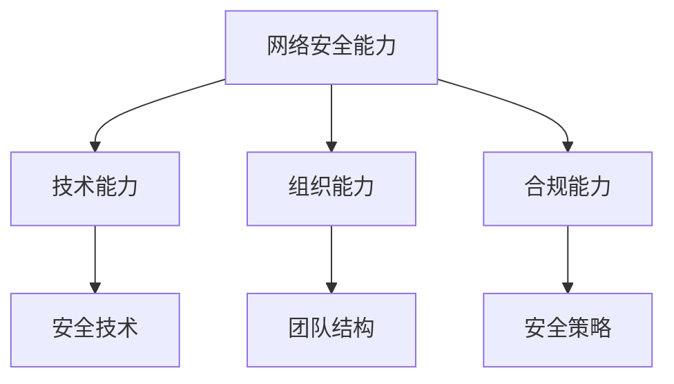
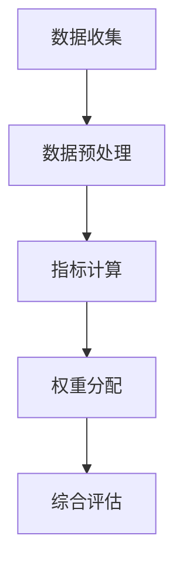
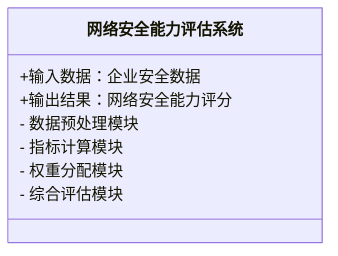
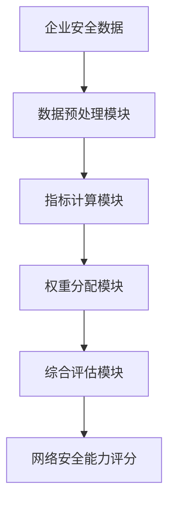
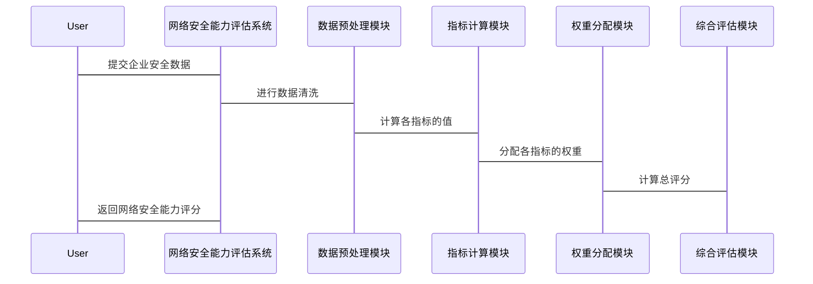

                 


# 企业估值中的网络安全能力评估

## 关键词：企业估值，网络安全，能力评估，技术能力，组织能力，合规能力

## 摘要：  
网络安全能力评估是企业估值中的关键因素。本文从网络安全能力评估的背景、核心概念、算法原理、系统架构、项目实战和最佳实践等方面进行详细分析。通过深入探讨网络安全能力评估的核心要素，结合实际案例，为读者提供全面的评估方法和实践指导。

---

## 第一部分: 企业估值与网络安全能力评估的背景介绍

### 第1章: 企业估值与网络安全能力评估的概述

#### 1.1 网络安全能力评估的重要性  
网络安全能力评估是企业在数字时代生存和发展的核心能力之一。随着企业数字化转型的推进，网络安全威胁日益复杂，企业的网络安全能力直接影响其市场价值和抗风险能力。  

#### 1.2 网络安全能力评估的核心概念  
网络安全能力评估是指通过对企业的网络安全技术、组织结构和合规能力的综合分析，量化其网络安全能力的过程。  

#### 1.3 企业估值中的网络安全挑战  
在企业估值中，网络安全能力是投资者关注的重要指标。然而，许多企业在网络安全能力评估中存在数据不足、方法不科学等问题，导致估值结果偏差。

---

## 第二部分: 网络安全能力评估的核心概念与联系

### 第2章: 网络安全能力评估的核心要素分析

#### 2.1 网络安全能力评估的关键属性  
网络安全能力评估的核心要素包括：  
1. **技术能力**：企业网络安全技术的先进性和适用性。  
2. **组织能力**：企业安全团队的结构和协作效率。  
3. **合规能力**：企业安全策略的合规性和执行度。  

#### 2.2 核心要素对比分析  
以下是技术能力、组织能力和合规能力的对比表格：  

| 能力维度   | 技术能力       | 组织能力       | 合规能力       |  
|------------|----------------|----------------|----------------|  
| 定义       | 安全技术的实现水平 | 安全团队的组织结构 | 安全策略的合规性 |  
| 重要性     | 高             | 中             | 高             |  
| 示例       | 防火墙、入侵检测系统 | 安全团队分工、协作机制 | ISO 27001认证 |  

#### 2.3 实体关系图（ER图）  
以下是网络安全能力评估的核心要素的实体关系图：  



---

## 第三部分: 网络安全能力评估的算法原理

### 第3章: 网络安全能力评估模型的构建

#### 3.1 算法原理概述  
网络安全能力评估模型的构建主要包括以下步骤：  
1. **数据收集与预处理**：收集企业的安全技术、组织结构和合规性数据，并进行清洗和标准化。  
2. **指标计算与权重分配**：根据各维度的重要性，计算各指标的权重，并进行综合评分。  
3. **综合评估模型的构建**：将各指标的评分进行加权计算，得出企业的网络安全能力总评分。  

#### 3.2 算法流程图  
以下是网络安全能力评估模型的算法流程图：  



#### 3.3 算法实现代码  
以下是网络安全能力评估模型的Python实现代码示例：  

```python
def calculate_security_capability(data):
    # 数据预处理
    preprocessed_data = preprocess(data)
    # 指标计算
    metrics = compute_metrics(preprocessed_data)
    # 权重分配
    weighted_metrics = assign_weights(metrics)
    # 综合评估
    total_score = calculate_total_score(weighted_metrics)
    return total_score

def preprocess(data):
    # 数据清洗和标准化
    return processed_data

def compute_metrics(processed_data):
    # 计算各指标的值
    return metrics

def assign_weights(metrics):
    # 根据指标重要性分配权重
    return weighted_metrics

def calculate_total_score(weighted_metrics):
    # 计算总评分
    return total_score
```

#### 3.4 算法的数学模型和公式  
网络安全能力评估模型的总评分公式如下：  

$$ \text{总评分} = \sum_{i=1}^{n} w_i \times s_i $$  

其中，$w_i$ 是第 $i$ 个指标的权重，$s_i$ 是第 $i$ 个指标的评分。  

---

## 第四部分: 网络安全能力评估的系统架构设计

### 第4章: 网络安全能力评估系统的设计与实现

#### 4.1 问题场景介绍  
企业需要一个系统化的网络安全能力评估系统，以量化其网络安全能力，并为投资者提供可靠的估值依据。  

#### 4.2 系统功能设计  
以下是网络安全能力评估系统的功能模块设计：  



#### 4.3 系统架构设计  
以下是网络安全能力评估系统的架构图：  



#### 4.4 系统接口设计  
网络安全能力评估系统的接口设计包括：  
1. 数据输入接口：接收企业的安全数据。  
2. 数据处理接口：对数据进行预处理和计算。  
3. 结果输出接口：返回网络安全能力评分。  

#### 4.5 系统交互流程  
以下是系统交互流程的序列图：  



---

## 第五部分: 网络安全能力评估的项目实战

### 第5章: 项目实战与案例分析

#### 5.1 环境安装与数据准备  
1. 安装Python和相关库（如Pandas、NumPy）。  
2. 准备企业的安全数据，包括技术、组织和合规性数据。  

#### 5.2 代码实现  
以下是网络安全能力评估系统的Python代码实现：  

```python
import pandas as pd
import numpy as np

def preprocess(data):
    # 数据清洗和标准化
    processed_data = data.dropna()
    return processed_data

def compute_metrics(processed_data):
    # 计算各指标的值
    metrics = {
        '技术能力': processed_data['技术能力'].mean(),
        '组织能力': processed_data['组织能力'].mean(),
        '合规能力': processed_data['合规能力'].mean()
    }
    return metrics

def assign_weights(metrics):
    # 根据指标重要性分配权重
    weights = {
        '技术能力': 0.4,
        '组织能力': 0.3,
        '合规能力': 0.3
    }
    weighted_metrics = {
        key: metrics[key] * weights[key] for key in metrics
    }
    return weighted_metrics

def calculate_total_score(weighted_metrics):
    # 计算总评分
    total_score = sum(weighted_metrics.values())
    return total_score

# 示例数据
data = pd.DataFrame({
    '技术能力': [0.8, 0.7, 0.9],
    '组织能力': [0.6, 0.8, 0.7],
    '合规能力': [0.7, 0.6, 0.8]
})

preprocessed_data = preprocess(data)
metrics = compute_metrics(preprocessed_data)
weighted_metrics = assign_weights(metrics)
total_score = calculate_total_score(weighted_metrics)

print(f"网络安全能力总评分为：{total_score}")
```

#### 5.3 案例分析  
以一个中型企业的网络安全能力评估为例，计算其网络安全能力总评分。  

#### 5.4 项目总结  
通过实际案例分析，验证网络安全能力评估模型的有效性和准确性，并总结经验教训。

---

## 第六部分: 网络安全能力评估的最佳实践

### 第6章: 最佳实践与注意事项

#### 6.1 数据收集的注意事项  
1. 确保数据的完整性和准确性。  
2. 数据来源应多样化，避免单一数据源偏差。  

#### 6.2 模型调优的建议  
1. 根据企业的实际情况调整各指标的权重。  
2. 定期更新模型，以适应网络安全威胁的变化。  

#### 6.3 评估结果的应用  
1. 将网络安全能力评估结果作为企业估值的重要参考。  
2. 根据评估结果制定改进计划，提升企业的网络安全能力。  

---

## 第七部分: 总结与展望

### 第7章: 总结与未来研究方向

#### 7.1 总结  
网络安全能力评估是企业估值中的关键环节，本文从背景、核心概念、算法原理、系统架构和项目实战等方面进行了详细分析。  

#### 7.2 未来研究方向  
1. 研究更复杂的网络安全威胁模型。  
2. 探讨人工智能在网络安全能力评估中的应用。  
3. 建立更全面的企业网络安全能力评估框架。  

---

## 参考文献  
1. [书籍或论文1]  
2. [书籍或论文2]  
3. [书籍或论文3]  

---

通过以上目录大纲，您可以根据实际需求逐步展开每个部分的内容，确保文章逻辑清晰、结构紧凑、内容详实。

