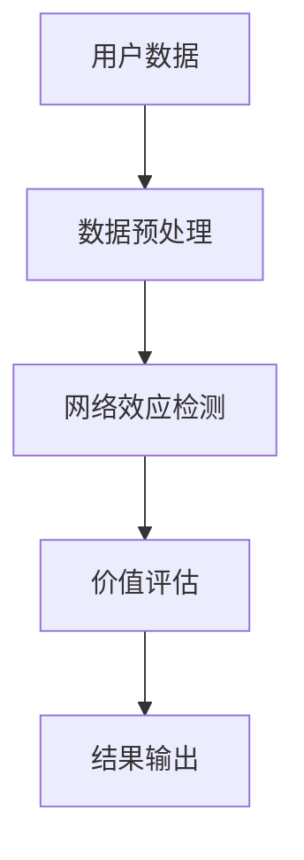

                 


# 企业估值中的网络效应价值评估

> 关键词：网络效应，企业估值，平台经济，双边市场，用户增长

> 摘要：网络效应是许多互联网企业的核心竞争力之一，尤其是在社交平台、电商平台等依赖用户互动的领域。本文从网络效应的定义、类型、数学模型入手，深入分析其对企业的价值影响，并提出具体的评估方法和算法。结合实际案例，详细讲解如何通过双边市场模型和平台价值评估模型来量化网络效应，从而为企业的估值提供科学依据。

---

## 第一部分：网络效应的定义与特点

### 第1章：网络效应的定义与特点

#### 1.1 网络效应的定义
网络效应是指随着用户数量的增加，产品或服务的价值也随之增加的现象。它通常出现在双边或多边市场中，例如社交平台、电商平台等。网络效应的核心在于用户的互动和数据共享，用户的增加会带来更多的价值。

#### 1.2 网络效应的类型
网络效应可以分为正向网络效应和负向网络效应：
- **正向网络效应**：用户数量增加会显著提升产品或服务的价值，例如社交媒体平台，用户越多，每个人的体验越好。
- **负向网络效应**：用户数量增加会边际效用递减，甚至可能降低整体价值，例如某些资源有限的共享经济平台。

#### 1.3 网络效应的数学模型
网络效应的数学模型可以帮助我们量化其对用户价值的影响。常见的模型包括：

1. **双边市场模型**：  
   双边市场是指平台连接两个或多个用户群体，例如消费者和商家。其收益函数可以表示为：  
   $$ R = aN + bN^2 $$  
   其中，$N$ 是用户数量，$a$ 和 $b$ 是常数，表示每增加一个用户带来的收益。

2. **用户增长模型**：  
   用户增长通常遵循指数增长曲线，可以用以下公式表示：  
   $$ N(t) = N_0 e^{kt} $$  
   其中，$N_0$ 是初始用户数量，$k$ 是增长率，$t$ 是时间。

---

### 第2章：网络效应与企业估值的关系

#### 2.1 网络效应对企业价值的影响
网络效应是许多互联网企业的核心竞争力。例如，社交平台的价值不仅仅在于其用户数量，还在于用户之间的互动和数据共享。网络效应越强，用户粘性和平台价值越高。

#### 2.2 网络效应的量化指标
为了量化网络效应，我们需要关注以下指标：
- **用户增长率**：用户数量随时间的增长速度。
- **用户粘性**：用户在平台上的活跃度和留存率。
- **经济价值**：平台的收入和利润是否随着用户数量增加而显著增长。

#### 2.3 网络效应的动态变化
网络效应并非一成不变，它会随着市场环境、用户需求和技术进步而变化。例如，当一个平台引入新的功能或服务时，可能会增强或减弱其网络效应。

---

## 第二部分：企业估值中的网络效应价值评估方法

### 第3章：网络效应的评估模型

#### 3.1 双边市场定价模型
在双边市场中，平台需要平衡两边用户的利益。例如，在一个社交平台上，消费者和内容创作者都需要被吸引才能形成网络效应。双边市场定价模型可以表示为：  
$$ P = \frac{a + b}{2} $$  
其中，$P$ 是价格，$a$ 和 $b$ 是两边用户的边际收益。

#### 3.2 平台价值评估模型
平台价值可以通过以下公式进行评估：  
$$ V = kN^α $$  
其中，$V$ 是平台价值，$N$ 是用户数量，$k$ 是常数，$α$ 是网络效应的指数。

#### 3.3 网络效应的外部性模型
网络效应的外部性可以通过以下公式表示：  
$$ E = \frac{dV}{dN} $$  
其中，$E$ 是外部性，表示每增加一个用户带来的额外价值。

---

### 第4章：网络效应的算法原理与实现

#### 4.1 网络效应的检测算法
网络效应的检测可以通过以下步骤实现：
1. **数据收集**：收集用户数量、活跃度、收入等数据。
2. **模型拟合**：使用回归模型拟合用户增长曲线。
3. **网络效应判断**：通过模型参数判断网络效应的强度。

#### 4.2 网络效应的价值评估算法
价值评估算法可以通过以下步骤实现：
1. **数据预处理**：清洗数据，提取关键指标。
2. **模型训练**：使用机器学习模型训练网络效应的评估模型。
3. **价值计算**：根据模型预测网络效应带来的价值。

---

### 第5章：系统架构设计与实现

#### 5.1 系统功能设计
- 用户数据采集模块：收集用户行为数据。
- 网络效应检测模块：检测网络效应的强度。
- 价值评估模块：计算网络效应带来的经济价值。

#### 5.2 系统架构图


---

### 第6章：项目实战与案例分析

#### 6.1 案例背景
以一家社交平台为例，假设用户数量为 $N$，收入为 $R$，我们需要评估其网络效应的价值。

#### 6.2 环境配置
```bash
pip install numpy pandas scikit-learn
```

#### 6.3 核心代码实现
```python
import numpy as np
from sklearn.linear_model import LinearRegression

# 示例数据
N = np.array([100, 200, 300, 400, 500])
R = np.array([10, 20, 30, 40, 50])

# 模型训练
model = LinearRegression()
model.fit(N.reshape(-1, 1), R)

# 网络效应检测
coeff = model.coef_[0]
if coeff > 0:
    print("存在正向网络效应")
else:
    print("不存在网络效应")
```

#### 6.4 案例分析
通过上述代码，我们可以检测社交平台是否存在正向网络效应。如果存在，则说明用户数量增加确实带来了收入增长，从而可以进一步评估其网络效应的价值。

---

## 第三部分：总结与展望

### 第7章：总结与展望

#### 7.1 本章总结
本文详细探讨了网络效应在企业估值中的重要性，提出了网络效应的数学模型和评估方法，并通过案例分析验证了其可行性。

#### 7.2 未来展望
未来的研究可以进一步探讨如何应对网络效应的动态变化，例如通过实时监控和自适应模型来优化估值。

---

通过本文的分析，我们可以看到，网络效应是企业估值中的关键因素之一。理解和量化网络效应可以帮助企业在竞争激烈的市场中占据优势。希望本文能为读者提供有价值的见解和方法。

