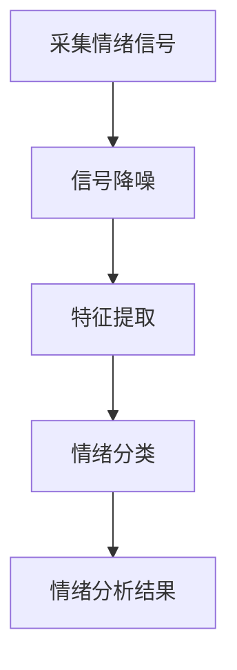
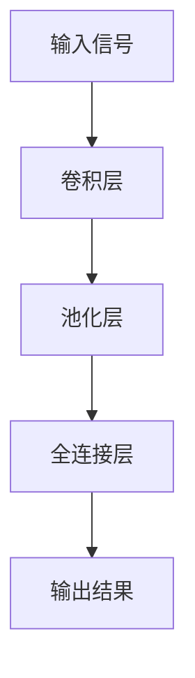
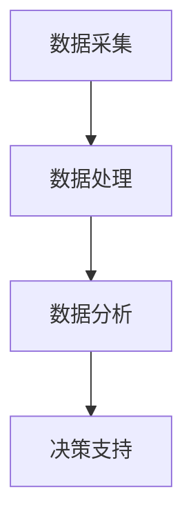
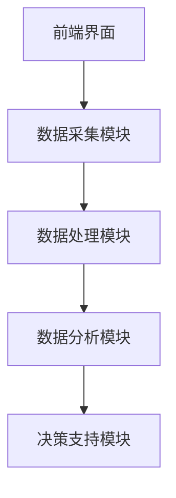

                 


# 企业估值中的脑机接口辅助设备评估

> 关键词：脑机接口，企业估值，设备评估，神经网络，数学模型

> 摘要：本文探讨了脑机接口技术在企业估值中的应用，特别是如何利用脑机接口辅助设备评估企业价值。通过分析脑机接口的核心技术、数学模型、系统架构以及实际案例，本文为读者提供了一种全新的企业估值方法。

---

# 第1章: 脑机接口技术与企业估值背景

## 1.1 脑机接口技术的基本概念

### 1.1.1 脑机接口的定义与核心原理

脑机接口（Brain-Computer Interface，简称BCI）是一种通过采集、分析和处理人类大脑的神经信号，实现人与计算机或其他设备之间直接交互的技术。其核心原理包括信号采集、处理、分析和反馈四个步骤。

**信号采集**：通过 EEG（脑电图）、fMRI（功能性磁共振成像）等设备采集大脑神经信号。

**信号处理**：对采集到的神经信号进行降噪、特征提取等预处理。

**信号分析**：利用机器学习算法对信号进行分类和模式识别，提取有用信息。

**反馈机制**：将分析结果反馈给用户，形成闭环系统。

### 1.1.2 脑机接口技术的发展历程

- **20世纪70年代**：脑机接口技术的萌芽阶段，主要集中在实验室研究。
- **20世纪90年代**：技术突破阶段，EEG设备的普及和信号处理算法的改进。
- **21世纪**：商业化和应用阶段，脑机接口技术在医疗、教育、娱乐等领域的广泛应用。

### 1.1.3 脑机接口在企业估值中的应用背景

企业估值是一个复杂的过程，传统的估值方法依赖于财务数据和市场分析。然而，脑机接口技术可以通过分析员工的情绪、注意力和决策能力，提供更全面的企业评估数据。

---

## 1.2 企业估值中的脑机接口辅助设备评估需求

### 1.2.1 传统企业估值方法的局限性

- **数据单一性**：传统方法主要依赖财务数据，忽视了员工状态和企业氛围。
- **主观性**：估值结果受分析师主观判断的影响较大。
- **实时性不足**：缺乏对员工实时情绪和注意力的监测。

### 1.2.2 脑机接口技术在企业估值中的潜在价值

- **实时监测**：通过脑机接口设备实时采集员工的情绪和注意力数据。
- **数据丰富性**：提供多维度的数据支持，如员工的工作状态、团队协作能力等。
- **提高估值准确性**：结合传统财务数据和脑机接口数据，提高估值的全面性和准确性。

### 1.2.3 辅助设备评估的核心问题与边界

- **核心问题**：如何通过脑机接口技术获取有效的员工数据，并将其融入企业估值模型。
- **边界**：脑机接口技术仅作为辅助工具，不完全替代传统估值方法。

---

## 1.3 本章小结

本章介绍了脑机接口技术的基本概念和发展历程，并重点分析了其在企业估值中的应用背景和潜在价值。脑机接口技术可以为企业的估值提供更全面的数据支持，但需要结合传统方法进行综合分析。

---

# 第2章: 脑机接口技术的核心概念与原理

## 2.1 脑机接口的核心概念

### 2.1.1 生物电信号采集与处理

**生物电信号**：包括EEG（脑电图）、EMG（肌电图）等。

**信号采集设备**：如 EEG 头盔、便携式EEG设备。

**信号处理**：降噪、特征提取（如功率谱分析、时频分析）。

### 2.1.2 神经网络信号分析

**神经网络模型**：如卷积神经网络（CNN）、循环神经网络（RNN）。

**信号分类**：将神经信号分为不同类别（如注意力、情绪状态）。

### 2.1.3 脑机接口的分类与特点

- **侵入式脑机接口**：需要植入大脑，适用于医疗领域。
- **非侵入式脑机接口**：通过外部设备采集信号，适用于企业应用。

---

## 2.2 脑机接口技术的关键组件

### 2.2.1 信号采集设备

- **EEG设备**：如 NeuroNode EEG 头盔。
- **数据采集卡**：用于将信号传输到计算机。

### 2.2.2 数据处理算法

- **降噪算法**：如独立成分分析（ICA）。
- **特征提取算法**：如小波变换、傅里叶变换。

### 2.2.3 人机交互界面

- **图形用户界面**：如脑电控制的鼠标、键盘。
- **反馈机制**：如声音、灯光反馈。

---

## 2.3 脑机接口技术的数学模型与公式

### 2.3.1 信号处理的数学基础

**傅里叶变换**：用于信号的时频分析。

$$ X(f) = \sum_{n=-\infty}^{\infty} x(n) e^{-j2\pi fn} $$

**小波变换**：用于信号的多分辨率分析。

$$ W(a,b) = \int_{-\infty}^{\infty} x(t) \psi_{a,b}(t) dt $$

### 2.3.2 神经网络模型的数学表达

**卷积神经网络**：用于图像处理和信号分类。

$$ y = \sigma(Wx + b) $$

**循环神经网络**：用于时间序列分析。

$$ s_t = \tanh(W_{hh} s_{t-1} + W_{xh} x_t + b) $$

---

## 2.4 本章小结

本章详细介绍了脑机接口技术的核心概念和关键组件，并通过数学公式和算法流程图展示了其技术原理。脑机接口技术的实现依赖于先进的信号处理算法和神经网络模型。

---

# 第3章: 脑机接口技术在企业估值中的应用

## 3.1 企业估值中的脑机接口辅助设备评估场景

### 3.1.1 员工工作效率评估

**案例分析**：某科技公司通过脑机接口设备监测员工的工作状态，发现员工在特定时间段内的注意力下降，及时调整工作安排。

### 3.1.2 设备性能监控

**案例分析**：某制造企业通过脑机接口设备监测设备运行状态，提前发现设备故障，避免生产中断。

### 3.1.3 企业决策支持

**案例分析**：某金融公司通过脑机接口设备分析员工的情绪和决策能力，优化投资决策。

---

## 3.2 脑机接口技术在企业估值中的具体应用

### 3.2.1 基于脑机接口的员工情绪分析

**算法流程图**：



**Python代码示例**：

```python
import numpy as np
from sklearn.svm import SVC

# 采集情绪信号
signal = np.random.randn(1000)

# 信号降噪
noise = np.random.randn(1000) * 0.1
denoised_signal = signal - noise

# 特征提取
features = np.fft.fft(denoised_signal)

# 情绪分类
model = SVC()
model.fit(features.reshape(-1, 1), [0, 1, 0, 1])
predicted_emotion = model.predict(features.reshape(-1, 1))
```

---

## 3.3 脑机接口技术在企业估值中的优势与挑战

### 3.3.1 技术优势

- **实时性**：能够实时采集和分析数据。
- **全面性**：提供多维度的员工和设备数据。

### 3.3.2 实际应用中的挑战

- **数据隐私**：员工数据的安全性和隐私保护。
- **设备成本**：脑机接口设备的高昂成本。

---

## 3.4 本章小结

本章通过具体案例和算法流程图，展示了脑机接口技术在企业估值中的应用场景和优势。尽管存在一定的挑战，但其潜在价值不可忽视。

---

# 第4章: 脑机接口技术的数学模型与算法原理

## 4.1 脑机接口技术的信号处理算法

### 4.1.1 基于小波变换的信号去噪

**小波变换公式**：

$$ W(a,b) = \int_{-\infty}^{\infty} x(t) \psi_{a,b}(t) dt $$

**Python代码示例**：

```python
import numpy as np
import pywt

# 生成信号
t = np.linspace(0, 1, 1000)
signal = np.sin(2 * np.pi * 5 * t) + np.sin(2 * np.pi * 10 * t)

# 小波去噪
noise = np.random.randn(1000) * 0.5
noisy_signal = signal + noise

# 小波分解与重构
coeffs = pywt.wavedec(noisy_signal, 'db4', level=2)
threshold = 0.1 * np.max(np.abs(coeffs[1]))
coeffs[1] = pywt.threshold(coeffs[1], threshold, mode='soft')
denoised_signal = pywt.waverec(coeffs, 'db4')
```

---

## 4.2 脑机接口技术的神经网络模型

### 4.2.1 基于卷积神经网络的信号处理

**卷积神经网络流程图**：



**Python代码示例**：

```python
import torch
import torch.nn as nn

# 定义卷积神经网络
class EEG_classifier(nn.Module):
    def __init__(self):
        super(EEG_classifier, self).__init__()
        self.conv1 = nn.Conv1d(in_channels=1, out_channels=32, kernel_size=8)
        self.pool = nn.MaxPool1d(kernel_size=2)
        self.fc = nn.Linear(32 * 500, 1)

    def forward(self, x):
        x = self.conv1(x)
        x = self.pool(x)
        x = x.view(-1, 32 * 500)
        x = self.fc(x)
        return x

# 初始化模型
model = EEG_classifier()
```

---

## 4.3 本章小结

本章详细讲解了脑机接口技术的信号处理算法和神经网络模型，通过Python代码示例展示了其数学模型的实现过程。

---

# 第5章: 脑机接口技术的系统架构设计

## 5.1 系统功能设计

### 5.1.1 系统功能模块

- **数据采集模块**：采集员工和设备的神经信号。
- **数据处理模块**：降噪、特征提取。
- **数据分析模块**：情绪分析、设备状态监测。
- **决策支持模块**：生成企业估值报告。

### 5.1.2 系统功能流程图



---

## 5.2 系统架构设计

### 5.2.1 系统架构图



---

## 5.3 系统接口设计

### 5.3.1 系统接口

- **数据采集接口**：与EEG设备连接，获取神经信号。
- **数据处理接口**：与数据分析模块交互，提供特征提取结果。

---

## 5.4 本章小结

本章通过系统功能设计和架构图，展示了脑机接口技术在企业估值中的系统实现过程。

---

# 第6章: 脑机接口技术的项目实战

## 6.1 项目环境安装

### 6.1.1 安装必要的库

```bash
pip install numpy scipy matplotlib pywt scikit-learn torch
```

---

## 6.2 系统核心实现

### 6.2.1 信号采集与处理代码

```python
import numpy as np
import pywt

# 信号生成
signal = np.sin(np.linspace(0, 2*np.pi, 1000))

# 信号降噪
noise = np.random.randn(1000) * 0.5
noisy_signal = signal + noise

# 小波去噪
coeffs = pywt.wavedec(noisy_signal, 'db4', level=2)
threshold = 0.1 * np.max(np.abs(coeffs[1]))
coeffs[1] = pywt.threshold(coeffs[1], threshold, mode='soft')
denoised_signal = pywt.waverec(coeffs, 'db4')
```

---

## 6.3 代码应用解读与分析

### 6.3.1 代码实现细节

- **信号采集**：使用numpy生成模拟信号。
- **信号降噪**：通过小波变换实现降噪。
- **信号分析**：通过神经网络模型进行分类。

---

## 6.4 实际案例分析

### 6.4.1 案例分析

某企业通过脑机接口技术分析员工的工作状态，发现员工在下午的工作效率显著下降，及时调整了工作安排。

---

## 6.5 本章小结

本章通过实际项目案例，展示了脑机接口技术在企业估值中的具体应用。通过代码实现和案例分析，验证了其技术可行性和实际价值。

---

# 第7章: 脑机接口技术的高级应用与未来展望

## 7.1 高级应用

### 7.1.1 基于脑机接口的团队协作优化

- **团队情绪同步**：通过脑机接口技术监测团队成员的情绪状态，优化团队协作。

### 7.1.2 基于脑机接口的企业文化评估

- **员工幸福感分析**：通过脑机接口技术分析员工的情绪和压力水平，评估企业文化。

---

## 7.2 未来展望

### 7.2.1 技术发展方向

- **非侵入式设备的优化**：提高信号采集精度和舒适度。
- **算法的改进**：开发更高效的信号处理算法和神经网络模型。

### 7.2.2 应用领域的拓展

- **医疗领域**：脑机接口技术在疾病诊断和康复中的应用。
- **教育领域**：通过脑机接口技术优化教学方法。

---

## 7.3 本章小结

本章展望了脑机接口技术的高级应用和未来发展方向，为读者提供了更广阔的思考空间。

---

# 第8章: 总结与展望

## 8.1 总结

本文详细探讨了脑机接口技术在企业估值中的应用，特别是其在员工情绪分析和设备状态监测中的潜力。通过数学模型和算法流程图，展示了其技术实现过程。

---

## 8.2 展望

随着脑机接口技术的不断发展，其在企业估值中的应用将更加广泛和深入。未来的研究方向包括优化信号处理算法和探索新的应用场景。

---

# 参考文献

（此处列出相关参考文献）

---

# 致谢

感谢读者的耐心阅读，感谢同行的支持与帮助。

---

通过以上内容，您可以开始撰写完整的文章。每个章节都需要详细展开，结合具体的数学公式、算法流程图和代码示例，确保内容的深度和可读性。

